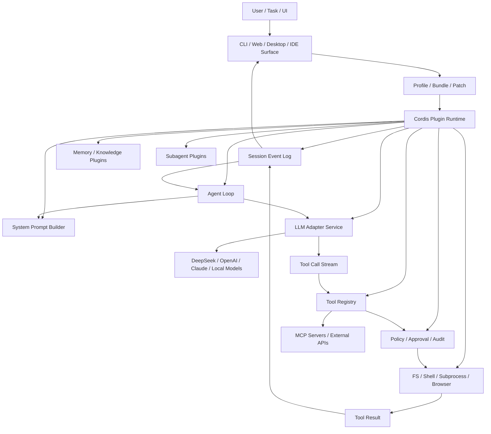

# DeepSeek Harness 框架技术解读报告

生成日期：2026-08-14
工作流：research-intelligence-skill / Deep Dive
对象：DeepSeek Harness、Cordis、官方 Reference、第三方技术解读、Harness Agent 生态影响

## 0. 执行摘要

DeepSeek Harness 的核心不是“又一个 Agent 应用”，而是把 Agent 产品中最难复用的一层抽象出来：模型适配、工具注册、会话日志、上下文构造、工具审批、沙箱执行、事件回放、插件生命周期、UI/协议桥接。它试图成为一个开放的 Agent Runtime。

一句话概括：

> DeepSeek Harness = Cordis 插件微内核 + 能力服务容器 + 持久事件流 + Agent Loop + Tool/LLM/FS/Shell/MCP/Subagent 等插件化能力面。

当前技术稿基本形成了一个共同判断：未来 Agent 竞争不会只发生在模型参数和 benchmark 上，还会发生在 Harness 层，也就是“模型如何被稳定地装进真实工作流”。DeepSeek 开源 Harness 后，行业会更直接比较上下文工程、工具调用成功率、权限/审批、任务可观测性、插件生态、长任务恢复和模型-运行时协同。

需要同时看到两个事实：

- 技术方向很重要：它把 Agent 产品的底层运行机制开源出来，可能推动 Harness 层标准化。
- 工程成熟度仍早：官方仓库和文档都提示 developer preview，API 可能变化，插件生态、安全治理、跨平台稳定性还没有进入成熟期。

## 1. 本报告覆盖的技术稿与资料

| 类别             | 资料                                                                                                                                                                                                                                                                                                                                       | 解读价值                                                   |
| ---------------- | ------------------------------------------------------------------------------------------------------------------------------------------------------------------------------------------------------------------------------------------------------------------------------------------------------------------------------------------ | ---------------------------------------------------------- |
| 官方仓库         | [deepseek-ai/deepseek-harness](https://github.com/deepseek-ai/deepseek-harness)                                                                                                                                                                                                                                                             | 项目定位、开源状态、README、开发者预览风险                 |
| 官方产品页       | [DeepSeek Harness: Everything is a Plugin](https://deepseek.com/harness)                                                                                                                                                                                                                                                                    | 官方叙事：开放 foundation agent system、插件化             |
| 官方 Reference   | [DeepSeek Harness Reference](https://deepseek-harness.github.io/deepseek-harness/reference/)                                                                                                                                                                                                                                                | API/模块入口，确认`@deepseek-ai/dsh` 技术边界            |
| Cordis 底层框架  | [cordiverse/cordis](https://github.com/cordiverse/cordis)                                                                                                                                                                                                                                                                                   | 插件微内核、服务容器、依赖注入、可逆副作用                 |
| Cordis 技术文档  | [Cordis Docs](https://cordis.js.org/)                                                                                                                                                                                                                                                                                                       | 理解 Harness 为什么采用插件树而不是传统应用框架            |
| 官方 Cookbook    | [Adding a Tool](https://deepseek-harness.github.io/deepseek-harness/reference/cookbook/adding-a-tool)、[Adding an LLM Adapter](https://deepseek-harness.github.io/deepseek-harness/reference/cookbook/adding-an-llm-adapter)、[Extension Cookbook](https://deepseek-harness.github.io/deepseek-harness/reference/cookbook/extension-cookbook) | 二次开发入口：工具、模型、扩展插件                         |
| 官方生命周期文档 | [Agent Lifecycle](https://deepseek-harness.github.io/deepseek-harness/reference/agent-lifecycle)、[Tool Execution Pipeline](https://deepseek-harness.github.io/deepseek-harness/reference/tool-execution-pipeline)                                                                                                                           | 一次 Agent turn 如何运行，工具调用如何治理                 |
| 第三方 Deep Dive | [DeepSeek Agent Harness Technical Deep-dive](https://dlcmh.github.io/deepseek-harness)                                                                                                                                                                                                                                                      | 从 Agent OS、MCP、memory、model-harness co-design 角度解释 |
| 能力树解读       | [AgentWay: DeepSeek Harness team&#39;s skill tree](https://agentway.dev/en/insights/deepseek-harness-skill-tree)                                                                                                                                                                                                                            | 把 Harness 能力拆成系统工程能力栈                          |
| 生态参照         | [WorkBuddy](https://cloud.tencent.cn/product/workbuddy)、[腾讯发布信息](https://www.tencent.com/zh-cn/articles/2202350.html)、[Qoder](https://qoder.com/)、[QoderWork Docs](https://docs.qoder.com/qoderwork/introduction)                                                                                                                     | 对比主流 Harness Agent 产品的护城河                        |

说明：本文把官方文档作为事实源，把第三方技术稿作为解释源。第三方稿中涉及未发布产品、模型版本、价格、内测细节的部分，不作为事实判断，只作为市场叙事信号。

## 2. 逐篇技术稿解读

### 2.1 官方仓库：deepseek-ai/deepseek-harness

核心要点：

- 官方仓库把 DeepSeek Harness 定位为开源 Agent Harness，而不是单一应用。
- README 和文档的主叙事是 “Everything is a Plugin”。
- 它不是只支持 DeepSeek 模型，而是通过 adapter / plugin 方式接入模型、工具、UI、协议和运行服务。
- 官方明确提示当前是 developer preview，意味着 API、插件接口、配置格式、运行行为都可能发生破坏性变化。

技术含义：

- DeepSeek 把自己从“模型供应商”向“模型 + 运行时”推进。
- 对开发者来说，重点不是调用一个 SDK，而是理解它的插件生命周期和能力面。
- 对产品团队来说，它会把基础 Agent Runtime 的能力开源化，降低自建 harness 的入门成本。

需要注意：

- 仓库热度高不等于生产成熟。
- 官方快速开源可能先获得生态心智，但 early adopter 要承受 API 变化成本。
- 目前最适合做技术验证、插件原型、架构学习，不适合直接承载不可中断的企业生产任务。

### 2.2 官方 Reference：`@deepseek-ai/dsh`

核心要点：

- Reference 文档把 `@deepseek-ai/dsh` 暴露成一组 interfaces、classes、functions、variables。
- 这说明 Harness 的设计不是单体 CLI，而是可以作为库、运行时和插件基座使用。
- 文档将核心能力拆成多个 extension seam：LLM、tools、sessions、system prompt、agent loop、shell、filesystem、subprocess 等。

技术含义：

- `dsh` 更像一个 Agent Runtime SDK，而不是 UI 产品。
- 它的扩展面不是集中在“回调函数”，而是散布在服务、事件、插件生命周期和能力注册表里。
- 如果未来文档稳定，这些 seam 有机会成为 DeepSeek Agent 生态的事实插件标准。

对研发团队的启发：

- 做 Agent 产品时，不应只封装 model client，而要把 tool registry、session event store、policy layer、adapter layer 拆出来。
- 要避免把文件系统、shell、浏览器、MCP、memory 直接写死在 agent loop 内部；这些都应该是可替换服务。

### 2.3 Cordis：插件微内核

核心要点：

- DeepSeek Harness 底层使用 Cordis。
- Cordis 的关键能力是 plugin tree、context service、依赖注入、事件分发、生命周期管理和可逆副作用。
- 插件不是简单函数注册，而是挂在上下文上的能力单元，可以提供服务、依赖服务、监听事件，并在卸载时撤销副作用。

技术含义：

- Harness 的“内核”很薄，绝大多数产品能力都可以变成插件。
- 插件树让能力组合具备层级关系：一个 profile 可以挂一组插件，一个子应用可以覆盖父级能力，一个实验功能可以局部生效。
- 可逆副作用对 Agent Runtime 很重要，因为工具、hook、prompt patch、adapter、UI 扩展都需要能够启停和热替换。

与传统框架的区别：

- LangChain 更像链式/图式编排库，Cordis/Harness 更像运行时插件系统。
- FastAPI/Express 这类 Web 框架强调请求响应，Cordis 强调长期存活的能力上下文。
- VS Code extension host 更接近 Cordis 的精神：插件向宿主注册能力，宿主负责生命周期和隔离边界。

### 2.4 Capability Seams：能力面设计

核心要点：

Capability seam 是理解 DeepSeek Harness 的关键概念。它把 Agent 运行时拆成多个可替换能力：

- `ctx.llm`：模型调用和流式响应适配。
- `ctx.tools`：模型可见工具注册表。
- `ctx.sessions`：会话、消息、事件和回放。
- `ctx.systemPrompt`：系统提示词构造与 patch。
- `ctx.agentLoop`：任务循环控制。
- `ctx.shell` / `ctx.fs` / `ctx.subprocess`：本地执行和文件系统能力。
- MCP、web、UI、subagent 等可以作为外部能力挂入。

技术含义：

- DeepSeek Harness 不把 Agent 看成一个大函数，而是拆成一组可替换服务。
- 这给二次开发留下空间：可以替换模型、不替换工具；替换工具审批、不替换 agent loop；增加 memory 插件、不 fork 主程序。
- 对企业安全治理有潜力，因为权限、审批、审计可以作为 seam 插入工具执行链路。

风险：

- seam 过多会带来理解成本。
- API 稳定前，插件作者可能要频繁适配。
- 如果缺少强 schema 和兼容性测试，插件生态容易碎片化。

### 2.5 Agent Lifecycle：一次 turn 如何运行

核心要点：

一次 Agent turn 可以抽象成以下流程：

1. 用户输入或任务事件进入 session。
2. Harness 读取 session event log，构造当前上下文。
3. system prompt、profile、memory、tool manifest 被拼装到模型输入。
4. LLM adapter 发起模型调用，处理流式 token 和 tool call。
5. 如果模型请求工具，进入 tool execution pipeline。
6. 工具结果写回 session event log。
7. agent loop 决定继续调用模型、请求用户确认、暂停、失败恢复或完成任务。
8. UI/CLI/日志系统从事件流中派生展示状态。

技术含义：

- Session event log 是事实源，UI 展示、恢复、审计、评测都可以从日志派生。
- Agent loop 不是固定逻辑，而是可被 hook、profile、插件影响。
- 真正的产品稳定性取决于 turn 边界、错误恢复、工具结果规范化和状态持久化。

与普通 chatbot 的差异：

- chatbot 的核心是 messages。
- Harness agent 的核心是 event stream + tool state + policy decisions + artifacts。
- 因此 Harness 不是聊天壳，而是任务执行系统。

### 2.6 Tool Execution Pipeline：工具执行治理

核心要点：

工具链路不是“模型说调用就直接调用”，而是一条治理流水线：

1. 插件注册工具名称、描述、schema、执行函数。
2. 工具 manifest 暴露给模型。
3. 模型产生 tool call。
4. Harness 解析、校验参数和工具名。
5. 策略层判断是否需要审批、是否允许执行、是否进入沙箱。
6. 执行工具，捕获 stdout/stderr/result/error。
7. 结果被规范化，写入事件日志。
8. agent loop 基于结果继续规划。

技术含义：

- 工具调用可靠性不是模型一个环节决定的，而是 schema、路由、审批、超时、沙箱、错误摘要共同决定。
- 对 coding agent 来说，工具执行 pipeline 的质量直接影响“敢不敢让它改代码/跑命令/操作浏览器”。
- 对企业 Agent 来说，工具治理是合规、安全、审计的入口。

当前开发者反馈中的问题也集中在这里：

- 同名或冲突 schema 可能导致工具循环。
- shell/code 工具错误可能污染 session。
- hook、审批、大小写匹配、跨平台路径等细节会影响真实使用体验。

### 2.7 Adding a Tool：工具插件写法

核心要点：

- 添加工具不是在主循环里写 if/else，而是通过插件向 `ctx.tools` 注册。
- 工具需要有稳定名称、描述、参数 schema 和执行逻辑。
- 工具结果应当被结构化，便于模型继续推理，也便于日志回放和调试。

技术含义：

- 工具是 Agent Runtime 的一等公民。
- 插件注册让工具可以按 profile、project、workspace、权限范围动态加载。
- 团队可以用同一套工具注册机制接入本地脚本、企业 API、MCP server、浏览器自动化、代码执行器。

工程建议：

- 工具 schema 要尽量窄，避免模型产生过宽参数。
- 工具结果要短而结构化，避免污染上下文。
- 高风险工具必须进入审批/沙箱/审计链路。

### 2.8 Adding an LLM Adapter：模型适配器

核心要点：

- LLM adapter 把不同模型供应商的输入输出差异包起来。
- 它要处理消息格式、流式事件、tool call 格式、错误、重试、token/cost、模型能力声明。
- 这使 DeepSeek Harness 不被绑定在单一模型 API 上。

技术含义：

- 模型适配和 Agent Runtime 被解耦。
- 产品可以在同一 Harness 中混用 DeepSeek、Claude、OpenAI、本地模型或代理 API。
- 适配器质量会直接影响工具调用成功率，尤其是 function calling / JSON mode / streaming tool call 的边界行为。

关键判断：

- DeepSeek 官方做 Harness 的优势在于可以针对自家模型优化 adapter、prompt、cache、tool call 行为。
- 第三方模型也能接入，但未必能获得同等深度的 model-harness 协同收益。

### 2.9 Extension Cookbook：扩展形态

核心要点：

扩展不止工具。一个完整 Harness 生态可能包含：

- Tool plugin：本地工具、企业 API、MCP 工具。
- LLM adapter：模型供应商和路由策略。
- Memory plugin：长期记忆、项目知识、用户偏好。
- UI plugin：Web、CLI、IDE、桌面外壳。
- Policy plugin：审批、安全、权限、审计。
- Runtime plugin：shell、fs、browser、subprocess、sandbox。
- Subagent plugin：任务拆分、多 Agent 协作。
- Scheduling plugin：cron、后台任务、定时检查。

技术含义：

- DeepSeek Harness 的潜在市场不是单个 coding agent，而是插件生态。
- 如果插件 API 稳定，它可能变成 DeepSeek 生态里的 “Agent extension host”。
- 如果插件 API 不稳定，它会停留在研究者和高级开发者玩具阶段。

### 2.10 第三方 Technical Deep-dive

核心要点：

第三方 deep-dive 通常把 DeepSeek Harness 放在更大的技术趋势里解释：

- Agent 需要的不只是模型，而是 harness。
- Harness 包含 prompt/context、tools、memory、MCP、workflow、observability、安全边界。
- DeepSeek 可能通过 model-harness co-design 获得优势：运行时产生的失败轨迹可以反哺模型训练。
- 与 Claude Code、Codex、Cursor、OpenCode 相比，DeepSeek Harness 更强调开放 runtime 和插件生态。

可采纳判断：

- “Harness 是 Agent 产品核心层”这个判断成立。
- “模型厂自己做 Harness 会有协同优势”这个判断成立。
- “DeepSeek Harness 一定会快速超过 Claude Code/Codex”这个判断目前证据不足。

需要保留的疑问：

- 是否有足够插件开发者进入生态。
- 官方是否会长期维护开放插件边界。
- DeepSeek 模型的 tool calling、long context、cache、规划能力能否和 Harness 同步进化。
- 是否能建立稳定 benchmark 来证明 Harness 层收益。

### 2.11 AgentWay Skill Tree：能力栈解读

核心要点：

AgentWay 文章把 Harness 能力拆成工程技能树：

- LLM API 与模型路由。
- Prompt/context engineering。
- 工具调用与 MCP。
- Memory 和知识管理。
- 文件系统、浏览器、终端、桌面自动化。
- 多 Agent 协作。
- Eval、trace、观测、反馈闭环。
- 产品化和安全治理。

技术含义：

- Harness 工程师不是 prompt engineer，也不是普通后端工程师，而是系统工程、开发工具、AI inference、权限安全、产品体验的交叉角色。
- DeepSeek 招 Harness 团队说明它要补齐模型到产品之间的系统层能力。

对团队的价值：

- 可以把这篇当作能力盘点清单，用来评估内部 Agent 平台是否缺模块。
- 也可以作为招聘/培养 Harness 工程师的能力模型。

## 3. DeepSeek Harness 的参考架构

下面是基于官方文档和技术稿综合出的逻辑架构，不代表源码中唯一目录结构。



这张图的关键不是节点多，而是依赖方向：Agent loop 不应该直接控制所有能力，而应该通过 `ctx.*` 服务和插件注册表调用能力。这样模型、工具、UI、memory、沙箱、安全策略都可以独立替换。

## 4. 核心技术设计判断

### 4.1 插件微内核优于单体 Agent Loop

传统 demo 式 Agent 通常是：

```text
while not done:
  call_llm(messages, tools)
  if tool_call:
    run_tool()
  append_result()
```

DeepSeek Harness 的方向是：

```text
Cordis context:
  services: llm, tools, sessions, fs, shell, policy, memory
  events: turn/start, model/delta, tool/call, tool/result, turn/end
  plugins: register, inject, dispose
  loop: orchestrates via services, not hard-coded modules
```

这种设计更复杂，但更接近真实产品：

- 工具需要审批和沙箱。
- 会话需要恢复和回放。
- UI 需要实时流式状态。
- 企业需要审计和权限。
- 插件需要启停和隔离。
- 模型需要被替换和比较。

### 4.2 Event Log 是 Agent 的事实源

一个成熟 Agent 产品不应只保存最终 messages。它需要保存：

- 用户输入。
- 系统 prompt patch。
- 模型 token stream。
- tool call 参数。
- 审批决策。
- 工具 stdout/stderr/result/error。
- 文件变更和 artifact。
- agent loop 的暂停、恢复、失败、重试。

DeepSeek Harness 的 session/event 设计方向是正确的，因为它支撑了：

- UI 回放。
- 失败恢复。
- Eval 和 regression test。
- 企业审计。
- 长任务追踪。
- 未来用真实轨迹训练/改进模型。

### 4.3 工具治理是 Coding Agent 成败关键

技术稿都隐含一个事实：Coding Agent 的瓶颈不是“会不会调用工具”，而是“工具调用失败后是否可控”。

关键治理点：

- 参数 schema 是否足够精确。
- 工具名是否稳定。
- 高风险命令是否需要审批。
- shell 是否有工作目录和沙箱边界。
- stdout 是否会污染上下文。
- 错误是否会被压缩成模型可理解的摘要。
- session 是否能从工具 crash 中恢复。
- 是否能阻止循环调用。

DeepSeek Harness 如果把这条 pipeline 做稳，会比只提供 chat-with-tools 的框架更有价值。

### 4.4 Model-Harness Co-design 是 DeepSeek 的潜在优势

第三方 Harness 产品通常只能做这些事：

- 调 prompt。
- 适配 tool schema。
- 写 context pruning。
- 做 rerank/memory。
- 根据失败日志改应用逻辑。

模型厂亲自做 Harness 可以多做一步：

- 收集真实工具调用失败轨迹。
- 观察模型在长任务里的 planning 错误。
- 针对模型训练 tool-use、cache、context compression。
- 让模型输出更适配 Harness 的事件协议和工具协议。

这会形成一个闭环：

```text
用户任务 -> Harness 执行轨迹 -> 失败/成功样本 -> 模型训练/对齐 -> 更适合 Harness 的模型 -> 更高任务完成率
```

这是 DeepSeek 进入 Harness 层最值得关注的战略意义。

## 5. 与主流框架/产品的技术比较

| 对象                        | 类型                               | 强项                                                               | 相对 DeepSeek Harness 的差异                                                                   |
| --------------------------- | ---------------------------------- | ------------------------------------------------------------------ | ---------------------------------------------------------------------------------------------- |
| LangChain / LangGraph       | 应用编排框架                       | chain/graph、RAG、workflow 生态                                    | 更偏应用逻辑编排，不是完整 Agent Runtime / 产品宿主                                            |
| AutoGen / CrewAI            | 多 Agent 框架                      | 多角色协作、实验快                                                 | 工具治理、产品态 session、审批、UI/runtime 边界较弱                                            |
| Claude Code                 | Coding Agent 产品                  | 成熟体验、模型强、任务完成率高                                     | 闭源产品化强，开放插件/runtime 边界弱                                                          |
| Codex                       | Coding Agent 产品/平台             | 工程集成、代码仓库操作、安全审批                                   | 更偏产品和平台，DeepSeek Harness 更偏开源 runtime                                              |
| OpenCode                    | 开源 Coding Agent                  | 开源、CLI、模型可切换                                              | DeepSeek Harness 若成熟，会在官方模型适配和插件内核上形成差异                                  |
| Cursor                      | IDE Agent 产品                     | IDE 体验、代码上下文、用户规模                                     | Harness 底层不是主要开放卖点                                                                   |
| WorkBuddy                   | 企业办公 Agent                     | 企业协同、腾讯生态、权限和组织上下文                               | DeepSeek Harness 会冲击基础能力叙事，但难直接替代企业分发和办公集成                            |
| Qoder / QoderWork           | Coding/工作流 Agent 产品           | 本地文件、浏览器、文档产物、Skills/Plugins、Memory、长任务         | 与 DeepSeek Harness 重叠更高，需要靠产品完成率和稳定性区分                                     |
| WPS Comate                  | 组织级办公 Agent 平台              | WPS 365、DataHub/APIHub/AIHub/TrustHub、Skill 市场、团队空间       | DeepSeek 会冲击底层 runtime 叙事，但 WPS 的护城河在办公数据、文档资产和组织治理                |
| Baidu Comate                | AI 编码 IDE / Coding Agent         | Agent/Ask/Plan 模式、Subagents、Skills、MCP、Checkpoints、消息压缩 | 与 DeepSeek Harness 在编码 agent runtime 上直接竞争，需靠 IDE 集成、代码理解和企业交付拉开差异 |
| Lingma / Qoder Cloud Agents | 云端 Coding Agent / Agent API 平台 | 自托管沙箱、MCP Connector、Skills API、Memory、事件流、权限策略    | 与 DeepSeek Harness 的开放 runtime 路线高度重叠，但阿里云生态和 Qwen 模型路由是差异化          |

## 6. 对 Harness Agent 生态的影响

### 6.1 Harness 层会从黑盒能力变成公开比较项

过去产品说自己是 Agent，用户很难判断差异。DeepSeek Harness 开源后，行业会更直接追问：

- 你的 agent loop 是什么？
- session event log 怎么设计？
- 工具失败如何恢复？
- tool call 是否有审批和审计？
- memory 是插件还是写死？
- prompt patch 怎么管理？
- 模型 adapter 是否能替换？
- 支持哪些 MCP 工具？
- 有无任务级 benchmark 和 trace？

这会提高整个行业对 Harness 层的工程要求。

### 6.2 基础 Agent Runtime 会被开源项目压价

如果 DeepSeek Harness 快速成熟，以下能力会逐渐成为 commodity：

- 基础工具注册。
- 文件系统访问。
- shell 执行。
- 模型适配。
- session 保存。
- 简单审批。
- MCP 接入。
- profile/plugin 装配。

闭源产品不能再只靠“我有 tools agent”收费，必须证明：

- 完成率更高。
- 出错更少。
- 企业权限更完整。
- 生态集成更深。
- UI 更适合真实工作流。
- 安全和合规更可信。

### 6.3 开源插件生态可能成为 DeepSeek 的入口战略

如果开发者开始为 `dsh` 写插件，DeepSeek 将获得三个入口：

- 模型入口：插件默认适配 DeepSeek 模型。
- 工具入口：企业和开发者把内部工具接入 dsh。
- 数据入口：真实 agent 轨迹帮助改进模型和 harness。

这比单纯 API 调用更有粘性。

### 6.4 国内 Agent 产品会被迫回应 DeepSeek 兼容性

WorkBuddy、QoderWork、字节/阿里/百度系 Agent 产品未来大概率都需要回答：

- 是否支持 DeepSeek 模型。
- 是否兼容 dsh 插件或 MCP。
- 是否能迁移已有工具。
- 是否有比 dsh 更强的任务完成率。
- 是否有企业级审计和权限。

DeepSeek Harness 不一定直接替代它们，但会成为评测基准和生态参照物。

## 7. 对市面 Harness Agent 产品的技术与生态冲击

DeepSeek Harness 的冲击不应理解为“DeepSeek 要替代所有 Agent 产品”。更准确的判断是：它把基础 Agent Runtime 的实现方式公开化，使市场从卖点竞争转向架构竞争。各家产品必须回答自己在以下层面的差异：

- Runtime：是否有可恢复、可审计、可扩展的 agent loop。
- Tool governance：工具调用是否有 schema、权限、审批、沙箱、日志和失败恢复。
- Context：是否有长期记忆、上下文压缩、子 Agent 隔离和知识注入机制。
- Extension：是否支持 Skills、MCP、插件、连接器、hook、工作台或 marketplace。
- Enterprise：是否有统一身份、组织权限、数据隔离、审计、私有化和成本治理。
- Ecosystem：是否能让第三方把方法、工具和行业经验沉淀为可流通资产。

### 7.1 冲击总览

| 产品                             | 当前技术/生态资产                                                                                               | DeepSeek Harness 带来的压力                                                                  | 可能的防守与演进                                                                          |
| -------------------------------- | --------------------------------------------------------------------------------------------------------------- | -------------------------------------------------------------------------------------------- | ----------------------------------------------------------------------------------------- |
| WorkBuddy / WMA                  | WorkBuddy Harness 内核、云端沙箱、7x24 托管、Trace/Eval、腾讯生态、SkillHub、MCP、统一身份                      | 开源 dsh 会压低“我也有 Harness”的叙事价值，迫使其证明托管 runtime 的工程指标               | 强化云端托管、企业 SLA、腾讯文档/会议/企微/乐享集成，兼容 DeepSeek 和 MCP/dsh 插件        |
| QoderWork                        | 桌面 computer use、本地文件、浏览器自动化、MS365/钉钉/Notion 等 Connector、Skills、Hooks、Expert Kits、定时任务 | dsh 会挑战其 Skills/插件/runtime 叙事，尤其在 developer 和 power user 场景形成替代压力       | 转向“完成工作流”的产品体验、跨应用执行、团队套件分发和连接器市场，而不是只卖 agent loop |
| WPS Comate                       | WPS 365 原生办公资产、DataHub/APIHub/AIHub/TrustHub、Skill 市场、团队空间、多 Agent 协同、组织级知识库          | dsh 会使基础插件和模型适配标准化，企业会要求更开放的插件迁移和模型接入                       | 用办公数据、文档协作、权限继承、私有化、模型成本治理和组织级 Skill 运营建立护城河         |
| Baidu Comate                     | AI IDE、Agent/Ask/Plan 模式、Subagents、Skills、MCP、消息压缩、Checkpoints、并行会话                            | dsh 在 coding agent runtime 上直接对标，尤其是官方模型 + 开源 harness 的组合会吸走开发者心智 | 强化 IDE 深度集成、代码库索引、Spec Mode、企业知识库、Skill 兼容和多模型优化              |
| Lingma / Qoder Cloud Agents      | Agent API、云端长任务、自托管沙箱、MCP Connector、Skills API、Memory、SSE 事件流、权限策略                      | dsh 会成为开放 agent runtime 参照物，削弱云厂商“自研编排”的黑盒优势                        | 依托阿里云/Qwen/ModelScope/MCP Square，走云原生、内网工具接入和企业级运维路线             |
| Claude Code                      | Skills、Subagents、Hooks、MCP、Plugins、Agent Teams、成熟 coding loop                                           | dsh 会给开源社区一个可研究/可改造的替代 runtime，但短期难追上 Claude 模型与产品稳定性        | 继续扩大 extension ecosystem，把 Skills/Plugins/MCP 变成事实标准                          |
| Codex / Cursor / OpenCode / Trae | 代码仓库工作流、IDE 分发、开源 CLI、模型切换                                                                    | dsh 会推动它们支持 DeepSeek 模型和兼容插件标准                                               | 通过 IDE/仓库体验、任务完成率、评测、分发渠道和模型质量维持差异                           |

### 7.2 对 WorkBuddy / WorkBuddy Managed Agents 的冲击

WorkBuddy 已经不是简单办公助手。官方资料显示，WorkBuddy Enterprise 把 CodeBuddy、WorkBuddy、WorkBuddy Managed Agents 组合成研发编码、办公协同、云端智能体托管的一体化矩阵。WMA 明确宣称基于 WorkBuddy Harness 内核，提供云端沙箱、7x24 运行、自动休眠和恢复、全链路 Trace、效果评测、成本视图、CoW Fork、端口转发和预热池等能力。

DeepSeek Harness 对 WorkBuddy 的冲击重点在两个层面：

- 技术叙事压力：如果 dsh 的插件微内核、工具治理、session event、LLM adapter 成为开源参考，WorkBuddy 不能只说“有 Harness”，而要给出更硬的 runtime 指标，例如任务恢复率、工具失败恢复、P95 启动时间、沙箱隔离、Trace 完整性和 Eval 体系。
- 生态迁移压力：企业会要求 WorkBuddy 支持 DeepSeek 模型、MCP Server、第三方 Skills，甚至未来可能要求兼容 dsh 插件或提供迁移桥。

但 WorkBuddy 的防守壁垒也清楚：

- 腾讯文档、会议、企微、邮箱、乐享、腾讯云等生态入口不是 DeepSeek Harness 能直接复制的。
- WMA 是托管平台，竞争点是运行环境、身份、网络、安全、规模、SLA 和企业交付，而不是开源框架本身。
- WorkBuddy 面向企业组织，价值在“把 Agent 放进企业治理体系”，不是把开发者 runtime 开源。

判断：DeepSeek Harness 对 WorkBuddy 是中等冲击。它会压迫 WorkBuddy 把 Harness 能力透明化、指标化、开放化，但不会短期替代 WorkBuddy 的企业分发和腾讯生态集成。

### 7.3 对 QoderWork 的冲击

QoderWork 与 DeepSeek Harness 重叠更高。它的核心能力包括桌面 AI 助手、本地文件处理、浏览器自动化、Computer Use、定时任务、IM 通道、Connector & MCP、Skills、Hooks、Expert Kits 和工作台。它的 Skills 也采用 `SKILL.md` 形式，强调把重复工作流沉淀成可复用资产；Hooks 则提供 deterministic enforcement，可以在工具执行前阻断危险操作、写文件后自动 lint、任务结束时通知。

DeepSeek Harness 对 QoderWork 的冲击更直接：

- Runtime 层：如果 dsh 形成稳定 agent loop + tool pipeline + plugin API，QoderWork 的底层 agent 能力会被部分开源平替。
- Skill 生态层：QoderWork 的 Skill/Expert Kit 市场会面临 dsh/Claude/Comate 等 Skill 协议趋同后的跨平台流通压力。
- Connector 层：QoderWork 的 Browser、macOS、MS365、DingTalk、Notion、Slack、Figma 等连接器仍有产品价值，但需要证明连接器执行质量、授权体验和任务成功率。
- 长任务层：定时任务、后台执行和跨应用工作流是 QoderWork 的重点。DeepSeek Harness 若补齐 scheduling/cloud runtime，会直接进入同一战场。

QoderWork 的反制方向：

- 以“工作交付体验”而不是“runtime 架构”竞争：文档、PPT、Excel、网页应用、浏览器任务、跨应用执行的完成质量要明显更好。
- 把 Skills + Connectors + Expert Kits 做成组织级 marketplace，让生态资产可以分发、安装、更新、评分和治理。
- 兼容外部标准：MCP、Claude-style Skills、dsh 插件、企业 SSO 和权限模型。

判断：短期冲击中高。QoderWork 的底层叙事会被 DeepSeek Harness 稀释，但它可以靠桌面执行、连接器、工作台和产物交付体验建立差异。

### 7.4 对 WPS Comate / WPS 365 AI 生态的冲击

WPS Comate 的定位是组织级 AI 办公平台，不是单纯个人 Agent。它强调六大模块：AI 岗位专家、自动化任务、Wiki 知识库、Skill 技能生态、团队协作空间、应用广场。Comate Studio 进一步把底层拆成 DataHub、APIHub、AIHub、TrustHub：连接组织数据、封装业务 API、管理模型成本、保障权限与合规。

DeepSeek Harness 对 WPS Comate 的冲击在于：

- 插件标准压力：WPS Comate 的 Skill 市场和企业技能生态，需要面对 dsh/Claude/Qoder/Comate 等 Skill 形态逐步趋同。企业会希望同一份方法论或工具包能跨平台复用。
- 模型路由压力：Comate Studio 的 AIHub 已经强调多模型接入和成本治理。DeepSeek 如果在低成本长任务和工具调用上表现好，会成为企业要求接入的默认模型之一。
- Runtime 透明度压力：WPS Comate 的自动化任务、多 Agent 协作、专家执行链路，需要更明确地展示 Trace、权限、审批、错误恢复和评测结果。

但 WPS Comate 的护城河比 QoderWork 更偏组织资产：

- WPS 365 文档、表格、演示、PDF、会议、邮箱、日历、待办、知识库是天然上下文。
- DataHub/APIHub/TrustHub 把 AI 与企业数据、系统 API、权限和审计绑定在一起。
- Skill 市场如果和组织认证、团队共享、版本管理、榜单运营结合，会形成企业内部能力市场。

判断：DeepSeek Harness 对 WPS Comate 是中等偏低到中等冲击。它会影响 Comate 的底层 runtime 选型和模型接入，但不容易替代 WPS 的办公资产、组织知识和企业数据治理入口。

### 7.5 对 Baidu Comate 的冲击

这里的 Comate 需要区分：WPS Comate 是办公平台，Baidu Comate 是文心快码/AI 编码助手。Baidu Comate 与 DeepSeek Harness 的重叠主要在 coding agent。

Baidu Comate 已经具备典型 Harness Agent 能力：

- Agent/Ask/Plan 模式。
- 文件读取、搜索、编辑、Shell、语义搜索、网络检索、网页读取、子代理调用、Skills 获取等工具。
- 消息压缩、Checkpoints、并行会话。
- Subagents，强调独立上下文、并行执行、主 Agent 调度。
- Skills，支持 `SKILL.md`、脚本、references、assets，强调可移植和版本控制。
- MCP，支持 STDIO、SSE、Streamable HTTP。

DeepSeek Harness 对它的冲击是直接的：

- 二者都在争夺“中文 coding agent runtime”的开发者心智。
- DeepSeek 的优势是官方模型团队 + 开源 runtime，容易形成社区研究和插件贡献。
- Baidu Comate 的优势是 IDE 插件、AI IDE、Spec Mode、代码库索引、Checkpoints、企业版本和百度云交付。

生态层面，Baidu Comate 已经在向跨工具 Skill 标准靠拢。它的 4.0 文档提到兼容社区 Skill 协议，支持 Claude Code、Cursor、OpenCode 等多个工具。这意味着未来竞争不只是“谁有 Skills”，而是：

- 谁能让 Skills 真正跨 IDE、CLI、云端 Agent 使用。
- 谁有更好的 Skill 搜索、安装、权限、安全和依赖修复。
- 谁能把 Skill 执行结果纳入 Eval 和模型训练闭环。

判断：短期冲击高。Baidu Comate 需要用 IDE 深度、代码理解、Spec Mode、Checkpoint 和企业交付证明自己，而不能只停留在“也有 Agent/Skills/MCP”。

### 7.6 对 Lingma / Qoder Cloud Agents 的冲击

阿里系 Lingma/Qoder Cloud Agents 的方向更接近“云端 Agent API 平台”。公开文档显示它具备自托管沙箱、MCP Connector、custom tools、tool permission policy、Skills API、Memory Stores、Vaults、Files、SSE event stream、长任务恢复、scheduled automation 等能力。

DeepSeek Harness 对它的冲击主要是开放标准冲击：

- dsh 如果成为开源 runtime 参考，云厂商的 agent orchestration 不能继续黑盒化。
- 开发者会要求云端 Agent API 兼容 MCP、Skills、插件包和本地 harness。
- DeepSeek 模型如果在长上下文、工具调用和成本上有优势，云端 Agent 平台必须支持或对标。

阿里系的反制点：

- Qwen 模型生态和阿里云资源编排。
- ModelScope MCP Square 这类工具市场。
- 自托管沙箱和内网 MCP Connector，解决企业内网工具接入。
- Cloud Agents 的 API 化、事件流、权限策略和资源管理能力。

判断：冲击中高。DeepSeek Harness 会成为架构参照，但阿里云的优势在云资源、企业 API、MCP 市场和云端长期任务治理。

### 7.7 对 Claude Code / Codex / Cursor / OpenCode 等产品的冲击

这些产品不一定会被 DeepSeek Harness 直接替代，但会受到标准化压力。

Claude Code 已经有非常完整的 extension layer：CLAUDE.md、Skills、Subagents、Hooks、MCP、Plugins、Agent Teams。DeepSeek Harness 对 Claude Code 的短期威胁不是体验，而是开源可改造性和低成本中文模型适配。Claude Code 仍然有模型能力、产品成熟度和插件设计优势。

Codex 的核心优势在代码仓库工作流、执行安全和开发者平台集成。DeepSeek Harness 会迫使 Codex 类产品更清楚地暴露任务 trace、工具审批、模型路由和插件扩展策略。

Cursor 的护城河在 IDE 分发和代码上下文。DeepSeek Harness 如果成熟，Cursor 更可能把 DeepSeek/dsh 作为模型或工具生态的一个来源，而不是让出 IDE 入口。

OpenCode、Trae、Cline、Roo 等更容易快速集成 DeepSeek，因为它们的用户更愿意换模型、换配置、接 MCP。DeepSeek Harness 对它们是双向影响：一方面提供可借鉴 runtime，另一方面也可能分流贡献者。

判断：国际主流 coding agent 短期冲击中等，开源/国产 coding agent 冲击更高。

### 7.8 生态构建层面的关键变化

DeepSeek Harness 会推动市场出现四个标准化方向：

1. Skill 标准趋同`SKILL.md`、frontmatter、触发条件、references、scripts、assets 这类结构会越来越常见。未来 Skills 可能像 VS Code 插件一样跨平台迁移。
2. MCP 成为连接器底座WorkBuddy、QoderWork、WPS Comate、Baidu Comate、Lingma、Claude Code、Cursor 都在不同程度上支持 MCP。未来连接器竞争会从“能不能接”转向“权限、审计、OAuth、网关、稳定性、工具搜索”。
3. Hooks / Policy 成为企业级刚需Agent 能执行 shell、读写文件、调用 API 后，prompt 约束不够。必须有 deterministic hooks、pre-tool approval、审计和 policy engine。
4. Managed Runtime 成为云厂商主战场
   DeepSeek Harness 开源的是 runtime 思路，云厂商真正要竞争的是长期任务托管、沙箱隔离、恢复、成本、Trace/Eval、内网连接和 SLA。

### 7.9 最终判断

DeepSeek Harness 对市面产品的冲击强弱大致如下：

| 产品类型                                                  | 冲击强度 | 原因                                                                        |
| --------------------------------------------------------- | -------- | --------------------------------------------------------------------------- |
| 开源 coding agent / CLI agent                             | 高       | runtime、插件、模型适配都可被 dsh 直接替代或吸收                            |
| 国产 AI IDE / coding agent，如 Baidu Comate、Lingma、Trae | 中高     | 技术叙事直接重叠，必须证明 IDE/云/企业交付优势                              |
| QoderWork 这类桌面工作 Agent                              | 中高     | Skills、Hooks、Connector、长任务与 dsh 生态重叠，但产品体验仍是壁垒         |
| WorkBuddy / WMA                                           | 中       | Harness 叙事受压，但腾讯生态、托管底座和企业治理强                          |
| WPS Comate                                                | 中到中低 | 底层 runtime 受影响，但办公资产、组织数据、DataHub/APIHub/TrustHub 难被替代 |
| Claude Code / Codex / Cursor                              | 中       | 会被迫支持 DeepSeek/开放标准，但短期仍靠模型、IDE 和产品成熟度领先          |

## 8. 技术风险与未解决问题

### 8.1 API 稳定性

developer preview 阶段最大问题是接口变化。插件作者如果过早投入，可能频繁重写。

建议观察：

- 是否发布 semver 兼容承诺。
- 是否有 migration guide。
- 是否有插件兼容性测试。
- 是否开始维护官方插件模板。

### 8.2 安全边界

Agent Harness 天然高风险，因为它能读写文件、执行 shell、访问网络和调用企业 API。

需要确认：

- shell sandbox 是否可靠。
- 文件访问是否有 workspace 边界。
- tool approval 是否可配置。
- 审计日志是否不可篡改。
- 插件权限模型是否明确。
- 第三方插件是否能隔离。

### 8.3 工具调用协议

工具调用越开放，越容易遇到 schema 冲突、命名冲突、循环调用、错误污染上下文。

需要确认：

- 工具名 namespace 机制。
- 参数 schema 版本化。
- 工具结果标准格式。
- tool call retry/backoff。
- loop 防死循环机制。

### 8.4 跨平台稳定性

社区讨论已经出现 Windows 路径、shell、文件选择器、依赖库等问题。Agent Runtime 要成为基础设施，Windows/macOS/Linux 都要稳定。

建议观察：

- CI 是否覆盖三大平台。
- 是否有端到端任务回归测试。
- shell/fs/subprocess 是否抽象清晰。

### 8.5 评测缺口

如果没有公开 eval，很难证明 dsh 比其他 harness 更好。

需要的评测：

- SWE-style coding task completion。
- Tool call success rate。
- Long-horizon task recovery。
- Context compression accuracy。
- Cache hit rate and cost。
- Human approval friction。
- Plugin compatibility。

## 9. 我们团队可以采取的行动

### 9.1 立即跟踪

- Watch `deepseek-ai/deepseek-harness` 的 release、breaking changes、discussions。
- 跟踪 `cordiverse/cordis` API 稳定性。
- 记录官方 cookbook 的插件接口变化。
- 收集社区 bug：tool schema、Windows、session 污染、shell 工具、MCP 兼容。

### 9.2 做一个最小验证

建议用两天做一个 POC：

- 写一个只读 repo 分析 tool。
- 写一个简单企业知识库查询 tool。
- 接入一个非 DeepSeek 模型 adapter 或本地模型 adapter。
- 跑 5 个标准 coding/research task。
- 对比 QoderWork / Claude Code / Codex / OpenCode 的完成率、耗时、成本、失败类型。

### 9.3 不要过早绑定

当前阶段不建议把内部 Agent 平台完全绑定到 dsh。更稳的做法：

- 内部工具接口保持 MCP 或自有 schema。
- 模型 adapter 保持独立。
- 审批和审计层自有。
- dsh 作为可选 runtime 后端接入。

这样未来 dsh 成熟时可以迁移，不成熟也不会被锁死。

## 10. 结论

DeepSeek Harness 的最大意义，是把 Agent 的竞争焦点从模型层推到运行时层。它提出了一个清晰方向：Agent 产品不应是 prompt + tools 的脚本，而应是由插件微内核、能力服务、事件日志、工具治理、模型适配和产品 profile 组成的运行系统。

对开源生态，它可能推动 Agent Runtime 标准化；对产品公司，它会压低基础 harness 能力的溢价；对 WorkBuddy、QoderWork、WPS Comate、Baidu Comate、Lingma 等产品，它不会马上造成完全替代，但会迫使它们证明自己在企业集成、任务完成率、稳定性、安全治理、插件生态和用户体验上有不可替代的价值。

当前最合理的策略是：重点研究架构，快速做插件和任务评测，不要把 developer preview 当作生产平台。

## 11. 参考链接

- DeepSeek Harness GitHub: https://github.com/deepseek-ai/deepseek-harness
- DeepSeek Harness official page: https://deepseek.com/harness
- DeepSeek Harness Reference: https://deepseek-harness.github.io/deepseek-harness/reference/
- Cordis GitHub: https://github.com/cordiverse/cordis
- Cordis Docs: https://cordis.js.org/
- Adding a Tool: https://deepseek-harness.github.io/deepseek-harness/reference/cookbook/adding-a-tool
- Adding an LLM Adapter: https://deepseek-harness.github.io/deepseek-harness/reference/cookbook/adding-an-llm-adapter
- Extension Cookbook: https://deepseek-harness.github.io/deepseek-harness/reference/cookbook/extension-cookbook
- Agent Lifecycle: https://deepseek-harness.github.io/deepseek-harness/reference/agent-lifecycle
- Tool Execution Pipeline: https://deepseek-harness.github.io/deepseek-harness/reference/tool-execution-pipeline
- DeepSeek Agent Harness Technical Deep-dive: https://dlcmh.github.io/deepseek-harness
- AgentWay Skill Tree: https://agentway.dev/en/insights/deepseek-harness-skill-tree
- WorkBuddy: https://cloud.tencent.cn/product/workbuddy
- Tencent WorkBuddy announcement: https://www.tencent.com/zh-cn/articles/2202350.html
- WorkBuddy Enterprise: https://cloud.tencent.com/product/workbuddy-enterprise
- WorkBuddy Managed Agents: https://cloud.tencent.com/product/workbuddy-managed-agents
- WorkBuddy Enterprise product overview: https://cloud.tencent.cn/document/product/1831/134329
- Qoder: https://qoder.com/
- QoderWork Docs: https://docs.qoder.com/qoderwork/introduction
- QoderWork Skills: https://docs.qoder.com/qoderwork/skills
- QoderWork Hooks: https://docs.qoder.com/qoderwork/hooks
- QoderWork Connectors: https://docs.qoder.com/qoderwork/connectors
- WPS Comate: https://comate.wps.cn/
- Comate Studio: https://comate.wps.cn/products/studio
- WPS Comate Skill marketplace analysis: https://plus.wps.cn/blog/p108419.html
- WPS Comate skill ecosystem: https://plus.wps.cn/blog/p108744.html
- WPS Comate model management: https://plus.wps.cn/blog/p108453.html
- Baidu Comate Agent overview: https://cloud.baidu.com/doc/COMATE/s/9mm5qvpb4
- Baidu Comate Subagents: https://cloud.baidu.com/doc/COMATE/s/4mfbxqbmd
- Baidu Comate Skills: https://cloud.baidu.com/doc/COMATE/s/Nmma28iqe
- Baidu Comate MCP: https://cloud.baidu.com/doc/COMATE/s/mmipy9pt9
- Lingma Agent Mode / MCP: https://www.alibabacloud.com/help/en/lingma/changelogs-of-202504
- Lingma Cloud Agents changelog: https://www.alibabacloud.com/help/en/lingma/product-overview/cloud-agents-cn-update-log
- Claude Code extension model: https://code.claude.com/docs/en/features-overview
- Claude Code hooks: https://code.claude.com/docs/en/agent-sdk/hooks
- Cursor MCP: https://docs.cursor.com/context/model-context-protocol
