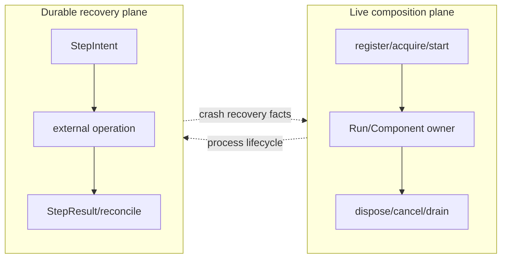
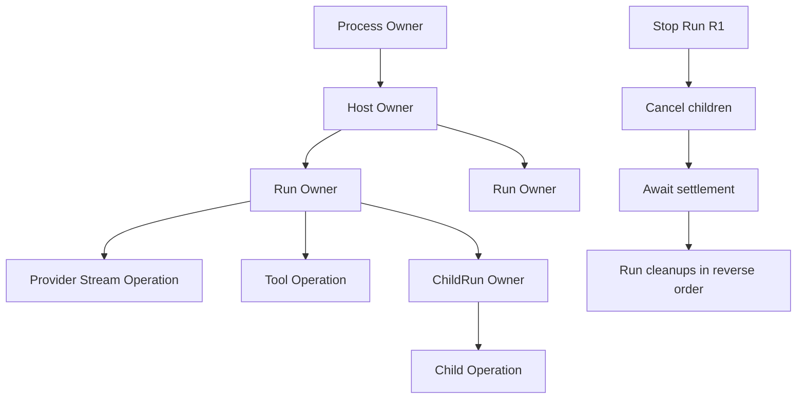
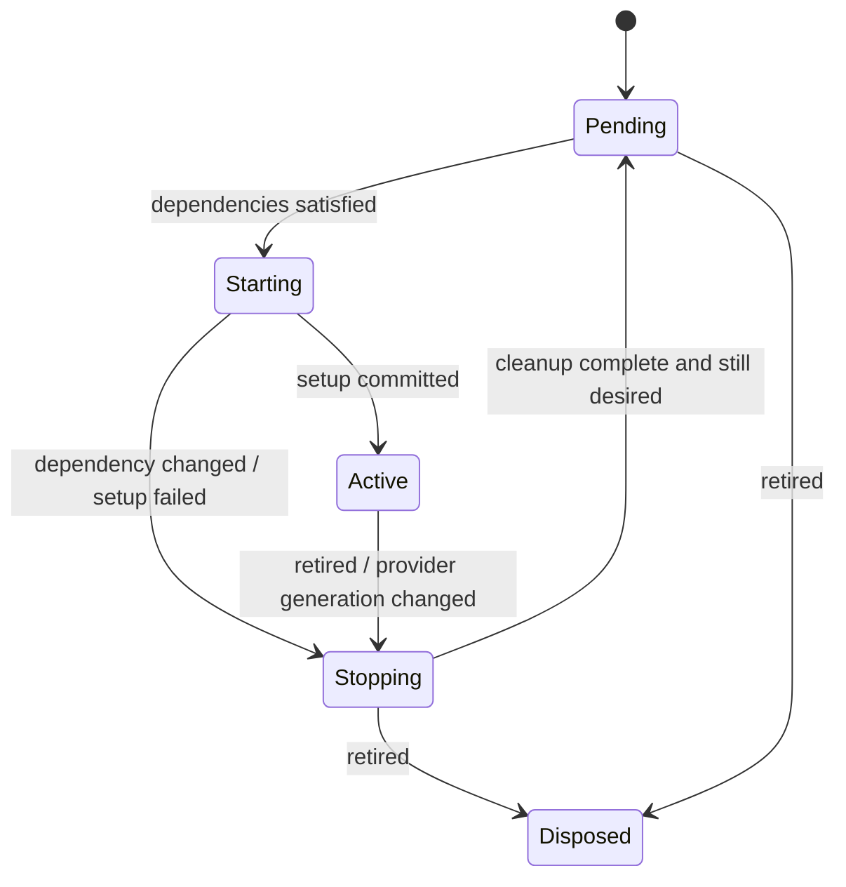
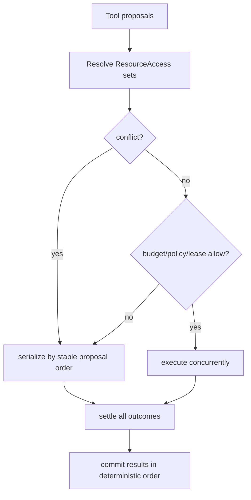
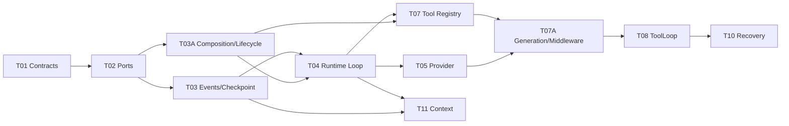
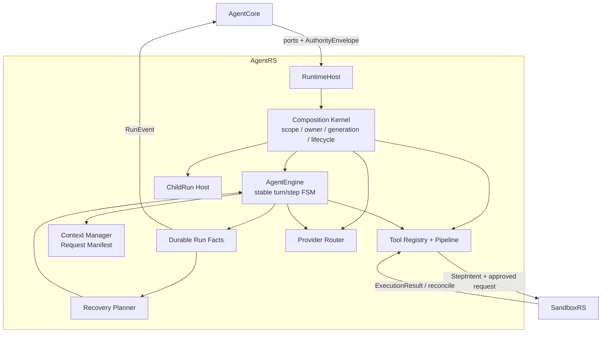

# DeepSeek Harness 与 Cordis 对 AgentRS 设计的影响评估报告

> 评估对象：`agentrs-技术架构设计与实施方案.md`、`agentrs-任务级实施分解与源码借鉴清单.md`、`opensource/deepseek-harness/DeepSeek-Harness与Cordis深度解读报告.md`  
> 评估日期：2026-08-14  
> 结论口径：本文评估的是对 uworker `agentrs` 架构决策的影响，不主张把 TypeScript Cordis 或 DeepSeek Harness 源码直接移植到 Rust。

## 0. 执行结论

DeepSeek Harness/Cordis 对 AgentRS 的总体影响为 **8/10，属于高影响但非推翻式影响**。

它不会改变 AgentRS 的产品定位：AgentRS 仍应是 Rust 编写、可嵌入、provider-neutral、通过 trait port 与 AgentCore/SandboxRS 协作的推理内核，也不应获得直接文件、进程、数据库或授权裁决能力。

真正受到高影响的是 AgentRS 的运行时内部结构：

1. AgentRS 不应只被设计为一个 `AgentEngine + 一组 ports`，还需要一套明确的 **能力实例、依赖、作用域、所有权和撤销模型**。
2. 当前 `StepIntent -> Sandbox -> StepResult` 只解决外部副作用的崩溃恢复，不能替代进程内 listener、tool registration、provider session、background task 等资源的结构化清理。
3. 当前 `RunSpec` 把能力完全固定到 Run，适合 P0，但长期需要区分“不可扩大的授权上界”与“可以减少、失效或换代的能力解析结果”。
4. `RunEvent` 不应只作为对外输出流，还应成为模型输入、回放和恢复的权威事实来源；所有模型可见内容必须能从事件或内容寻址快照重建。
5. Tool/LLM/Prompt/Compaction/Policy 等扩展不应逐渐堆入 `AgentEngine`，而应形成稳定的 Definition/Provider/Consumer seam 和类型化 middleware pipeline。

影响评估可以压缩为：

| 方面 | 影响等级 | 判断 |
|---|---:|---|
| AgentRS 产品边界 | 2/10 | 现有 Core/AgentRS/SandboxRS 分工正确，不应改变 |
| Runtime 生命周期 | 10/10 | 当前方案缺少统一的 owned effect/resource model |
| 能力与依赖拓扑 | 9/10 | 需要从 ports 集合提升为有身份、有代际、有依赖的 capability graph |
| 事件与恢复 | 8/10 | 已有良好基础，但需补“模型可见即可重建”和 live/durable 双平面 |
| Tool/LLM 扩展机制 | 8/10 | 应从具体 registry/调用链提升为 capability seam + typed middleware |
| 多 Agent 隔离 | 7/10 | 现有能力收窄正确，需要补 derived scope 与资源所有权 |
| 工具并发判定 | 8/10 | “只读并行、写串行”过粗，需要资源冲突/交换性模型 |
| 配置和热更新 | 5/10 | P0 不必实现通用 HMR，P1 可引入受控 generation replacement |
| 安全架构 | 4/10 | Cordis 不提供安全保证；现有 SandboxRS 边界更强，应继续坚持 |
| Rust crate 划分 | 7/10 | 现有 crates 可保留，但应增加 runtime composition/lifecycle 责任 |

最终建议不是“在 AgentRS 中实现 Cordis”，而是：

> **把 Cordis 的生命周期与依赖语义，翻译成适合 Rust、适合安全桌面 Agent、适合崩溃恢复的显式 Runtime Composition Kernel。**

## 1. 为什么影响很大

### 1.1 Agent 系统的复杂度最终来自生命周期，而不只来自推理循环

AgentRS 当前方案已经覆盖模型流、工具调度、上下文、记忆、技能、子 Agent、checkpoint 和恢复。随着能力增加，真正容易失控的部分会变成：

- 某个 provider adapter 何时可用、何时失效；
- ToolDef、middleware、prompt section 由谁注册；
- 一个 Run 或 ChildRun 结束时，哪些 task、stream、listener 和租约必须停止；
- 能力替换时，正在进行的 step 是继续、取消还是在边界重建；
- 某项 setup 完成一半后失败，前半段如何撤销；
- 子 Agent 继承哪些能力、覆盖哪些实现、谁拥有其资源；
- 多个插件/策略同时包装工具调用时，顺序是否确定、撤销是否完整；
- 恢复之后如何证明模型看到的输入与历史事实一致。

这些正是 Cordis/Harness 最有价值的部分。它们没有提供更聪明的推理算法，却提供了一个长期运行系统如何持续组合能力的答案。

### 1.2 AgentRS 当前设计偏重 durable workflow，缺少 live composition

当前方案最成熟的是持久工作流平面：

```text
StepIntent -> Policy -> Sandbox -> StepResult -> Checkpoint
```

这条链解决的是：进程崩溃或超时后，怎样不重复未知外部副作用。

但一个运行中的 Agent 还有另一类状态：

```text
tool registration / listener / provider stream / background task /
temporary scope / child runtime / cached adapter / middleware registration
```

这些状态多数不需要写入 durable log，却必须在 Run 取消、组件失败、能力换代或宿主关闭时精确释放。Cordis 的 `Fiber + ctx.effect()` 正好补足这一平面。



如果只保留 durable plane，AgentRS 仍可能在单次进程生命周期内泄漏资源或出现 stale registration；如果只照搬 Cordis live rollback，又无法撤回已发送网络请求、已执行命令或已持久化外部事实。AgentRS 必须同时拥有两者。

## 2. 对现有正确决策的确认

Harness/Cordis 并不意味着现有 AgentRS 方案需要重写。以下决策得到进一步验证，应保持不变。

### 2.1 AgentCore、AgentRS、SandboxRS 三方边界正确

Cordis 的 recovery theorem 不等于安全隔离。一个 effect 即使能在结束时删除，也可能已经读取秘密、发送网络数据或破坏宿主。因此：

- AgentCore 继续拥有账号、策略、审批、持久化实现和 grant 签发；
- AgentRS 继续只负责推理、上下文和调用编排；
- SandboxRS 继续负责 OS 进程、路径、网络、资源限制和 ChangeSet；
- AgentRS 不直接 `spawn`、`fs::write`、打开 SQLite 或读取 Keychain。

这个边界比 Harness 的进程内 VM self-modification 更适合商业桌面产品，不能为了追求“一切皆插件”而削弱。

### 2.2 Trait port 方向正确

AgentRS 已定义 `ProviderPort`、`RunPersistence`、`PolicyEnforcer`、`SandboxExecutor`、`MemoryRetriever` 等窄接口，这与 Harness capability seam 的思想一致。

需要加强的是 port 的运行时元数据和生命周期，不是改成全局 Service Locator。Rust trait、构造函数注入和显式 struct 字段仍然比 JavaScript Proxy 更适合 AgentRS。

### 2.3 StepIntent 与 reconcile 方向正确

Cordis inverse 不能撤销外部 emission。AgentRS 现有规则“工具执行前持久化 intent，未知状态先 reconcile，不能盲重试”比单纯 disposer 更严格，也更符合本地工作区安全要求。

该设计应保留，并明确它与 live resource cleanup 是互补关系。

### 2.4 子 Agent 能力只能收窄

Harness 的 per-agent Context/Scope 证明了局部能力视图的重要性；AgentRS 当前规定 ChildRun 的 capability、模型预算和递归深度只能取父授权交集，是正确方向。

后续应把这种规则落实为 derived scope，而不是每个子模块手写 filter。

### 2.5 RunEvent、checkpoint 和 fake ports 是正确基础

Harness 的 append-only Session Log 验证了事实流对 replay、UI、恢复、telemetry 和模型上下文的重要性。AgentRS 当前 `RunEvent`、单调 `seq`、checkpoint、fake provider/sandbox/persistence 的设计是正确地基。

需要补强的是事件与模型输入之间的可重建约束，以及 live event 与 durable fact 的区分。

## 3. 最重要的新增设计：Runtime Composition Kernel

### 3.1 不移植 Cordis API，提炼其语义

不建议在 Rust 中复刻以下 Cordis 机制：

- JavaScript Proxy 风格的 `ctx.<service>` 动态属性；
- TypeScript declaration merging；
- 任意 JS plugin callback；
- 运行时 YAML 加载任意进程内代码；
- 用字符串 key 表示所有服务；
- 不受信代码直接进入同一进程 Context。

建议新增或明确一个 AgentRS 内部模块，例如：

```text
agentrs-runtime/src/composition/
  capability.rs       CapabilityKey、ProviderId、Generation
  component.rs        ComponentSpec、依赖、provision
  scope.rs            RootScope、RunScope、ChildScope
  owner.rs            OwnerId、OwnedResource、cleanup stack
  lifecycle.rs        Pending/Starting/Active/Stopping/Failed
  registry.rs         provider/consumer resolution
  middleware.rs       typed pipeline registrations
  quiescence.rs       cancel、drain、shutdown settlement
```

若希望 crate 隔离，也可以增加 `agentrs-composition`；但 P0 更建议先作为 `agentrs-runtime` 内部模块，避免过早公开一套未经验证的插件 ABI。

### 3.2 核心对象

建议的最小模型：

```rust
pub struct CapabilityKey(&'static str);
pub struct ProviderId(Uuid);
pub struct ComponentId(Uuid);
pub struct ScopeId(Uuid);
pub struct Generation(u64);

pub struct ComponentSpec {
    pub id: ComponentId,
    pub requires: Vec<CapabilityRequirement>,
    pub provides: Vec<CapabilityProvision>,
    pub parent: Option<ComponentId>,
}

pub enum LifecycleState {
    Pending,
    Starting { generation: Generation },
    Active { generation: Generation },
    Stopping { generation: Generation },
    Failed { generation: Generation, code: ErrorCode },
    Disposed,
}
```

Rust 中不必让每个 capability 都通过 `Any` 动态向下转型。可采用两层结构：

- 核心 ports 继续是强类型字段，如 `Arc<dyn ProviderPort>`；
- registry 只保存 capability identity、provider generation、availability 和 owner，用于拓扑/lifecycle；
- 具体组件 setup 通过强类型 `RuntimeServices` 获取已验证依赖。

这样既能获得 Cordis 的 reactive lifecycle，又不牺牲 Rust 的类型安全。

### 3.3 Component 与 Run 的关系

建议区分四个作用域层级：

```text
ProcessScope
  -> HostScope
      -> RunScope
          -> Turn/OperationScope
          -> ChildRunScope
```

| Scope | 拥有什么 | 何时销毁 |
|---|---|---|
| Process | runtime factory、共享 immutable catalogs | 进程关闭 |
| Host | 注入 ports、provider pools、全局 telemetry adapters | AgentCore host 停止或重配置 |
| Run | Run-specific tools、prompts、budget、listeners、child runs | Run 终止/取消 |
| Operation | provider stream、tool execution wait、timeout、temporary artifact handles | 单次 step/operation settlement |
| ChildRun | 收窄后的 capability view 与自己的 resources | ChildRun 完成、父取消或超时 |

每项资源只归一个 owner，父 owner 停止时先取消子 operation/child，再反序释放自己的 registrations。



## 4. Revertible Effect 对 AgentRS 的具体影响

### 4.1 引入 OwnedResource，而不是通用“任意状态 inverse”

Cordis 用 `ctx.effect(() => disposer)` 统一追踪副作用。在 Rust 中，RAII 已能处理许多同步资源，但 async cleanup、task cancellation、listener deregistration 和有序 drain 不能只依赖 `Drop`。

建议提供显式 owner API：

```rust
#[async_trait]
pub trait AsyncCleanup: Send {
    async fn cleanup(self: Box<Self>) -> Result<(), CleanupError>;
}

pub struct ResourceOwner {
    cancel: CancellationToken,
    cleanups: Vec<Box<dyn AsyncCleanup>>,
    children: Vec<OwnedHandle>,
}

impl ResourceOwner {
    pub async fn acquire<T, F>(&mut self, setup: F) -> Result<T, SetupError>
    where
        F: AsyncFnOnce() -> Result<(T, Box<dyn AsyncCleanup>), SetupError>;

    pub async fn shutdown(&mut self) -> ShutdownReport;
}
```

语义要求：

1. setup 成功后，cleanup 必须在资源对外可见前登记；
2. setup 中途失败，已登记资源反序撤销；
3. shutdown 先发 cancellation，再等待 in-flight task 到达边界，最后执行 cleanup；
4. cleanup failure 被收集到 `ShutdownReport`，不能阻止其他 cleanup；
5. owner 进入 Stopping 后禁止注册新逃逸资源；
6. public dispose 幂等，多次调用返回同一个 settlement 结果。

这些要求直接对应 Harness vendored Cordis 对 reentrant disposal 和 async cleanup 所做的加固。

### 4.2 哪些 AgentRS 对象应纳入 live effect

| 对象 | 正向动作 | cleanup |
|---|---|---|
| Tool registration | 加入 Run tool catalog | 删除该 owner 的 ToolDef/handler |
| Middleware registration | 加入 pipeline | 从 pipeline 删除 |
| Provider stream | 建立流/连接或借用 session | cancel、drain、release lease |
| Background task | spawn task | cancel token + await join |
| ChildRun | publish child handle | cancel、await terminal、unregister |
| Temporary prompt/context section | 加入 Run view | 删除 section |
| Telemetry subscriber | subscribe | unsubscribe/flush |
| MCP logical tool proxy | 加入 catalog | 删除 proxy；真实连接仍由 Core owner 管 |
| Approval waiter | 注册等待 | cancel/expire/unregister |

### 4.3 哪些对象不能假装可逆

以下行为不能用 cleanup 宣称“恢复为未发生”：

- 已发出的模型 API 请求和计费；
- 已输出给 UI 的 token；
- 已写入 append-only RunEvent；
- 已发送的网络消息；
- Sandbox 已执行但状态未知的命令；
- 用户已经提交的 ChangeSet；
- 外部 MCP server 已完成的业务操作。

这些必须继续走 intent/result/reconcile、幂等 key、事务或业务补偿。报告建议在代码和文档中明确两类术语：

```text
cleanup/release: 释放当前 live resource，不承诺抹除历史
reconcile/compensate: 处理不可逆或状态未知的外部 operation
```

## 5. Reactive Coeffect 对能力模型的影响

### 5.1 将 ports 从字段集合提升为有身份的 capability view

当前 `RunSpec` 注入 ports 和 capability grant，可以启动一个稳定 Run。长期运行时仍会遇到：provider credential 失效、模型 adapter 被替换、MCP server 下线、Sandbox session 重建、工具被策略撤回、workspace 切换。

建议每个 capability resolution 包含：

```rust
pub struct ResolvedCapability<T: ?Sized> {
    pub provider_id: ProviderId,
    pub generation: Generation,
    pub value: Arc<T>,
    pub availability: Availability,
}
```

Consumer 依赖的不是“某 trait object 非空”这么简单，而是一个 committed view：

```text
(CapabilityKey, ProviderId, Generation)
```

只要 provider identity 或 generation 改变，旧 operation 不能在无检查的情况下继续混用新 provider。

### 5.2 授权上界与能力可用性必须分离

当前方案写明 RunSpec 中能力固定，中途变化需要新 Run 或安全边界重建。这个原则应细化为：

| 对象 | 是否允许 Run 中变化 | 规则 |
|---|---|---|
| Authority ceiling | 不允许扩大 | 来自 Core 签名/授予，ChildRun 只能取交集 |
| Tool availability | 可减少/失效 | 撤回后新 step 不再暴露；in-flight 按 operation policy 处理 |
| Provider generation | 可换代 | 当前 model request 固定 committed generation，下一 step 可重建 |
| Prompt/policy content | 不静默混入 | 记录新 generation，在 step boundary 重新 assemble 并写事件 |
| SandboxGrant | 每 operation 签发 | 不能通过 capability refresh 延长或扩大 |
| Workspace identity | 不原地切换 | 创建新 Run 或显式 transition，防止上下文混淆 |

因此推荐把 `RunSpec.capability_grant` 拆成概念上的两层：

```text
AuthorityEnvelope: 不可扩大、可验证的权限上界
CapabilityView: 当前在 AuthorityEnvelope 内实际可用的 provider/tool 集合
```

CapabilityView 可以收缩或换代；任何变化都不能突破 AuthorityEnvelope。

### 5.3 激活、撤回与 provider replacement

建议组件生命周期遵循：



对 AgentRS 而言，不必让整个 Run 因任意 tool 变化而重启。应选择正确粒度：

- Tool catalog change：在下一个 model request assembly 边界提交；
- LLM provider replacement：当前 request 固定旧 generation，下一 step 使用新 generation；
- Sandbox executor replacement：当前 execution 必须由旧 executor reconcile/settle；新 execution 才用新 generation；
- Prompt contributor change：下一 request 生成新 snapshot，并记录 generation；
- 核心 Persistence port 失效：Run 进入 suspended/failed，而不是热换后继续写不连续日志。

这比“所有依赖变化都重启 AgentEngine”更精细，也比“Arc 指针悄悄换掉”更可审计。

## 6. Harness Session 模型对 RunEvent 的影响

### 6.1 从输出事件升级为权威事实流

当前方案把 `RunEvent` 定义为 AgentRS 唯一对外输出，这是好基础。建议进一步确立：

> 任何进入下一次模型请求的内容，都必须能从 durable RunEvent、不可变 RunSpec 或内容寻址 Artifact/Snapshot 重建。

这会改变 `ContextManager` 的实现责任。它不能仅在内存中拼接 prompt 后调用 provider，而应产生一个可审计的 request assembly record，例如：

```rust
pub struct ModelRequestManifest {
    pub request_id: RequestId,
    pub model_generation: Generation,
    pub source_event_range: EventRange,
    pub system_sections: Vec<ContentRef>,
    pub memory_fragments: Vec<MemoryRef>,
    pub skill_fragments: Vec<SkillRef>,
    pub tool_catalog_digest: Digest,
    pub capability_view_digest: Digest,
    pub compaction_refs: Vec<SummaryRef>,
    pub token_accounting: TokenAccounting,
}
```

不一定要把完整 prompt 正文写入普通 telemetry；可以把敏感内容保存在 Core 管理的加密内容存储中，RunEvent 只记录 content ref、hash、版本和范围。关键是能够证明和重放“模型当时看到了什么”。

### 6.2 Live event 与 durable event 分离

Harness 区分 durable Session events 与 live Agent/capability events。AgentRS 也应避免把所有 delta 都当恢复事实。

| 类别 | 示例 | 是否必须 durable |
|---|---|---|
| Durable facts | TurnStarted、StepIntent、ApprovalRequested、StepResult、RequestManifest、终态 | 是 |
| Durable content refs | assistant committed message、tool result ref、summary ref | 是 |
| Live telemetry | provider frame timing、queue depth、intermediate retry | 否，可采样 |
| UI stream | TextDelta、ThinkingDelta | 可实时广播；必须有 committed replacement 或明确 partial record |
| Runtime notifications | tool catalog changed、component starting/stopping | 通常非 durable；影响模型输入时需记录新 manifest |

这样可以避免事件日志被每个内部 lifecycle tick 污染，同时保证模型上下文和副作用边界可重建。

### 6.3 对当前恢复规则的补充

当前规则“模型产生可见文本后不自动重试”是正确的，但还应记录：

- partial assistant output 是否进入 durable transcript；
- provider continuation/signature 属于哪个 provider generation；
- tool call 是否已被模型 commit；
- 下一次 request 使用哪个 source range；
- compaction summary 覆盖哪些 event，是否仍与原始权限 scope 一致。

恢复不是仅恢复 `ConversationState` struct，而是恢复一个对事实流的确定投影。

## 7. Capability Seam 对 crate/API 设计的影响

### 7.1 Definition、Provider、Consumer 三角色

AgentRS 当前 ports 和 ToolDef 已接近这一模式，但建议在设计评审中强制检查完整 seam：

| Seam | Definition | Provider | Consumer |
|---|---|---|---|
| LLM | `ProviderPort`、message/stream types | OpenAI/Anthropic/DeepSeek adapters | ModelRouter/AgentEngine |
| Tool | `ToolDef`、execution/result contract | Core/Sandbox/MCP proxy registrations | ToolLoop + prompt assembler |
| Persistence | event/checkpoint contract | AgentCore adapter | RuntimeHost/RecoveryPlanner |
| Policy | proposal/decision contract | AgentCore policy adapter | ToolLoop |
| Memory | candidate/fragment contract | Core Awareness adapter | ContextManager/selector |
| Skill | manifest/content contract | Core resolver | ContextManager/skill search |
| Subagent | ChildRunSpec/summary | RuntimeHost/Core worker adapter | ToolLoop/main Agent |

每个 seam 必须回答：

1. provider 如何注册和撤销；
2. consumer 声明什么依赖；
3. provider generation 改变时如何处理 in-flight operation；
4. 失败是否导致整个 Run 失败；
5. 哪些数据是 durable；
6. 该 seam 的 capability 是否可被 ChildRun 收窄；
7. 是否存在绕过 policy/sandbox 的 alternate caller。

### 7.2 不要让 AgentEngine 成为 privileged core

Harness 的经验是 Agent loop 本身也应是一个消费者，而不是所有扩展都修改它。AgentRS 中 `AgentEngine` 应只负责稳定状态机：

```text
claim input -> assemble request -> stream model -> classify outcome
-> dispatch tool round or finish -> checkpoint -> continue/stop
```

以下能力不应通过持续修改 engine 主循环加入：

- retry；
- telemetry；
- permission preprocessing；
- tool timeout；
- output retention；
- compaction trigger；
- context contributor；
- goal/plan continuation；
- model request decoration。

它们应进入有明确阶段、明确顺序和明确 ownership 的 pipeline。

## 8. Typed Middleware Pipeline 的建议

### 8.1 从 Cordis waterfall 借鉴“可环绕”，但避免隐式短路

Cordis waterfall 允许 listener 调用 `next()` 包围后续行为。它很灵活，也容易因为忘记 `next()` 意外短路。Rust 版本应更显式：

```rust
#[async_trait]
pub trait ToolMiddleware: Send + Sync {
    async fn handle(
        &self,
        call: ToolCallContext,
        next: NextTool<'_>,
    ) -> Result<ToolOutcome, ToolError>;
}
```

每个 registration 还应包含：

```rust
pub struct MiddlewareRegistration<M> {
    pub id: RegistrationId,
    pub owner: ComponentId,
    pub phase: MiddlewarePhase,
    pub order: i32,
    pub middleware: Arc<M>,
}
```

### 8.2 建议的固定 pipeline

```mermaid
flowchart LR
  Parse[Parse + schema validation]
  Resolve[Resolve registered tool generation]
  Guard[Capability + cancellation guard]
  Policy[Policy evaluation]
  Approval[Approval wait]
  Around[Timeout / retry / metrics middleware]
  Exec[SandboxExecutor]
  Normalize[Normalize / artifact / redaction]
  Persist[StepResult commit]
  Return[Tool message]
  Parse --> Resolve --> Guard --> Policy --> Approval --> Around --> Exec --> Normalize --> Persist --> Return
```



硬安全检查必须位于不可绕过的 executor path，不能只做 middleware：

- schema validation；
- capability/grant validation；
- StepIntent 持久化；
- Sandbox enforcement；
- StepResult commit。

Middleware 适合 timeout、retry、metrics、result transformation，但不能替代最终授权和 Sandbox 强制执行。

### 8.3 Pipeline registration 必须可撤销

任何 middleware、tool、prompt contributor 注册都应返回 owner-bound registration handle。组件停止后，新的 request 不得再看到它；已拿到 committed pipeline snapshot 的 operation 则按该 snapshot 完成或取消。

建议每次 operation 在开始时固定：

```text
ToolCatalogGeneration
MiddlewareChainGeneration
ProviderGeneration
AuthorityEnvelopeId
```

这相当于 Cordis committed view，防止一次调用的前半段使用旧策略、后半段使用新策略。

## 9. 对工具并发模型的影响

### 9.1 “只读并行、写串行”不足以表达 independence

当前 ToolLoop 规则把 read-only 并行、mutating 串行，适合作为保守 P0 默认值。但“只读”不代表无副作用：

- 两次网络搜索都消耗 rate limit；
- 两次模型调用共享 provider quota；
- 两个 read 工具可能争用同一 terminal/session；
- 一个 read 可能触发 lazy cache fill；
- 两个写操作若写不同隔离 ChangeSet，也可能安全并行。

建议 ToolDef 增加 effect/resource 描述：

```rust
pub struct EffectProfile {
    pub resources: Vec<ResourceAccess>,
    pub external_emission: bool,
    pub retry: RetrySemantics,
    pub cancellation: CancellationSemantics,
}

pub enum AccessMode {
    SharedRead,
    ExclusiveWrite,
    CommutativeAppend,
    RateLimited,
}
```

### 9.2 并发调度规则

两个工具调用只有在以下条件同时满足时才允许并行：

1. resource access 不冲突，或对应 operation 明确声明为 commutative；
2. 不共享 exclusive provider/session lease；
3. policy 允许并行；
4. 总并发、token、cost 和 Sandbox resource budget 未超限；
5. 一个失败不会使另一个已签发 grant 失效；
6. 结果回灌顺序有确定规则。



这把论文中的 independence 转化为可执行的保守冲突检测，而不是试图在运行时证明任意 Rust closure 可交换。

## 10. 多 Agent、Skill 与 Scope 的影响

### 10.1 ChildRun 使用 derived scope

建议 ChildRun 不再只是复制父 RunSpec 后过滤字段，而是由 scope API 构造：

```rust
pub struct ScopeDerivation {
    pub allowed_tools: SetIntersection,
    pub model_policy: NarrowedModelPolicy,
    pub budget: ChildBudget,
    pub visibility: VisibilityFilter,
    pub provider_overrides: Vec<AuthorizedOverride>,
}
```

Derived scope 保证：

- 未显式覆盖的 capability 从父级继承；
- override 只能落在 AuthorityEnvelope 内；
- child registration 由 ChildRun owner 持有；
- 父取消先传播到 child，再等待 child terminal；
- child 只返回结构化 summary/artifact refs；
- child 结束后其 tools/listeners/prompts 不残留在父 scope。

### 10.2 Skill 是 Context modifier，不是权限插件

当前方案已经规定 Skill 只能收窄能力，应继续保持。受 Cordis interception 启发，可把 Skill 对运行环境的影响表达为 derived configuration layers：

```text
base Run policy
  -> selected skill restrictions
  -> child/profile restrictions
  -> operation-specific grant
```

合并必须是单调收窄：集合取交集、预算取最小、风险策略取更严格、数据可见范围不能扩大。不要采用右侧任意覆盖的普通 config merge。

### 10.3 每 Agent 局部注册

Tool、prompt section、memory view 和 middleware 的 registration 应带 `ScopeId`。查询时由 Run/ChildRun scope 过滤，而不是复制整套 registry。这样可以：

- 全局提供基础工具；
- 为某 Run 临时增加只读 capability；
- 为 ChildRun 屏蔽高风险工具；
- 在 Run 结束时按 owner 一次性清理；
- 避免一个 Agent 的工具变化污染其他 Agent。

## 11. 对配置、插件与自修改的影响

### 11.1 P0 不需要通用动态插件系统

AgentRS 首发目标是可嵌入、安全、可恢复，而不是开放第三方 in-process plugin ABI。Rust 动态库 ABI、panic 隔离、内存安全之外的逻辑安全、版本兼容和签名分发都会显著扩大范围。

P0 建议：

- 能力实现静态链接；
- 通过 trait objects 和 builders 组合；
- 配置只选择已编译 components；
- 外部 MCP/工具通过 AgentCore/SandboxRS 进程边界接入；
- 不允许运行时下载并装载任意 Rust dynamic library；
- CLI 不读取一个可执行表达式 YAML。

### 11.2 P1/P2 的受控换代

需要热更新时，应使用 generation replacement，而不是通用代码 HMR：

```text
register candidate generation
-> validate dependencies/config
-> start candidate privately
-> commit provider generation
-> stop old consumers at safe boundary
-> drain old provider
-> remove old generation
```

若 candidate 启动失败，旧 generation 继续服务。这借鉴 Harness transactional Loader，但实现范围限定在受信、已编译组件或外部进程 adapter。

### 11.3 Self-modification 的取舍

Harness 的 self-modification 证明 Agent 可以通过插件修改自己的能力图，但其 VM 不是安全边界。AgentRS 不应在 P0/P1 复制这一机制。

适合 AgentRS 的“自修改”应定义为：

- Agent 提议一个能力配置变更；
- AgentCore 校验、审批并创建新 composition generation；
- 新能力仍来自签名/已安装 catalog；
- 权限不超过 AuthorityEnvelope；
- Sandbox 承担外部代码执行；
- RunEvent 记录变更意图、批准、generation 与回滚结果。

即“自修改配置和能力图”，不是“模型把任意代码塞进 AgentRS 进程”。

## 12. 对现有 crate 的逐项影响

| 现有 crate | 影响 | 建议修改 |
|---|---:|---|
| `agentrs-contracts` | 中 | 增加 generation、scope、request manifest、capability view digest 等跨边界语义；不要暴露内部 plugin runtime |
| `agentrs-types` | 中 | ToolDef 增加 EffectProfile/ResourceAccess；模型请求携带 assembly manifest identity |
| `agentrs-runtime` | 极高 | 新增 composition、owner、lifecycle、quiescence；AgentEngine 消费 committed snapshots |
| `agentrs-provider` | 高 | provider identity/generation、stream ownership、drain/replacement policy |
| `agentrs-context` | 高 | model-visible-is-reconstructable、context contributors、request manifest、generation digest |
| `agentrs-tools` | 极高 | scoped registry、owned registration、typed middleware、resource conflict planner |
| `agentrs-skills` | 中 | 使用 derived restriction layer；禁止任意 config overwrite |
| `agentrs-memory` | 中 | fragment provenance/visibility/generation 进入 manifest |
| `agentrs-subagents` | 高 | derived scope、child ownership、父子 cancel/drain、summary-only publication |
| `agentrs-prompts` | 高 | prompt contributor registry、版本和 scope、可重建 section refs |
| `agentrs-observability` | 中 | 区分 live lifecycle telemetry 与 durable Run facts |
| `agentrs-cli` | 低 | 继续薄；增加 composition/owner 诊断，不承担动态插件加载 |
| `agentrs-testkit` | 高 | fake capability changes、provider replacement、cleanup failure、interleaving scheduler |

是否新增 `agentrs-composition` crate：

- P0：否，先作为 runtime 内部模块；
- P1：当 tools/provider/subagent 至少三个模块稳定复用同一套 owner/lifecycle API 后再抽出；
- 对外公开：只有 AgentCore 确实需要程序化注册组件、且 API 经至少两个版本验证后再考虑。

## 13. 对现有 20 项任务的调整建议

### 13.1 必须修改的任务

| 原任务 | 调整 |
|---|---|
| T01 Contracts | 增加 `Generation`、`ScopeId`、`CapabilityViewDigest`、`ModelRequestManifest`/ref |
| T02 Ports/Testkit | port registration 带 provider identity/generation；fake 可模拟失效、替换和 drain |
| T03 RunEvent/Checkpoint | 增加 request assembly、capability generation、partial output commit 语义 |
| T04 RuntimeHost/Loop | 增加 Run owner、operation owner、quiescent shutdown；Engine 只消费 committed snapshots |
| T05 Provider | stream 必须 owner-bound；明确 replacement 与 continuation generation |
| T07 Tool Registry | scoped、generation-aware、owned registration；ToolDef 加 EffectProfile |
| T08 ToolLoop | 固定 pipeline 与不可绕过阶段；用 resource conflict 代替纯 read/write 分类 |
| T10 Recovery | 同时覆盖 crash recovery 和 live cleanup；明确二者不互相替代 |
| T11 ContextManager | 生成 ModelRequestManifest，落实“模型可见即可重建” |
| T15 Skills | ContextModifier 使用单调收窄 merge |
| T16/T20 Subagent | derived scope + parent-owned lifecycle + cancel/drain |
| T19 Observability | 分开 durable facts、UI stream、live lifecycle telemetry |

### 13.2 建议新增任务

建议在 T03 与 T04 之间新增一项，编号可定为 `T03A`：

#### T03A. Runtime Composition 与 Owned Lifecycle

- 依赖：T01、T02。
- 实施：`ComponentId/ScopeId/Generation`、ResourceOwner、async cleanup stack、child ownership、lifecycle FSM、quiescent shutdown。
- 不照搬：不实现 JS Proxy、YAML 任意插件、动态库 ABI 或不受信 in-process code。
- 交付：composition 内部模块、owner API、状态图、故障注入 scheduler。
- 验收：setup 第 N 步失败会反序清理前 N-1 步；取消时先 cancel/drain child 后清理 parent；cleanup failure 不阻断其他资源；Stopping 后不能注册逃逸资源。

建议在 T07 与 T08 之间新增 `T07A`：

#### T07A. Capability Generation 与 Typed Middleware

- 依赖：T03A、T07。
- 实施：provider identity/generation、committed operation view、Tool/LLM pipeline registration、owner-bound disposer。
- 交付：snapshot API、middleware registry、replacement tests。
- 验收：一次 operation 不跨两个 provider/pipeline generation；撤销 component 后新 operation 不再看到其 registration；旧 operation 能完成或被明确取消。

### 13.3 推荐后的关键路径



## 14. 分阶段落地方案

### Phase 0：现在就吸收，避免返工

在写 AgentEngine 主循环前完成：

1. 定义 Run/Operation/Child owner；
2. 实现 async cleanup 与 quiescent shutdown；
3. Tool registration 带 scope 和 owner；
4. Provider stream 绑定 operation owner；
5. 区分 durable operation 与 live resource；
6. 定义 ModelRequestManifest 最小字段；
7. ToolDef 预留 resource/effect profile。

这一阶段不需要动态 provider hot swap，也不需要通用 component loader，但必须把身份字段和所有权位置放对，否则后续 API 会大面积破坏性修改。

### Phase 1：能力增长后引入 generation

当出现两个以上 provider、MCP、per-run tool 或 Skill modifier 时：

1. 引入 capability/provider generation；
2. operation 开始时提交 dependency view；
3. tool/prompt/middleware catalog 采用 immutable snapshot；
4. ChildRun 使用 derived scope；
5. request manifest 记录 catalog/capability digest；
6. fake scheduler 验证变化与 in-flight operation 交错。

### Phase 2：需要长期运行和动态重配置时再做 reactive replacement

1. component dependency graph；
2. safe-boundary deactivate/reactivate；
3. candidate generation transactional start；
4. provider withdrawal guard；
5. config diff/reconcile；
6. quiescence 与无环检查；
7. 管理界面展示 live component graph。

### Phase 3：仅在产品需求明确时开放扩展生态

优先使用进程外 WASI/MCP/JSON-RPC plugin，由 SandboxRS/AgentCore 管理。只有在 ABI、签名、版本、资源限制、crash containment 和权限模型成熟后，才考虑进程内 Rust plugin。

## 15. 必须新增的测试

### 15.1 Lifecycle 测试

- setup 第 1/N/最后一步失败；
- setup 进行中 Run 被取消；
- cleanup 本身失败或超时；
- cleanup 回调试图注册新资源；
- public dispose 并发调用；
- parent shutdown 时 child 尚在 provider stream；
- provider replacement 与 tool execution 同时发生；
- listener/middleware/tool unregister 后不可再见。

### 15.2 Dependency/coeffect 测试

- 必需 capability 缺失时 component 保持 Pending；
- capability 出现后仅激活一次；
- provider generation 改变触发正确边界重建；
- consumer teardown 期间旧 provider 仍可用于结算；
- 循环依赖被诊断，不永久静默 Pending；
- ChildRun override 不突破 AuthorityEnvelope。

### 15.3 Event/reconstructability 测试

- 任意 model request 都能由 RunSpec + events + refs 重建；
- 未写 durable fact 的内容不能进入 request assembler；
- compaction summary 的 source range 不重叠错误、不重复压缩；
- provider/tool/prompt generation 改变后 manifest digest 改变；
- UI delta 丢失不影响 committed transcript replay；
- partial output 恢复策略确定。

### 15.4 并发与交换性测试

- 相同 exclusive resource 的两个 tool 串行；
- 不相交 ChangeSet root 可在 policy 允许时并行；
- rate-limited provider 遵守共享配额；
- 并发结果以稳定 call order 写入模型历史；
- 一个并行调用失败不丢失其他调用的 StepResult；
- property test 随机打乱无冲突 operation，最终 projection 一致。

### 15.5 HMR-safety 等价测试

即使 AgentRS 不实现 HMR，也应采用 Harness 的 disposal test 思路：

```text
register component
-> observe capability/tool/listener exists
-> dispose owner
-> observe contribution removed
-> repeat register/dispose
-> verify no duplicate callback, stale task or retained Arc cycle
```

## 16. 风险与反模式

### 16.1 直接复制 Cordis

风险：把动态字符串 Context、任意插件和 YAML 执行带入安全内核，弱化 Rust 类型和 AgentCore/SandboxRS 边界。

结论：拒绝。

### 16.2 认为 RAII 已经解决所有 lifecycle

风险：`Drop` 不能 await；无法可靠 drain background task；错误和取消顺序不可见；Arc cycle 可能让资源永不 drop。

结论：RAII 负责局部同步资源，ResourceOwner 负责异步结构化生命周期。

### 16.3 用 StepIntent 替代 cleanup

风险：为每个 listener/tool registration 写 durable event 成本过高，且不能在进程内即时清理。

结论：durable recovery 与 live cleanup 分层。

### 16.4 用 cleanup 替代 StepIntent

风险：外部命令、网络和计费无法撤回，崩溃后 disposer 根本不会运行。

结论：所有外部副作用继续执行 intent/result/reconcile。

### 16.5 把 `ArcSwap` 当 reactive dependency

风险：一次 operation 可能前半段使用旧 provider、后半段使用新 provider；旧 provider 在 consumer 未结算前被释放。

结论：operation 固定 committed generation，并有 withdrawal/drain 规则。

### 16.6 让 middleware 承担安全裁决

风险：注册顺序、短路或 alternate caller 绕过安全检查。

结论：middleware 只扩展，授权、intent 和 Sandbox enforcement 固定在 executor path。

### 16.7 把所有变化都做成整个 Run 重启

风险：简单但用户体验差，容易丢失 in-flight context，也使局部工具变化造成过大 blast radius。

结论：P0 可采用 Run-level snapshot；P1 后按 request/tool operation 边界局部换代。

### 16.8 过早实现完全通用 component calculus

风险：为尚不存在的第三方组件需求设计复杂 ABI，拖慢 P0。

结论：先实现 owner、scope、generation 和固定 seams；等三个以上真实消费者出现再抽象。

## 17. Architecture Decision 建议

建议新增以下 ADR：

### ADR-A01：AgentRS 采用 live/durable 双时间平面

- Live plane 管进程内 resource ownership、cancel、drain 和 cleanup；
- Durable plane 管 StepIntent、StepResult、checkpoint、reconcile；
- 两者不可互相替代。

### ADR-A02：Capability 权限上界与可用视图分离

- AuthorityEnvelope 在 Run 内不可扩大；
- CapabilityView 可收缩、失效或换代；
- ChildRun 只能派生更窄 view。

### ADR-A03：每个 operation 固定 committed dependency generation

- Provider、Tool catalog、middleware 和 prompt view 在 operation 开始时冻结；
- 中途变化在下一安全边界生效。

### ADR-A04：模型可见输入必须可重建

- 每个模型请求生成 ModelRequestManifest；
- 来源为 RunSpec、durable events 和 content refs；
- 纯内存、无来源内容不得进入请求。

### ADR-A05：所有 registration 都有 owner

- Tool、middleware、prompt、listener、child task 注册必须返回 owner-bound handle；
- owner shutdown 后贡献不可见；
- async cleanup 可 drain 且幂等。

### ADR-A06：AgentRS P0 不提供任意进程内动态插件

- 组件静态链接、trait 组合；
- 外部扩展优先进程隔离；
- 自修改是受审计的 composition generation 变更，不是任意代码注入。

### ADR-A07：工具并发由资源冲突模型决定

- read/write 作为默认分类；
- ToolDef 可声明 ResourceAccess、commutative append、rate limit 和 cancellation；
- 调度器保守判冲突。

## 18. 更新后的推荐总体架构



这张图与当前设计相比，只新增一层 Composition Kernel，但它改变了其他模块的连接方式：所有 runtime capability 都经 scope 解析、由 owner 持有、带 generation，并在 operation 开始时形成 committed view。

## 19. 预期收益

### 19.1 工程收益

- Run 取消后不残留 provider stream、tool task 或 listener；
- 组件 setup 失败不会留下半注册状态；
- Tool/Provider/Prompt 可局部替换，不必修改 AgentEngine；
- ChildRun 资源与能力天然归父 owner；
- 配置变化不会让单次 operation 混用两个 generation；
- 重放能够解释模型为何看到某工具、记忆或摘要；
- 并发调度从布尔 read/write 升级为可审计冲突模型；
- fake scheduler 能系统性发现 lifecycle/interleaving bug。

### 19.2 产品收益

- 更可靠的取消、恢复和关闭体验；
- 支持长期运行 Agent，而不要求频繁重启进程；
- 支持 per-run/per-child 能力定制且不扩权；
- Provider/MCP/工具失效时给出确定状态，不产生幽灵能力；
- 未来可安全加入受控插件市场或远程 capability；
- 审计可回答“模型当时看到了什么、能调用什么、由谁提供”。

### 19.3 不吸收这些设计的代价

若保持当前 `AgentEngine + ports + registries` 但不补生命周期模型，P0 仍可能完成；问题通常在 P1/P2 暴露：

- registry entry 没有统一 owner，Run 重建后重复注册；
- provider stream 与取消竞态，终态后仍产生事件；
- ChildRun 结束但 task 或 tool handler 残留；
- capability 更新依赖全局重启；
- tool middleware 顺序逐渐隐式化；
- prompt/context 来源无法完整重建；
- “只读并行”在共享 quota/session 上发生冲突；
- 外部恢复与进程内 cleanup 逻辑散落在各 crate。

这类问题后期修复会触及所有公开接口，因此影响评分达到 8/10。

## 20. 最终决策清单

### 立即采纳

1. live cleanup 与 durable recovery 双平面；
2. Run/Operation/Child 的结构化 owner；
3. async cancel -> drain -> reverse cleanup；
4. scoped、owned Tool/middleware/prompt registration；
5. ModelRequestManifest 和模型输入可重建原则；
6. AuthorityEnvelope 与 CapabilityView 分离；
7. ToolDef 预留 ResourceAccess/EffectProfile；
8. AgentEngine 保持稳定，扩展走 typed pipelines。

### P1 采纳

1. provider/tool/prompt/middleware generation；
2. operation committed view；
3. derived ChildRun scope；
4. capability 收缩和失效通知；
5. resource conflict 并发调度；
6. candidate generation transactional replacement。

### 暂不采纳

1. Cordis JavaScript Proxy Context；
2. TypeScript declaration merging 风格 API；
3. YAML 任意代码插件；
4. 通用 Rust 动态插件 ABI；
5. 不受信 in-process self-modification；
6. 把 Session/RunEvent 回滚为“未发生”；
7. 用 disposer 代替 Sandbox 和 crash reconcile。

## 21. 总结

DeepSeek Harness/Cordis 对 AgentRS 的最大启发不是“一切皆插件”这句口号，而是三个更精确的工程原则：

1. **能力必须有拓扑。** 一个组件需要什么、提供什么、解析到哪个 generation，必须明确；
2. **资源必须有所有者。** 注册、监听、任务、流和子运行都必须随 owner 结束而取消、收敛和撤销；
3. **历史与现场必须分层。** Live Context 可以清理和重建，durable facts 只能追加、reconcile 或补偿。

AgentRS 当前方案已经具备可靠的安全边界和 durable workflow 思维，这是比直接照搬 Harness 更重要的基础。真正需要做的，是在这个基础上补一层 Rust 原生的 Composition Kernel，并让 Tool、Provider、Context、Subagent 和 Pipeline 都统一服从 scope、owner、generation 和 committed view。

最终架构判断为：

> **保持 AgentRS 的边界和端口化设计不变；高优先级重构其内部生命周期与能力组合模型；吸收 Cordis 的语义，不复制 Cordis 的动态语言实现。**

## 附录 A：参考材料

- `agentrs-技术架构设计与实施方案.md`
- `agentrs-任务级实施分解与源码借鉴清单.md`
- `uworker-产品级技术架构设计执行方案.md`
- `opensource/deepseek-harness/DeepSeek-Harness与Cordis深度解读报告.md`
- `opensource/deepseek-harness/deepseek-harness-master/vendor/cordis/src/`
- `opensource/deepseek-harness/deepseek-harness-master/packages/boot/app-boot/src/`
- `opensource/deepseek-harness/deepseek-harness-master/packages/core/`
- `opensource/deepseek-harness/deepseek-harness-master/packages/llm/`
- `opensource/deepseek-harness/deepseek-harness-master/packages/client/`

## 附录 B：一句话评估

对 AgentRS 的影响不是“要不要用 Cordis”，而是“要不要在第一版就为长期运行 Agent 建立可证明的能力所有权和生命周期”；建议答案是要，但只实现最小、显式、Rust 原生且不削弱 Sandbox 安全边界的那一部分。
