# DeepSeek Harness、Cordis 与对应论文深度解读报告

> 分析对象：`cordis/`、`deepseek-harness-master/`、`paper.pdf`  
> 分析日期：2026-08-14  
> 方法：静态源码追踪、配置组合追踪、论文原文对照。本文中的“事实”来自当前本地快照；“判断”是基于代码的工程分析。

## 0. 执行摘要

这套系统真正重要的创新，不是又实现了一遍“LLM 调工具”的循环，而是把 **agent harness 自身变成了一个可动态组合、可局部撤销、可按 agent 隔离的运行时**。

三个层次构成了完整设计：

1. **论文给出理论模型**：动态组合有两个正交问题。时间可组合性要求组件卸载时完整撤销其副作用；空间可组合性要求组件显式声明依赖，并随依赖出现、消失或换代自动激活、停用和重载。论文分别以 revertible effects（可逆 effect）和 reactive coeffects（响应式 coeffect）解决，再统一为 Context。
2. **Cordis 给出元框架实现**：`Context` 是服务访问、作用域和事件路由的统一入口；`Fiber` 是插件实例及其生命周期；`ctx.effect()` 收集逆操作并按 LIFO 撤销；`inject` 声明依赖；服务提供方变化会改变 Fiber 的 epoch，驱动其加载或卸载。
3. **DeepSeek Harness 把 agent 产品拆成插件图**：模型适配器、系统提示词、工具注册与执行、会话日志、压缩、权限、沙箱、子代理、Web UI、agent loop 本身都只是插件。部署不是构造一个固定 Agent 类，而是用 profile、bundle 和 patch 组装一棵 Cordis 插件树。

最核心的产品级设计可概括为：

> **Cordis 管“运行时里有什么以及何时存在”，Session 管“发生过什么”，Agent Loop 管“下一步做什么”，Scope 管“这些能力属于谁”。**

这个分工带来五个直接结果：

- 能力可替换：LLM、持久化、文件系统、沙箱、压缩和子代理均通过 service seam 替换，而不修改 loop。
- 行为可叠加：审批、hook、超时、重试、观测等通过事件 waterfall 和环绕执行插件加入。
- 历史可重建：所有模型可见输入必须落入 append-only session log，下一次请求从日志投影而来。
- 多 agent 可隔离：每个 agent 有自己的 Cordis Scope，能继承全局能力并局部覆盖工具、提示词和策略。
- harness 可自修改：模型可以定义、运行、停止和删除进程内 Cordis 动态插件，但当前实现仍是受信代码实验机制，不是强安全隔离的自治扩展平台。

## 1. 分析对象与版本关系

### 1.1 两个代码项目

| 项目 | 角色 | 当前快照特征 |
|---|---|---|
| `cordis/` | 通用动态组件元框架 | 上游包名 `cordis`，核心实现集中在约 1,848 行 TypeScript；当前 `package.json` 标为 `4.0.0-rc.8` |
| `deepseek-harness-master/` | 基于 Cordis 的完整 agent harness | `@deepseek-ai/dsh-root` `0.1.0-rc.5`；`packages/**/src` 约 22.8 万行 TS/TSX，另含 Web、Python SDK、native sandbox、文档和大量测试 |

Harness 并非简单依赖 npm 上的 Cordis，而是在 `vendor/` 中固定并改造了完整框架层。当前 vendored `@deepseek-ai/cordis` 包版本标为 `4.0.1`，源码相对独立 `cordis/` 快照存在差异。`vendor/README.md` 记录了生命周期加固、事务化配置 reconcile、HMR、延迟配置解析、命名空间重定向等本地修改。

因此阅读时必须区分：

- `cordis/` 解释通用范式与上游结构；
- `deepseek-harness-master/vendor/` 才是 Harness 实际编译和运行所用的框架版本；
- Harness 的真实语义还包括对 vendored Cordis 的本地加固，不能只读独立项目后推断生产行为。

当前快照还有一处版本文档漂移：`vendor/README.md` 的清单仍写 Cordis `4.0.0-rc.7`，而 `vendor/cordis/package.json` 已写 `4.0.1`。这不改变架构判断，但意味着做依赖审计或复现实验时，应以实际 manifest/lockfile 为准并修正文档清单。

### 1.2 对应论文

`paper.pdf` 是 88 页论文：

- 标题：*A Programming Paradigm for Spatiotemporal Composability*
- 作者：Yifan Shi、Wei Zhang、Tianyi Cui
- 单位：北京大学、DeepSeek-AI
- 本地 PDF 生成时间：2026-08-13

论文的实现案例主体是 Cordis，并以 Koishi 的 4,000+ 社区插件作为生产案例。论文并没有完整描述 DeepSeek Harness 的 agent loop、会话事件溯源或工具流水线；它为 Harness 所采用的动态组件底座提供理论基础。论文结论把“self-evolving agent harness”列为后续验证方向，而当前 Harness 代码已经向这一方向实现了一部分工程机制。

## 2. 论文核心：什么是“时空可组合性”

### 2.1 问题不是模块化，而是运行中的模块化

传统函数、模块和继承主要解决静态组合：依赖在编译或启动时确定。插件系统和 agent harness 的困难在于，组件会在进程运行期间加入、退出、更新，系统又不能每次都重启。

论文把问题拆为两个维度：

| 维度 | 问题 | 失败表现 |
|---|---|---|
| 时间可组合性 | 组件退出后，能否完整撤销它对环境造成的改变 | 监听器、定时器、服务注册、子组件或资源泄漏；只能重启整个进程恢复 |
| 空间可组合性 | 组件能否声明、发现并动态响应依赖 | 手写探测、悬空引用、替换 provider 后 consumer 不重建、循环依赖只在运行时爆炸 |

这里“时间”指组件效果跨越一段运行生命周期，“空间”指组件在依赖拓扑中的位置，并非物理时空。

### 2.2 Revertible effect：副作用必须携带逆操作

普通 effect 只描述环境如何从 `Γ` 变成 `Γ'`。论文把 effect 提升为“正向变换 + 恢复变换”，运行时把每次 effect 的 inverse 累积起来。若多个 effect 顺序执行，撤销时必须逆序执行：

```text
apply:    e1 -> e2 -> e3
recover:  e3^-1 -> e2^-1 -> e1^-1
```

这正是 Cordis `ctx.effect(() => disposer)` 的理论含义，而不只是常见的 cleanup callback 便利 API。

论文的重要限定是：运行时能跟踪 inverse，却不能自动证明插件作者提供的 inverse 真的恢复了状态。也就是说，理论中的 witness/正确逆操作是一项编程纪律；Cordis 能保证“调用所有已登记的 disposer”，不能证明“你没有绕开 Context 直接修改全局变量”。

### 2.3 Reactive coeffect：依赖不是一次注入，而是持续成立的条件

Coeffect 描述计算对环境的需求。一个组件声明依赖集合 `d`，运行时在 Context 发生变化时重新判断：

- 原来不满足、现在满足：activate；
- 原来满足、现在不满足：deactivate；
- provider 身份改变但依赖仍满足：先卸载旧 episode，再按新 view 激活；
- 前后都不影响满足性：neutral。

这和传统构造函数 DI 的根本区别是：传统 DI 通常只在创建对象时解析一次，而 Cordis 的依赖是 **活的拓扑关系**。

### 2.4 Context 统一 effect 与 coeffect

论文把两个上下文统一：

- 写 Context 是 effect，需要可逆；
- 读 Context 是 coeffect，需要声明、解析与响应变化；
- isolation 让同一个 key 在不同派生 Context 中解析为不同 provider；
- interception 让服务访问在某个 Context 中叠加配置或代理行为。

这个统一是 Harness “一切皆插件”的真正前提。若工具注册可逆但工具依赖不可响应，或者依赖可动态替换但旧监听器无法撤销，都不能完成安全热替换。

### 2.5 Component、Fiber 与生命周期演算

论文把组件建模为三元组：

```text
Component = (dependencies, provisions, effect program)
```

一次组件实例化得到 Fiber。Fiber 保存：

- 依赖声明；
- 当前解析到的 provider view；
- effect 执行时积累的 inverse；
- 生命周期状态和异步迁移状态；
- 它注册出的子 Fiber。

论文进一步处理了异步加载、撤回中的 provider、迭代式 effect、失败和并发交错，并给出几个关键性质：

- **Preservation**：每一步迁移后 registry 仍满足良构条件；
- **Recovery exactness**：在 effect 两两独立等条件下，撤销一个 episode 恢复其开始前的可观察状态；
- **Ordering**：consumer 只在依赖存在时进入迁移，provider 在 consumer 撤出前不会真正消失；
- **Progress**：依赖关系无环、组件有限等条件下，系统最终静止；
- **Confluence**：在独立、无失败、provider 行为完整等条件下，最终静止状态只取决于最终配置，而非 reconcile 的交错顺序。

这些定理都带有前提。尤其是 pairwise independence、无环依赖、有限组件、正确 inverse、无失败或受约束失败。不能把论文理解成“任意 JavaScript 插件都能无条件安全热更新”。

## 3. Cordis 源码如何实现论文模型

### 3.1 Context：一个带作用域语义的动态对象

`Context` 构造器返回 Proxy，并在其上挂载根 Fiber、反射、注册表、事件和日志服务。`extend()` 通过原型链派生 Context；`isolate()` 为指定服务 key 写入新的隔离标签；`intercept()` 为指定服务累积拦截配置。

这带来一个非常紧凑的编程模型：插件只接收 `ctx`，服务访问仍写成 `ctx.tools`、`ctx.llm`，但解析由 Proxy/Reflect 动态中介。类型层则通过 TypeScript declaration merging 扩展 `Context` 接口，做到“开放世界的 ctx key + 静态类型”。

工程代价也很明确：

- 语义依赖 Proxy、原型链、symbol 元数据和模块声明合并，调试门槛高；
- 依赖 key 本质仍是名义标识，跨独立构建的版本兼容依赖 peer dependency 与 semver 纪律；
- 错误地捕获别的 Context 或直接操作全局资源，可能逃逸 Fiber 生命周期。

### 3.2 Service：provider 注册与访问过滤

一个 `Service` 构造时调用 `ctx.reflect.provide(name, self, check)` 注册自身。服务的过滤逻辑比较 provider Context 与 caller Context 的 isolation label；配置解析沿 interception 原型链逐层合并。

因此 isolation 和 interception 不是两个额外容器：它们直接参与普通 `ctx.<service>` 的解析。Harness 后续用自己的 Scope 层实现 agent 级注册视图，而 Cordis isolation 更偏向 provider 解析隔离。

### 3.3 Fiber：真正的运行时核心

Fiber 的职责远大于“插件实例”：

1. 保存插件的 `inject` 依赖表；
2. 为插件创建派生 Context；
3. 跟踪当前依赖 provider 及由 provider uid 拼成的 epoch；
4. 在依赖齐备时 `_reload()`，执行插件 body；
5. 在依赖缺失或身份变化时 `_unload()`；
6. 收集所有 effect disposer；
7. 等待异步迁移通过 `inertia` 收敛；
8. 将子插件注册也纳入父 Fiber 的可逆 effect。

关键状态为：`PENDING -> LOADING -> ACTIVE -> UNLOADING`，异常进入 `FAILED`，最终为 `DISPOSED`。`_refresh()` 根据声明依赖是否存在计算 epoch；只要任何 provider uid 变化，epoch 就变化，Fiber 会卸载并重新激活。

这正是 reactive coeffect 的具体实现：依赖变化不是通知业务代码自己处理，而是重启依赖该 view 的组件 episode。

### 3.4 `ctx.effect()`：结构化资源管理

`effect()` 执行一个 setup，接受以下返回形态：

- 单个 disposer；
- disposer 的同步 iterator；
- `Promise<disposer>`；
- disposer 的 async iterator。

收集到的 disposer 在撤销时按逆序执行。effect 本身又注册到 owner Fiber 的 disposable list，因此形成嵌套的资源树。事件监听、服务注册、工具注册、子插件和计时器最终都应归约到这种结构化生命周期。

这个模型比在插件末尾写一个 `deactivate()` 更可靠，因为创建 effect 和返回 inverse 位于同一个局部代码块，减少遗漏；但它仍依赖所有有意义的外部动作都通过可跟踪 API 完成。

### 3.5 typed events：行为组合的第二根轴

Cordis 支持 `emit`、`parallel`、`serial`、`bail`、`waterfall` 五种分发模式。Harness 最重要的是 waterfall：监听器接收 `next`，可改写值、委托后续监听器或短路。

Service 适合表达稳定能力，event/waterfall 适合表达跨能力的横切策略。Harness 因而能在不修改 Agent Loop 的情况下加入：

- 请求配置改写；
- step 前压缩；
- 工具执行前审批和 hook；
- 工具执行后结果改写；
- 请求失败重试；
- turn 停止前的目标驱动续跑。

### 3.6 Loader 与 HMR

Cordis Loader 把 YAML 配置解释为插件树。配置 reconciliation 根据 entry 的增删改完成 Fiber 创建、更新和卸载；HMR 监控模块与配置文件变化。

论文的一个很强的工程结论是：只要系统满足 confluence 前提，最终静止状态只由最终配置决定，Loader 可以并发实例化 entry，不必要求用户手写拓扑加载顺序。实际 Harness 对 vendored Loader 又增加了事务式 reconcile、失败回滚、序列化更新和 HMR 加固，说明形式模型之外仍有大量异步 I/O 与实现级竞态需要处理。

## 4. DeepSeek Harness 的宏观架构

### 4.1 “一切皆插件”不是口号

Harness 中没有不可替换的 agent 大内核。核心包也只是若干 Service Definition 与插件：

| 能力 | Definition/核心服务 | 典型 Provider/Consumer |
|---|---|---|
| LLM | `ctx.llm` | DeepSeek、pi-ai、replay；agent-loop 消费 |
| Session | `ctx.sessions` | 内存 store、JSONL/SQLite persistence、projection、query |
| System Prompt | `ctx.systemPrompt` | persona、agent instructions、skills、plan mode、工具 schema |
| Tools | `ctx.tools` | bash、fs、web、LSP、todo、subagent、Cordis 自修改 |
| Sandbox | `ctx.sandbox` / policy | local、E2B、Windows ACL；shell/fs 消费 |
| Compaction | `ctx.compaction` | basic summarizer、tool result pruner；pre-step 消费 |
| Subagent | `ctx.subagents` | in-process spawn/fork、ACP、Codex、Claude Code |
| Interaction | approval/questions/commands | Web、ACP、headless 等表面 |
| Agent | `ctx.agents` / `ctx.agentLoop` | agent factory、默认 ReactLoop driver |

项目把一条能力边界定义为三个角色：

```text
Service Definition  <- Provider 实现能力
        ^
        +------------ Consumer 使用能力或暴露成工具
```

这是很成熟的依赖倒置：例如 `tool-bash` 不负责起进程，`bash-sandbox` 不负责把能力暴露给模型，`shell` Definition 不绑定部署方式。替换 E2B/local/provider 时，模型工具和 loop 无需知道。

### 4.2 Profile、Bundle 与 Patch

运行中的 `dsh` 是按层叠加得到的插件树：

```text
profile template
  -> dsh-base bundle
  -> web-app / headless bundle
  -> 用户安装 bundle
  -> profile cordis.patch.yml
  -> 命令行 --patch overlay
```

`dsh-base` 安装大多数公共能力；`headless` 只覆盖 persona、工具模式并加入命令行 runner；`web-app` 再挂 BFF、RPC、Web Server 和客户端插件。插件包通过 `package.json` 的 `dsh.bundle` 暴露 patch，profile 通过 `dsh.profile.bundles` 决定层序。

这个设计把“安装代码”和“决定当前产品组成”分离：npm/pnpm 负责物理依赖，Cordis patch 负责逻辑装配。

### 4.3 为什么 Agent Loop 仍然很小

尽管仓库规模很大，默认 loop 的职责被严格限制为：

- 管 turn/step 状态机；
- 从 Inbox 领取用户输入；
- 组装提示词和 runtime context；
- 从 Session 投影消息；
- 发起 LLM stream 并记录 chunk/message；
- 调用工具调度器；
- 记录 turn/step 边界和终止原因。

压缩、目标续跑、审批、超时、重试、hook、工具实现、模型默认值都通过插件挂在公开扩展点上。仓库规则明确要求“新行为优先插件，不改 loop”。这降低了核心循环的条件分支爆炸，也使同一扩展能作用于未来的其他 loop 实现。

## 5. 一次任务的完整执行链路

### 5.1 启动阶段

1. CLI 解析 profile、patch 和命令参数。
2. App boot 初始化 Harness home/profile，组合 bundle patch。
3. Cordis Loader 创建 entry/Fiber；没有依赖的插件先激活。
4. Service provider 注册后，依赖它的 Fiber 自动刷新并激活。
5. `agent-loop` 根据配置或上层请求创建 Session 和 Agent。
6. Agent 构造时创建专属 Scope，并得到 `agent.ctx = scope.ctx.extend({agent})`。

### 5.2 输入与调度

Agent 的输入不是简单数组，而是带目标边界的 Inbox：

- `followup()` 放入 `next-turn` 并唤醒 driver；
- `steer()` 放入 `next-step` 并唤醒，影响当前 turn 下一次模型调用；
- `inject()` 放入 `next-step` 但不主动唤醒，适合工具或后台事件注入上下文；
- `cancel()` 终止当前 activity，并可选择保留 Inbox。

内部 Phase 是显式判别联合：`idle`、`maintenance`、`running`。这避免用多个布尔值表达互相矛盾的状态，并使 wake-after-abort、维护任务和重入行为可定义。

### 5.3 Turn 与 Step

一次 turn 表示由一个 waking 输入启动、直到模型完成/阻塞/错误/取消的用户级回合；step 表示 turn 内的一次 LLM 请求及其后续工具批次。

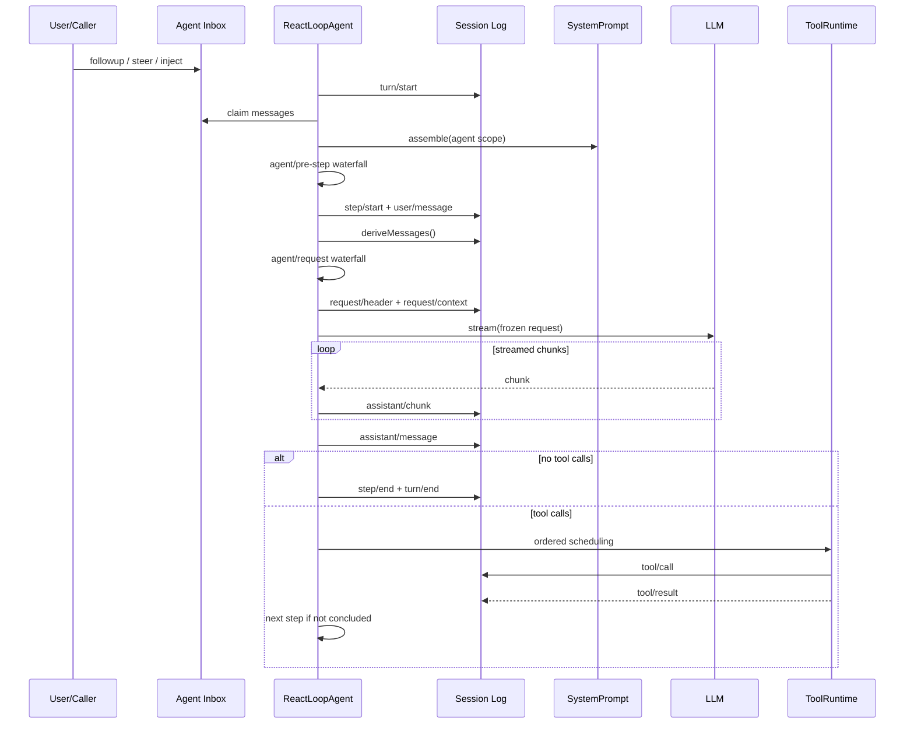
```mermaid
sequenceDiagram
    participant U as User/Caller
    participant I as Agent Inbox
    participant A as ReactLoopAgent
    participant S as Session Log
    participant P as SystemPrompt
    participant L as LLM
    participant T as ToolRuntime

    U->>I: followup / steer / inject
    A->>S: turn/start
    A->>I: claim messages
    A->>P: assemble(agent scope)
    A->>A: agent/pre-step waterfall
    A->>S: step/start + user/message
    A->>S: deriveMessages()
    A->>A: agent/request waterfall
    A->>S: request/header + request/context
    A->>L: stream(frozen request)
    loop streamed chunks
      L-->>A: chunk
      A->>S: assistant/chunk
    end
    A->>S: assistant/message
    alt no tool calls
      A->>S: step/end + turn/end
    else tool calls
      A->>T: ordered scheduling
      T->>S: tool/call
      T-->>S: tool/result
      A->>A: next step if not concluded
    end
```

### 5.4 请求构建的关键不变量

每次请求构建遵循几个很强的约束：

1. **历史来自日志**：`session.deriveMessages()` 而不是 loop 内维护的临时 message list。
2. **模型可见配置可重建**：provider、model、reasoning effort、max tokens、system prompt、tools 被写入 `request/header`。
3. **解析后的 route 也落日志**：`request/context` 记录实际 provider/model/context window。
4. **请求深冻结**：避免 adapter 或并发插件在发出后修改历史视图。
5. **流式输出先记 chunk，再归并 message**：最终 message 通过 `sourceEventSeqs` 关联 chunk，UI 可流式展示，回放以稳定 message 为准。

`request/header` 只在 initial、resume 或配置实际变化时追加。这兼顾重建性与 KV cache 稳定性。

## 6. Session：事件溯源是第二个核心

### 6.1 Append-only log 不是聊天记录数组

`Session` 是普通类，不是 Service；每个实例维护不可变、连续 `seq` 的事件日志。`append()` 在写入前：

- 做 lossless JSON 快照；
- 拒绝 BigInt、函数、NaN、稀疏数组、循环引用、Map/Set/Date 等不可靠持久化值；
- 校验 surface 转移；
- 深冻结事件；
- 先提交内存日志，再同步发布观察事件；
- 隔离 observer 错误，避免观察者改变已提交事实。

因此 event log 才是权威状态，持久化插件只是异步镜像。这样 LLM 热路径不等待磁盘 I/O，同时任何坏事件都在 append 现场失败，而非稍后 flush 时才暴露。

### 6.2 Log 与 Surface 是两个层次

日志保留所有事实：turn/step 边界、chunk、调用、结果、压缩事务、inbox 操作等。模型不应看到全部事件，因此 Session 维护一个 **surface**：按 `surfaceOp` 从日志中投影出的有序消息节点。

典型操作：

- `append`：把 user/assistant/tool result 加到模型历史；
- `replace`：压缩摘要替换一段旧 surface，但旧事件仍在日志里；
- log-only：chunk、turn 边界、统计等不进入模型上下文。

`deriveMessages()` 只遍历 surface，按 `replaceGeneration` 增量缓存。由此同时满足：

- 审计层保留完整历史；
- 模型层看到压缩后的有限历史；
- UI/telemetry/projection 可各自从相同事件源派生；
- fork 可以选合法日志边界，而不是复制一个含隐式状态的 Agent 对象。

### 6.3 “Model-visible iff logged”

这是 Harness 最值得复用的架构纪律：任何会进入模型请求的输入，都必须能从 session log 重建。它防止插件通过内存旁路悄悄影响模型，却无法在回放、故障恢复、审计或测试中解释。

但它不意味着所有内部状态都必须写日志。运行中 provider 实例、Fiber 状态、缓存、连接池属于运行时状态；只有其影响模型的投影需要被记录。

## 7. System Prompt 与运行时上下文

系统提示词不是一大段常量，而是一个按 scope 分层的 registry：

- `sections`：稳定指令片段；
- `contexts`：当前运行环境快照；
- `variables`：`{{model}}`、`{{cwd}}` 等严格插值；
- `toolProviders`：当前 scope 可见工具 schema；
- suppressor：按 scope 关闭动态 context。

每个条目有稳定 name 和 order。Agent 在每个 step 前重新 assemble，因此插件热装卸、agent 局部工具限制、plan mode、skill 和目标状态都能在下一步自然生效。

动态 runtime context 不简单追加无限多份。`RuntimeContextProjection` 生成标有“当前快照取代此前快照”的 user context，并通过 session surface 的替换/投影语义控制历史。这解决了 coding agent 中常见的 cwd、时间、计划状态、tmux 状态越来越陈旧的问题。

工具 schema 顺序是显式稳定的。稳定的 system/tool 前缀对 provider KV cache 很重要：能力没有变化时不应因 Map 遍历、locale 排序或注册时序改变 token 前缀。

## 8. 工具系统：策略与执行解耦

### 8.1 完整流水线

一次工具调用依次经过：

```text
tool/call 落日志
  -> tools/pre-execute waterfall
  -> approval（当决策为 ask）
  -> monotonic guards
  -> tools/execute around waterfall
  -> ToolDefinition.execute
  -> tools/post-execute waterfall
  -> 输出快照与 schema 校验
  -> definition.finalizeContent
  -> tools/result 最终通知
  -> tool/result 落日志
```

设计上有两个很细但重要的安全点：

- pre-policy 可以 allow/deny/ask，但之后的 guard 只能 deny/abstain，不能 allow，因此监听器排序无法把更强策略的拒绝重新放行；
- 参数在策略执行前已经记录和展示，因此 pre-policy 不允许改写 arguments，避免 UI、审计和真实执行不一致。

### 8.2 并发执行、顺序提交

同一 assistant message 可包含多个工具调用。调度器按工具实时分类为 `parallel` 或 exclusive：

- parallel 调用进入有上限的滚动并发池；
- exclusive 调用形成 barrier；
- 后续调用在真正启动前重新读取 registry 分类，因此热更新能影响尚未派发的调用；
- 工具 body 可以并发完成，但 `tool/result` 和 additional context 严格按模型调用顺序提交。

这是一种很好的折中：吞吐来自并发执行，确定性来自有序 commit。若按完成顺序写日志，下一次模型上下文和回放结果会依赖网络/进程调度时序。

取消时，已启动调用被 drain；未启动调用生成结构化 synthetic error result，保持 tool-call/result 配对合法。内部调度器错误则不伪造结果，以免把 harness 故障伪装成工具业务失败。

### 8.3 Native Mode 与 Code Mode

工具可按 scope 选择：

- `native`：模型直接看到所有工具 schema；
- `code`：模型只直接调用 `run_code`，在生成的 TypeScript/Python SDK 中组合工具；
- `both`：两种方式并存。

Code Mode 并非旁路：SDK 子调用仍经过相同 ToolRuntime 流水线、权限、超时和结果约束。这样模型可以用代码表达循环、并发、条件和数据流，同时不绕过治理层。

风险是 prompt/schema 复杂度显著增加，且代码运行时成为新的高权限面；因此系统要求显式 `ctx.codeRuntime` provider，而不在 tools 内部偷偷默认一个执行器。

## 9. 权限、沙箱与失败边界

Harness 把三件常被混为一谈的事分开：

1. **Approval**：这次高风险操作是否得到人类/策略同意；
2. **Guard/Policy**：无论谁同意都不能越过的单调限制；
3. **Sandbox**：操作系统层面实际限制进程和文件效果。

`dsh-base` 默认选择 `workspace-write + ask`，并可切换 read-only 或 danger-full-access。bash/pwsh 走 sandbox provider；文件工具还有 read-before-write observation policy 和 write/edit intent 事件。

这一分层很重要：approval 不是安全边界，prompt 指令也不是安全边界。真正的不可信代码必须在语言运行时之外隔离。论文第 6.3 节也明确承认语言级 Context 不能阻止恶意组件逃逸，需进程、SFI、Wasm 或容器。

## 10. Compaction：压缩历史但不改写历史

基础 compactor 在 `agent/pre-step` waterfall 中运行。它通过 token meter 判断上下文压力，选择一个合法 surface span，调用 summarizer，然后以事务形式记录：

```text
compaction/start
  -> 异步摘要
  -> compaction/summary（计量与摘要事实）
  -> user/message surface replace（真正替换模型历史）
  -> compaction/end
```

关键设计：

- `compaction/start` 是持久锁；未配对的 start 可在恢复时识别；
- 摘要异步执行期间持续检查 surface generation 和目标 span 未改变；
- commit 段不 yield，避免 summary 记录与 replace 之间被并发写入穿插；
- 旧事件不删除，surface 只用一条摘要消息 shadow 它们；
- tool call/result 必须成对选择，不能把工具协议截断；
- tool-result-pruner 先做无模型的小粒度裁剪，再触发昂贵的整体总结。

因此压缩不是“截断 messages 数组”，而是一次可审计的日志投影事务。

## 11. 子代理：会话、作用域与所有权组合

子代理能力同样拆成 Definition、Provider 和 Tool Consumer。当前 provider 包括进程内 spawn、进程内 fork、ACP、Codex、Claude Code、DSH SDK 等。

两种进程内语义尤其清晰：

| 模式 | 上下文来源 | 适用场景 |
|---|---|---|
| spawn | 新 Session，无父会话历史 | 独立并行研究，降低上下文污染 |
| fork | 从父 Session 的合法边界复制日志前缀 | 延续父任务背景，探索分支 |

每个 child 仍是完整 Agent：独立 Session、Scope、Inbox、生命周期和持久身份。continuable child 可接收后续消息、被中断、向直接父报告；one-shot child 完成即结算。

所有权不是只靠一个 `parentId` 字符串：操作要求精确 live parent/ancestor authority，继续消息进入 child 自己的 FIFO Inbox；Scope 父链使父 scope 能观察后代事件，而事件不会向无关 child scope 下行。

这比在主 loop 内递归调用模型更健壮，因为 child 的状态、取消、持久化和工具权限都复用了普通 Agent 机制。

## 12. Scope：同一进程内的多 Agent 能力隔离

Cordis 原生 Context isolation 解决 provider 解析；Harness 额外实现 `dsh-scope`，用 opaque object identity 标记 agent 级注册范围。

Scope 有两条方向相反的规则：

- 注册视图向下继承：child 能看到 parent/global layer；近层可 shadow 远层；
- 事件可见性向上汇聚：parent listener 能观察 descendant 事件，sibling 之间互不可见。

因此一个子代理可局部：

- 限制工具 allow/deny；
- 替换 persona；
- 设置 Code/Native presentation；
- 添加只属于自己的 system prompt section；
- 注册只在自己范围生效的 guard。

Scope 的销毁最终落到一个空 Cordis Fiber 的 disposer，保证所有经 `agent.ctx` 注册的资源一起撤销。这是论文时空组合模型在 agent 多租户场景中的一次产品化扩展。

## 13. Harness 自修改闭环

### 13.1 当前已实现什么

`tool-cordis` 向模型暴露运行时检查和动态插件生命周期：

- inspect/list/query：查看存活服务、Fiber、工具、事件/API 目录和客户端 slot；
- define：登记 host/client 代码与用途，但不立即运行；
- run：在 host VM 中求值并挂载 Cordis 插件，必要时等待客户端批准；
- stop：等待 host Fiber 完全卸载并撤回 client half；
- undefine：停止后删除进程内定义。

动态插件可注册工具、提示词、事件监听或受限 service façade。停止时这些贡献沿 Cordis effect/Fiber 生命周期撤销。新的版本使用不可变 package id，切换由 runner 管理，而不是就地修改一段活代码。

### 13.2 为什么这与论文高度契合

自修改最危险的两个问题恰好对应论文两维：

- 时间维：模型生成的坏插件能否完整撤回，恢复原 harness；
- 空间维：新插件依赖什么，provider 变化时能否正确激活/停用。

Cordis 使“修改 harness”从改全局对象变成“创建一个有依赖声明和 disposer 树的 Fiber episode”。这比让模型直接重写 agent loop 或 monkey patch 单例更可恢复、更可检查。

### 13.3 当前边界

当前机制仍不等于安全自治：

- README 明示 VM 只隔离全局变量，不是安全边界；host realm helper 可能导致逃逸；
- async host body 可逃出同步 `vmTimeoutMs`；
- 动态包仅驻留当前进程，不跨重启，不自动写成正式插件；
- 动态 façade 不开放任意 `ctx.effect()`，只允许框架支持的注册路径；
- client half 需要审批，但 host half 仍应按接近 bash 权限看待；
- 论文的 inverse 正确性和 effect independence 无法由 JavaScript 运行时普遍证明。

所以当前更准确的定位是：**可撤销、可观察的 runtime prototyping plane**，而不是不可信代码的扩展市场或完全自治的自进化系统。

## 14. 这套 Harness 设计最强的地方

### 14.1 把可扩展性放在正确的层

许多 agent 框架只让开发者增加“工具”，但模型选择、上下文策略、权限、持久化和 loop 都是固定内核。DSH 把这些都变成同一插件模型，扩展不再是几组不一致的 callback API。

### 14.2 把实时状态与历史事实分开

Cordis Context/Fiber 描述当前可用能力；Session log 描述过去事实。当前 provider 可以热换，过去使用过哪个 request header、工具结果和压缩摘要仍可重建。这是热更新与可审计性能够同时成立的原因。

### 14.3 插件生命周期是结构化的

注册行为必须返回 disposer，并归属 Fiber/Scope。相比手工 teardown，局部性和组合性更强；相比整进程重启，保留了其他 agent、连接、缓存和任务。

### 14.4 工具治理链完整

从模型参数到审批、单调 guard、sandbox、body、post-policy、schema、最终日志，每一层责任明确。并发执行与有序提交也显示设计者把 replay determinism 当作一等目标，而不仅是跑通 demo。

### 14.5 失败语义被认真建模

代码大量显式处理 abort、重入、异步 cleanup、半完成 compaction、provider 切换、observer 异常、工具输出不可序列化和冷恢复。`vendor/README.md` 中长篇本地加固清单也说明真正复杂度主要在生命周期边角，而团队没有把这些隐藏在“eventually consistent”一句话后面。

## 15. 风险、代价与尚未解决的问题

### 15.1 认知复杂度很高

业务行为可能横跨：YAML entry、Fiber inject、Service、typed event、Scope layer、Session event、surface projection 和 UI renderer。新增一个工具不难，但诊断“为什么这个 agent 此刻看不到这个工具”需要同时理解依赖激活、scope、restriction、presentation mode 与 prompt assembly。

缓解手段是项目已有的 generated catalogs、graph docs、invariant registry、snapshot tests 和 inspect 工具；这些不是附属文档，而是架构可维护性的必要部分。

### 15.2 插件粒度可能膨胀

论文承认双向依赖通常需拆成 core + integration components，最坏可能平方增长。Harness 包目录已经体现这一点：Definition、local provider、sandbox provider、tool consumer、UI consumer、bundle wiring 往往各自成包。

优点是替换和依赖清楚；缺点是包发现、命名、配置和发布成本高。Bundle 是用户侧降复杂度机制，但开发者仍需理解完整图。

### 15.3 形式保证与 JavaScript 现实之间有间隙

论文保证依赖于正确 inverse、effect 独立性、无环和受约束的组件行为；Cordis 不能静态证明这些条件。外部 I/O 也常不可逆：网络请求、发送消息、已经写入远端数据库只能补偿，不能数学意义恢复。

因此“时空可组合”更准确地说是：框架为满足纪律的组件提供保证，并把违规面收窄、显式化，而非自动让任意副作用可逆。

### 15.4 安全隔离仍需 OS/进程能力

Context isolation 是解析隔离，不是内存安全；VM 也不是可信边界。真正第三方/模型生成代码应使用独立进程、Landlock、容器、Wasm 或远程 sandbox，并把可达 Service 变成最小 capability façade。

### 15.5 Session schema 的演进成本

event sourcing 带来审计和恢复，也带来格式兼容压力。新模型可见行为要新增事件；旧日志回放需知道事件类型；surface replace、fork 边界和 request header 都是持久协议。当前项目仍是 developer preview，明确不承诺早期 session format 兼容，因此生产接入前应先确定迁移与保留策略。

### 15.6 可观测性与隐私存在张力

完整事件日志对复现极有价值，但也可能包含 prompt、工具参数、文件内容和错误详情。默认 telemetry 虽关闭，开启后配置说明表明会上传原始捕获副本。部署方需要独立评估日志留存、凭据脱敏、附件权限和遥测出口。

### 15.7 当前源码快照仍快速演进

独立 Cordis、vendored Cordis 和 vendor manifest 的版本信息并不完全一致；Harness 也明确标注开发者预览。二次开发应固定 commit 与 lockfile，不应只依赖 README 中的版本号或把内部事件视为稳定公共 API。

## 16. 与常见 Agent 框架的本质差异

| 常见设计 | DeepSeek Harness |
|---|---|
| Agent 类拥有模型、memory、tools | Agent 是由插件图提供能力的轻量状态机 |
| callback/middleware 在启动时固定 | Service 和 event contribution 可随 Fiber 生命周期动态加入/撤销 |
| messages 数组是状态真相 | append-only event log 是真相，messages 是 surface projection |
| tool 权限写在工具或 loop 中 | pre-policy、approval、monotonic guard、sandbox 分层 |
| 并发工具按完成顺序返回 | body 可并发，结果按模型顺序 commit |
| 子代理是递归函数或临时 promise | 子代理是有 Session、Scope、Inbox、authority 的完整 Agent |
| prompt 是模板字符串 | prompt 是 scoped、排序、可逆的 registry assembly |
| 修改 harness 需要重启 | Cordis 动态插件可在进程内定义、切换和撤销 |

因此它更像一个“面向 agent 的动态应用内核”，而不仅是一个 ReAct SDK。

## 17. 二次开发时应遵循的路径

### 17.1 添加新能力

优先按 seam 拆分：

1. Definition 包只定义 Service、类型、事件与注册协议；
2. Provider 包实现 local/remote/sandbox 后端；
3. Consumer 包把能力暴露成 tool、command、UI 或 loop hook；
4. Bundle patch 决定默认部署是否加载；
5. 所有注册通过 `ctx.effect()`、`ctx.on()` 或返回 disposer 的 registry；
6. 所有模型可见变化有对应 session event；
7. agent 局部能力通过 `agent.ctx` 注册，不在全局 service 上塞 session id 条件分支。

### 17.2 不应直接做的事

- 不要为一个新策略直接修改 `ReactLoopAgent.step()`；先找 `agent/pre-step`、`agent/request`、`agent/request-error`、`agent/turn-stopping` 或 tools waterfall。
- 不要在插件模块全局保存不可撤销的注册；把资源归属到 Fiber effect。
- 不要让工具绕过 `ctx.tools` 直接由 loop 调用；否则审批、guard、hook、结果规范化和日志都失效。
- 不要把仅存在内存里的隐式上下文直接加入模型请求；先定义事件和 surface/projection 规则。
- 不要把 approval 当成 sandbox，也不要把 Context isolation 当作恶意代码隔离。
- 不要依赖 entry 加载顺序解决 provider/consumer 关系；用 `inject` 声明依赖。

### 17.3 测试重点

对一个非平凡插件，至少验证：

- 依赖缺失时保持 pending，provider 出现后激活；
- provider 替换或移除时完整 dispose；
- disposer 异常、异步 setup、取消和重入；
- agent scope 之间不可串能力或事件；
- session replay 得到相同模型消息；
- 工具 deny/ask/abort/invalid-output 的最终日志一致；
- 用户可见行为有无 key 的 snapshot transcript；
- bundle 装配测试证明 Definition、Provider、Consumer 全部存在。

## 18. 建议的源码阅读顺序

为了避免一开始陷入 5,000 多个文件，建议按以下顺序：

1. `paper.pdf` 第 1、3、4、5、6 章：理解 effect/coeffect、Fiber 和保证前提。
2. `cordis/packages/core/src/context.ts`：理解 Context 派生、isolate、intercept。
3. `cordis/packages/core/src/fiber.ts`：理解 effect、epoch、reload/unload。
4. `deepseek-harness-master/docs/architecture.zh.md`：建立产品模块图。
5. `packages/bundle/base/cordis.patch.yml`：看默认产品到底装了什么。
6. `packages/core/session/src/index.ts` 与 `surface.ts`：理解事实源和模型视图。
7. `packages/core/agent-loop/src/agent.ts`：追 turn/step/request。
8. `packages/core/agent-loop/src/tool-calls.ts` 与 `packages/core/tools/src/index.ts`：追工具调度和治理。
9. `packages/core/system-prompt/src/index.ts` 与 `packages/core/scope/src/index.ts`：理解 per-agent 组合。
10. compaction、subagent、tool-cordis：看三类高级能力如何完全通过扩展点实现。

## 19. 最终判断

DeepSeek Harness 的核心贡献可以归纳为四句话：

1. **它用 Cordis 把 agent harness 从静态对象图改造成可响应依赖变化的插件运行时。**
2. **它用 append-only Session + Surface projection 把运行时可变性与历史可重建性解耦。**
3. **它用 Scope、Service seam 和 typed waterfall 把多 agent 隔离、能力替换与横切策略统一到同一组合模型。**
4. **它正在用动态 Cordis 工具验证“agent 修改自身 harness”的方向，但强隔离、持久化演化和形式前提验证仍是开放问题。**

从工程角度看，这套设计最值得借鉴的不是包数量或某个工具 schema，而是三条纪律：

- **注册即 effect，必须有明确 owner 和 inverse；**
- **依赖即 coeffect，必须声明并响应 provider 身份变化；**
- **模型可见即 logged，必须能从持久事实重建。**

三者合起来，才形成一个能热更新、可审计、可恢复，并有机会支持长期自治演化的 agent harness。

## 20. 关键源码索引

| 主题 | 文件 |
|---|---|
| 论文原文 | [`paper.pdf`](./paper.pdf) |
| Cordis Context | [`cordis/packages/core/src/context.ts`](./cordis/packages/core/src/context.ts) |
| Cordis Fiber/effect | [`cordis/packages/core/src/fiber.ts`](./cordis/packages/core/src/fiber.ts) |
| Cordis Service | [`cordis/packages/core/src/service.ts`](./cordis/packages/core/src/service.ts) |
| Cordis typed events | [`cordis/packages/core/src/events.ts`](./cordis/packages/core/src/events.ts) |
| Harness 总架构 | [`deepseek-harness-master/docs/architecture.zh.md`](./deepseek-harness-master/docs/architecture.zh.md) |
| 默认 bundle | [`deepseek-harness-master/packages/bundle/base/cordis.patch.yml`](./deepseek-harness-master/packages/bundle/base/cordis.patch.yml) |
| Agent Loop | [`deepseek-harness-master/packages/core/agent-loop/src/agent.ts`](./deepseek-harness-master/packages/core/agent-loop/src/agent.ts) |
| 工具批调度 | [`deepseek-harness-master/packages/core/agent-loop/src/tool-calls.ts`](./deepseek-harness-master/packages/core/agent-loop/src/tool-calls.ts) |
| Session 与日志投影 | [`deepseek-harness-master/packages/core/session/src/index.ts`](./deepseek-harness-master/packages/core/session/src/index.ts) |
| Session Surface | [`deepseek-harness-master/packages/core/session/src/surface.ts`](./deepseek-harness-master/packages/core/session/src/surface.ts) |
| Tool Runtime | [`deepseek-harness-master/packages/core/tools/src/index.ts`](./deepseek-harness-master/packages/core/tools/src/index.ts) |
| System Prompt | [`deepseek-harness-master/packages/core/system-prompt/src/index.ts`](./deepseek-harness-master/packages/core/system-prompt/src/index.ts) |
| Agent Scope | [`deepseek-harness-master/packages/core/scope/src/index.ts`](./deepseek-harness-master/packages/core/scope/src/index.ts) |
| Compaction | [`deepseek-harness-master/packages/compaction/compaction-basic/src/region.ts`](./deepseek-harness-master/packages/compaction/compaction-basic/src/region.ts) |
| Subagent Runtime | [`deepseek-harness-master/packages/subagent/subagent/src/index.ts`](./deepseek-harness-master/packages/subagent/subagent/src/index.ts) |
| 自修改工具 | [`deepseek-harness-master/packages/extensions/tool-cordis/README.zh.md`](./deepseek-harness-master/packages/extensions/tool-cordis/README.zh.md) |
| 动态 Cordis Runner | [`deepseek-harness-master/packages/extensions/cordis-host-runner/src/index.ts`](./deepseek-harness-master/packages/extensions/cordis-host-runner/src/index.ts) |
| Vendored 修改清单 | [`deepseek-harness-master/vendor/README.md`](./deepseek-harness-master/vendor/README.md) |

## 21. Cordis 全模块技术架构

### 21.1 模块总图

Cordis workspace 可以分成内核、声明式装配、运行期刷新和基础设施四层：

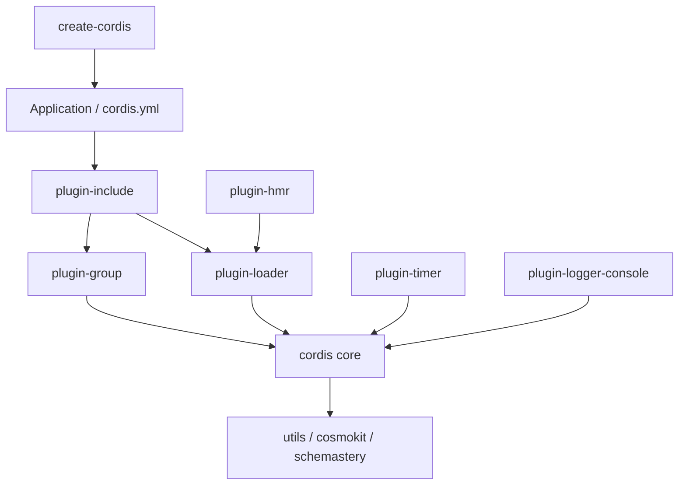
```mermaid
flowchart TB
  App[Application / cordis.yml]
  Create[create-cordis]
  Loader[plugin-loader]
  Include[plugin-include]
  Group[plugin-group]
  HMR[plugin-hmr]
  Core[cordis core]
  Timer[plugin-timer]
  Log[plugin-logger-console]
  Utils[utils / cosmokit / schemastery]

  Create --> App
  App --> Include
  Include --> Loader
  Include --> Group
  HMR --> Loader
  Loader --> Core
  Group --> Core
  Timer --> Core
  Log --> Core
  Core --> Utils
```

### 21.2 `cordis` core 的内部模块

| 文件模块 | 技术职责 | 核心数据/算法 | 对上层的意义 |
|---|---|---|---|
| `context.ts` | 创建根 Context 和派生 Context | Proxy、原型链、isolation symbol、interception chain | 让 `ctx.service` 保持普通属性语法，同时动态解析当前 provider |
| `reflect.ts` | 服务提供、查找与响应式通知 | service key -> implementation；Proxy handler；provider identity | coeffect 的实际存储与访问中介；provider 换代会通知依赖 Fiber |
| `service.ts` | Service provider 基类 | `provide()`、filter、配置 interception merge | 一个服务既是能力实例，也是有 Context 所属关系的 provider |
| `registry.ts` | 插件定义注册和实例化 | Plugin 归一化、Runtime 元数据、callback -> Fibers | 将函数/class/namespace plugin 转换成 Fiber |
| `fiber.ts` | 组件实例和生命周期状态机 | inject store、epoch、effect accumulator、inertia | 实现 reactive coeffect 和 revertible effect，是 Cordis 核心中的核心 |
| `events.ts` | 类型化事件与策略链 | emit/parallel/serial/bail/waterfall；Context filter | 为插件间横切组合提供不依赖具体 Service 的机制 |
| `logger.ts` | 分层日志与 exporter | logger name tree、level、record dispatch | 插件错误和异步 teardown 不直接绑定 console |
| `utils.ts` | 元数据、disposable、错误合成 | symbol protocol、DisposableList、traceable context | 支撑 Fiber、Proxy 和 diagnostics，不承载业务能力 |
| `index.ts` | 公共导出面 | 统一 re-export | 保持插件作者面对一个稳定入口 |

#### Context/Reflect 访问流程

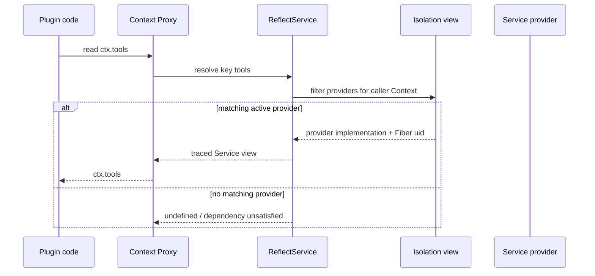
```mermaid
sequenceDiagram
  participant P as Plugin code
  participant C as Context Proxy
  participant R as ReflectService
  participant I as Isolation view
  participant S as Service provider

  P->>C: read ctx.tools
  C->>R: resolve key tools
  R->>I: filter providers for caller Context
  alt matching active provider
    I-->>R: provider implementation + Fiber uid
    R-->>C: traced Service view
    C-->>P: ctx.tools
  else no matching provider
    R-->>C: undefined / dependency unsatisfied
  end
```

#### Fiber 依赖激活与换代流程

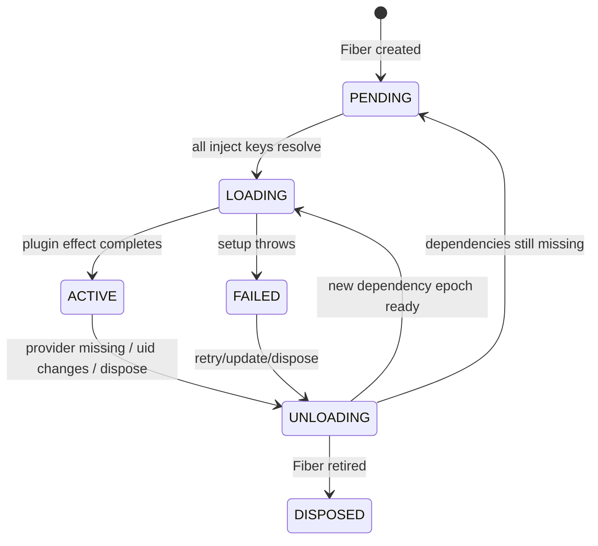
```mermaid
stateDiagram-v2
  [*] --> PENDING: Fiber created
  PENDING --> LOADING: all inject keys resolve
  LOADING --> ACTIVE: plugin effect completes
  LOADING --> FAILED: setup throws
  ACTIVE --> UNLOADING: provider missing / uid changes / dispose
  FAILED --> UNLOADING: retry/update/dispose
  UNLOADING --> PENDING: dependencies still missing
  UNLOADING --> LOADING: new dependency epoch ready
  UNLOADING --> DISPOSED: Fiber retired
```

Fiber 的 epoch 由所有注入 provider 的 uid 组成。服务内容“看起来相等”但 provider 身份改变时，uid 仍改变，consumer 会重建。这对应论文的 committed view：依赖的是某一 provider episode，不只是同名对象值。

#### Effect 收集和撤销流程

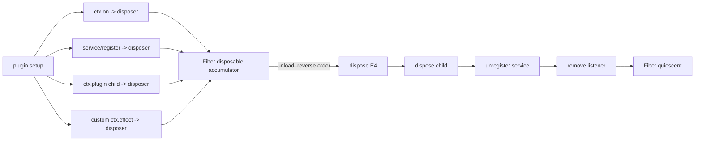
```mermaid
flowchart LR
  Setup[plugin setup] --> E1[ctx.on -> disposer]
  Setup --> E2[service/register -> disposer]
  Setup --> E3[ctx.plugin child -> disposer]
  Setup --> E4[custom ctx.effect -> disposer]
  E1 --> Stack[Fiber disposable accumulator]
  E2 --> Stack
  E3 --> Stack
  E4 --> Stack
  Stack -->|unload, reverse order| D4[dispose E4]
  D4 --> D3[dispose child]
  D3 --> D2[unregister service]
  D2 --> D1[remove listener]
  D1 --> Quiet[Fiber quiescent]
```

### 21.3 声明式装配模块

| 包 | 设计职责 | 主要对象 | 流程与边界 |
|---|---|---|---|
| `@cordisjs/plugin-loader` | 将模块解析和插件生命周期统一成可操作的配置树 | `Loader`、`Entry`、`EntryTree`、`EntryGroup`、module loader | import 插件 -> unwrap exports -> resolve config -> `ctx.registry.plugin()`；entry update 驱动 Fiber update/dispose |
| `@cordisjs/plugin-include` | 从 YAML/文件载入 entry 列表并应用 patch | Include subtree、patch list、文件缓存 | 读取候选 -> parse/validate -> clone 上应用 patch -> reconcile child tree -> 成功后提交缓存 |
| `@cordisjs/plugin-group` | 在一个 entry 下建立嵌套插件组 | group-owned subtree | group 自身不因 ancestor disabled 逻辑被当作普通叶子；子 entry 保持独立 Fiber |
| Loader `config/tree.ts` | 管整棵 entry tree | id index、root group | 负责新增、修改、删除的集合 reconcile |
| Loader `config/entry.ts` | 管一个逻辑插件实例 | options、Context、Fiber、subtree | disabled 时 dispose；config 变化走 Fiber update；name 变化重新 import |
| Loader `config/isolate.ts` | 将配置 isolation 映射到 Context | service key -> isolation label | 让同一棵树的子树选择不同 provider |
| Loader `config/utils.ts` | 配置表达式与结构工具 | `!!js` 插值、深比较、排序 | 表达式延迟到依赖可用的 Context 求值；非法配置在装配边界失败 |
| Loader `internal.ts` | Node 模块加载器桥 | ESM job/cache/resolve | HMR 需要的模块依赖图与 cache 控制面 |

#### Loader reconcile 流程

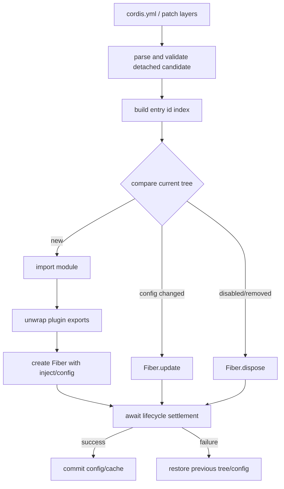
```mermaid
flowchart TD
  C[cordis.yml / patch layers] --> Parse[parse and validate detached candidate]
  Parse --> Index[build entry id index]
  Index --> Diff{compare current tree}
  Diff -->|new| Import[import module]
  Import --> Plugin[unwrap plugin exports]
  Plugin --> Fiber[create Fiber with inject/config]
  Diff -->|config changed| Update[Fiber.update]
  Diff -->|disabled/removed| Dispose[Fiber.dispose]
  Fiber --> Settle[await lifecycle settlement]
  Update --> Settle
  Dispose --> Settle
  Settle -->|success| Commit[commit config/cache]
  Settle -->|failure| Rollback[restore previous tree/config]
```

独立 Cordis 源码展示基础流程；Harness vendored 版本在此基础上补了事务式候选导入、失败回滚、组更新并发与串行化、异步 teardown drain。二者的设计方向一致，但错误原子性以 vendored 实现为准。

### 21.4 HMR 与基础插件

| 包 | 技术架构 | 关键流程 |
|---|---|---|
| `@cordisjs/plugin-hmr` | chokidar + Node ESM/CJS module cache + Loader Runtime/Fiber | 建模块依赖闭包；区分 external、accepted、declined；清 cache；预导入候选；卸旧 Runtime；按原 config 创建新 Fiber；失败时恢复 cache/旧配置 |
| `@cordisjs/plugin-timer` | 把 timeout/interval/debounce/throttle 注册成 Fiber effect | Fiber dispose 自动清 timer，避免热卸载后 callback 继续触发 |
| `@cordisjs/plugin-logger-console` | Logger record 的 Node/browser console exporter | 日志能力与输出目标解耦；浏览器和 Node 使用不同入口 |
| `create-cordis` | 项目脚手架 | 生成最小 manifest、TypeScript 和配置，属于开发时模块，不参与运行期 |
| `@cordisjs/utils` | 配置/插件常用工具 | 不拥有生命周期；用于减少插件重复代码 |

#### HMR 流程

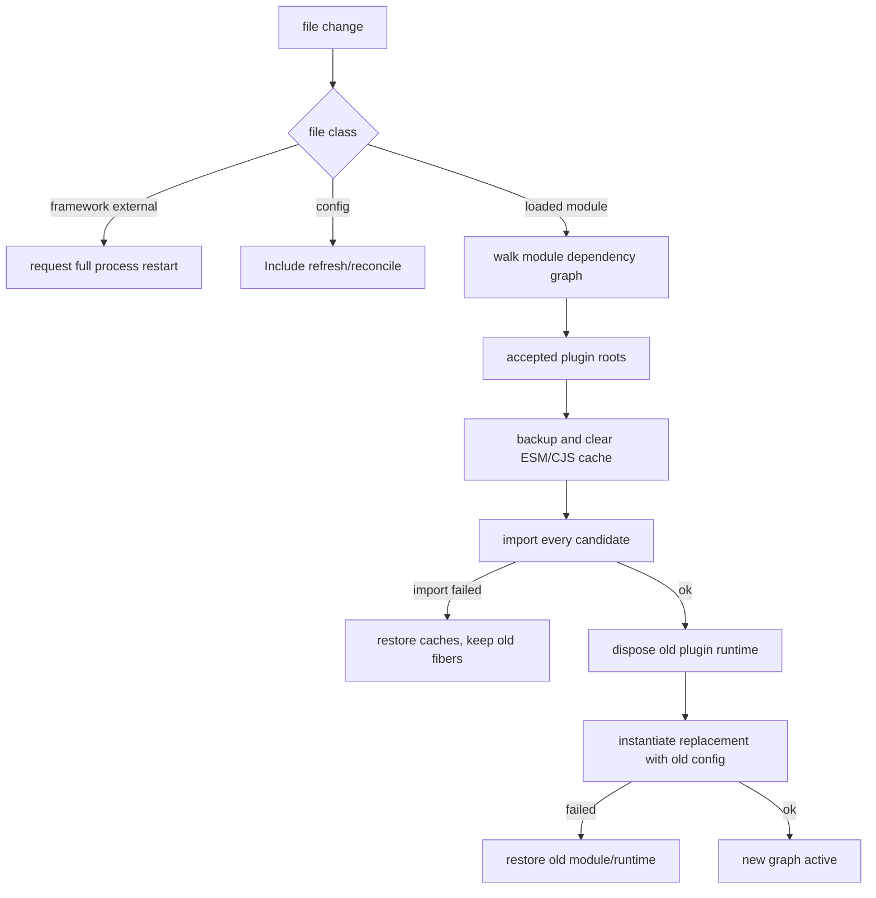
```mermaid
flowchart TD
  Change[file change] --> Classify{file class}
  Classify -->|framework external| Restart[request full process restart]
  Classify -->|config| Refresh[Include refresh/reconcile]
  Classify -->|loaded module| Graph[walk module dependency graph]
  Graph --> Accept[accepted plugin roots]
  Accept --> Backup[backup and clear ESM/CJS cache]
  Backup --> Preload[import every candidate]
  Preload -->|import failed| CacheRollback[restore caches, keep old fibers]
  Preload -->|ok| Unload[dispose old plugin runtime]
  Unload --> Reload[instantiate replacement with old config]
  Reload -->|failed| RuntimeRollback[restore old module/runtime]
  Reload -->|ok| Quiescent[new graph active]
```

## 22. Harness 模块分层总图

Harness 的模块不应只按目录理解，更准确的分层是：

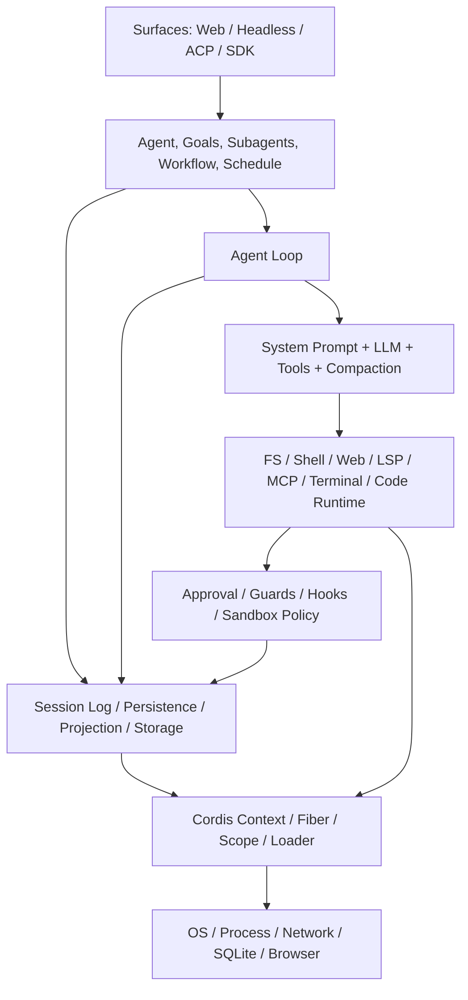
```mermaid
flowchart TB
  Surface[Surfaces: Web / Headless / ACP / SDK]
  Orchestration[Agent, Goals, Subagents, Workflow, Schedule]
  Loop[Agent Loop]
  ModelPlane[System Prompt + LLM + Tools + Compaction]
  Capability[FS / Shell / Web / LSP / MCP / Terminal / Code Runtime]
  Governance[Approval / Guards / Hooks / Sandbox Policy]
  State[Session Log / Persistence / Projection / Storage]
  Runtime[Cordis Context / Fiber / Scope / Loader]
  Host[OS / Process / Network / SQLite / Browser]

  Surface --> Orchestration
  Orchestration --> Loop
  Loop --> ModelPlane
  ModelPlane --> Capability
  Capability --> Governance
  Orchestration --> State
  Loop --> State
  Governance --> State
  State --> Runtime
  Capability --> Runtime
  Runtime --> Host
```

横向看，每个能力域倾向于采用相同的包结构：

```text
<capability>                  Service Definition + types + events
<capability>-local/e2b/...    Provider
tool-<capability>             Model-facing Consumer
client-ui-<capability>        Browser-facing Consumer
bundle/*                      Deployment composition
```

并非每个域都需要五类包；只有当角色能独立演化时才拆包。

## 23. Harness 服务端与 Agent 平面模块详解

### 23.1 核心主干 `core/`

| 模块 | 架构设计 | 输入 -> 输出 | 关键不变量 |
|---|---|---|---|
| `agent` | Agent 接口、AgentRegistry、Inbox、initiator 动态作用域、事件词汇 | Session + options -> Agent handle | 同一 session 的 live agent 唯一；工具必须能定位 initiator；Inbox 修改可持久重放 |
| `agent-loop` | 默认 `ReactLoopAgent` 状态机 | Inbox + Session + Prompt + LLM + Tools -> turn events | 每个请求从日志重建；turn/step 必须闭合；取消被 containment boundary 吸收 |
| `agent-default-model` | 入口共享的默认 route | settings/config -> provider/model | 默认选择在 Agent 创建边界解析，不隐藏在 LLM adapter 内 |
| `agent-tool-presentation` | per-agent Native/Code/Both 选择 | agent preset/options -> scoped tool mode | 只影响该 agent scope，不改变全局工具注册 |
| `scope` | agent 级注册层和事件路由 | opaque key + parent -> scoped Context | 注册视图向下继承，事件向上可见，禁止 scope parent cycle |
| `session` | 内存 event-sourced store 与 Surface | typed append -> immutable log + derived messages | seq 连续、lossless JSON、模型可见节点必须有 surfaceOp |
| `system-prompt` | scoped prompt/context/tool registry | contributions + agent scope -> ordered assembly | name 唯一、order 稳定、变量严格、工具顺序确定 |
| `tools` | 工具定义、可见性、schema、执行治理和 Code Mode | ToolExecutionInput -> frozen ToolExecutionResult | pre 不改已记录参数；guard 单调拒绝；最终结果 lossless JSON |

### 23.2 LLM 与上下文平面

| 能力域 | 叶子模块 | 设计与数据流 |
|---|---|---|
| `llm` | `llm`、`llm-deepseek`、`llm-pi-ai`、`llm-retry`、`token-meter` | Definition 保存 provider route registry；adapter 在 `prepareCall` 固化默认值和 retry policy；retry 通过 `agent/request-error`；token meter 从可回放 surface/request facts 估算压力 |
| `context` | `agent-instructions`、`session-reference`、`time-context`、`tmux-context` | 各插件向 SystemPrompt 注册动态 context；AGENTS/CLAUDE 文件按工作区读取；跨会话引用被标成不可信内容；时间/tmux 是可选逐步快照 |
| `compaction` | `compaction`、`compaction-basic`、`compaction-tool-result-pruner`、`command-compact` | Definition 定义压缩事务与事件；basic 在 pre-step 按 token 压力总结；result pruner 先做无模型裁剪；command 提供人工 `/compact` 入口 |
| `preset` | `agent-presets`、`persona` | preset 用独立 `cordis.yml` 为每个 Session 组合 agent scope；选择结果写日志；persona 是 deployment-authored prompt contribution |
| `plan` | `plan-mode` | 模式是 logged state + prompt section + command + reviewed exit tool；工具目录保持稳定以保护 request cache |
| `goal` | `goal`、`goal-round-driver`、`command-goal`、`tool-goal` | goal 是同 Session 的事件溯源领域；round driver 在 turn-stopping 处决定是否续跑，并用 race fence 避免重复 driver |
| `todo` | `tool-todo` | 模型可见任务表工具，状态写入 session event；属于单 agent 工作记忆，不承担跨 Session 项目管理 |
| `schedule` | `schedule` | after/at/fixed-rate reminder 持久化到 session log，触发时向 Agent Inbox 投递，而不是直接递归调用 loop |

#### LLM 路由流程

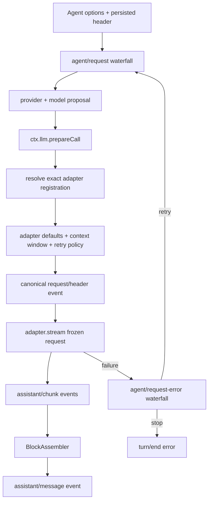
```mermaid
flowchart TD
  Seed[Agent options + persisted header] --> RequestHook[agent/request waterfall]
  RequestHook --> Route[provider + model proposal]
  Route --> Prepare[ctx.llm.prepareCall]
  Prepare --> Registry[resolve exact adapter registration]
  Registry --> Defaults[adapter defaults + context window + retry policy]
  Defaults --> Header[canonical request/header event]
  Header --> Stream[adapter.stream frozen request]
  Stream --> Chunks[assistant/chunk events]
  Chunks --> Assemble[BlockAssembler]
  Assemble --> Message[assistant/message event]
  Stream -->|failure| ErrorHook[agent/request-error waterfall]
  ErrorHook -->|retry| RequestHook
  ErrorHook -->|stop| StructuredError[turn/end error]
```

### 23.3 执行能力模块

| 能力域 | Definition | Provider | Consumer/附加策略 | 核心边界 |
|---|---|---|---|---|
| `fs` | `fs` | `fs-local`、`fs-sandbox`、`fs-e2b` | `tool-fs`、`tool-fs-search`、`tool-str-replace-editor`、`fs-observation-policy` | text I/O 与版本保护；写操作经过 sandbox 与 read-before-edit 策略；搜索使用打包 ripgrep |
| `shell` | `shell` | `bash-local`、`bash-sandbox`、`pwsh-local`、`pwsh-sandbox` | `tool-bash`、`tool-bash-persistent`、`tool-pwsh`、`shell-env` | request/spec 显式解析；环境变量由 registry 合成；persistent 工具委托 terminal |
| `subprocess` | `subprocess` | `subprocess-local`、`subprocess-e2b` | shell、LSP、terminal 等消费 | process tree、abort 和 stdout/stderr 的底层能力，不直接暴露模型 |
| `terminal` | `terminal` | `terminal-bash` | `tool-terminal` | 持久 PTY session、owner isolation、读写/关闭；区别于一次性 shell |
| `sandbox` | `sandbox` | `sandbox-local`、`sandbox-windows-acl` | `sandbox-policy` | local 根据平台探测 bwrap/Landlock/Seatbelt/Windows restricted token，失败关闭；policy 按 session 解析 mode/root |
| `code-runtime` | `code-runtime` | `code-runtime-worker-thread` | ToolRuntime Code Mode | 模型代码在 worker 执行，子工具调用桥回 host ToolRuntime；不是权限旁路 |
| `web` | `web` | `web-search-deepseek`、`web-search-exa`、`web-search-perplexity`、`web-fetch-http` | `tool-web` | provider-neutral search/fetch；选择与注册顺序无关；HTTP fetch 需单独 SSRF/内容策略 |
| `lsp` | `lsp` | `lsp-stdio` | `tool-lsp` | extension/provider 映射；临时打开文档；LSP UTF-16 坐标规范化；只读模型工具 |
| `mcp` | 无独立 Service，`mcp-client` 桥接 | 外部 MCP server | 动态注册到 `ctx.tools` | MCP 工具仍进入本地 ToolRuntime 治理，不直接塞进 loop |
| `e2b` | `e2b` lifecycle service | E2B SDK | `fs-e2b`、`subprocess-e2b` | 共享远程 sandbox 生命周期，避免两个 adapter 各自创建环境 |
| `skill` | `skill` | `skill-filesystem`、`skill-badge`、运行时 provider | `tool-skill` | provider-neutral 分层目录；按 scope 和 rank 裁决；目录持久发布，正文按需加载；调用策略区分 model/user |

#### 文件与 Shell 安全链路

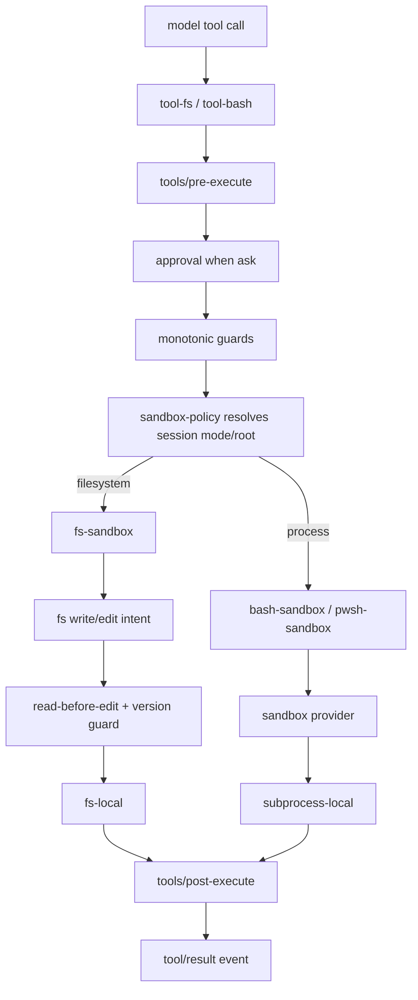
```mermaid
flowchart TD
  Model[model tool call] --> Tool[tool-fs / tool-bash]
  Tool --> Pre[tools/pre-execute]
  Pre --> Approval[approval when ask]
  Approval --> Guard[monotonic guards]
  Guard --> Policy[sandbox-policy resolves session mode/root]
  Policy -->|filesystem| FS[fs-sandbox]
  FS --> Intent[fs write/edit intent]
  Intent --> Observe[read-before-edit + version guard]
  Observe --> LocalFS[fs-local]
  Policy -->|process| Shell[bash-sandbox / pwsh-sandbox]
  Shell --> Sandbox[sandbox provider]
  Sandbox --> Subprocess[subprocess-local]
  LocalFS --> Post[tools/post-execute]
  Subprocess --> Post
  Post --> Result[tool/result event]
```

### 23.4 长任务、编排与多 Agent

| 能力域 | 模块 | 技术架构 |
|---|---|---|
| `jobs` | `jobs`、`jobs-local`、`tool-jobs` | owner-scoped background registry；工具启动长工作后返回 job id；output/list/kill 通过同一 service，避免模型持有裸 Promise |
| `subagent` | `subagent`、`subagent-in-process-driver`、`subagent-spawn-in-process`、`subagent-fork-in-process`、`subagent-acp`、`subagent-codex`、`subagent-claude-code`、`subagent-dsh-sdk`、`tool-subagent`、`tool-subagent-control`、`tool-subagent-report` | provider registry 允许多后端共存；child 有独立 Session/Scope/Agent；continuation manager 管消息、冷恢复、interrupt、report 和 descendant drain |
| `workflow` | `workflow`、`workflow-worker-thread`、`tool-workflow`、`tool-ralph` | 模型写 JS orchestration，在 worker thread 运行；`agent()` 调用桥回 subagent seam；Ralph 是固定多轮 fresh-agent workflow |

#### Subagent 生命周期

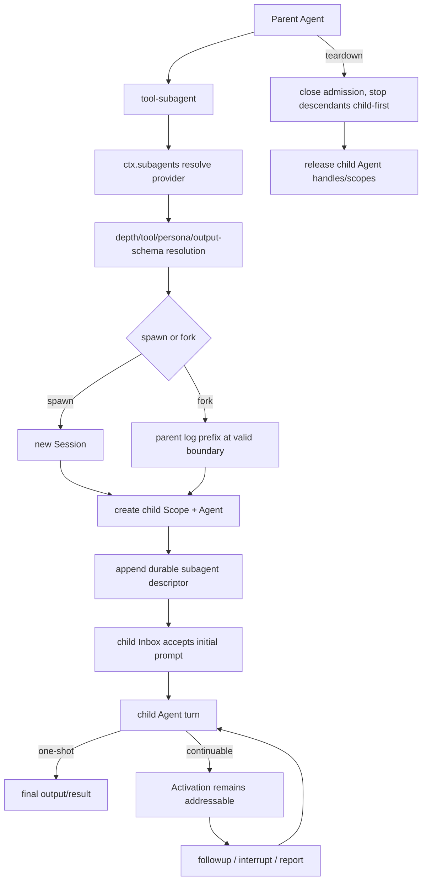
```mermaid
flowchart TD
  Parent[Parent Agent] --> Tool[tool-subagent]
  Tool --> Runtime[ctx.subagents resolve provider]
  Runtime --> Policy[depth/tool/persona/output-schema resolution]
  Policy --> Mode{spawn or fork}
  Mode -->|spawn| Fresh[new Session]
  Mode -->|fork| Seed[parent log prefix at valid boundary]
  Fresh --> Scope[create child Scope + Agent]
  Seed --> Scope
  Scope --> Descriptor[append durable subagent descriptor]
  Descriptor --> Deliver[child Inbox accepts initial prompt]
  Deliver --> Run[child Agent turn]
  Run -->|one-shot| Settle[final output/result]
  Run -->|continuable| Park[Activation remains addressable]
  Park --> Follow[followup / interrupt / report]
  Follow --> Run
  Parent -->|teardown| Drain[close admission, stop descendants child-first]
  Drain --> Dispose[release child Agent handles/scopes]
```

#### Workflow 桥接流程

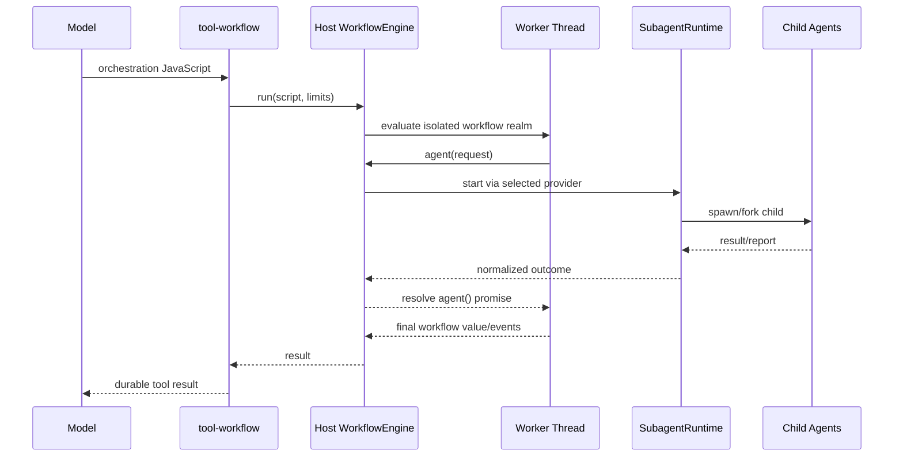
```mermaid
sequenceDiagram
  participant M as Model
  participant T as tool-workflow
  participant H as Host WorkflowEngine
  participant W as Worker Thread
  participant S as SubagentRuntime
  participant C as Child Agents

  M->>T: orchestration JavaScript
  T->>H: run(script, limits)
  H->>W: evaluate isolated workflow realm
  W->>H: agent(request)
  H->>S: start via selected provider
  S->>C: spawn/fork child
  C-->>S: result/report
  S-->>H: normalized outcome
  H-->>W: resolve agent() promise
  W-->>H: final workflow value/events
  H-->>T: result
  T-->>M: durable tool result
```

## 24. 状态、持久化和数据治理模块

### 24.1 Session 持久数据平面

| 子域 | 模块 | 所有权与流程 |
|---|---|---|
| 持久化 seam | `session-persistence` | 连接 live Session firehose 与后端；协调 append、flush、load、inspect；Session 本身不依赖某种数据库 |
| 后端 | `session-persistence-jsonl`、`session-persistence-sqlite` | JSONL 适合可读日志和默认本地部署；SQLite 适合事务/索引部署；两者实现同一恢复合同 |
| 检查点 | `session-checkpoint-policy` | 在 LLM 请求和顶层工具 dispatch 前要求 durable flush，确保外部效果发生前意图/历史已落盘 |
| 投影 | `session-projection`、`session-projection-cache`、`session-stats` | projection unit 纯折叠日志得到当前值；cache 保存 watermark+value，加速冷读但不取代日志真相 |
| 标题 | `session-title`、`session-title-llm`、`session-title-first-prompt-llm`、`session-title-all-prompts-llm` | 核心服务管理回退和唯一 provider；不同策略选择首条或全部人类 prompt；标题仍由日志事实支撑 |
| 遥测 | `session-telemetry`、`session-telemetry-otel` | 捕获 session record，按 FULL/FEEDBACK_ONLY/DISABLED 交给 OTLP；遥测不是 Session 持久化后端 |

#### 写入、持久化、投影与恢复

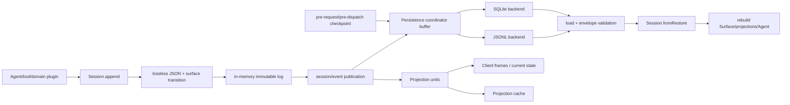
```mermaid
flowchart LR
  Producer[Agent/tool/domain plugin] --> Append[Session.append]
  Append --> Validate[lossless JSON + surface transition]
  Validate --> Log[in-memory immutable log]
  Log --> Bus[session/event publication]
  Bus --> Buffer[Persistence coordinator buffer]
  Buffer --> JSONL[JSONL backend]
  Buffer --> SQLite[SQLite backend]
  Bus --> Projection[Projection units]
  Projection --> UI[Client frames / current state]
  Projection --> Cache[Projection cache]
  Checkpoint[pre-request/pre-dispatch checkpoint] --> Buffer
  JSONL --> Restore[load + envelope validation]
  SQLite --> Restore
  Restore --> Seed[Session.fromRestore]
  Seed --> Replay[rebuild Surface/projections/Agent]
```

### 24.2 查询、附件、溢出和非会话存储

| 能力域 | 模块 | 与 Session 的区别 |
|---|---|---|
| `session-query` | `session-query`、`session-query-sqlite`、`session-log-export`、`tool-session-query` | 面向读取、过滤、trace/search/export；可查 live 或 cold session；不拥有写入日志的权威 |
| `attachment` | `attachment`、`attachment-local` | 二进制内容寻址存储；Session message 只保留 durable reference，避免把大图像字节塞进 JSON event |
| `spill` | `spill`、`spill-local`、`spill-policy` | 超大工具结果落外部存储，模型结果保留摘要/引用；policy 决定 inline 阈值 |
| `storage` | `storage`、`storage-json`、`storage-sqlite`、`storage-domain` | 保存 Session log 以外的产品领域数据；consumer 面向 typed form/domain，不绑定后端 |
| `workspace` | `workspace` | 以 storage domain 管 durable workspace entity，并把 Session 关联到验证后的 workspace |
| `settings` | `settings`、`settings-file` | 热重载用户配置文档；插件注册 namespace/schema/source，设置变化可换 provider 参数但不是 session history |
| `credentials` | `credentials`、`credentials-local` | settings 只存 secret reference；真实值来自环境、凭据文件等 provider，避免 secret 进入普通设置或 session log |
| `identity` | `anonymous-user-id` | 为遥测/反馈提供可重置匿名相关 id，不作为授权身份 |

#### 配置与凭据分离

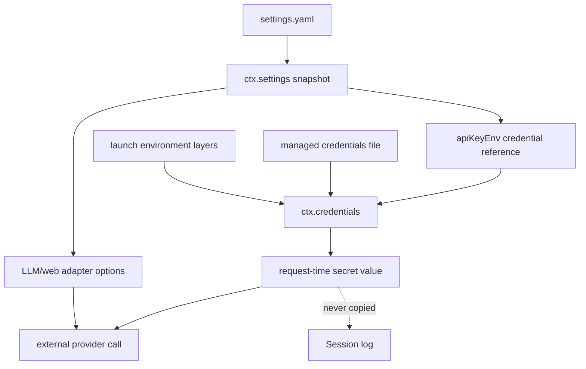
```mermaid
flowchart TD
  SettingsFile[settings.yaml] --> Settings[ctx.settings snapshot]
  Settings --> Adapter[LLM/web adapter options]
  Settings --> Ref[apiKeyEnv credential reference]
  Env[launch environment layers] --> Credentials[ctx.credentials]
  SecretFile[managed credentials file] --> Credentials
  Ref --> Credentials
  Credentials --> Secret[request-time secret value]
  Secret --> AdapterCall[external provider call]
  Adapter --> AdapterCall
  Secret -. never copied .-> Session[Session log]
```

## 25. 交互、协议与 Host 模块

### 25.1 人机交互与横切治理

| 能力域 | 模块 | 技术设计 |
|---|---|---|
| `interaction` | `commands`、`user-approval`、`user-questions`、`tool-ask-user`、`permission-presets` | command 是人类发起动作；question 是模型主动询问；approval 专用于权限且默认 fail-closed；preset 把 sandbox+approval 两个配置合成产品选项 |
| `hooks` | `hook-protocol`、`hooks-claude-code`、`hooks-codex` | 解析外部 hook 配置并桥接到 agent/tool waterfall；matcher、stdin/stdout/exit code 归一化；hook 调用与结果进入 session audit event |
| `guard` | `repeat-tool-reminder`、`tool-call-timeout-policy` | repeat 是 advisory context，不伪装成权限；timeout 包装 `tools/execute` 并融合 AbortSignal，而不是在每个工具复制 timer |
| `feedback` | `command-feedback`、`message-feedback` | session/assistant message 的旁路评级与 note；生命周期绑定并可作为 telemetry gate，不进入模型 surface |
| `runtime-diagnostics` | `invariants` | 各包注册自己拥有的运行时关系检查；检查 authoritative mutable data/event，而非仅判断 service 是否存在 |

### 25.2 API、SDK 与自动化入口

| 能力域 | 模块 | 架构 |
|---|---|---|
| `typert` | `typert-protocol`、`typert-generator`、`typert-registry`、`typert-loader` | AST/类型图生成 Remote descriptor；runtime registry 保存 lookup/context resolver；loader 把生成贡献装入 Host/Client |
| `api` | `api-gateway`、`api-remotes` | Gateway 将 wire id 解析为 Host Agent/Session/Scope 后调用 `@Remote`/`@RemoteScope` 方法；BFF remotes 组合具体业务接口 |
| `sdk` | `sdk-protocol`、`sdk-jsonrpc-server`、`sdk-client` | 稳定 JSON-RPC wire vocabulary；server 把调用映射到 Agent；TS client 提供进程外调用面 |
| `acp` | `acp` | 面向自动化的 stdio Agent Client Protocol server；无交互 UI 时 approval/question 必须遵循 automation 可回答性和 fail-closed 规则 |
| `boot` | `app-boot`、`cmdline` | 读取 layered env、解析 profile/bundle/patch、建立 Loader、处理退出和信号；cmdline 以 immutable service 交给具体 app plugin |
| `bundle` | `base`、`headless`、`web-app` | base 是公共产品图；headless/web-app 是 overlay，不复制公共能力实现 |
| `examples` | `agent-spine-demo`、`acp-demo`、`sdk-jsonrpc-demo` | 可运行装配与 snapshot/e2e 验证入口；不是伪 mock 示例，而是产品行为的最小组合证明 |

#### Typert Remote 调用流程

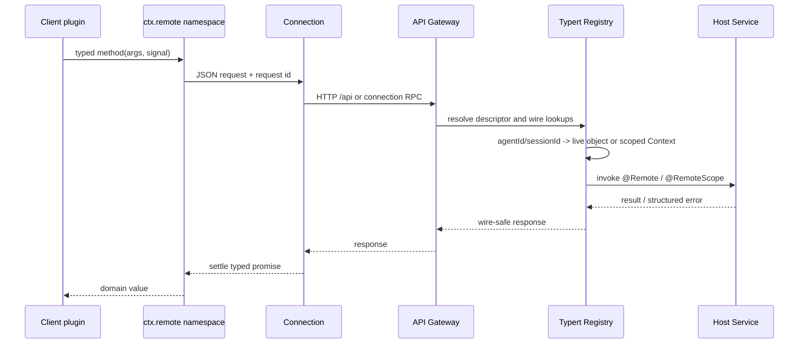
```mermaid
sequenceDiagram
  participant UI as Client plugin
  participant R as ctx.remote namespace
  participant C as Connection
  participant G as API Gateway
  participant T as Typert Registry
  participant S as Host Service

  UI->>R: typed method(args, signal)
  R->>C: JSON request + request id
  C->>G: HTTP /api or connection RPC
  G->>T: resolve descriptor and wire lookups
  T->>T: agentId/sessionId -> live object or scoped Context
  T->>S: invoke @Remote / @RemoteScope
  S-->>T: result / structured error
  T-->>G: wire-safe response
  G-->>C: response
  C-->>R: settle typed promise
  R-->>UI: domain value
```

### 25.3 Host/Web 服务端

| 模块 | 角色 | 关键设计 |
|---|---|---|
| `host-webserver` | 通用 HTTP/upgrade route registry | 不知道 Agent 业务；插件注册 route disposer；支持 index transform 和 fallback seat |
| `host-frontend-static` | SPA 静态资源和 fallback | traversal rejection、index injection、SPA fallback；与开发 HMR 分离 |
| `host-apiproxy` | Host API/fetch gateway | 对 client 提供受控 host fetch/API carrier，不让浏览器插件任意触达内部 Service |
| `host-plugin-inventory` | Loader 状态只读投影 | 设置页展示真实 Fiber/entry 状态，不复制配置解析逻辑 |
| `host-directory-picker` | workspace 目录选择 seam | `host-directory-picker-native` / `host-directory-picker-browse` 两种 provider；`host-directory-picker-auto` 在启动时按宿主环境选择并挂载 |
| `client-modules` Node half | 生成浏览器 entry graph | 扫描 `dsh.client` 声明，注入 boot table 和 bundle route |

## 26. Web Client 39 个模块的架构拆分

Web 侧同样运行一棵 Cordis 插件树。Host 和 Client 不是共享同一个 Context，而是共享生成协议、模块清单和 Connection；这避免浏览器代码直接持有 Host service。

### 26.1 客户端内核、传输与开发运行时

| 模块 | 设计职责 |
|---|---|
| `client-web` | 浏览器 shell 启动器：seed module table、两阶段 boot、AppRoot gate、最终 app composition |
| `client-modules` | Node half 生成 `__DSH_BOOT__` entry graph；browser half 提供 lazy module table 给 vendored Loader |
| `client-runtime` | `SlotRegistry`、SessionRuntime、client scope tree 和对象 layer |
| `client-connection` | HTTP 上行/WebSocket 下行、重连、双流 controller、fixture API |
| `client-hmr` | 开发 SSE rebuild -> invalidate/prefetch -> Loader Fiber swap |
| `client-web-react` | React 与 Cordis 的桥：SessionProvider、slot renderer、`useSyncExternalStore` selector、Remote invoke |
| `client-ui-slots` | SlotMap 声明合并、cardinality/scope、owner/registrant 合同，是 UI 插件组合的核心 |
| `client-ui-primitives` | 无 Cordis 的 React 控件、icon、Markdown/JSON 展示原子 |
| `client-locale` | Host 用户偏好 + browser fallback；按 namespace 注册字典和快照 |
| `client-ui-theme` | pre-plugin palette bootstrap、light/dark/system runtime、token 和设置项 |

### 26.2 Shell、会话和输入模块

| 模块 | 设计职责与依赖 |
|---|---|
| `client-ui-layout` | 三栏 AppFrame、拖拽布局、导航和 panel viewing state |
| `client-ui-sidebar` | session/workspace 树、搜索、分组、运行状态点；消费 projection/query，不拥有 Session |
| `client-ui-workspace` | sidebar/empty-state workspace slot；选择 durable workspace |
| `client-ui-conversation` | chat skeleton、surface node 流、composer、details host；是会话视图 owner |
| `client-ui-input-trigger` | `/`、`@` tokenizer 和候选菜单；source 插件注册候选，不耦合具体命令/子代理 |
| `client-ui-commands` | command source、popupSelect registry 和三类 command UI |
| `client-ui-tool` | 通用工具调用树和 keyed per-tool renderer slot；未知工具仍有 generic fallback |
| `client-ui-trajectory` | 从事件 ledger 计算时序概览，只消费数据，不提供 Host service |
| `client-ui-deliverables` | 从工具/最终回答识别产出文件，挂到 turn tail 和文件引用 |
| `client-ui-attachment` | draft image、message gallery、lightbox；纯 React，二进制经 attachment service |

### 26.3 设置与产品配置模块

| 模块 | 设计职责 |
|---|---|
| `client-ui-settings` | settings namespace scope 和 slot 合同，不拥有每个具体设置页 |
| `client-schema-form` | 从序列化 Schemastery schema 恢复表单模型、immutable path edit、draft validation |
| `client-ui-settings-general` | General section、shell/onboarding 内容、版本化 welcome notice |
| `client-ui-settings-models` | LLM provider settings 与 credential reference 联合编辑 |
| `client-ui-settings-plugins` | Plugins section 和 feature-owned tabs |
| `client-ui-settings-plugin-inventory` | Host Loader inventory 只读页 |
| `client-ui-model-selection` | 当前 Session `/model`，调用 Agent model selection Remote |
| `client-ui-permission-presets` | 新 Session 默认和当前 Session `/permission`，联动 sandbox/approval projection |
| `client-ui-agent-preset` | 默认 preset、本 Session preset seat 和 composition editor |

### 26.4 领域功能 UI 模块

| 模块 | 设计职责 |
|---|---|
| `client-ui-plan` | plan projection、composer mode 控制、`/plan` channel |
| `client-ui-goal` | goal projection -> composer 上方 GoalBar |
| `client-ui-jobs` | session header 展示 live jobs frames |
| `client-ui-subagent` | child catalog、continuation UI、`@` reference source |
| `client-ui-skill` | skill 引用和 skill tool 专用行 |
| `client-ui-user-questions` | ask-user tool 与 composer takeover 答题界面 |
| `client-ui-message-feedback` | assistant action strip 的 rating/note |
| `client-ui-workflow-run` | durable workflow run 节点和嵌套成员展示 |
| `client-ui-directory-picker-native` | 无 UI 的 native chooser slot occupant |
| `client-ui-directory-picker-browse` | 应用内目录浏览与创建界面 |
| `client-ui-cordis` | `cordis_define` 专用卡片和 run/stop 控件 |

#### Web 启动与数据流

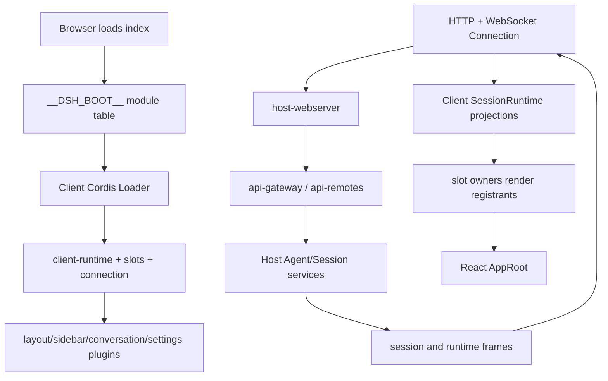
```mermaid
flowchart TD
  Browser[Browser loads index] --> BootTable[__DSH_BOOT__ module table]
  BootTable --> ClientLoader[Client Cordis Loader]
  ClientLoader --> Runtime[client-runtime + slots + connection]
  Runtime --> Shell[layout/sidebar/conversation/settings plugins]
  Connection[HTTP + WebSocket Connection] --> Host[host-webserver]
  Host --> Gateway[api-gateway / api-remotes]
  Gateway --> Agent[Host Agent/Session services]
  Agent --> Events[session and runtime frames]
  Events --> Connection
  Connection --> Projection[Client SessionRuntime projections]
  Projection --> Slots[slot owners render registrants]
  Slots --> React[React AppRoot]
```

#### Slot 组合模型

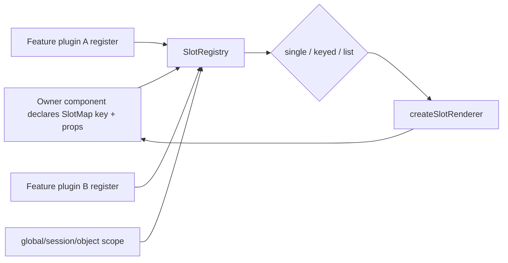
```mermaid
flowchart LR
  Owner[Owner component declares SlotMap key + props] --> Registry[SlotRegistry]
  RegistrantA[Feature plugin A register] --> Registry
  RegistrantB[Feature plugin B register] --> Registry
  Scope[global/session/object scope] --> Registry
  Registry --> Cardinality{single / keyed / list}
  Cardinality --> Renderer[createSlotRenderer]
  Renderer --> Owner
```

Slot 避免 UI 插件 import 并修改一个中央页面组件。Owner 定义“哪里可以扩展和 props 是什么”，Registrant 定义“放什么”，Cordis Fiber 保证注册卸载时 UI 自动撤回。它是浏览器侧 revertible effect 的主要表现形式。

## 27. 扩展、自修改、辅助与工程保障模块

### 27.1 动态 Cordis 双平面

| 模块 | 责任 |
|---|---|
| `cordis-host-runner` | 动态 plugin/package/version registry、host VM、service façade、生命周期和调用 handler |
| `cordis-client-runner` | 浏览器 half 求值、guard façade、client Loader entry、slot/API provider |
| `tool-cordis` | 模型 inspect/define/run/stop/undefine 工具和 prompt |
| `client-ui-cordis` | 人类审批、版本状态和 run/stop 卡片 |

#### 双平面自修改流程

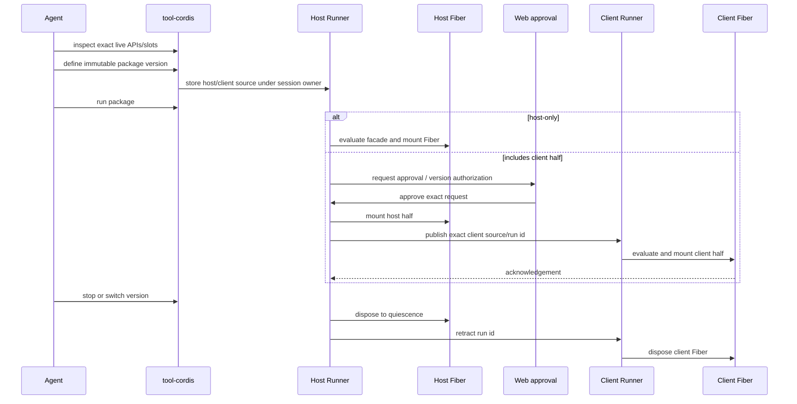
```mermaid
sequenceDiagram
  participant A as Agent
  participant T as tool-cordis
  participant H as Host Runner
  participant HF as Host Fiber
  participant UI as Web approval
  participant C as Client Runner
  participant CF as Client Fiber

  A->>T: inspect exact live APIs/slots
  A->>T: define immutable package version
  T->>H: store host/client source under session owner
  A->>T: run package
  alt host-only
    H->>HF: evaluate facade and mount Fiber
  else includes client half
    H->>UI: request approval / version authorization
    UI->>H: approve exact request
    H->>HF: mount host half
    H->>C: publish exact client source/run id
    C->>CF: evaluate and mount client half
    CF-->>H: acknowledgement
  end
  A->>T: stop or switch version
  H->>HF: dispose to quiescence
  H->>C: retract run id
  C->>CF: dispose client Fiber
```

### 27.2 Utility 与测试保障

| 能力域 | 模块 | 设计价值 |
|---|---|---|
| `util` | `brand`、`timeout`、`atomic-write`、`home-paths`、`launch-environment`、`native-command`、`output-retention` | 保持零/低依赖、单一语义：opaque id、防溢出 deadline、temp+rename 原子写、路径所有权、环境来源、无 shell OS 命令、有界输出 |
| `test-support` | `agent-loop-testkit`、`llm-mock-server`、`llm-replay`、`acp-snapshot`、`client-test-runtime`、`loader-smoke` | 区分 unit mock、协议 replay、真实装配 snapshot 和 Loader 发布路径 smoke；避免每个包自建不一致 fixture |

### 27.3 模块级故障归属矩阵

| 故障 | 检测/处理模块 | 处理结果 |
|---|---|---|
| 插件依赖缺失 | Cordis Fiber | 保持 PENDING，不运行半可用组件 |
| 插件 setup 失败 | Fiber/Loader | FAILED，撤销已收集 effect；vendored reconcile 尝试回滚 |
| provider 换代 | Reflect + Fiber epoch | consumer 卸载旧 episode 后重建 |
| LLM stream 失败 | adapter + `agent/request-error` | 结构化 LlmError，策略可重试 |
| 工具参数/输出非法 | ToolRuntime | 物化 `INVALID_*` error result，不让坏值进入日志 |
| 工具超时/取消 | timeout policy + scheduler | 融合 signal、drain 已启动调用、为未启动调用配对结果 |
| 权限无人回答 | user-approval | fail closed，记录 asked/decided |
| 文件越界 | fs-sandbox/sandbox provider | 在实际 I/O/进程边界拒绝 |
| Session 事件不可序列化 | Session.append | 提交前同步拒绝 |
| 持久化未完成即外部调用 | checkpoint policy | flush 后才放行 LLM/顶层工具 dispatch |
| 压缩期间历史变化 | compaction generation/span checks | 放弃或从新 surface 重试，不提交错误 replacement |
| 子代理父级销毁 | continuation manager | 关闭 admission，后代 child-first drain |
| Web 断线 | client-connection | 重连并恢复 projection/frames，而非保留失效 RPC promise |
| 动态插件版本失败 | dynamic runners | 保留/恢复现役版本，失败 package 留作诊断 |

## 28. 模块协作的统一判断

逐模块分析后，可以看到 Harness 并不是由几十套不同架构拼成。绝大多数模块遵循五条统一协议：

1. **能力协议**：Service Definition 定义 `ctx.key`，Provider 注册实现，Consumer 通过 inject 声明需求。
2. **生命周期协议**：任何 listener、provider、tool、route、slot、timer 和 child 都必须归属于 Cordis effect/Fiber。
3. **历史协议**：影响 Session 恢复、模型输入或用户观察的事实进入 typed event；当前状态由 projection 折叠。
4. **作用域协议**：全局能力向 agent/child scope 继承，局部贡献只通过 scoped Context 注册，事件按 ancestor 路由。
5. **跨边界协议**：进入 JSON、文件、worker、进程、网络或持久化层时验证；同进程已类型化调用不重复做敌意校验。

从这个角度，模块数量多不是偶然复杂度，而是将“能力定义、后端选择、模型暴露、用户界面和部署装配”刻意分离的结果。判断一个新增模块是否符合架构，不应先看它放在哪个目录，而应问：

- 它拥有哪个事实或能力？
- 谁是 provider，谁是 consumer？
- 它的 effect 由哪个 Fiber/Scope 回收？
- 它影响模型时写了什么 Session event？
- 它跨越哪个不可信边界，验证和权限在哪里？
- provider 消失、请求取消、进程重启时如何收敛？

只有这六个问题都有明确答案，新模块才真正进入了 Harness 的组合模型。

## 29. 仓库顶层、跨语言与发布模块

`packages/` 是产品能力主体，但完整系统还依赖 `apps/`、`python/`、`native/`、`vendor/`、`website/` 五个顶层平面。它们的职责不能和普通能力插件混为一谈。

### 29.1 `apps/cli`：产品进程入口

CLI 包只负责选择和启动 profile，不拥有 Agent 业务：

| 子模块 | 职责 |
|---|---|
| `src/args.ts` | 把 argv 分成 profile、plugin management、dump-config 三类 invocation；launcher flags 与 app flags 在第一个非 launcher token 处分界 |
| `src/bin.ts` | 动态 import 被选中的执行路径，避免未使用模式进入启动图 |
| `src/profile-boot.ts` | 初始化 profile、合成 bundle/home/profile/CLI patch、启动 Loader、注册 signal shutdown |
| `src/plugin.ts` | 在 profile 目录转发 pnpm，随后按已安装 manifest reconcile `dsh.profile.bundles` |
| `src/dump-config.ts` | 复用 Include patch 语义离线投影最终树，不启动插件 |
| `src/process-shutdown.ts` | SIGINT/SIGTERM 和进程退出的单一 teardown owner，等待根 Fiber/telemetry 收敛 |

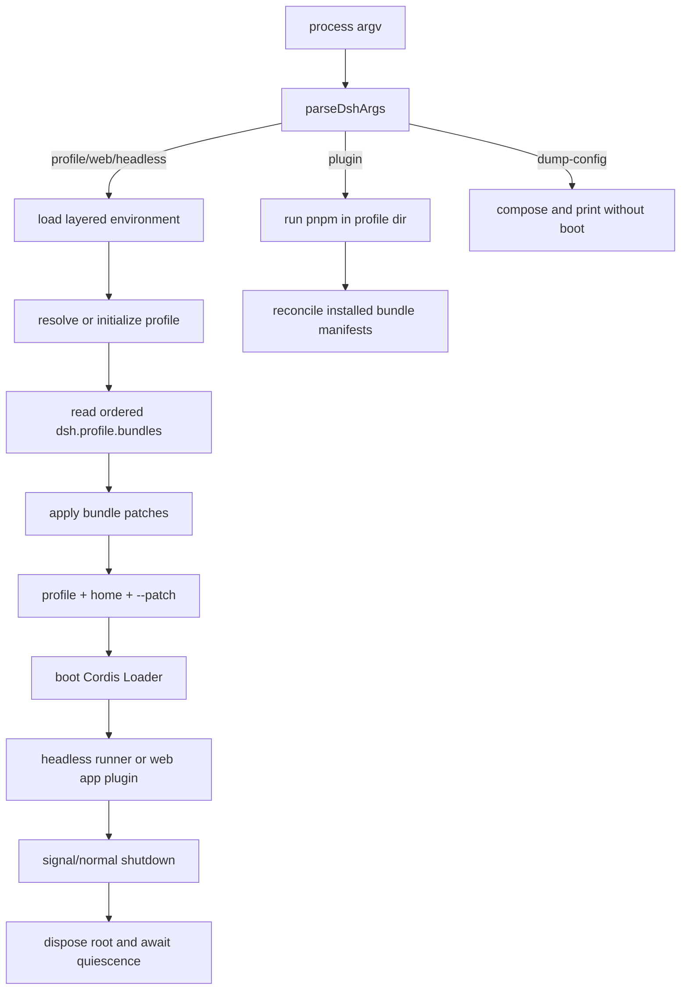
```mermaid
flowchart TD
  Argv[process argv] --> Parse[parseDshArgs]
  Parse -->|profile/web/headless| Env[load layered environment]
  Env --> Profile[resolve or initialize profile]
  Profile --> Bundles[read ordered dsh.profile.bundles]
  Bundles --> Compose[apply bundle patches]
  Compose --> UserPatch[profile + home + --patch]
  UserPatch --> Loader[boot Cordis Loader]
  Loader --> AppPlugin[headless runner or web app plugin]
  Parse -->|plugin| Pnpm[run pnpm in profile dir]
  Pnpm --> Reconcile[reconcile installed bundle manifests]
  Parse -->|dump-config| Offline[compose and print without boot]
  AppPlugin --> Shutdown[signal/normal shutdown]
  Shutdown --> Dispose[dispose root and await quiescence]
```

这种入口设计保证一个未来的 TUI 或自定义 automation app 可以只增加 bundle/app plugin，而不 fork CLI 主程序。

### 29.2 `apps/web`：最薄的 Web 构建入口

`apps/web` 是 Vite entry，不是 Web 业务实现所在地。它依赖 `dsh-client-web` 启动 shell，产出 `dist/`，再由 `host-frontend-static` 服务。业务 UI 都在 `packages/client/*` 中，因此：

- Vite app 只决定构建和 HTML 入口；
- client bundle 的插件图由 `client-modules` 生成；
- Host 服务静态文件但不 import React 业务组件；
- 浏览器运行时通过 Connection/Remote 与 Host 交互。

这让 Web shell 可作为库测试，也避免 `apps/web` 变成无法拆卸的前端单体。

### 29.3 Python SDK 与内置 Runtime

| 模块 | 分发角色 | 技术边界 |
|---|---|---|
| `python/sdk` | `deepseek-harness-sdk` | Python 高层 turn API + 低层 JSON-RPC client；管理子进程、请求 id、通知和错误映射 |
| `python/sdk-runtime` Python 包 | `deepseek-harness-runtime-bin` | 选择并启动随 wheel 分发的匹配 runtime，给 SDK 一个默认执行闭包 |
| `python/sdk-runtime/package.json` | Node deploy root | pnpm deploy 物化 JSON-RPC agent 可执行文件及精确 node_modules 依赖 |
| `packages/sdk/sdk-protocol` | 跨语言 wire source of truth | JSON-RPC message、Agent/session/tool notification vocabulary |
| `packages/sdk/sdk-jsonrpc-server` | Node server | 将 wire 请求翻译为普通 Harness Agent 操作 |
| `packages/sdk/sdk-client` | TypeScript client | 与 Python client 对应的 TS 调用面，也供 subagent provider 使用 |

#### Python 调用链

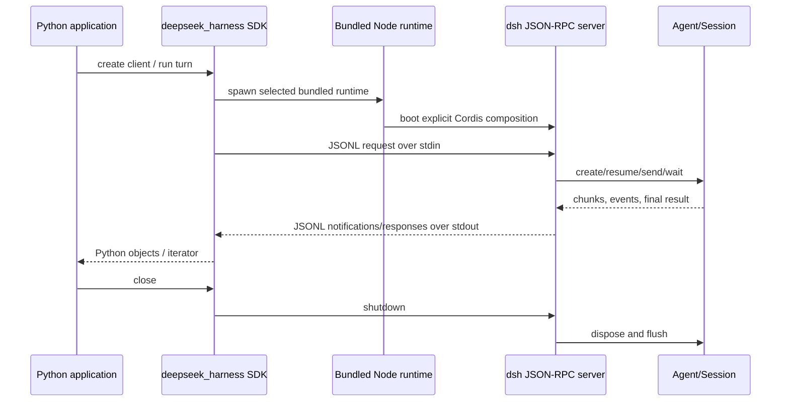
```mermaid
sequenceDiagram
  participant P as Python application
  participant SDK as deepseek_harness SDK
  participant Proc as Bundled Node runtime
  participant RPC as dsh JSON-RPC server
  participant A as Agent/Session

  P->>SDK: create client / run turn
  SDK->>Proc: spawn selected bundled runtime
  Proc->>RPC: boot explicit Cordis composition
  SDK->>RPC: JSONL request over stdin
  RPC->>A: create/resume/send/wait
  A-->>RPC: chunks, events, final result
  RPC-->>SDK: JSONL notifications/responses over stdout
  SDK-->>P: Python objects / iterator
  P->>SDK: close
  SDK->>RPC: shutdown
  RPC->>A: dispose and flush
```

这里 Python 不是另一套 Agent 实现；它是进程外客户端。Agent 语义仍由同一个 Node Harness、Session log 和插件图提供，避免跨语言实现漂移。

### 29.4 `native/landlock-run`：Linux 强制执行边界

Landlock workspace 由三类 npm 包组成：

| 模块 | 职责 |
|---|---|
| `@deepseek-ai/node-addon-landlock-run` | JS 入口：按 OS/arch 解析二进制、功能探测、构造 CLI 合同 |
| `...-linux-x64` | x64 静态 musl launcher 二进制，只作为文件路径消费 |
| `...-linux-arm64` | arm64 静态 musl launcher 二进制，只作为文件路径消费 |

它采用“self-restrict then exec”：launcher 先给自身应用 Landlock 规则，再 `exec` 目标命令，使限制由内核继承到真实子进程。平台包作为 optional dependency，npm 只安装匹配架构；sandbox-local 在启动时做功能探测，不能工作的 backend 不被当作可用安全能力。

```mermaid
flowchart LR
  Policy[workspace/read-only policy] --> SandboxLocal[sandbox-local provider]
  SandboxLocal --> Probe[probe Landlock launcher]
  Probe --> JS[entry package resolves platform binary]
  JS --> Native[static landlock-run]
  Native --> Rules[install kernel filesystem rules]
  Rules --> Exec[exec target process]
  Exec --> Kernel[Linux enforces inherited restriction]
```

这层解释了为什么 sandbox 不能只靠 TypeScript 路径判断：进程内部检查会被工具实现错误或恶意子进程绕开，Landlock/Seatbelt/bwrap/Windows token 才是强制执行者。

### 29.5 `vendor/`：受控框架源代码平面

Vendored 模块包括：

| 模块 | 作用 |
|---|---|
| `cordis` | Context、Fiber、Service、events |
| `loader/include/group/hmr/timer/logger-console` | Cordis 声明式装配和基础插件 |
| `cosmokit` | Cordis/Schemastery 公共数据结构与工具 |
| `schemastery` | 所有插件 Config 的 schema、默认值、merge 和验证 |

Vendoring 的目的不是复制依赖以方便修改，而是让发布的 Harness 完整拥有并固定框架层：

- 所有包改名到 `@deepseek-ai` scope，防止发布时占用上游命名；
- workspace link 保证只有一份 Context/Service 类型和运行时身份；
- 上游 commit、本地修改和同步步骤集中记录；
- 生命周期、Loader/HMR 的本地修复能与 Harness consumer 同一个提交测试；
- 构建同时产生运行时 JS 与 NodeNext-safe declarations。

代价是必须持续维护 upstream merge、本地修改日志、版本清单和许可证，当前快照中的版本漂移正说明这是一项实质性维护责任。

### 29.6 `website/` 与文档生成系统

Website 只是 VitePress adapter：配置、导航、主题和发布 manifest 在 `website/`，权威内容仍留在 `docs/`、package README 和源码 JSDoc。构建时 projector 把选定内容写到 ignored `.generated/`。

文档在该项目中具有架构控制作用：

- `gen-doc-graphs` 从代码生成 module/event/capability 图；
- `gen-persistence-catalog` 从 declaration merging 生成完整事件目录；
- `gen-cordis-api` 生成模型自检查与开发者参考共用的 API 目录；
- 中英文文档有 pairing gate；
- 网站 build 同时检查死链接；
- 生成物新鲜度进入 `doc-sync` 门禁。

因此 website 不复制一套容易漂移的文档树，模型运行时 inspect、源码类型和开发站点尽量共享同一生成事实。

### 29.7 完整部署边界图

```mermaid
flowchart TB
  subgraph Distribution[Distribution]
    NPM[npm packages + profile bundles]
    Wheel[Python wheels + bundled runtime]
    NativePkgs[platform native packages]
  end

  subgraph HostProcess[Node Host Process]
    CLI[apps/cli]
    Cordis[vendored Cordis runtime]
    Packages[packages/* Host plugins]
    Sessions[Session/persistence/storage]
  end

  subgraph Browser[Browser Process]
    WebEntry[apps/web build]
    ClientCordis[client Cordis tree]
    ReactUI[slot-composed React UI]
  end

  subgraph External[External Boundaries]
    LLM[LLM/search providers]
    MCP[MCP servers]
    Child[ACP/Codex/Claude/subagent processes]
    OS[OS sandbox + filesystem + subprocess]
  end

  NPM --> CLI
  Wheel --> CLI
  NativePkgs --> OS
  CLI --> Cordis
  Cordis --> Packages
  Packages --> Sessions
  WebEntry --> ClientCordis
  ClientCordis --> ReactUI
  ReactUI <-->|HTTP/WebSocket + Typert| Packages
  Packages <--> LLM
  Packages <--> MCP
  Packages <--> Child
  Packages <--> OS
```

## 30. 模块分析结论

从两个项目的全模块视角看，Cordis 与 Harness 的关系可以压缩为四层递进：

1. **Cordis core 提供可逆 effect、响应式依赖和 Context 派生原语。**
2. **Cordis Loader/HMR 把这些原语提升为声明式、可 reconcile 的动态插件树。**
3. **Harness packages 用统一的 Definition/Provider/Consumer 模式表达 Agent 所有能力。**
4. **apps、Python、Web、native 和 SDK 把同一插件图投射到不同进程、语言和用户界面。**

最关键的架构一致性是：无论能力来自本地文件系统、远程 E2B、浏览器插件、MCP server、Python 调用方还是模型临时生成的 Cordis 包，它最终都必须进入相同的生命周期、作用域、日志和安全协议。正是这一点，使如此多模块仍然构成一个系统，而不是一个功能集合。

## 31. 论文形式化基础：从类型论概念到运行时结构

论文《A Programming Paradigm for Spatiotemporal Composability》的核心问题可以表述为：**如何让一个长期运行、组件持续加入和退出的程序，在空间上始终拿到正确依赖，在时间上又能精确撤销每个组件造成的状态变化？**

它所借用的两条经典理论线索是 effect 与 coeffect：

| 理论线索 | 传统形式 | 描述对象 | 论文中的运行时提升 |
|---|---|---|---|
| effect | `Γ ⊢ t : T ! ε`、Monad、algebraic effect | 计算会对外界做什么 | 可执行的上下文变换及其逆 |
| coeffect | `Γ^r ⊢ t : T`、Comonad、graded coeffect | 计算要求环境提供什么 | 可查询、可变化、能触发生命周期的依赖规格 |
| state threading | `S -> (A, S)` | 显式传递状态 | 所有组件与环境交互统一经过 Context |
| observational equivalence | 程序上下文不可区分 | 行为相同而物理表示可不同 | 回滚与合流以 `≃` 而非内存逐位相等判定 |

关键跃迁在于：传统 effect/coeffect 多数是静态类型或词法结构；论文把二者变成运行时可操作的数据。Effect 不再只是“可能写日志”的标签，而是带逆见证的状态变换；coeffect 不再只是“需要配置”的注解，而是动态求值、变化后触发装卸的依赖规格。

这形成一条完整推导链：

```mermaid
flowchart LR
  A[Static effect<br/>computation changes environment] --> B[Runtime effect function<br/>state + yielded inverse]
  B --> C[Accumulator<br/>composite inverse]
  D[Static coeffect<br/>computation requires environment] --> E[Runtime dependency specification]
  E --> F[notify satisfaction changes]
  C --> G[Component lifecycle]
  F --> G
  G --> H[Fiber operational calculus]
  H --> I[Recovery / Ordering / Progress / Confluence]
```

论文所谓“Context paradigm”因此不是一个新的 DI 容器名称，而是如下纪律：

1. 组件与共享环境的每次交互都经由 Context；
2. 每个原子 effect 在发生时给出足以撤销它的逆；
3. 每个组件预先声明需要和可能提供的 coeffect key；
4. 运行时把 effect 的逆与发起它的 Fiber 绑定；
5. 依赖解析结果变化时，运行时驱动 Fiber 进入加载或卸载；
6. 跨组件共享状态按 key 和 operation 建模，以便证明独立性。

这六点中，前五点主要由 Cordis 运行时实现；第六点很大程度仍是插件和 Service API 的设计义务，而不是 JavaScript 类型系统或运行时能自动验证的性质。

## 32. 可逆 Effect 的代数构造

### 32.1 从状态变换到“变换 + 逆”

通常可把有副作用的函数改写为显式状态传递：

```text
f_impure : X -> Y
f_pure   : Γ × X -> Γ × Y
```

只看对环境的作用时，effect 是 `Γ -> Γ`。所有这种变换在函数复合下构成 monoid：单位元是 `idΓ`，结合律来自函数复合。为了恢复，论文把一次操作写成 `(f, g)`，其中 `f` 是正向变换，`g` 是逆向变换，并定义扭曲复合：

```text
(f1, g1) ∘ (f2, g2) = (f1 ∘ f2, g2 ∘ g1)
```

正向按执行顺序组合，逆向按相反顺序组合。这正是 disposer 栈必须 LIFO 的代数原因，而不只是经验规则。

Definition 2 的 effect context 为：

```text
∂Γ = Γ × (Γ -> Γ)
```

状态 `(γ, φ)` 分别保存当前上下文与累计逆。初态是 `(γ0, idΓ)`。对固定正向/逆向对 `(f, g)`，追踪操作为：

```text
trackΓ(f, g)(γ, φ) = (f(γ), φ ∘ g)
recoverΓ(γ, φ)     = (φ(γ), idΓ)
```

论文先证明两个基础性质：

- `track` 的第一投影与原 effect 相同，不改变原程序的正向语义；
- `track` 是 monoid homomorphism，复合程序可以由原子追踪操作复合得到。

若累计逆满足 `φ(γ) = γ0`，则调用 `recover` 恢复初态并清空累计器。这个等式是后续所有恢复定理的核心 invariant。

### 32.2 为什么逆必须由 effect 在运行时产生

固定逆 `g` 对真实程序太弱。以“注册监听器”为例，反注册需要知道这一次生成的 listener handle；以“改配置”为例，恢复需要记住修改前的旧值。这些信息只有 effect 观察应用时状态后才能确定。

因此 Definition 8 把 effect function 定义为：

```text
EΓ = Γ -> Γ × (Γ -> Γ)

e(γ) = (δ, g)
```

其中 `δ` 是新状态，`g` 是这次运行生成的逆。一个 witnessed effect 只要求：

```text
g(δ) = γ
```

注意它不要求 `g` 是正向变换在所有状态上的全局反函数，只要求在这次 effect 真正产生的状态上正确。这解释了工程 API 为什么是 `ctx.effect(() => disposer)`：disposer 是执行安装动作以后才产生的局部见证。

Effect function 的 Kleisli 式复合为：

```text
g(γ) = (δ, s)
f(δ) = (ε, t)

(f ⋄ g)(γ) = (ε, s ∘ t)
```

论文证明：

- `(EΓ, ⋄)` 仍构成 monoid；
- witnessed effects 对复合封闭；
- 把这种 effect 提升进带累计器的 context 会保持复合；
- 逆按严格反序运行时，只需每一步有局部 witness，就能回到初态。

```mermaid
sequenceDiagram
  participant S as State γ0
  participant E1 as effect e1
  participant E2 as effect e2
  participant R as recovery
  S->>E1: apply
  E1-->>E2: γ1, inverse g1
  E2-->>R: γ2, inverse g2
  R->>R: g2(γ2) = γ1
  R->>R: g1(γ1) = γ0
  Note over R: accumulator = g1 ∘ g2
```

### 32.3 LIFO 安全不等于任意热卸载安全

这是论文最容易被简化错的地方。

如果所有效果严格按全局 LIFO 撤销，局部 witness 已经足够。但是插件系统要做的是：组件 A 加载后，B、C 又做了自己的 effect，此时仍能只卸载 A 而保留 B、C。为此必须证明 A 的逆不会破坏 B、C，且 B、C 在 A 存在与否时仍会产生相同的逆。

论文为 effect `e` 定义 transformation monoid `M(e)`：它由 `e` 的正向映射，以及 `e` 在所有可能状态上产生的逆映射共同生成。两个 effect 的 independence 包含两个条件：

1. **变换交换**：`M(e1)` 中任意变换与 `M(e2)` 中任意变换交换；
2. **逆选择稳定**：一个 effect 的变换不能改变另一个 effect 在该状态下会产生哪一个逆。

第二项比“最终状态恰好相同”更强。若 B 根据 A 写入的隐藏标志选择不同 disposer，即使两个正向变换偶然交换，也不能安全地把 A 从历史中抽掉。

在两条件 independence 下，Theorem 20 证明可删除任意组件的 effect，状态等价于它从未发生，且其他 effect 保存的逆仍有效；Corollary 21 才进一步允许按任意排列调用不同组件的逆。

```mermaid
flowchart TD
  Q{要撤销哪种序列?}
  Q -->|全局严格反序| L[每个 effect 有 witness]
  L --> LR[LIFO recovery 成立]
  Q -->|保留后来组件<br/>只卸载中间组件| I[还需 pairwise independence]
  I --> C1[所有 forward/inverse 变换交换]
  I --> C2[foreign effect 不改变 inverse 选择]
  C1 --> AR[arbitrary withdrawal 成立]
  C2 --> AR
```

工程含义是：不同 key 上的 Map entry、listener entry、route entry 通常容易独立；同一个有序 middleware chain、数组位置、全局当前值通常不独立，必须增加明确的 coeffect 顺序或把它封装成自身负责一致性的 Service。

## 33. Reactive Coeffect：把依赖满足变成运行时事件

### 33.1 Coeffect context 与规格

Definition 22 把依赖环境定义成依赖类型的有限偏函数：

```text
Σ = (k : K) ⇀ V_k
```

每个 key `k` 对应自己的值类型 `V_k`。`set(k, v)` 的前置条件是 key 尚未存在，返回加入绑定后的状态以及删除该绑定的逆；`get(k)` 的前置条件是 key 已存在。于是 `set` 本身就是上一节定义的 witnessed effect：**提供依赖是 effect，撤销提供者就是它的 inverse。**

一个 coeffect 不只包含值类型，而是三元组：

```text
(V_k, ≃_k, A_k)
```

- `V_k`：该依赖的值类型；
- `≃_k`：该 key 上的观测等价关系；
- `A_k`：消费者可以在该值上执行的 operation 集合。

组件依赖规格是 key 的集合 `d ⊆ K`，满足关系为：

```text
σ ⊨ d  iff  ∀k ∈ d, k ∈ dom(σ)
```

Context 从 `σ` 变化到 `σ'` 时，对规格 `d` 的通知分类是：

```text
activating    : σ ⊭ d  and σ' ⊨ d
deactivating  : σ ⊨ d  and σ' ⊭ d
neutral       : otherwise
```

需要特别注意：Definition 26 只根据“是否满足”分类，并不把同 key 的 provider identity 或 value 改变直接写入该三分法。后面的 Fiber calculus 用 **target view 与 committed view 是否一致** 捕获 provider replacement，从而触发离开旧 episode 和重新加载。

### 33.2 为什么 notification 本身还不够

当 A 提供 `k`、B 依赖 `k` 时，满足谓词保证 B 不能早于 A 加载。但若直接撤销 A 的 `set(k, v)`，B 的 teardown 过程可能已经读不到 `k`。因此局部 reactivity 只解决“先提供、后加载”，还没有解决“先卸载消费者、后卸载提供者”。

Section 4 加入 withdrawal guard：只要某个已安装 Fiber 的 committed view 仍指向 provider，provider 就处于 `relied upon` 状态，不允许完成卸载。于是形成完整的括号结构：

```text
provider begin < consumer begin < consumer end < provider end
```

这不是普通事件监听能保证的顺序，而是全局 lifecycle calculus 的性质。

### 33.3 Isolation 与 interception 的理论含义

Isolation 把逻辑 key 与存储 realm 分开：

```text
Σiso = (K ⇀ R) × ((r : R) ⇀ V_r)
```

`get(k)` 先求 `ρ(k)`，再从 realm table 读值。同一个逻辑 service key 因而可以在不同派生 Context 中解析成不同实例。论文把它称为运行时 ad-hoc polymorphism；在 Cordis 中对应 `ctx.isolate()` 和派生 Context 的服务解析。

Interception 则不改变 provider table，而把依赖值建模为“metadata 到 value”的函数。组件声明的 metadata 与 Context 携带的 metadata 通过每个 key 自己的 monoid 合并，再交给 provider：

```text
get(k, μ) = provider_k(μ ⊕ contextMetadata_k)
```

这说明 interception 的本质不是简单 monkey patch，而是派生 Context 对“如何使用依赖”的约束。Isolation 改变解析到哪个 binding，interception 改变用什么 metadata 调用 binding；两者都适合 derived realization：父 Context 不变，回收时丢弃子 Context 即可。

```mermaid
flowchart LR
  Child[Derived Context] --> Key[logical key k]
  Key --> Realm[isolation: rho(k) = realm r]
  Realm --> Provider[provider function]
  Child --> Meta[context metadata]
  Spec[component metadata] --> Merge[monoid merge]
  Meta --> Merge
  Merge --> Provider
  Provider --> Value[resolved value]
```

## 34. 统一 Context 与观测等价

### 34.1 递归 Context

Definition 32 将 effect context 与 coeffect context 合并为递归类型：

```text
Γ∞ = μΓ. Γ × (Γ -> Γ) × Σ
```

三部分分别是当前层的递归上下文、该层累计逆和依赖表。父 Context 能聚合子级 effects，派生 Context 又能承载 isolation/interception，因此插件树与 Context 树具有同构的控制结构：加载相当于 plug in，累计逆相当于 unplug，父级 dispose 递归撤销其拥有的子级 effect。

这也是 Cordis “Context 既是依赖入口、又是 effect 所有权令牌”的理论来源。只把 Context 当 Service Locator，会漏掉后一半设计。

### 34.2 为什么恢复目标不能是物理相等

`malloc/free` 后堆布局不必逐位恢复；创建并丢弃随机 uid 后，下次 uid 也不必相同；Fiber 删除后 registry 可能保留不可观察的墓碑信息。若定理要求 JavaScript heap 完全相等，真实实现几乎不可能满足。

因此论文按每个 coeffect key 的公开 operations 定义 observational equivalence。两个 coeffect context 等价，当且仅当：

1. 绑定相同的 key；
2. 每个 key 的值在 `≃_k` 下等价。

对某个 value，论文又以所有有限 operation tests 的可定义性和 outcome 是否相同定义 indistinguishability。Lemma 35 证明它是所有 operations 都尊重的最粗等价关系。这把“外部看不出差别”落实成了接口可检验的语义，而非随意忽略实现差异。

随后 witnessed effect 的要求被放宽为：

```text
e(γ) = (δ, g)  implies  g(δ) ≃ γ
```

同时 effect 与 inverse 都必须尊重 `≃`。Lemma 38 证明前述恢复等式可整体替换为观测等价。

### 34.3 从 key-local operation 推出跨组件独立性

Theorem 40 证明不同 key 上的 operations 自动独立，因为每个 lift 只读写自己的 binding。对于同一个 key，则要求该 key 的公开 operations 两两独立，即该 key 是 commutative 的。

Definition 41 再允许组件根据前面 operation 的 outcome 选择后续 operation，形成 coeffect-mediated effect。Theorem 42 证明：若两个组件重叠使用的每个 key 都是 commutative 的，则两个完整 effect function 独立。

这一步是论文理论的“闭环”：

```mermaid
flowchart TB
  Local[operation typed at one key] --> Distinct[distinct keys commute]
  Same[same-key interface] --> Commutative{operations declared/proved independent?}
  Commutative -->|yes| Shared[safe shared-key composition]
  Commutative -->|no| Order[express ordering as coeffect dependency]
  Distinct --> Component[coeffect-mediated component effects]
  Shared --> Component
  Component --> Pairwise[pairwise component independence]
  Pairwise --> Recovery[arbitrary component recovery]
  Pairwise --> Confluence[quiescent-state confluence]
```

所以论文并非声称“所有 ctx.effect 天生可交换”。它给出一种设计方法：把共享位置 reify 为 key，把操作限制到 key，把不交换的关系显式提升为 coeffect 顺序。无法被 Context 化的共享位置，以及不交换却未声明顺序的操作，都在定理边界之外。

## 35. 动态组合演算：Component、Fiber 与 episode

### 35.1 Component 是双向接口加一个 witnessed program

Definition 43 把 component 定义为三元组：

```text
CΓ = DΓ × PΓ × EΓ*
component = (d, p, e)
```

- `d`：从环境读取的依赖 key；
- `p`：可能向环境提供的 key；
- `e`：激活时执行并产生逆的 witnessed effect program。

Component 是声明，Fiber 是 component 的一次有名字实例。全局 registry 为每个 Fiber 保存：父 Fiber、retired 标志、依赖/提供声明、局部 provision table、lifecycle state、累计逆以及 committed resolution view。

Target view 根据当前活跃 providers 计算“每个依赖 key 应解析到哪个 Fiber”；依赖不满足时为 `⊥`。Committed view 则冻结一次 episode 开始时的解析结果。二者的分离解决了异步加载跨越依赖变更的问题。

### 35.2 基础规则与扩展规则

演算中的 orchestration 规则负责插入、退休、物理删除 Fiber；lifecycle 规则负责激活和撤销：

| 规则 | 语义 | Cordis 对应动作 |
|---|---|---|
| `O-Insert` | 以 fresh name 插入 inactive Fiber | `ctx.plugin/use` 创建 Fiber |
| `O-Retire` | 单调标记不再需要 | parent disposer / Loader reconcile |
| `O-Remove` | 已退休、inactive 且无子节点时删除 | registry 清理 |
| `L-Begin` | target 非空时提交 view 并开始加载 | `_reload` / `execute` 开始 |
| `L-Iter` | effect iterator 落地一步并累计 inverse | generator yield / `ctx.effect` |
| `L-Finish` | iterator 结束，Fiber active | LOADING -> ACTIVE |
| `L-Leave` | committed view 与 target 分叉，开始卸载 | dependency epoch 变化 |
| `L-Divert` | 异步一步落地时发现 view 已变，转入卸载 | inertia boundary guard |
| `L-Raise` | setup 抛错但仍携带已累计 inverse 退出 | failure cleanup |
| `L-Unload` | 应用 accumulator，清除 committed view | DISPOSING -> INACTIVE |

```mermaid
stateDiagram-v2
  [*] --> Inactive: O-Insert
  Inactive --> Reloading: L-Begin / commit target view
  Reloading --> Reloading: L-Iter / land effect + inverse
  Reloading --> Active: L-Finish
  Reloading --> Unloading: L-Divert / target changed
  Reloading --> Unloading: L-Raise / setup failed
  Active --> Unloading: L-Leave / target changed or retired
  Unloading --> Inactive: L-Unload / run accumulator
  Inactive --> [*]: O-Remove
```

### 35.3 三个现实因素为何必须进入演算

**非原子 setup。** 插件 callback 可能是 async generator。Effect iterator 把 setup 拆成多步，每步都返回 successor、inverse 和 continuation；运行时每落地一步就立即把 inverse 叠入累计器。因此第七步失败时，前六步仍可完整清理。

**异步惯性。** 已经发出的 Promise 或 I/O 通常不能凭依赖变化瞬间撤销。演算允许当前 iteration 落地，但在边界重新检查 target。若已分叉，`L-Divert` 把刚落地 effect 的 inverse 一并纳入，然后转入 Unloading。这样不会让“迟到的一步”逃出所有权范围。

**失败。** `L-Raise` 不假设 setup infallible。失败 Fiber 不提供 coeffect，且会经过同一 accumulator 回滚；但失败状态本身可以被记录，因此后面的 Confluence 定理明确排除失败 Fiber。

### 35.4 Withdrawal guard 与父子所有权是两种不同的边

Registry 中有两类关系：

- provider -> consumer：由 `p_provider ∩ d_consumer != ∅` 产生，决定依赖装卸顺序；
- parent -> child：由 effect 内注册子组件产生，决定所有权与递归退休。

Provider 的 `relied` guard 要等所有 committed consumers 退出，保证 teardown 时依赖仍可读。父 Fiber 的 accumulator 则负责退休自己创建的 child；child 完成其生命周期后父级才能最终清除。两类边共同构成 support relation，但不能混为普通调用关系。

```mermaid
flowchart TD
  Root[root Fiber] -->|owns| A[provider A]
  A -->|provides key k| B[consumer B]
  B -->|owns| C[child C]
  Retire[retire A] --> Guard{B still commits to A?}
  Guard -->|yes| Wait[deactivate B and descendants first]
  Wait --> RollB[rollback C, then B]
  RollB --> RollA[rollback A]
  Guard -->|no| RollA
```

## 36. 元理论：每个结论究竟建立在什么前提上

### 36.1 五组主要结果

| 结果 | 论文结论 | 关键前提 | 工程解释 |
|---|---|---|---|
| Preservation, Thm. 59 | 每步迁移保持 registry well-formed | 规则前置条件、fresh name、single provider、confinement | 运行时不会制造悬空 committed provider 或破坏树形所有权 |
| Recovery exactness, Thm. 61 / Cor. 62 | 一个 episode 的累计逆恰好删除该 Fiber 的贡献，保留穿插的 foreign effects | witnessed iterator、pairwise independence、观测等价 | 热卸载后如同该 episode 未发生，但允许不可观察残留 |
| Ordering, Thm. 63 | provider 先于 consumer 开启 episode，晚于 consumer 关闭；consumer 期间解析稳定 | target/committed view、withdrawal guard、well-formedness | teardown 仍可安全使用依赖 |
| Resolution coherence, Thm. 64 | 一次加载只基于一个 committed resolution；分叉会 divert/raise 并完整回滚 | iteration boundary 检查、inertia 语义 | 不会把同一次 setup 的前半段连到旧 provider、后半段连到新 provider |
| Progress, Thm. 66 | 非静止状态总有规则可走，有限步达到 quiescence | precedence 无环、每个 iterator 有界、Fiber names 有限 | 不死锁、不无限生成子 Fiber，reconcile 最终结束 |
| Confluence, Thm. 73 | 相同 orchestration 输入的不同调度到达等价静止态 | 到达 quiescence、无失败、pairwise independence、provision total、支持关系良基 | 最终活系统由最终配置决定，而非异步交错顺序 |

Registry well-formedness 的内容可归纳为：parent pointer 落在 registry/root；不同 Fiber 的 provision 不重叠；committed view 指向真实且已安装的 provider；被依赖的 provider 不会先退出。Preservation 是后面所有顺序与恢复结论成立的结构底座。

### 36.2 Progress 不是无条件保证

论文定义 precedence：

```text
n ≺ m  iff  p_n ∩ d_m != ∅
```

Progress 要求该关系无环、每个 effect iterator 长度不超过某个 `K`、可出现的 Fiber name 集合有限。其步数界为：

```text
S(n) <= (K + 4)(V(n) + 1)
```

其中 `V(n)` 是该 Fiber target view 的变化次数。它表达的是：每次依赖解析变化最多引发一次有界 unload/reload 周期。

这也揭示三种真实反例：

- A 依赖 B、B 又依赖 A，二者都无法首次激活；
- plugin generator 永不结束，reconcile 无法 quiesce；
- plugin setup 无界注册新 child，有限 name 假设失效。

Cordis 能检测一部分依赖等待，却不能从一般 JavaScript callback 静态证明这三项。因此 Thm. 66 是“在这些系统纪律下”的进展保证，不是对任意插件代码的自动承诺。

### 36.3 Confluence 的结论与边界

Confluence 并不声称所有中间事件顺序相同，也不声称外部世界被倒带。它只声称满足前提的两条调度序列，从同一初态接收相同 orchestration inputs 后，会达到等价的 quiescent state；等价允许 fresh-name 重命名、观测等价和无行为影响的残留 registry entry。

定理依赖关系如下：

```mermaid
flowchart TB
  W[Rule preconditions + confinement] --> P[Preservation 59]
  Witness[Witnessed iterators] --> R[Recovery 61/62]
  Indep[Pairwise independence] --> R
  P --> O[Ordering 63]
  Guard[Withdrawal guard] --> O
  Commit[Target/committed view] --> RC[Resolution coherence 64]
  R --> RC
  Acyclic[Acyclic precedence + finite names + bounded iterator] --> Prog[Progress 66]
  P --> Prog
  R --> Conf[Confluence 73]
  O --> Conf
  RC --> Conf
  Prog --> Conf
  Total[Total provisions + no failures] --> Conf
  Indep --> Conf
```

失败被排除是有实质原因的：两个调度可能令同一 component 在不同环境时刻失败，从而留下不同 lifecycle/failure record。论文仍保证失败前已产生的 effect 被撤销，但不把两个失败历史判为同一最终 Fiber 状态。

### 36.4 “理论保证 / 实现机制 / 作者义务”三层不可混淆

| 性质 | Cordis 能结构性执行 | 插件作者仍需保证 |
|---|---|---|
| effect 归属 | `ctx.effect` 将 disposer 绑定到 Fiber/Context | 所有共享变更都必须走受追踪 API |
| 局部回滚 | disposer 以 LIFO 累积和执行 | disposer 在实际落地点确实是 inverse |
| 依赖 reactivity | `inject`、provider store、refresh/reload | 依赖声明完整，不能偷偷读 undeclared global |
| provider 顺序 | committed provider + unload guard | Service teardown 不绕开 Context 修改外界 |
| isolation | 派生 Context 和 realm | 插件不缓存错误 realm 的全局单例 |
| independence | 不同注册 key/entry 容易隔离 | 同 key operations 的交换性和 inverse stability |
| total provision | 可观察实际注册结果 | 成功 activation 必须安装声明的全部 `p` |
| termination | runtime 驱动状态机 | callback 有界、依赖图无环、child 创建有限 |

因此论文把部分传统“记得 cleanup”的纪律变成结构保证，但没有消除全部程序员证明义务。最重要的剩余义务是：正确 inverse、共享状态封装、同 key operation 的交换性、provision total 和终止性。

## 37. 形式模型到 Cordis 源码的逐项映射

| 论文对象 | Cordis 实现对象 | 语义说明 |
|---|---|---|
| `Γ∞` | `Context` 及其 internal store/reflect | 统一依赖访问、派生作用域和 effect 所有权 |
| key `k` | Service/property name | coeffect 的逻辑身份 |
| `V_k` | 对应 Service 实例/值 | key 依赖的运行时值 |
| `d` | plugin `inject` | 必需/可选依赖规格 |
| `p` | Service registration / reflect entries | component 可能提供的 key |
| `e` | plugin callback 或 async generator | 激活 episode 的 effect program |
| yielded inverse | disposer/cleanup callback | effect 的局部 witness |
| component | plugin definition + config | 可重复实例化的声明 |
| Fiber name `n` | Fiber uid | instance identity |
| parent `π_n` | parent Fiber/Context ownership | 子注册随父 effect 退休 |
| lifecycle `θ_n` | Fiber state + inertia | loading/active/disposing 等状态 |
| target view | 当前 service provider identities 的解析摘要 | 判断依赖当前应连向谁 |
| committed view `ω_n` | Fiber committed/store snapshot | 一个 episode 固定使用的 provider view |
| accumulator `g_n` | Fiber effect/disposer stack | 此 episode 已落地 effect 的合成逆 |
| `O-Insert/O-Retire` | `ctx.plugin/use` 及其 disposer | 动态创建和退休 Fiber |
| `L-Begin...L-Unload` | `Fiber.start/execute/_reload/_unload` 路径 | 驱动真实生命周期 |
| isolation/interception | `Context.isolate/intercept` | 派生解析 realm 与横切 metadata/行为 |

论文 Section 5 对 Koishi/Cordis 的实现论证，本质上是在指出几条关键代码线：Fiber callback 被当作 effect iterator 执行；每个 yield 的 inverse 立即进入累计器；provider identity 被折叠进 committed view；依赖变化设置 inertia 并触发 reload；provider dispose 受 consumer committed reference 约束。

这一映射也解释了为什么直接调用全局 `process.on`、修改 module singleton 或在插件外启动 detached task 会削弱模型：这些变化不在当前 Fiber accumulator 中，Context 无法把它们归因、排序或撤销。

## 38. 理论对 DeepSeek Harness Agent 设计的实际解释

### 38.1 Harness 把 Agent 能力变成可组合 coeffect

Harness 中 Model、Tool、Prompt、Permission、Sandbox、MCP、Subagent、Memory、Compaction、UI slot 等能力都通过 definition/provider/consumer 或 Cordis service 进入 Context。理论上可按下面方式理解：

```mermaid
flowchart LR
  Def[Capability Definition] --> P[Provider plugin]
  P -->|provision p| Ctx[Cordis Context]
  Consumer[Agent/Session consumer] -->|dependency d| Ctx
  Ctx --> View[committed provider view]
  View --> Episode[one agent capability episode]
  Episode --> Effects[tools, prompts, listeners, tasks]
  Effects --> Acc[owned disposer accumulator]
  Change[config/provider change] --> Ctx
  Ctx --> Reload[consumer unload/reload]
  Acc --> Reload
```

其核心价值不是让 Agent “会调用更多工具”，而是把能力安装、替换、隔离和撤销变成统一的生命周期问题。模型提供商切换、MCP server 上下线、workspace scope 变化或动态生成插件，都可以复用相同的 provider replacement 语义，而不是各写一套热更新代码。

### 38.2 Session 日志为何不属于可逆 state

Harness 的 append-only Session/Event Log 是已经发生事实的持久记录。插件卸载后不应删除过去的 `tool_call`、`model_output` 或 permission decision。这与论文并不冲突：形式定理覆盖的是被纳入 Context、可由 inverse 撤销的共享状态；不可撤回的 emission 在系统边界之外。

因此 Harness 实际上有两个不同的时间模型：

| 平面 | 时间语义 | 典型对象 |
|---|---|---|
| Cordis live context | 可撤销、可重算、趋向 quiescent state | provider、listener、route、prompt/tool registry entry |
| Session event history | 追加事实、可 replay/derive、不可假装未发生 | message、tool call/result、approval、task lifecycle |

前者回答“系统现在由哪些能力构成”，后者回答“Agent 是怎样走到现在的”。报告前文讨论的 event sourcing 不是论文回滚代数的一部分，而是 Harness 在其上增加的持久可观测平面。

### 38.3 外部 I/O、安全与长任务不由论文自动解决

网络请求、发出的邮件、外部数据库提交、已经显示给用户的 token 都不能靠 JavaScript disposer 擦除。能做的通常是：

- 把资源 acquisition 纳入 effect，例如关闭 socket、终止 child process、删除临时 workspace；
- 对 emission 使用幂等 key、事务、outbox 或业务补偿；
- 用 permission 与 sandbox 在发生前限制不可逆动作；
- 把长任务绑定到 owning Fiber，并通过 abort signal 处理退休；
- 把所有最终结果写入 Session 事件，保留真实历史。

安全性也不是 Recovery/Confluence 的推论。一个 effect 可以“可逆”但仍然在回滚前泄露秘密。Harness 的 permission、policy、Landlock/Seatbelt/bwrap/Windows sandbox 属于不同的安全论证层。

### 38.4 Self-evolving Harness 与论文的关系

论文把 self-evolving agent harness 作为范式的未来验证方向；当前仓库则已经部分实现了这一方向：Agent 可以生成插件、在隔离 VM 中装入、通过 Cordis 生命周期注册能力，并在失败或移除时撤销注册。

但严谨表述应是“工程实例正在逼近论文模型”，而不是“论文已经证明任意自生成代码安全且合流”。生成插件若写全局变量、做不可逆外部 I/O、产生无限子任务或使用不交换的共享操作，都会越出 Thm. 61/66/73 的前提。VM 负责装载边界，也不等价于 OS 安全沙箱。

## 39. 与相邻理论和工程范式的差异

| 范式 | 已解决的问题 | 相对论文仍缺少什么 |
|---|---|---|
| RAII / `bracket` | 词法或结构化作用域的资源释放 | 动态 provider topology、任意组件热替换 |
| Structured concurrency | 父子 task 的取消和等待 | 一般共享依赖的提供/撤销排序 |
| Dependency injection | 构造时解析依赖 | provider 变化后的 reactive deactivate/reload 与 effect recovery |
| FRP / incremental computation | 数据变化传播和增量重算 | 一般插件副作用的局部 inverse ownership |
| Algebraic effects/handlers | operation 与 interpretation 分离 | 长期运行的动态组件 registry 和非词法生命周期 |
| Actor/process/container | 隔离、监督、粗粒度重启 | 进程内 Service 共享、低成本局部热卸载 |
| Event sourcing | 从不可变事实重建派生状态 | live resources 的即时撤销和依赖排序 |

论文的独特组合是：用 revertible effect 解决时间撤销，用 reactive coeffect 解决空间依赖，再用 Fiber calculus 对二者跨异步生命周期的交互给出操作语义。它既不同于只谈 cleanup 的资源管理，也不同于只谈 lookup 的 DI。

## 40. 对论文理论的综合评价

这项工作的最强贡献有四点：

1. **把 inverse 从手写 teardown 提升为原子 effect 的返回值。** 复合 teardown 随 effect composition 自动得到，减少 setup/cleanup 漂移。
2. **把依赖变化与生命周期绑定。** 满足谓词、target/committed view 和 withdrawal guard 一起给出完整 provider-consumer 括号顺序。
3. **正面处理异步半完成状态。** Effect iterator、inertia、divert 和 failure recovery 使模型不局限于原子同步插件。
4. **明确列出全局结论的假设。** Independence、acyclicity、boundedness、total provision、no failure 并未被含糊藏在实现描述中。

同时，理论与工程之间存在四个重要缺口：

1. JavaScript/TypeScript 不能自动证明 disposer 是正确 inverse；
2. shared location 是否都经 Context reify，主要靠 API 设计和代码审查；
3. commutativity、inverse stability 与 provision total 缺少机器检查；
4. 外部 emission、恶意代码与安全隔离不属于该合流理论。

因此最准确的结论是：**Cordis 将动态插件系统中最常见的一批生命周期错误，从分散的手工约定提升成了运行时结构；论文又给出了该结构在何种假设下可恢复、有序、终止并合流的形式解释。DeepSeek Harness 的设计价值，则在于把 Agent 的模型、工具、权限、上下文、子代理和 UI 能力都压入这套结构，使“长期运行且持续重构自身能力的 Agent”仍有统一的所有权与依赖语义。**

## 41. DeepSeek Harness 与 Cordis 的源码依赖关系

### 41.1 先给出结论：不是普通 library dependency，而是 framework substrate

从源码看，二者的依赖方向是单向的：

```text
DeepSeek Harness -> vendored @deepseek-ai/cordis
Cordis           -X-> DeepSeek Harness business modules
```

Cordis 不知道 Agent、LLM、Tool、Session 或 Web UI；Harness 则把 Cordis 的 `Context`、`Service`、`Fiber`、event bus、Loader 和 HMR 作为整个产品的运行骨架。更准确地说：

- Cordis core 提供动态组件的执行模型；
- Cordis Loader family 提供声明式组件树和热更新；
- Harness packages 定义 Agent 领域的 Service、Event 和 plugin；
- Harness apps 选择并启动一棵具体插件树；
- Harness Session/Event Log、协议和 UI 是构建在这棵树上的产品层，不属于 Cordis 本身。

```mermaid
flowchart TB
  subgraph Upstream[独立 Cordis 项目]
    Core[packages/core]
    LoaderU[packages/loader]
    IncludeU[packages/include]
    GroupU[packages/group]
    HmrU[packages/hmr]
  end

  subgraph Vendor[Harness vendor framework layer]
    VC[@deepseek-ai/cordis]
    VL[@deepseek-ai/cordis-plugin-loader]
    VI[include / group / hmr / timer]
  end

  subgraph Harness[DeepSeek Harness product layer]
    Packages[packages/*/*]
    Bundles[bundle patch layers]
    Apps[CLI / Web / SDK / Python runtime]
  end

  Core -. pinned source sync .-> VC
  LoaderU -. pinned source sync .-> VL
  IncludeU -. pinned source sync .-> VI
  GroupU -. pinned source sync .-> VI
  HmrU -. pinned source sync .-> VI
  VC --> Packages
  VL --> Bundles
  VI --> Bundles
  Packages --> Apps
  Bundles --> Apps
```

这里的虚线表示源码供应关系，而不是运行时从独立 Cordis checkout 动态加载。Harness 实际编译和运行的是自己仓库 `vendor/` 中的副本。

### 41.2 独立 Cordis 仓库与 vendored Cordis 不是同一工作区实例

当前目录中虽然同时存在两个开源项目，但 Harness 并不通过相对路径依赖旁边的 `cordis/` checkout：

| 对象 | 位置 | 包名/作用 |
|---|---|---|
| 独立项目 | `cordis/packages/core` | 上游 `cordis` core |
| Harness 内置 core | `deepseek-harness-master/vendor/cordis` | 重命名后的 `@deepseek-ai/cordis` |
| Harness 内置装配插件 | `vendor/loader/include/group/hmr/timer` | 重命名后的 `@deepseek-ai/cordis-plugin-*` |
| Harness 业务代码 | `packages/*/*` | `@deepseek-ai/dsh-*` plugins/services |

`vendor/README.md` 记录每个 vendored package 的 upstream repository、commit 和本地修改。同步方式是按固定 commit 复制源码，再重新应用本地 patch；它不是 git submodule，也不是启动时从 npm 解析上游包。

这样做带来四个效果：

1. **版本固定。** Harness 的所有包使用同一份 Context/Fiber 构造器与全局符号约定；
2. **可审计。** 发布产物包含的 framework source 位于同一仓库；
3. **可修补。** Harness 可对异步回滚、Loader transaction、HMR watcher 做产品所需的 lifecycle hardening；
4. **原子发布。** Framework 修复与依赖它的业务包能在同一个 commit 和测试矩阵中演进。

当前 vendored 源码并非对旁边独立 checkout 的逐文件镜像。`vendor/README.md` 列出了包括 Fiber reentrant disposal、transactional Loader/Include reconcile、配置 HMR、lazy config resolution、rescope 和 NodeNext specifier 在内的本地修改。因此分析 Harness 行为时，权威实现是 `deepseek-harness-master/vendor/*`，独立 `cordis/` 项目主要用于理解上游架构与演进来源。

### 41.3 Workspace 和发布依赖：219 个 Harness 包共享一个 peer framework

源码清点显示，`packages/<group>/<package>/package.json` 的 219 个正式 Harness package 全部同时具备：

```json
{
  "peerDependencies": {
    "@deepseek-ai/cordis": "..."
  },
  "devDependencies": {
    "@deepseek-ai/cordis": "workspace:^"
  }
}
```

二者职责不同：

- `peerDependencies` 表明发布后的插件必须加入宿主提供的同一 Cordis runtime，不能私带一份隔离副本；
- `devDependencies` 让每个 workspace package 在独立 typecheck/test/build 时能解析 Context 类型和运行时；
- `pnpm-workspace.yaml` 的 `linkWorkspacePackages: true` 让本地 semver request 指向 `vendor/cordis`；
- workspace overrides 保证 Cordis 的基础依赖 `cosmokit`、`schemastery` 也链接到 vendored copy。

这是一项身份约束，不只是版本约束。若一个 Harness plugin 装入另一份 Cordis 副本，可能出现 Service store、Fiber registry、类型增强或运行时 singleton 不一致。Peer dependency 设计确保插件加入宿主的同一棵 Context/Fiber 图。

Apps 的依赖更接近 composition root。例如 `apps/cli/package.json` 同时依赖：

- `@deepseek-ai/cordis`；
- Loader、Include、HMR、Timer 等 Cordis plugins；
- `dsh-base`、`dsh-web-app`、`dsh-headless` 等 bundle；
- Agent、LLM、Session、Tool、Sandbox 等具体 Harness packages。

所以 package graph 可以概括为：

```mermaid
flowchart LR
  Cordis[@deepseek-ai/cordis peer] --> Def[Service Definition packages]
  Cordis --> Provider[Provider plugins]
  Cordis --> Consumer[Consumer/tool plugins]
  Def --> Provider
  Def --> Consumer
  Provider --> Bundle[Bundle patch rows]
  Consumer --> Bundle
  Bundle --> App[CLI / Web / Headless assembly]
  Loader[Cordis Loader family] --> App
```

### 41.4 编译期关系：Declaration Merging 把领域能力接入 Context

Harness 没有维护一个中央 `AppContext` 巨型接口。每个 Service Definition package 通过 TypeScript module augmentation 扩展 Cordis 的开放接口：

```ts
declare module '@deepseek-ai/cordis' {
  interface Context {
    tools: ToolRuntime
    llm: LlmRuntime
    agents: AgentRegistry
  }

  interface Events {
    'tools/pre-execute': ...
    'llm/stream': ...
    'agent/pre-step': ...
  }
}
```

仓库中有 103 个 production TypeScript 文件直接增强 `@deepseek-ai/cordis` module，501 个 production TypeScript 文件直接从它 import 类型或运行时对象。这说明依赖不是集中在 boot 层，而是贯穿全部 capability groups。

编译期数据流如下：

```mermaid
flowchart TD
  Base[cordis Context + Events interfaces]
  Tools[tools declaration merge]
  LLM[llm declaration merge]
  Agent[agent declaration merge]
  Session[session declaration merge]
  FS[fs declaration merge]
  Client[client declaration merge]
  TS[TypeScript merged program]
  Base --> TS
  Tools --> TS
  LLM --> TS
  Agent --> TS
  Session --> TS
  FS --> TS
  Client --> TS
  TS --> Typed[typed ctx.tools / ctx.llm / ctx.emit(...)]
```

这种设计有两个层次：

- Context augmentation 声明“某个 key 存在时是什么类型”；
- plugin 的 `static inject` 或导出的 `inject` 声明“本次 Fiber 激活前必须有哪些 key”。

前者是 TypeScript 编译期可见性，后者才是 Cordis 运行时拓扑。只写 interface augmentation 并不会注册 Service；只读取 `ctx.tools` 而未声明 injection，则会被 Cordis proxy 拒绝或形成错误的生命周期关系。

### 41.5 Cordis core 模块分别被 Harness 哪一层依赖

| Cordis 源码模块 | 提供的原语 | Harness 的直接用途 |
|---|---|---|
| `context.ts` | root/derived Context、`extend/isolate/intercept` | host root、per-agent scope、browser scope、provider realm |
| `service.ts` | `Service` 基类、自动 provision、intercept config | Tools、LLM、Session、FS、Agent 等 capability definition/runtime |
| `reflect.ts` | Context proxy、`get/provide/set/accessor/mixin`、service store | `ctx.tools` 属性解析、optional `ctx.get()`、provider replacement notification |
| `registry.ts` | `Plugin` 规范、`inject()`、`plugin()`、runtime registry | 所有 function/class plugin 的注册和依赖声明 |
| `fiber.ts` | plugin instance、effect stack、生命周期、async iterator | setup、rollback、reload、父子 plugin ownership |
| `events.ts` | typed emit/serial/parallel/bail/waterfall | Agent、Tool、LLM、Session 和 capability interception |
| `logger.ts` | scoped logger Service | boot、Loader、provider 与 runtime diagnostics |
| `utils.ts` | symbols、traceable proxy、disposable utilities | Context branding、isolation/interception metadata、诊断链 |

这些模块不是平行的工具箱，而是一条运行链：

```mermaid
flowchart LR
  Registry[registry.plugin()] --> Fiber[new Fiber]
  Fiber --> Context[derived Context]
  Context --> Reflect[proxy/service resolution]
  Reflect --> Inject[dependency availability]
  Inject --> Run[plugin apply/Service ctor]
  Run --> Effect[fiber.effect accumulator]
  Run --> Events[owned listeners/waterfalls]
  Run --> Provide[owned service provisions]
  Events --> Effect
  Provide --> Effect
  Provide --> Refresh[refresh dependent Fibers]
  Refresh --> Fiber
```

关键调用可从源码直接对应：

- `Context` 构造函数建立 root Fiber，并安装 Reflect、Registry、Events、Logger 四个内建 Service；
- `ReflectService` 把 `effect/plugin/inject/on/emit/provide/get` 等方法 mixin 到 `ctx`；
- `RegistryService.plugin()` 创建 Fiber，并把 plugin `inject` 规范交给它；
- `ReflectService.provide()` 本身调用 `fiber.effect()`，因此 Service 注册天然带 disposer；
- provider 增删时 `ReflectService.notify()` 扫描依赖它的 Fibers 并调用 `_refresh()`；
- `EventsService.on()` 同样通过当前 Fiber effect 注册，插件卸载时 listener 自动删除。

所以 Harness 所遵守的“registrations are effects”并非仅是编码规范；`provide`、`on`、plugin child registration 等 Cordis 核心 API 在实现上都汇入 Fiber effect accumulator。

### 41.6 Harness capability modules 如何落在 Cordis 原语上

Harness 每个 capability 通常拆成三类模块：Definition、Provider、Consumer。它们对 Cordis 的依赖方式不同。

| Harness 模块角色 | 典型源码 | 使用的 Cordis 能力 | 产生的运行时关系 |
|---|---|---|---|
| Service Definition | `core/tools`、`llm/llm`、`fs/fs`、`subprocess/subprocess` | `extends Service`、Context augmentation、typed Events | 定义一个稳定 coeffect key/API |
| Provider | `llm-deepseek`、`fs-local`、`subprocess-local`、sandbox providers | `inject`、`ctx.effect`、registry `register()` disposer | 向 Definition 注册实现或提供 Service |
| Consumer | `tool-bash`、`tool-fs`、`agent-loop`、Web tool | `inject`、`ctx.<service>`、event waterfalls | 在依赖满足时注册工具/行为 |
| Cross-cutting plugin | retry、permission、telemetry、timeout | `ctx.on` waterfall/emit | 包围主调用但不改 Agent loop |
| Composition package | bundles、presets | Cordis config rows、isolate/group | 声明一棵可 patch 的插件树 |

以 `AgentLoop` 为例，源码声明：

```ts
export class AgentLoop extends Service {
  static inject = ['agents', 'sessions', 'llm', 'tools', 'systemPrompt']
}
```

这意味着 AgentLoop 不是主动 new 五个依赖，而是一个 Cordis consumer Fiber。只有 Agent registry、Session store、LLM runtime、Tool runtime 和 System Prompt 都处于可用状态，它才会激活。Provider 替换导致 committed dependency view 变化时，Cordis 会卸载并重建受影响的 Fiber。

`ToolRuntime` 与 `LlmRuntime` 又体现 registry-within-service 模式：Cordis 管理外层 Service 的生命周期，Service 内部管理多个 tool/adapter registration；每次 `register()` 仍通过 `ctx.effect()` 返回 disposer，使内部条目保持 Fiber ownership。

```mermaid
flowchart TB
  CordisFiber[Cordis Fiber: provider plugin]
  CordisFiber --> Effect[ctx.effect]
  Effect --> Register[ToolRuntime.register / LlmRuntime.register]
  Register --> RegistryEntry[tool or adapter entry]
  RegistryEntry --> Consumer[AgentLoop uses stable Service API]
  Dispose[provider Fiber unload] --> Effect
  Effect --> Remove[remove only owned entry]
  Remove --> RegistryEntry
```

这避免了“每个 tool 都成为顶层 Service key”的膨胀，同时仍保留插件级撤销能力。

### 41.7 Loader family 是 Cordis 与 Harness 配置系统之间的桥

Cordis core 只知道以程序方式调用 `ctx.plugin(plugin, config)`；Harness 要让用户通过 profile、bundle 和 YAML 组合产品，需要 Loader family：

| Vendored plugin | 在 Harness 中的职责 |
|---|---|
| `cordis-plugin-loader` | 动态 import package、维护 Entry/Group/Tree、create/update/remove |
| `cordis-plugin-include` | 读取 `cordis.yml`、应用 patch layers、transactional reconcile |
| `cordis-plugin-group` | 把多个 entries 放入共同 isolation realm |
| `cordis-plugin-hmr` | 文件/配置变化后触发 reload |
| `cordis-plugin-timer` | 为 watcher/debounce 等 lifecycle timer 提供 owner |

Harness boot 的真实顺序位于 `packages/boot/app-boot/src/index.ts`：

```mermaid
sequenceDiagram
  participant App as CLI/SDK host
  participant Boot as dsh-app-boot
  participant Ctx as Cordis Context
  participant Loader as Cordis Loader
  participant Include as Root Include
  participant Plugins as Harness plugins

  App->>Boot: boot(config, patches, prepare)
  Boot->>Ctx: new Context()
  Boot->>Ctx: provide host facts
  Boot->>Loader: ctx.plugin(Loader)
  Boot->>Include: loader.create(cordis:include)
  Include->>Include: parse + apply bundle/profile overlays
  Include->>Loader: reconcile Entry tree
  Loader->>Plugins: import + ctx.plugin(plugin, config)
  Plugins-->>Ctx: services/events/effects
  Boot->>Loader: await tree settlement
  Boot-->>App: active root Context
```

CLI 的 `runProfile()` 在这一基础上进一步：

1. 读取 profile manifest；
2. 按 bundle 顺序叠加 patch；
3. 再应用 profile、home、`--patch` 和 telemetry overlay；
4. 在任何 entry mount 前提供 launch environment 与 cmdline Service；
5. boot 完成后为用户 patch 文件建立 HMR watcher；
6. 收到 signal 或 app exit 时调用 root `ctx.fiber.dispose()`，沿所有权树完成卸载。

这说明 Bundle 不是另一种插件运行时，它只是生成 Loader Entry tree 的分发格式；最终每一行仍转化为 Cordis Fiber。

### 41.8 Host 和 Browser 是两棵 Cordis 树，不是一个 Context

Harness Web 架构在 Node 与浏览器两侧都使用 Cordis：

- Host tree 装载 Agent、Session、LLM、Tool、WebServer、API gateway 等 Node plugins；
- Host Loader 从 package metadata 生成 client boot manifest；
- 浏览器 `packages/client/web/src/boot.tsx` 再执行 `new Context()`；
- Client Module System 加载各 package 的 `src/client` entry；
- UI slots、conversation nodes、settings tabs、renderers 等成为 Browser Context 中的 plugins/effects；
- Host 与 Client 通过 HTTP/WebSocket/Typert RPC 和 session events 通信。

```mermaid
flowchart LR
  subgraph Host[Node process: Cordis tree A]
    HCtx[Host Context]
    Agent[Agent/Session/Tools]
    Gateway[API + client manifest]
    HCtx --> Agent
    HCtx --> Gateway
  end

  subgraph Browser[Browser process: Cordis tree B]
    BCtx[Browser Context]
    Modules[Client module loader]
    UI[Slots / nodes / settings / views]
    BCtx --> Modules
    Modules --> UI
  end

  Gateway <-->|HTTP / WebSocket / Typert| Modules
```

因此 `ctx.sessions` 在 Host 和 Client 上即使名称或类型投影相关，也不是同一个 JavaScript object。跨进程状态必须经过显式 protocol、snapshot/event replay 或 RPC；Cordis 的依赖注入只在各自进程内生效。

许多 UI package 同时有 `src/index.ts` 和 `src/client/index.ts`：Host half 可以是空 plugin，但它让该 package 出现在 Host Loader inventory 和 client manifest；真正 UI effect 在 Browser Context 激活。这是“同一分发插件，两个运行时 entry”的设计，而不是空文件没有作用。

### 41.9 SDK、Python 与其他入口仍复用同一 Cordis spine

并非只有 CLI profile 依赖 Cordis：

- TypeScript SDK server 可以程序化 `new Context()` 并 `ctx.plugin(agentCore)`；
- JSON-RPC/ACP server 作为 plugins 接入同一 Agent/Session Service；
- Python runtime 打包 Node Harness runtime 与 Cordis Loader plugins，Python 调用通过协议进入该 Node plugin graph；
- Headless、Web、ACP 和 demo 的差别主要是 composition，不是各自复制 Agent core。

所以 Cordis 使 Harness 支持两种等价装配入口：

```text
declarative: profile/bundle/cordis.yml -> Loader -> Fiber tree
programmatic: new Context -> ctx.plugin(...) -> Fiber tree
```

两条路径最终汇入相同的 Service、Event、Effect 和 Fiber 语义。Loader composition tests 的意义正是验证一个 package 不只在手工 `ctx.plugin()` 下可用，也能在真实声明式装配中满足依赖、失败并回滚。

### 41.10 Dependency、ownership 和 data flow 必须分开理解

源码中至少存在四种“依赖”，它们不能用一张 npm graph 代替：

| 关系 | 例子 | 决定什么 |
|---|---|---|
| Package dependency | `dsh-agent-loop` import `dsh-agent`、peer Cordis | 编译、发布和模块解析 |
| Runtime coeffect dependency | `AgentLoop.static inject = [...]` | Fiber 何时激活、provider 如何排序卸载 |
| Ownership dependency | Agent Fiber 创建 scoped child plugins/effects | 谁 dispose 谁、父退场时清理哪些资源 |
| Data/protocol dependency | AgentLoop 读 Session log、Browser 订阅 Host events | 数据从哪里来、是否持久、是否跨进程 |

例如 AgentLoop 对 Session 的 package import 只提供类型和 API；`static inject` 才建立运行时 provider-consumer 关系；创建 per-agent Context 又建立父子 ownership；Session events 则形成持久数据流。四者恰好可能出现在同一对模块之间，但语义完全不同。

### 41.11 完整依赖关系总图

```mermaid
flowchart TB
  subgraph Framework[Vendored Cordis Framework]
    Ctx[Context + Reflect]
    Reg[Registry + Fiber]
    Ev[Events + Effects]
    Load[Loader + Include + Group + HMR]
    Ctx --> Reg
    Reg --> Ev
    Load --> Reg
  end

  subgraph Definitions[Harness Capability Definitions]
    Sessions[Session]
    Agents[Agent]
    LLM[LLM]
    Tools[Tools]
    IO[FS / Shell / Subprocess / Sandbox]
    Interaction[Permission / Commands / Jobs]
  end

  subgraph Implementations[Providers and Consumers]
    Models[DeepSeek / Pi AI adapters]
    Local[Local and remote IO providers]
    Toolset[Model-facing tools]
    Loop[Agent Loop]
    Cross[Retry / policy / telemetry / compaction]
  end

  subgraph Composition[Composition Plane]
    Bundle[Bundles + presets]
    Profile[Profile + patch overlays]
    Apps[CLI / Headless / Web / ACP / SDK]
  end

  Ctx --> Definitions
  Reg --> Implementations
  Ev --> Cross
  Definitions --> Implementations
  Models --> LLM
  Local --> IO
  IO --> Toolset
  Tools --> Toolset
  Sessions --> Loop
  Agents --> Loop
  LLM --> Loop
  Tools --> Loop
  Implementations --> Bundle
  Bundle --> Profile
  Load --> Profile
  Profile --> Apps
```

### 41.12 源码级最终判断

DeepSeek Harness 对 Cordis 的依赖可以概括为五层：

1. **源码供应层：** 从 Cordis 上游固定 commit vendoring，并保留 Harness 本地 lifecycle patches；
2. **包身份层：** 所有 Harness packages 以同一个 `@deepseek-ai/cordis` 为 peer，并在 workspace 中链接同一副本；
3. **类型层：** declaration merging 把 Agent 领域 Service/Event 分布式扩展到 Cordis Context；
4. **运行时层：** Service resolution、Fiber dependency、effect ownership 和 event dispatch 驱动所有业务模块；
5. **装配层：** Loader family 把 bundle/profile/YAML 转成可 reconcile 的 Fiber tree，供 CLI、Web、SDK 和 Python surface 复用。

因此，移除 Cordis 不只是替换一个 DI library，而需要重写 Harness 的插件实例模型、服务拓扑、作用域、事件总线、异步 setup/teardown、配置 Loader、HMR 和 Host/Client 插件装配。反过来，Cordis 即使完全不了解 Agent 领域，也能承载 Harness，正说明两者保持了清晰的 framework/product 单向依赖。
