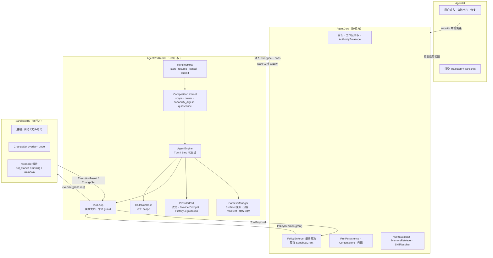
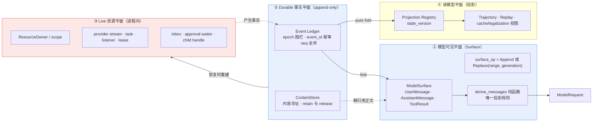
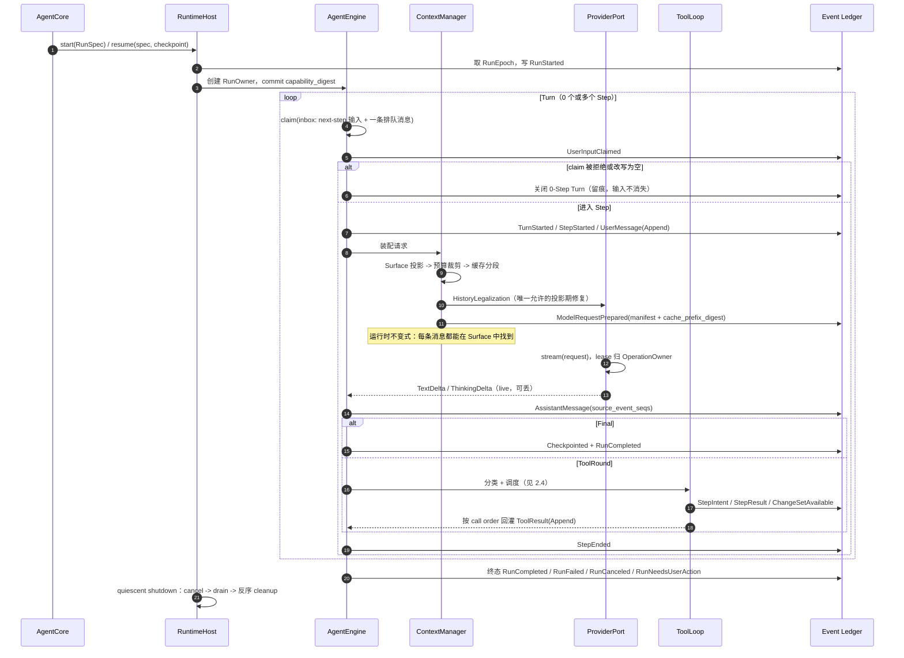
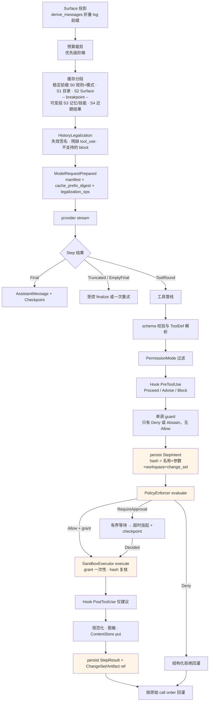
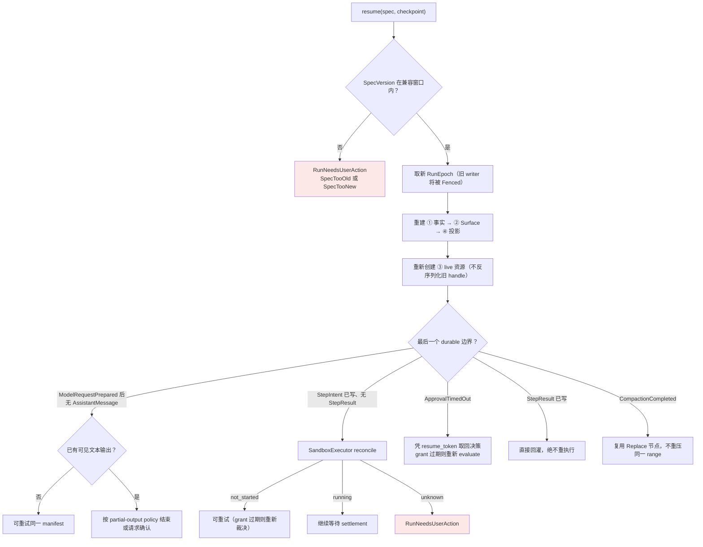

# AgentRS 技术架构设计与实施方案

> 版本：v1.7（回填 W1–W10 实现反馈：六个契约缺口、五处设计修正；新增 §18）
>
> v1.3 变更摘要：
>
> | 编号 | 变更 | 类型 |
> |---|---|---|
> | C1 | 新增 `ContentStore` 端口与 ContentRef liveness/GC 契约 | 补缺 |
> | C2 | 定义 `PolicyDecision`、SandboxGrant 签发与一次性消费绑定 | 补缺 |
> | C3 | `RunEpoch` fencing、事件幂等键与 checkpoint 写序 | 补缺 |
> | C4 | 审批语义定死为「有界阻塞 -> 降级挂起 -> resume」 | 定型 |
> | C5 | 新增 `RunHandle::submit` steering 通道与注入安全边界 | 补缺 |
> | C6 | 缓存前缀不变式（`cache_prefix_digest` + 分段布局） | 新不变式 |
> | C7 | 新增 `HistoryLegalization` 固定阶段 | 新不变式 |
> | C8 | ChangeSet overlay 读己之写语义与文件工作集版本绑定 | 补缺 |
> | C9 | P0 以单一 `CapabilityViewDigest` 取代五元组 generation | 减法 |
> | C10 | P0 并发调度回退为 `concurrency_safe` 布尔，ResourceAccess 降为声明字段 | 减法 |
> | C11 | `PermissionMode`/Plan Mode 提升为 Run 级一等状态；新增 `HookEvaluator` 端口 | 补缺 |
> | C12 | 安全不变量拆分为「内核不变量 / 宿主义务」并配 conformance suite | 定型 |
> | C13 | M0 范围收缩、真实 provider 提前、补性能与容量验收指标 | 排期 |
> | C14 | 新增参考 `agentrs-dev-adapter` 打通 dogfooding 路径 | 补缺 |
> | C15 | 补齐 crate 归属规则、投影清单、技能/子 Agent 与新契约的衔接 | 自洽 |
> | C16 | 新增 §17 跨团队待确认项（Q1–Q10）与兜底规则 | 收口 |
>
> v1.4 变更（引擎架构定位为 aionrs 内容层 + DeepSeek Harness 结构层的融合）：
>
> | 编号 | 变更 | 来源 |
> |---|---|---|
> | D1 | 新增 §1.5 设计谱系、融合原则、冲突裁决表与「明确不吸收」清单 | 两者 |
> | D2 | 新增 §4.3.1 ModelSurface：log append-only + Surface 投影 + Replace 遮蔽 | Harness |
> | D3 | 新增 §4.1.1 Fork 契约（补上两个参考实现都有、本方案缺失的能力） | 两者 |
> | D4 | 新增 §6.0 Turn/Step 精确定义，含 0-Step Turn | Harness |
> | D5 | §6.3 steering 由「队列+排空」升级为 inbox/claim，被拒 claim 也留痕 | Harness |
> | D6 | §8 新增规则 6A：guard 单调（只能 Deny/Abstain，无 Allow 变体） | Harness |
> | D7 | §8.3 并发补 exclusive-as-barrier、rolling pool、启动前重分类；并记录两参考实现独立收敛的证据 | 两者 |
> | D8 | §5.1 明确 Scope 不是安全边界，与 Authority 正交 | Harness |
> | D9 | §9.1.1 缓存前缀规则大幅简化为 Surface 的推论 | Harness |
> | D10 | §9.3 压缩改为 Replace 节点 + 双触发 + SurfaceGeneration 防重试循环 | Harness |
>
> v1.5 变更（Q11 定案与评审反馈落地）：
>
> | 编号 | 变更 |
> |---|---|
> | E1 | **Q11 已决：重写为主 + aionrs 模块级移植**；新增 §3.3 移植清单（A 类 6800 行直接复制 / B 类 2900 行改造 / C 类 12900 行拒绝）与移植纪律 |
> | E2 | §3.2 补 Apache-2.0 §4 强制归属义务与文件头模板（因复制源码而从"建议"变"强制"） |
> | E3 | 裁决 #1 拆为 1a（拒绝动态扩展）/ 1b（保留配置化装配），修正原论证的跳步 |
> | E4 | §8 规则 6 的 middleware 白名单改为否定式约束 |
> | E5 | §4.1 新增 `ConfigTree`，避免 RunSpec 字段膨胀导致配置侧信道偷渡 |
> | E6 | §5.1 用 `VisibleTool`/`AuthorizedTool` 类型分离强制 scope≠authority |
> | E7 | M0 验收新增"能干成一件事"；Phase B 新增 SandboxRS 可运行前置；性能表补工具往返开销 |
>
> v1.6 变更（多智能体协作补全）：
>
> | 编号 | 变更 |
> |---|---|
> | F1 | 新增 §11.3 多智能体协作架构；修正 §11.2 对协作式成员错误的 epoch 假设 |
> | F2 | 明确 ChildRun（parent-owned）与 MemberRun（平级、自有 epoch）是两种模型 |
> | F3 | 新增 `ExternalFact` 契约：跨 Run 内容进入 Surface 的唯一通路，只带内容不带能力 |
> | F4 | 新增 `BoardSnapshotRef` 契约：共享可变状态固化为不可变快照，保证 replay 确定性 |
> | F5 | 审批一律归人类，禁止 agent 互相授权；团队预算池化 |
> | F6 | 内核不变量增至 16 条；Q9 自 Phase D 提前到 Phase B 前确认 |
>
> 范围：本方案只定义 uworker 的 `agentrs`。它是 Rust 编写、可嵌入的 Agent 推理与工作流内核；保留既有安全边界与 durable workflow，并吸收 DeepSeek Harness/Cordis 的生命周期、依赖拓扑和可撤销注册语义。这里借鉴的是语义，不移植 JavaScript Proxy、任意 YAML 插件或进程内不受信代码。

---

## 1. 定位与边界

AgentRS 的职责是将“用户目标 + 已授权上下文 + 可用能力”推进为可审计的步骤流：模型推理、工具提议、工具结果回灌、上下文管理、子 Agent 和最终结果。它不拥有桌面 UI、数据库、用户身份、策略规则、文件系统写入权限或 OS 进程。

```text
AgentUI                  AgentCore                       AgentRS                    SandboxRS
  用户输入/展示   ->   RunSpec、策略/审批、持久化端口  ->  推理、规划、工具调度  ->  命令隔离、ChangeSet
      ^                        ^                              |                              |
      +---- RunEvent ----------+--------- RunPersistence ------+------ SandboxExecutor --------+
```

依赖方向固定：`agentcore -> agentrs`，`agentcore -> sandboxrs`；AgentRS 只依赖稳定的 `agentrs-contracts` 和 trait port。AgentRS 可以请求工具执行，但不能直接 `spawn`、`fs::write`、访问 SQLite、读取 Keychain 或决定“总是允许”。

| AgentRS 必须负责 | AgentRS 不得负责 |
|---|---|
| provider 无关消息与流、回合循环、模型路由、上下文预算、工具编排、技能加载、子 Agent、摘要与结构化事件 | Electron/HTTP UI、账号和订阅、SQLite/JSONL 实现、工作区授权、审批最终裁决、SandboxGrant 签发、文件提交/删除、进程/网络隔离 |

### 1.1 边界判定规则：AgentRS 与 AgentCore 怎么分

§6 的职责对齐表是**判例列表**，无法覆盖将来出现的新能力。真正的规则是四个正交测试，按顺序问：

```text
一个新能力 X 归谁？

1. X 需要碰 OS / 网络 / 磁盘 / 真实时钟 / 凭据吗？
     是 -> 实现归 Core（或 Sandbox），AgentRS 只定义 port

2. X 需要"最终说了算"吗（授权 / 身份 / 计费 / 可见性 / 商业策略）？
     是 -> 裁决归 Core，AgentRS 只能消费结果，不能做决定

3. X 跨越多个 Run 吗？
     是 -> 跨 Run 的路由与聚合归 Core
           进入单个 Run 之后的处理归 AgentRS

4. 四问皆否 -> 完全归 AgentRS
```

**一句话：AgentRS = 纯的、单 Run 的、无权威的、依赖注入的那一部分。** 任一条不满足，该能力就至少有一半在 Core。

#### 可执行判据

文字规则会被理解偏，因此配一条能在 CI 里自动执行的判据：

> **如果加入 X 之后，`agentrs` 的单元测试需要网络、文件系统、真实时钟或 OS 进程，那么 X 放错地方了。**

判据有两处**受约束例外**，都是 OS 与内核之间的翻译层（详见 §18.2 修正 3、4）：

| 例外 | 豁免什么 | 仍然禁止什么 |
|---|---|---|
| `agentrs-provider` | 网络——它的全部存在意义就是与模型 API 通话 | fs / 进程 / 读环境凭据。端点由 `ModelPolicy` 指定，凭据由构造参数注入，分帧与投影是纯函数 |
| `agentrs-cli` | 读环境变量与命令行——把它们翻译成 `RunSpec` 正是它的职责（§3.1） | fs / 派生进程 |

另外，禁的是**派生进程**（执行权），不是"名字里带 process"：`std::process::Command`
禁止，`std::process::exit` 允许——进程退出不构成执行权。

这条原本是 T02 的测试要求，现提升为边界判据——它不依赖任何人的判断。

#### 四个交接面，没有第五种

边界模糊往往源于通道太多。AgentRS 与外界只有四个通道：

| 方向 | 通道 | 内容 |
|---|---|---|
| Core → RS（启动） | `RunSpec` | 不可变快照：AuthorityEnvelope、ModelPolicy、ConfigTree、PermissionMode、checkpoint |
| Core → RS（运行中） | `RunHandle::submit()` | steering 与 `ExternalFact` 的唯一入口 |
| RS → Core | `RunEvent` 事实流 | 唯一语义输出 |
| 双向 | port trait 集合 | Persistence / ContentStore / Policy / Sandbox / Memory / Skill / Hook / TokenCounter / Clock / Cancellation |

**任何绕过这四个通道的设计都是边界违规，不需要再讨论。**

#### 五个"切开"的案例

难点不是"整块归谁"，而是"一件事两边各一半，切在哪"：

| 能力 | AgentRS 侧 | 切点 | AgentCore 侧 |
|---|---|---|---|
| 内容存储 | ref 语义、liveness 声明、解引用降级 | **`ContentRef`** | 存储后端、加密、GC、配额 |
| 审批 | 有界等待、超时挂起、凭 token 恢复 | **`ApprovalDecision`** | 最终裁决、令牌保管、唤醒 |
| 跨 Run 消息 | inbox → claim → Surface | **`submit()`** | Team 实体、邮箱、路由、可见性、投递重试 |
| 任务板 | 快照固化为不可变 ref | **`BoardSnapshotRef`** | 存储、DAG 校验、环检测、租约、死锁升级 |
| 记忆 | 候选选择、fragment 注入 | **`MemoryCandidate`** | FTS 索引、权限、保留策略 |

规律一致：**AgentRS 拿"这东西在一次 Run 里怎么用"，Core 拿"这东西怎么存在、归谁管"；切点永远是一个不可变值类型。**

#### 此前未定的六处，现予明确

| # | 议题 | 裁定 |
|---|---|---|
| 1 | **Token 计数** | **内核内置保守估算器**（字符/字节启发式，只高估不低估）用于硬上限保护；**Core 通过 `TokenCounter` port 注入精确计数**用于账本与展示。两者职责不同：前者保证内核能独立防止超窗，后者保证成本数字准确。此前 `token estimator port` 只在任务交付物里出现一次、端口清单中没有，是真实的契约缺口 |
| 2 | **Prompt 的产品文案边界** | 内核 prompt **只含行为契约与安全规则**；一切身份、语气、品牌、产品说明由 Core 通过 `SystemContext` 注入 |
| 3 | **工具描述** | 描述文本随 `ToolDef` 由 Core/Sandbox 注册，**归 Core**。但内核提供描述质量的 lint（长度上限、必须含风险说明、禁止内联绝对路径），并在 eval 集中覆盖"工具选择正确性"——**描述质量直接决定 Agent 好不好用，不能无人负责** |
| 4 | **ModelTier 映射** | 档位**语义**（`lite` 零工具、`craft` 预算更严）归 AgentRS；档位到具体模型 id 的**映射**归 Core，经 `ModelPolicy` 传入 |
| 5 | **错误文案** | 稳定错误码归 AgentRS；错误码到用户可读文案与 i18n 归 Core |
| 6 | **重试/退避参数** | 归 `ModelPolicy`（与 fallback 同一授权面），不进 `ConfigTree` |

设计目标：

1. 可嵌入：Core 通过 Rust trait 进程内驱动，不依赖 CLI 或全局配置文件。
2. 可恢复：每个有意义步骤能写 checkpoint，崩溃后从明确边界恢复，不重复未知副作用。
3. 可控：工具仅由 Core 注入的 capability 和 SandboxGrant 执行；AgentRS 不持有越权通道。
4. 高信噪比：主 Agent 上下文只含任务、精选记忆、已批准能力和结构化摘要，不吸收子 Agent 过程推理。
5. 可测：Provider、时间、持久化、工具执行、记忆检索与子 Agent 全部可替换为 fake。
6. 可收敛：Run、Operation、ChildRun 的 live resource 有唯一 owner，取消按 `cancel -> drain -> reverse cleanup` 结束。
7. 可重建：任何模型可见输入均能由不可变 RunSpec、durable event 与 `ContentStore` 中的内容寻址引用重建；物理来源只有这两处。
8. 可解释：一次 Run 的输入来源、模型请求、工具路径、子运行、能力视图变化和终止原因可以从事实流投影为完整 Trajectory。
9. 可扩展：扩展以声明式 Component 和明确 capability seam 进入系统，默认静态链接或进程外隔离，不向不受信代码开放进程内权限。
10. 可交互：Run 支持运行中注入用户输入并在安全边界生效；长时审批以挂起而非阻塞占用资源的方式等待。
11. 可负担：前缀缓存命中率与授权正确性同为一等约束；任何改写缓存前缀的机制必须说明其批量边界。
12. 可移交：安全承诺分为内核不变量与宿主义务，后者由随内核发布的 conformance suite 验证，内核不为第三方 adapter 的正确性背书。

## 1.5 设计谱系：aionrs 的内容层 + DeepSeek Harness 的结构层

AgentRS 引擎的技术架构由两个现有系统的核心思想融合而成，各自贡献的层面不同，因此可以叠加而不是二选一。

### 1.5.1 aionrs 贡献「Agent 主体的内容层」

aionrs 回答的是"一个真正能用的 Agent 需要哪些内容层机制"。这些是被 3 万行生产代码验证过的知识，AgentRS 直接继承而不重新发明：

| 思想 | aionrs 出处 | AgentRS 落点 |
|---|---|---|
| provider 无关的统一流式契约 `stream(LlmRequest) -> LlmEvent` | `aion-providers/src/provider.rs` | §7 ProviderPort |
| 厂商差异数据化，绝不进主循环分支 | `aion-config/src/compat.rs`、`projector.rs` | §7 ProviderCompat |
| 回合结果四态骨架 `Final / ToolRound / Truncated / EmptyFinal` | `aion-agent/src/{engine,turn}.rs` | §6 Step 结果分类 |
| 确定性回合防护，不依赖模型自觉 | `TurnGuards` | §6.4 |
| 分层压缩 micro / auto / emergency | `aion-agent/src/compact/` | §9.3 |
| 工具输出治理：ANSI 清洗、重复折叠、JSON/TOON | `aion-compact/` | §9.3 第 1 段 |
| 前缀缓存是一等公民：断点放置 + break 归因 | `cache_diagnostics.rs`、`projector.rs:88` | §9.1.1 |
| 无可见输出才重试 | `stream_runner.rs` | §6.1 |
| 历史合法性修复 | `tool_call_sanitize.rs`、`abort_current_turn()` | §8.1 HistoryLegalization |
| 读改缓存与陈旧检测 | `aion-tools/src/file_cache.rs` | §8.2 文件工作集 |
| 会话 fork 谱系 | `session.rs` 的 `forked_from/root_id` | §4.1.1 |

### 1.5.2 DeepSeek Harness 贡献「系统的结构层」

Harness 回答的是"如何让这些机制可替换、可观测、可恢复、可组合"。这些是 aionrs 没有的：

| 思想 | Harness 出处 | AgentRS 落点 |
|---|---|---|
| **Model-visible means logged**，且由运行时不变式断言 | `docs/architecture.md`、`runtime-diagnostics/invariants` | §4.3、§13 运行时断言 |
| **Surface**：log 上只有三类事件产生模型消息，带 `append \| replace{range}` | `core/session/src/surface.ts` | §4.3.1 ModelSurface |
| **三域事件**：durable 事实 / live 协调 / capability 事件 | `docs/architecture.md` | §4.3 三类事件 |
| **Seam 三角**：Definition + Provider + Consumer，缺一不成 seam | `docs/capability-seams.md` | §4.2 seam 表 |
| **Turn/Step 精确定义** | `docs/architecture.md` turn flow | §6.0 |
| **Inbox + claim**，被拒绝的 claim 也记 durable turn | `docs/agent-lifecycle.md` | §6.3 |
| **Monotonic guard**：只能 deny 或弃权，顺序受保护 | `docs/tool-execution-pipeline.md` | §8 规则 6 |
| `executionMode` 布尔 + exclusive 作为 ordering barrier + rolling pool + 启动前重分类 | `core/tools/src/index.ts:1276`、`agent-loop/src/tool-calls.ts` | §8.3 |
| **Scope 不是安全边界**（Harness 自己写明） | `core/scope/README.md` | §5.1 |
| Reversible effect：注册即 effect，卸载自动 unwind | Cordis `fiber.ts` | §5.1 ResourceOwner |
| 压缩双触发 + surface replacement generation 防重试循环 | `docs/agent-lifecycle.md` | §9.3 |

### 1.5.3 融合原则与冲突裁决

> **Harness 给骨架，aionrs 给内容，Rust 与权限模型给约束。**

三者冲突时的裁决已固定如下，后续变更需要修改本表：

| 冲突点 | Harness 立场 | aionrs 立场 | AgentRS 裁决与理由 |
|---|---|---|---|
| 扩展模型 a：动态扩展 | 运行时挂载插件、HMR、self-modification | 无 | **拒绝**。动态库 ABI、崩溃隔离与供应链成本过高，且与权限模型冲突 |
| 扩展模型 b：组件装配 | 组件集合与装配由配置决定，主循环不硬编码 | 在 `bootstrap` 里按全局配置组装 | **保留此性质**。静态链接组件的集合与装配方式由宿主在 RunSpec/装配期决定，不在 `AgentEngine` 内写死。用 trait object + builder 即可，不需要 Proxy 或动态加载；现在做接近零成本，事后补要改全部构造路径。<br/>此前把 a 与 b 合并否决是论证跳步：「Rust 没有 Proxy」只否定了机制，「不受信代码」也不成立——Harness 的插件同样是受信编译代码 |
| 扩展点形态 | waterfall，listener 调 `next()` 可环绕包括安全判定在内的全部阶段 | 无扩展点 | **固定安全阶段 + typed middleware 只能环绕非安全阶段**。schema/grant/StepIntent/Sandbox/StepResult 五阶段不可被 middleware 短路 |
| 状态模型 | append-only log + surface 投影 + 运行时不变式 | 全量 session 快照重写 | **取 Harness**。全量快照无法表达"这条命令跑没跑" |
| 并发调度 | `executionMode` 布尔，fail-closed 到 exclusive，exclusive 成 barrier | `is_concurrency_safe` 布尔，批次划分 | **两者独立收敛到同一设计，直接取用**，并吸收 Harness 的 rolling pool 与启动前重分类。这也是 §8.3 放弃 ResourceAccess 冲突图的独立验证 |
| 执行权 | `ctx.sandbox` 包 argv + landlock addon | 直接 `Command::spawn`，`containment.rs` 只做 kill 传播 | **两者都不满足要求**。取 AgentRS 自有的 grant + `SandboxExecutor`，内核无执行权 |
| scope 语义 | 明确声明"路由受信同进程插件，不是沙箱或权限边界" | 无 scope 概念 | **采纳该声明**，并保持 `AuthorityEnvelope` 与 scope 正交：scope 管可见性与生命周期，Authority 管权限 |
| 配置 | profile/bundle/patch 分层覆盖 | 全局 TOML + `dirs::home_dir()` | **都不进内核**。配置由宿主转换为不可变 `RunSpec`；分层 profile 留到 Phase D 且只能收窄 |

### 1.5.4 明确不吸收的部分

为避免后续反复讨论，以下机制**有意不进入 AgentRS**，理由记录在此：

| 不吸收 | 来源 | 理由 |
|---|---|---|
| JavaScript Proxy Context / 服务定位 | Cordis | Rust 无等价物；字符串定位破坏类型安全 |
| HMR / 热重载 | Cordis | 服务的是开发期体验，代价是全套 generation 机制 |
| `!!js` 可执行 YAML、任意插件下载即挂载 | Harness bundle | 与权限模型不可调和 |
| self-modification（Agent 挂载自己的插件） | `packages/self-modification` | 模型不得改变自身权限面 |
| 全局 TOML 与 `dirs::home_dir()` 读取 | aionrs | 破坏可嵌入性 |
| 内核内 `auto_approve` / `allow_list` 持久化 | aionrs `confirm.rs` | 授权状态归宿主 |
| 直接 `Command::spawn` 与技能 shell 片段执行 | aionrs `aion-process`、`aion-skills/src/shell.rs` | 内核无执行权 |
| TUI | aionrs `aion-tui` | 归 AgentUI |

## 2. 总体架构

### 2.1 分层与权限边界

AgentRS 是中间一层，**没有任何执行权**：它能提议、能编排、能解释，但改变世界的动作必须经过 Core 的裁决与 Sandbox 的执行。



依赖方向固定：`agentcore -> agentrs`、`agentcore -> sandboxrs`。AgentRS 只依赖 `agentrs-contracts` 与 trait port，**不能** `spawn`、`fs::write`、访问数据库、读取凭据或决定"总是允许"。

### 2.2 四个平面：本架构最核心的一张图

理解 AgentRS 只需要抓住一件事——**同一份 Run 状态被切成四个平面，各有各的规则，互相不可替代**。此前方案里大部分设计缺陷，本质都是把两个平面混为一谈。



| 平面 | 规则 | 崩溃后 | 违反的后果 |
|---|---|---|---|
| ① Durable 事实 | 只追加，epoch 围栏，`event_id` 幂等 | 权威来源，全部保留 | 双写者污染、重复副作用 |
| ② 模型可见 Surface | log 上的投影；压缩以 `Replace` 遮蔽而非改写 | 由 ① 重建 | 请求不可重建、transcript 被抹 |
| ③ Live 资源 | 有 owner，`cancel -> drain -> reverse cleanup` | **不恢复**，重新创建 | 句柄泄漏、幽灵回调 |
| ④ 读模型 | 确定性纯 fold，带 `state_version` | 由 ① 重放 | 出现第二份可变事实源 |

三条不可替代性：

1. `cleanup/release` 只释放 ③ 的资源，**不宣称历史未发生**；外部副作用只能靠 `reconcile/compensate` 处理。
2. ② 的任何变化都必须先是 ① 的一条事件；"只在内存里、下轮还要发给模型"的状态是设计缺陷。
3. ④ 从不回写 ①。

### 2.3 Run 生命周期时序



### 2.4 Step 内部：请求装配与工具管线



橙色为**五个不可绕过的固定阶段**（schema → StepIntent → Policy/grant → Sandbox → StepResult）。middleware 只能环绕 timeout / retry / metrics / 结果转换，不能短路其中任何一个。

并发调度：`concurrency_safe(args)` 严格为真才并行，未知一律 exclusive；exclusive 形成 ordering barrier；bounded rolling pool；**每个调用在真正启动前重新分类**（前序调用可能已改变状态）。

### 2.5 恢复决策树

崩溃或重启后，`RecoveryPlanner` 按 durable 事实决定下一步。核心原则：**宁可停下问人，也不重复未知副作用**。



### 2.6 AgentEngine 的定位

AgentEngine 是唯一拥有可变对话状态的组件，但**不是 privileged core**。它只消费 operation 开始时冻结的 capability、provider、tool、prompt 和 middleware 快照；扩展能力不能靠持续修改主循环加入。所有外部 I/O 均通过 port。

模型可见内容的物理来源固定为两处且只有两处：**durable event ledger** 与 **ContentStore**。任何"只存在于内存里、下一轮还要发给模型"的状态都是设计缺陷——它会在崩溃恢复后凭空消失，使 §16 的可重建标准失效。

## 3. Workspace 与 crate 边界

```text
agentrs/
  agentrs-contracts/       公共 ID、DTO、RunEvent envelope、RunEpoch/SpecVersion、
                           ContentRef、PolicyDecision/SandboxGrant 载体、PermissionMode、
                           LegalizationOp、projection key 与全部 port trait
  agentrs-types/           Message、ContentBlock、LlmRequest/Event、ToolDef、Usage
  agentrs-runtime/         RuntimeHost、AgentEngine、composition/lifecycle、steering 队列、
                           审批挂起与恢复、取消与 RecoveryPlanner
  agentrs-provider/        Provider trait、流式适配、模型路由、ProviderCompat、
                           HistoryLegalization、缓存断点放置、授权内 fallback、重试
  agentrs-context/         token 账本、RequestManifest、缓存前缀分段布局、
                           请求构建、选择、压缩和来源追踪
  agentrs-tools/           scoped registry、typed pipeline、concurrency_safe 调度、结果规范化
  agentrs-skills/          Skill manifest、按需加载、变量替换、ContextModifier
  agentrs-memory/          MemoryRetriever port adapter、选择协议、引用格式
  agentrs-subagents/       函数式 asTool、profile、摘要 contract、Team 适配端口
  agentrs-prompts/         版本化系统提示、结构化输出 schema、prompt fixtures
  agentrs-observability/   trajectory/projection/replay、trace/metrics、脱敏导出
  agentrs-cli/             轻量命令行驱动器、JSONL host 协议、诊断与测试入口
  agentrs-testkit/         fake ports、故障调度、回放与属性测试、host conformance suite
  (Phase D) agentrs-components/  ComponentManifest、Inventory、profile/overlay、generation 事务
```

`agentrs-contracts` 不得依赖任何业务 crate。`agentrs-runtime` 依赖 contracts/types/context/tools/provider，但不得依赖 sandboxrs 的实现 crate；SandboxRS 仅通过 `SandboxExecutor` trait 注入。Provider 厂商差异集中在 `ProviderCompat` 和投影器，禁止在 AgentEngine 中出现厂商名分支。

两条归属规则值得单独写明，否则容易散落：

1. **`HistoryLegalization` 属于 `agentrs-provider`，不属于 `agentrs-context`。** 它的输入是已装配好的请求 + 目标 `ProviderCompat`，输出是该 provider 能接受的等价请求。放在 context 会让厂商差异重新泄漏进上下文层。
2. **缓存前缀的分段布局属于 `agentrs-context`，断点的物理放置属于 `agentrs-provider`。** 前者决定"哪些段稳定"，后者决定"这个厂商用什么语法标记断点"（如 Anthropic 的 `cache_control: ephemeral`）。两者不可合并。

Phase A 将 composition 作为 `agentrs-runtime` 内部模块；只有 tools/provider/subagents 至少三个模块稳定复用同一 API 后，才评估抽出 `agentrs-composition`，且不承诺公开插件 ABI。`agentrs-components` 在 Phase D 触发条件满足前不创建。

### 3.1 AgentRS CLI：轻量驱动器，不是第二个产品

`agentrs-cli` 是薄二进制模块，面向开发者、自动化和宿主集成测试。它负责把命令行参数或 JSONL 输入翻译为 `RunSpec`，装配 RuntimeHost，并把 `RunEvent` 原样输出；它不实现 TUI、账户、会话数据库、插件市场或桌面工作台。

```text
stdin / args -> CliAdapter -> RuntimeHost -> RunEvent -> stdout JSONL / human renderer
                     |              |
                     |              +-> injected Provider/Persistence/Policy/Sandbox ports
                     +-> config/profile validation only
```

CLI 必须复用 RuntimeHost 和 contracts，禁止维护第二份 loop、工具协议或权限模型。默认采用只读/模拟 adapter；要执行真实工具时必须显式指定由 AgentCore/SandboxRS 提供的受控 adapter，且 CLI 不能自行退化为直接执行宿主 Shell 的后门。

建议命令面：

```text
agentrs run "<prompt>" [--model <id>] [--workspace <id>] [--json]     # A
agentrs serve --jsonl                         # stdin command -> stdout RunEvent，供宿主驱动   A
agentrs doctor                                # 版本、capability、provider 与 adapter 健康检查   A
agentrs resume <run-id> --checkpoint <path>   # 仅在提供 Persistence adapter 时可用           A
agentrs validate config|provider|skill <path>                                              # B
agentrs replay <events.jsonl>                 # 回放/诊断，不调用模型或工具                    B
agentrs trajectory <run-id> [--json]          # 投影 Run/Turn/Step/Tool/Child 轨迹            B
agentrs conformance --adapter <endpoint>      # 对宿主 adapter 跑 H1-H7 契约套件              B
agentrs cache-report <run-id>                 # 缓存命中率与 CacheBreakCause 归因             B
agentrs components [--scope <id>]             # 组件、依赖、代际、生命周期快照                  D
```

（右侧字母为交付阶段。）

`run` 在无受控执行 adapter 时只允许无工具或只读 fake 工具；`--unsafe` 不作为常规参数提供。开发环境若确需真实 Sandbox，使用明确的 `--sandbox-endpoint` 或宿主签发的短期 capability 文件，并在 JSONL 事件中标识执行器与 grant 来源。

#### 参考 dev adapter：让内核可被自己开发者验证

"默认只读、真实执行必须由 Core 提供 adapter"这条边界是对的，但如果止步于此，团队在 Phase A/B 期间将**无法用 AgentRS 做任何真实工作**，内核的实际可用性要等 AgentCore 就绪才被发现。这是一个可预见的反馈延迟。

因此在 `agentrs-cli` 之外提供一个**独立、显式、非默认**的参考实现 `agentrs-dev-adapter`（单独 crate 与单独二进制），它是最小但真实的 Persistence + ContentStore + Policy + Sandbox 组合：

| 端口 | 参考实现 | 约束 |
|---|---|---|
| `RunPersistence` | 本地 JSONL + 幂等索引 + epoch 文件锁 | 必须通过 H3 |
| `ContentStore` | 本地 CAS 目录 + retain 计数 | 必须通过 H4 |
| `PolicyEnforcer` | 终端交互式审批，无 `allow always` 持久化 | 必须通过 H5 |
| `SandboxExecutor` | 复用 SandboxRS；SandboxRS 未就绪期间使用受限子进程 + 显式 allowlist + overlay 目录 | 必须通过 H1/H2/H7 |

规则：

1. 它是**开发工具，不是产品运行时**；启动时在 stderr 打印醒目的非生产横幅。
2. 它必须持续通过 `agentrs conformance` 的全部用例——它同时是 conformance suite 的第一个真实被测对象，这样套件本身也被验证。
3. 它不进入 `agentrs-cli` 的默认依赖；`agentrs run` 不会隐式加载它，必须显式 `--adapter dev`。
4. 它的存在不放宽任何边界：grant 仍由其 Policy 实现签发、Sandbox 仍强制 hash 与隔离、CLI 仍不直接执行宿主 Shell。

有了它，M1 结束时团队就能用 AgentRS 自己改 AgentRS，缺陷在内核阶段暴露而不是在集成阶段。

### 3.3 实施路线：重写为主，模块级移植（Q11 已决）

**裁决：走重写路线，但 aionrs 中经过验证且与本架构不冲突的模块直接复制源码，而非重新实现。**

这不是"从 aionrs fork 后改造"（那会让 §2.2 的四平面模型长期与代码不符），也不是"完全从零"（那会浪费 aionrs 已验证的 wire format 与兼容性知识）。边界很清楚：**结构层全部新写，内容层能搬就搬。**

判定规则，按顺序应用：

1. 该模块是否触碰 §2.2 的四个平面的**结构**（事实流、Surface、owner、投影）？是 → 新写。
2. 该模块是否含有**执行权、环境配置读取、内核内授权状态**？是 → 拒绝移植。
3. 该模块是否是**纯函数或纯数据**（文本变换、wire 编解码、兼容性表）？是 → 直接复制。
4. 其余 → 复制逻辑，改造接缝（换成 port、加 owner、改事件）。

#### 3.3.1 移植清单

**A 类：直接复制（约 6800 行，仅改 crate 路径与 import）**

| 模块 | 行数 | 移入 | 为什么能直接搬 |
|---|---:|---|---|
| `aion-providers/src/{openai,anthropic,anthropic_shared,openai_responses,vertex,bedrock,openai_messages}.rs` | 2113 | `agentrs-provider` | 五个厂商的 wire format 是外部事实，与我们的架构无关 |
| `aion-providers/src/{framing,parser,transport,stream_process,stream_runner,retry,error}.rs` | 1456 | `agentrs-provider` | SSE 分帧与流处理是纯机械逻辑，重写只会引入新 bug |
| `aion-providers/src/{projector,openai_responses_projector,tool_call_sanitize,stream_diagnostics}.rs` | 1071 | `agentrs-provider` | 请求投影与 tool_call 清洗；`tool_call_sanitize` 直接成为 §8.1 的一部分 |
| `aion-config/src/compat.rs` | 546 | `agentrs-provider` | `ProviderCompat` 数据表。**剥掉 TOML 读取，只保留数据结构与默认值** |
| `aion-compact/src/{sanitize,fold,json,toon,level,api}.rs` | 400 | `agentrs-context` | 纯文本/JSON 变换，无任何外部依赖 |
| `aion-types/src/{message,llm,tool,compact}.rs` | 373 | `agentrs-types` | provider 无关的内容块模型。**需加 `ContentRef` 变体** |
| `aion-agent/src/context_usage.rs` | 356 | `agentrs-context` | token 账本计算 |
| `aion-agent/src/turn.rs` | 343 | `agentrs-runtime` | `TurnGuards` 确定性防护逻辑。**需改为发 durable 事件** |
| `aion-agent/src/cache_diagnostics.rs` | 164 | `agentrs-provider` | 缓存 break 归因；直接成为 §9.1.1 的实现 |

**B 类：复制逻辑，改造接缝（约 2900 行）**

| 模块 | 行数 | 必须改什么 |
|---|---:|---|
| `aion-skills/src/{frontmatter,substitution,context_modifier,prompt,types,conditional}.rs` | 1095 | 解析逻辑照搬；**发现与加载改由 Core 提供 `SkillManifest`**；`context_modifier` 改为单调收窄 |
| `aion-agent/src/compact/{micro,auto,emergency,state,estimate,prompt}.rs` | 744 | 触发阈值与摘要策略照搬；**产物必须表达为 `SurfaceOp::Replace` 而非改写历史** |
| `aion-protocol/src/{events,commands,reader,writer,approval}.rs` | 466 | JSONL 编解码框架照搬；**事件集换成我们的 `RunEvent`** |
| `aion-tools/src/{tool_search,registry,tool}.rs` | 278 | deferred 搜索逻辑照搬；**registry 加 ScopeId/owner，ToolDef 去掉 execute 能力** |
| `aion-tools/src/file_cache.rs` | 180 | 陈旧检测照搬；**条目加 `change_set_id` 维度**（§8.2） |
| `aion-agent/src/plan/{state,prompt,file}.rs` | 105 | 状态机照搬；**升级为 Run 级 `PermissionMode`**（§4.1.2） |

**C 类：明确不移植（约 12900 行）**

| 模块 | 行数 | 拒绝理由 |
|---|---:|---|
| `aion-tui/` | 3774 | 归 AgentUI |
| `aion-agent/src/{engine,session,orchestration,bootstrap,confirm}.rs` | 3333 | 全量快照状态模型、单体循环、内核内 `allow_list` —— 正是本架构要替换的东西 |
| `aion-config/src/{config,schema,auth,logging,shell,plan,file_cache,hooks,compact}.rs` | 2340 | 全局 TOML 与 `home_dir()` 读取，破坏可嵌入性 |
| `aion-skills/src/{shell,executor,discovery,loader,watcher,permissions,paths,hooks,mcp}.rs` | 1753 | 执行 shell 片段、扫描磁盘 —— 内核无执行权 |
| `aion-tools/src/{read,edit,write,grep,glob,exec_command,view_image}.rs` | 1338 | 工具执行体，归 SandboxRS / Core adapter |
| `aion-process/` | 381 | 直接 `Command::spawn`；且其 `containment.rs` 只做 kill 传播，不是隔离 |

> C 类中 `orchestration.rs` 有一个例外：其**并发批次划分逻辑**（连续 `concurrency_safe` 合批）可单独摘出复制到 `agentrs-tools`，其余的审批与执行部分丢弃。

#### 3.3.2 移植纪律

1. **移植是一次性的，不是持续同步。** 复制进来即成为 AgentRS 的代码，由我们维护。不建立与 aionrs 上游的 rebase 关系——那会把重写路线偷偷变成演进路线。
2. **A 类必须带原测试一起复制。** aionrs 的 `*_test.rs` 是这些模块可靠性的主要证据，只搬实现不搬测试等于放弃了移植的大部分价值。
3. **移植后立即适配四平面模型，不留"以后再改"。** 尤其 `turn.rs` 的事件发射与 `compact/` 的 Surface 表达，留到后面改会长成第二套状态模型。
4. **每个移植文件头部标注来源与修改**（Apache-2.0 §4b 的强制要求，见 3.2）。
5. **C 类不得以"临时用一下"的名义进入仓库。** 特别是 `aion-process`——一旦它进来，"内核无执行权"这条硬边界就破了。

#### 3.3.3 移植带来的排期影响

A 类约 6800 行、B 类约 2900 行，合计接近 aionrs 内核部分的四成，且集中在 provider 与上下文两个最耗时的领域。据此调整：

- Phase B 的 provider 工作从"实现五个适配器"变为"移植 + 适配接缝 + 补 owner/generation"，可压缩约 2–3 周；
- 但**新增一项移植合规工作**（许可证、NOTICE、文件头标注、来源清单），必须在首个公开发布前完成，不能拖到最后；
- **A 类移植应在 Phase A′ 就开始**，与真实 provider 冒烟同步——先搬 framing/parser/一个厂商适配，用真实流验证移植是否可用，而不是等到 Phase B 一次性搬完。

### 3.2 开源与产品边界

建议以 AgentRS Kernel 为开源单元，开放 contracts/types、runtime/composition、trajectory/projection/replay、Component SDK、testkit、CLI 和参考 adapter。开放这些承重契约有利于宿主集成、第三方 Provider/Tool 适配和对恢复/生命周期不变量的外部审查。

AgentCore 的账号、计费、组织策略、凭据、插件市场后台、签名服务、商业路由和私有评测不进入 AgentRS 仓库；SandboxGrant 签发与工作区最终授权仍归 Core，OS 隔离与 ChangeSet 执行仍归 SandboxRS。开源不改变进程权限边界，也不意味着任意插件可以进入 AgentRS 进程。

发布前必须完成依赖许可证、NOTICE、商标和代码来源审计。DeepSeek Harness/Cordis 仅作为设计与测试语义参考；AgentRS 默认采用独立的 Rust 实现，并保留必要归属信息。

## 4. 核心契约

### 4.1 启动与恢复

```rust
pub struct RunSpec {
    pub run_id: RunId,
    pub parent_run_id: Option<RunId>,
    pub conversation: ConversationSnapshot,
    pub system_context: SystemContext,
    pub authority: AuthorityEnvelope,
    pub initial_capabilities: CapabilityViewRef,
    pub permission_mode: PermissionMode,
    pub model_policy: ModelPolicy,
    pub context_budget: ContextBudget,
    pub execution_budget: ExecutionBudget,
    pub checkpoint: Option<RunCheckpoint>,
    pub spec_version: SpecVersion,
    /// 组件配置树。内核只按各组件声明的 schema 校验并分发，不解释其内容。
    pub config: ConfigTree,
}

pub trait RuntimeHost: Send + Sync {
    async fn start(&self, spec: RunSpec) -> Result<RunHandle, AgentError>;
    async fn resume(&self, spec: RunSpec, checkpoint: RunCheckpoint) -> Result<RunHandle, AgentError>;
    async fn cancel(&self, run_id: RunId, reason: CancelReason) -> Result<(), AgentError>;
}

pub struct RunHandle {
    pub run_id: RunId,
    pub epoch: RunEpoch,
    /* events(), join(), ... */
}

impl RunHandle {
    /// 运行中注入用户输入（steering）。仅在安全边界生效，见 6.3。
    pub async fn submit(&self, input: UserInput) -> Result<InputAccepted, AgentError>;
}
```

`RunSpec` 是不可变快照。`AuthorityEnvelope` 是 Core 签发且 Run 内不可扩大的授权上界；`CapabilityView` 是上界内当前可用的 provider/tool 集合，可以收缩、失效或在安全边界换代。工作区身份不能原地切换；策略、prompt 或能力变化不得静默混入进行中的 operation。

#### ConfigTree：避免 RunSpec 字段膨胀

「配置不进内核」是对的，但若每加一个配置项就给 `RunSpec` 加一个具名字段，Core 每次都要跟着改——摩擦一大，人就会从侧信道偷渡配置（塞进 `SystemContext`、塞进 skill manifest、塞进环境变量），规矩最终形同虚设。

因此 `RunSpec` 携带一个 **schema 校验过的不透明配置树**：

```rust
pub struct ConfigTree {
    /// 按组件 id 分区；内核不解释其内容
    sections: BTreeMap<ComponentId, serde_json::Value>,
}
```

规则：

1. 每个组件声明自己的 config schema；内核在 Run 启动时校验全部 section，失败即拒绝启动（fail loud，不静默忽略未知字段）。
2. 内核只做校验与分发，**不理解任何 section 的语义**。
3. 配置进入 `capability_digest`——配置变了，依赖视图就变了。
4. 配置**不能扩大** `AuthorityEnvelope`；越权字段在校验期即被拒绝。
5. 未知组件的 section 是错误而非忽略，避免"配置写了但没生效"这类最难排查的问题。

这样既保住"内核不读任何环境配置"，又不让 `RunSpec` 长成一百个字段的怪物。

#### RunEpoch 与写者围栏

`start`/`resume` 各分配一个单调递增的 `RunEpoch`。同一 `run_id` 上的所有 durable 写入必须携带 epoch，`RunPersistence` 拒绝小于当前 epoch 的写入并返回 `Fenced`。收到 `Fenced` 的 runtime 立即停止全部 durable 写入、取消 live resource 并以 `RunFailed { code: Fenced }` 收敛，不得继续消费 provider 流或提交 StepResult。

这条不变式解决"进程假死后被 Core 重新拉起、旧进程复活"导致的双写者污染。没有 epoch 时，「恢复以 durable log 为准」的规则本身不成立，因为 log 已被两个 writer 交错写坏。

#### SpecVersion 与恢复兼容窗口

`RunSpec`、`RunCheckpoint`、事件 envelope 各带 schema 版本。内核声明一个兼容窗口 `[min_supported, current]`：

| 情况 | 行为 |
|---|---|
| `version` 在窗口内且 ≤ current | 正常 `resume` |
| `version` 低于 `min_supported` | 拒绝恢复，返回 `RunNeedsUserAction { reason: SpecTooOld }`，由 Core 决定归档或重开 Run |
| `version` 高于 `current` | 拒绝恢复（降级会丢字段），返回 `SpecTooNew` |
| 窗口内但存在语义变更字段 | 走显式 migration 函数，迁移结果写一条 `CheckpointMigrated` durable 事件 |

兼容窗口至少覆盖两个发行版；缩窗必须是一次显式的破坏性变更公告。禁止「静默降级恢复」。

### 4.1.1 Fork：对话分叉

两个参考实现都有对话分叉而上一版方案没有，这是一个遗漏而非有意省略：aionrs 的 `Session` 带 `forked_from` / `root_id` 谱系字段，Harness 提供 `ctx.sessions.fork(source, boundary?, childSessionId?)`。

```rust
pub struct ForkSpec {
    pub source_run_id: RunId,
    /// 分叉点：从该 seq 之前的 durable 前缀派生。None = 从当前尾部分叉
    pub boundary: Option<EventSequence>,
    pub new_run_id: RunId,
}
```

规则：

1. Fork 产生一个**新 Run**，不修改源 Run。源 Run 的 durable 前缀是新 Run 的 `ConversationSnapshot` 来源。
2. 分叉点必须落在 durable 事实上（一个 `EventSequence`），不能落在 live delta 上。
3. `forked_from` / `root_id` 谱系只作记录，**加载时从不跟随**——新 Run 自带完整可重建前缀，不依赖源 Run 存活。
4. 被 fork 的前缀所引用的 `ContentRef` 必须由新 Run 的 checkpoint 重新 `retain`，否则源 Run 归档后新 Run 会出现悬空引用。
5. Fork 不继承任何 live 状态：不继承 inbox、未决审批、in-flight 工具或 grant。
6. Fork 不能扩大权限：新 Run 的 `AuthorityEnvelope` 由 Core 重新签发，且不得宽于源 Run。

### 4.1.2 PermissionMode 与 Plan Mode

`PermissionMode` 是 Run 级一等状态，不是提示词约定，也不能由函数式子 Agent 表达：

```rust
pub enum PermissionMode {
    /// 只读探索：仅 Info 类工具，禁止任何 EffectProfile 非只读的调用
    Plan,
    /// 常规：按 Policy 逐次裁决
    Default,
    /// Core 已就本 Run 预授权某类操作，仍受 AuthorityEnvelope 与 Sandbox 约束
    Accepted { scopes: Vec<PreapprovedScope> },
}
```

规则：

1. `PermissionMode` 同时影响**工具目录投影**（Plan 模式下写类工具不进入 catalog）与**系统提示分段**，两者必须一致变化，否则模型会提出注定被拒的调用。
2. 模式切换只能发生在 turn 边界，必须写 `PermissionModeChanged` durable 事件，并作为缓存前缀断点（见 9.1.1）。
3. 模式只能由 Core 或用户切换，模型只能通过 `ExitPlanMode` 之类工具**提议**切换；提议经 `PolicyEnforcer` 裁决后才生效。
4. `Plan -> Default` 的收敛点是一次显式审批；`Default -> Plan` 可无条件收窄。
5. ChildRun 继承父 Run 的 `PermissionMode` 且只能更严格。

```rust
pub struct ResolvedCapability<T: ?Sized> {
    pub provider_id: ProviderId,
    pub value: Arc<T>,
    pub availability: Availability,
}

/// P0 形态：单一 digest 覆盖 provider + tool catalog + prompt + middleware。
/// P1 出现真实换代需求时，在保持 digest 字段不变的前提下追加 generation 元组，
/// 旧事件仍可解析（digest 是向前兼容的收缩投影）。
pub struct OperationView {
    pub authority_id: AuthorityEnvelopeId,
    pub permission_mode: PermissionMode,
    pub capability_digest: CapabilityViewDigest,
    // P1 追加：provider/tool_catalog/middleware/prompt 各自的 Generation
}

pub struct ModelRequestManifest {
    pub request_id: RequestId,
    pub operation_view: OperationView,
    pub source_event_range: EventRange,
    pub system_sections: Vec<ContentRef>,
    pub memory_fragments: Vec<MemoryRef>,
    pub skill_fragments: Vec<SkillRef>,
    pub compaction_refs: Vec<SummaryRef>,
    pub tool_catalog_digest: Digest,
    pub cache_prefix_digest: Digest,
    pub cache_breakpoints: Vec<SegmentIndex>,
    pub legalization_ops: Vec<LegalizationOp>,
    pub token_accounting: TokenAccounting,
}
```

每个 operation 只使用一个 committed `OperationView`，不变式为 **「一次 operation 内 `capability_digest` 不变」**——这是一条断言即可验证的规则，不需要 P0 就建成完整的代际系统。

P0 与 P1 的分界明确如下：

| | P0 | P1（出现 ≥2 provider / MCP / per-run component 后） |
|---|---|---|
| 依赖视图 | Run 启动时一次性 commit，Run 内不变 | 安全边界上换代 |
| 表达 | 单一 `capability_digest` | digest + generation 元组 |
| 能力失效 | 下一次 catalog 快照中消失，in-flight 调用返回 `CapabilityWithdrawn` 错误并回灌模型 | committed generation replacement + 旧代 drain |
| 事务式启动 | 不实现 | candidate transaction + rollback |

理由：P0 明确不采用动态插件（见 5.3/5.4），因此没有任何东西会换代；五元组 generation 在 P0 全程是常量，却要渗透进每个 port 签名和每条事件 envelope。以 digest 起步可以让 M0 少两周关键路径，且不牺牲向前兼容。

### 4.2 外部端口

```rust
pub trait RunPersistence: Send + Sync {
    async fn begin_step(&self, epoch: RunEpoch, intent: StepIntent) -> Result<StepId, PersistError>;
    /// 幂等：以 event.event_id 去重。重复投递必须返回首次分配的 EventSequence，
    /// 不得分配新 seq，也不得写入第二条记录。
    async fn append_event(&self, epoch: RunEpoch, event: RunEvent) -> Result<EventSequence, PersistError>;
    async fn finish_step(&self, epoch: RunEpoch, result: StepResult) -> Result<(), PersistError>;
    /// 必须在 up_to_seq 对应事件已持久化之后才可见；违反时返回 CheckpointAhead。
    async fn save_checkpoint(&self, epoch: RunEpoch, checkpoint: RunCheckpoint) -> Result<(), PersistError>;
}

/// 内容寻址存储。ContentRef/ArtifactRef/SummaryRef/MemoryRef 的唯一物理来源。
pub trait ContentStore: Send + Sync {
    async fn put(&self, scope: ContentScope, bytes: Bytes, meta: ContentMeta)
        -> Result<ContentRef, ContentError>;
    async fn get(&self, r: &ContentRef) -> Result<Bytes, ContentError>;
    async fn get_range(&self, r: &ContentRef, range: ByteRange) -> Result<Bytes, ContentError>;
    async fn stat(&self, r: &ContentRef) -> Result<ContentStat, ContentError>;
    /// 声明这些 ref 仍被某个 Run/checkpoint 引用，阻止 GC 回收。
    async fn retain(&self, owner: RetentionOwner, refs: &[ContentRef]) -> Result<(), ContentError>;
    async fn release(&self, owner: RetentionOwner) -> Result<(), ContentError>;
}

pub trait PolicyEnforcer: Send + Sync {
    async fn evaluate(&self, proposal: ToolProposal) -> Result<PolicyDecision, PolicyError>;
    /// deadline 由 ExecutionBudget 派生。超时返回 Pending，由 ToolLoop 降级为挂起（见 6.2）。
    async fn await_approval(&self, request: ApprovalRequest, deadline: Deadline)
        -> Result<ApprovalOutcome, PolicyError>;

    /// 凭挂起时的令牌取回决策。
    ///
    /// **没有这个方法，`ApprovalOutcome::Pending` 里的令牌就是死路**——挂起后
    /// 永远无法恢复（见 §18.1 缺口 2）。返回 `Pending` 表示人仍未裁决，内核继续
    /// 保持挂起；返回 `Decided` 则**继续同一个 `StepIntent`**，不重新裁决、不重复副作用。
    async fn redeem(&self, token: ApprovalToken) -> Result<ApprovalOutcome, PolicyError>;
}

pub enum PolicyDecision {
    Allow {
        grant: SandboxGrant,
        /// grant 绑定的输入指纹，Sandbox 侧必须复核
        bound_input_hash: InputHash,
        expires_at: Timestamp,
    },
    RequireApproval(ApprovalRequest),
    Deny { code: DenyCode, message: RedactedMessage },
}

pub enum ApprovalOutcome {
    Decided(ApprovalDecision),
    /// 到达 deadline 仍无人裁决
    Pending { resume_token: ApprovalToken },
}

pub trait SandboxExecutor: Send + Sync {
    async fn execute(&self, grant: SandboxGrant, request: ExecutionRequest)
        -> Result<ExecutionResult, SandboxError>;
    async fn cancel(&self, execution_id: ExecutionId) -> Result<(), SandboxError>;
    async fn reconcile(&self, execution_id: ExecutionId) -> Result<ExecutionStatus, SandboxError>;
}

pub trait MemoryRetriever: Send + Sync {
    async fn candidates(&self, query: MemoryQuery) -> Result<Vec<MemoryCandidate>, MemoryError>;
    async fn load(&self, ids: &[MemoryId]) -> Result<Vec<MemoryFragment>, MemoryError>;
}

/// 精确 token 计数。内核另有内置保守估算器用于硬上限保护，
/// 二者并存：估算器保证不超窗，本 port 保证账本数字准确。
pub trait TokenCounter: Send + Sync {
    async fn count(&self, model: &ModelId, payload: &CountPayload) -> Result<TokenCount, CountError>;
}

/// 宿主 Hook 求值。Hook 只能建议或否决，不能授权。
pub trait HookEvaluator: Send + Sync {
    async fn evaluate(&self, point: HookPoint, payload: HookPayload)
        -> Result<HookOutcome, HookError>;
}

pub enum HookPoint { PreToolUse, PostToolUse, PreCompact, TurnEnd, RunStop }

pub enum HookOutcome {
    Proceed,
    /// 追加一段回灌给模型的文本，不改变授权结论
    Advise(RedactedMessage),
    /// 否决本次调用；等价于一次 Deny，仍要写 StepResult
    Block { code: DenyCode, message: RedactedMessage },
}
```

端口的责任必须单一：Persistence 是事实记录，不执行策略；ContentStore 是不可变字节存储，不理解语义；TokenCounter 只计数，不做预算决策；Policy 是授权决策，不运行命令；Sandbox 是限制执行，不规划任务；Memory 是检索，不直接注入提示词；Hook 是宿主可插拔的建议/否决点，不能签发 grant。AgentRS 组合这些结果，但不绕过其中任何一个。

#### ContentStore 契约要点

1. **不可变且按内容寻址**：`ContentRef` 包含 hash、长度、编码与 `ContentScope`（run / workspace / global）。相同字节在同一 scope 内必然产生相同 ref。
2. **liveness 显式声明**：checkpoint 保存前必须对其引用的全部 ref 调用 `retain(RetentionOwner::Checkpoint(run_id, seq))`。Run 归档后由 Core 调 `release`。**AgentRS 不实现 GC，但必须保证不产生未 retain 的悬空引用**——否则 §16「任意模型请求可重建」不成立。
3. **加密边界归 Core**：`put` 收到的是明文字节，Core 的实现可落盘前加密。AgentRS 不感知密钥。
4. **解引用失败是可预期路径**，不是 panic：

| 失败 | 上下文装配行为 | 事件 |
|---|---|---|
| `NotFound`（已被 GC） | 该 fragment 降级为占位摘要（"内容已过期，原长度 N 字节，来源 step X"） | `ContentRefUnresolved` |
| `Forbidden`（可见性收窄） | 直接剔除，不降级，不向模型暴露存在性 | `ContentRefUnresolved` |
| 传输错误 | 按可重试处理，超过次数后同 `NotFound` | — |

任何降级都必须进入 `ModelRequestManifest`，使「这次请求为什么和上次不同」可解释。

#### SandboxGrant 的签发与消费

grant 由 `PolicyEnforcer::evaluate` 在 `Allow` 中签发，AgentRS 只搬运不铸造。规则：

1. **一次性消费**：一个 grant 只能进入一次 `SandboxExecutor::execute`。ToolLoop 在本地记录已消费 grant id，重复使用是内部错误而非重试路径。
2. **输入绑定**：`bound_input_hash` 覆盖 `tool_name + 规范化后的参数 + workspace_id + change_set_id`。Sandbox 侧必须独立复核，不能信任调用方。这条是 host obligation（见 12.2）。
3. **过期即失效**：`expires_at` 之前未执行则 grant 作废，必须重新 `evaluate`。恢复流程中读到过期 grant 时**不得**直接执行，走重新裁决。
4. **不可派生**：ChildRun 不能复用父 Run 的 grant，必须各自 `evaluate`。

每个 capability seam 都要明确 Definition、Provider、Consumer，并回答：注册/撤销方式、owner、generation 变化时的 in-flight 策略、失败传播、durable 数据、ChildRun 收窄规则以及是否存在绕过 Policy/Sandbox 的 alternate caller。核心 port 继续使用强类型 trait 字段；composition registry 只维护 identity、generation、scope、availability 和 owner，不引入字符串 Service Locator 或 `Any` 驱动的公共 API。

| Seam | Definition | Provider | Consumer |
|---|---|---|---|
| LLM | `ProviderPort`、message/stream types | provider adapters | ModelRouter/AgentEngine |
| Tool | `ToolDef`、execution/result contract | Core/Sandbox/MCP registrations | ToolLoop/request assembler |
| Persistence/Policy | event/checkpoint、proposal/decision | AgentCore adapters | RuntimeHost/RecoveryPlanner/ToolLoop |
| Content | `ContentRef`、put/get/retain 契约 | Core 存储适配器 | ContextManager/Artifact/Compaction/Replay |
| Hook | `HookPoint`/`HookOutcome` | Core hook 运行器 | ToolLoop/Engine/Compactor |
| Context sources | memory/skill/prompt refs | Core resolvers/scoped contributors | ContextManager |
| Subagent | ChildRunSpec/summary | RuntimeHost/Core worker adapter | ToolLoop/main Agent |

### 4.3 事件模型

`RunEvent` 是 AgentRS 的权威 durable facts 流和唯一对外语义输出。事件 envelope 至少包含 `run_id`、单调 `seq`、`event_id`、时间戳、可见性和 durability；需要建立因果关系的事件还携带 `trace_id/parent_event_id`、`turn_id/step_id/operation_id`、`scope_id/component_id/generation` 与 `request_manifest_id`。未知事件必须可安全忽略。

```text
RunStarted | ContextSelected | ModelRequestPrepared | TurnStarted | TurnEnded
PartialOutputStarted | TextDelta | ThinkingDelta
ToolProposed | ApprovalRequested | ApprovalTimedOut | ToolStarted | ToolCompleted
ChangeSetAvailable | ArtifactCreated | SubagentSummary | UsageUpdated
CompactionStarted | CompactionCompleted | Checkpointed
UserInputSubmitted | PermissionModeChanged | HookOutcomeRecorded
ExternalFactReceived | BoardSnapshotAttached
ContentRefUnresolved | HistoryLegalized | CacheBreakObserved | CheckpointMigrated
RunCompleted | RunFailed | RunCanceled | RunNeedsUserAction
```

事件分为三类：

| 类别 | 示例 | 规则 |
|---|---|---|
| Durable facts | `StepIntent`、审批、`StepResult`、`ModelRequestPrepared`、终态 | 必须追加持久化，是恢复与回放依据 |
| Durable content refs | assistant committed message、tool result、summary/artifact ref | 保存 hash、版本与来源范围，正文可由 Core 加密存储 |
| Live stream/telemetry | frame timing、queue depth、`TextDelta`、lifecycle notification | 可采样或丢失；UI delta 必须有 committed replacement 或明确 partial record |

`TextDelta` 不单独作为完整恢复依据。任何进入下一模型请求的内容都必须可由 RunSpec、durable events 与内容寻址引用重建。终态之后禁止产生新的模型或工具语义事件；迟到的 live frame 只能丢弃或记录为诊断。

#### 事件必须携带恢复所需的数据

初版把 `EventPayload` 定义成无字段的判别式枚举，只有一个 `type` 标签。写 `RecoveryPlanner`
时才发现它**取不出 `execution_id`、`resume_token`、`source_range`**——规划器无从据事实流决定
恢复动作（见 §18.1 缺口 4）。

因此恢复相关的变体必须携带载荷：

| 变体 | 载荷 | 恢复时用来 |
|---|---|---|
| `ModelRequestPrepared` | `request_id` | 判断能否重试同一请求 |
| `PartialOutputStarted` | 无 | 回答"崩溃前有没有可见输出" |
| `StepIntentRecorded` | `Box<StepIntent>` | 凭 `execution_id` 向 Sandbox `reconcile` |
| `StepResultRecorded` | `Box<StepResult>` | 直接回灌，绝不重执行 |
| `ApprovalRequested` / `ApprovalTimedOut` | `call_id` / `token` | 凭令牌兑现，继续同一意图 |
| `CompactionCompleted` | `source_range` | 复用摘要，不重压同一范围 |

大载荷装箱，避免 envelope 体积失控。

#### `PartialOutputStarted`：可见输出的明确记录

`TextDelta` 是 live 的、**可丢失的**，因此"崩溃前用户看到过东西没有"这个问题
**无法**从 delta 的有无来回答。恢复时若不能回答它，就只能在"静默重发"（可能重复给
用户看内容）与"一律放弃"（可能丢失工作）之间二选一。

因此在**首个非空可见增量**处写一条 durable 事实，每个 Step 至多一条。
§4.3 所说的"明确 partial record"就是它。

#### seq、event_id 与幂等

| 概念 | 分配者 | 用途 |
|---|---|---|
| `event_id` | AgentRS（生成侧，确定性派生自 `run_id + epoch + 本地计数`） | **幂等键**。重投递必须命中同一条记录 |
| `seq` | `RunPersistence`（存储侧，单调递增） | durable 事实的全序，projection 与分页游标的依据 |
| `live_seq` | AgentRS 进程内 | live stream（`TextDelta` 等）的局部顺序，**与 durable `seq` 分属两个序空间**，不可比较 |

消费端去重键是 `(run_id, event_id)`，不是 `(run_id, seq)`——后者在重试分配新 seq 时会失效。live 事件不进入 durable 序空间，UI 需要交错渲染时按 `parent_event_id` 挂载到最近的 durable 锚点，而不是假设两个 seq 可排序。

### 4.3.1 ModelSurface：模型历史是 log 的投影，不是第二份可变状态

这是从 Harness 直接吸收的核心机制（`packages/core/session/src/surface.ts`），它同时解决三个此前各自处理的问题：历史压缩、缓存前缀稳定、请求可重建。

**规则：durable log 永远 append-only；模型看到的历史是 log 上一个叫 Surface 的有序投影。**

只有三类事件进入 Surface：

```text
UserMessage | AssistantMessage | ToolResult
```

每个 Surface 事件带一个 `surface_op`：

```rust
pub enum SurfaceOp {
    /// 在 surface 尾部追加，且自身从不是替换副本
    Append,
    /// 遮蔽一段已有 surface range，用于压缩
    Replace { range: SurfaceRange, generation: SurfaceGeneration },
}
```

由此得到四条推论，每一条都替代了此前一段专门设计：

| 推论 | 替代了什么 |
|---|---|
| **压缩 = 追加一个 Replace 节点遮蔽一段 range**，历史从不被改写 | 替代"Microcompact 攒到边界批量重写前缀"这套规则 |
| **人类 transcript 用 append-origin 事件**，模型历史用 Surface | 解决"压缩后用户已看到的对话被抹掉"——replacement 副本是 model-only |
| **任何请求可由「log 前缀 + 同一个 fold 函数」精确重建** | 这是 §16 可重建标准的实现机制，不再只是约定 |
| **缓存前缀稳定性是 Surface 的推论**：append-origin 前缀天然稳定，一次 Replace 从其 range 起点开始失效 | 大幅简化 §9.1.1 |

配套约定：

0. **请求装配只从 `derive_messages` 投影**，输入与工具结果都必须先进 Surface。
   直接用手头的消息装配会让运行时不变式没有对象可查——这条让本节与 T22A 真正咬合
   （见 §18.2 修正 5）。
1. `AssistantMessage` 必须携带 `source_event_seqs`，精确列出它由哪些 `TextDelta`/`ThinkingDelta` 事件构成（**包括显式的空列表**）。这样 live delta 丢失不影响 committed transcript 重建。
2. 空 content 的 `AssistantMessage` 不进入派生历史，但事件必须保留——它承载 usage 与 `max_tokens` 之类的终止信息。
3. `deriveMessages` 是**纯函数**且是唯一的投影规则；内核内外（trajectory、replay、外部重建器）必须折叠同一个函数，不允许存在第二份"模型历史构造"逻辑。
4. **运行时不变式**：每次组装模型请求时断言"请求中的每条消息都能在 log 前缀的 Surface 投影中找到对应节点"。违反即 panic（debug）或 `RunFailed{InvariantViolated}`（release）。这条断言是 Harness `model-visible means logged` 的 Rust 落法——把文档规定变成可执行检查。

### 4.4 Trajectory 与 Projection Registry

Trajectory 不是日志搜索页，而是从权威 Event Ledger 计算出的版本化读模型。AgentRS 提供事件、纯投影定义、查询/分页、replay bundle 和脱敏导出协议；AgentUI/AgentCore 负责桌面渲染和存储实现。投影不得成为第二份可变事实源。

```rust
pub trait ProjectionDefinition: Send + Sync {
    type State: Serialize + DeserializeOwned;
    type View: Serialize;

    fn key(&self) -> ProjectionKey;
    fn state_version(&self) -> u32;
    fn init(&self) -> Self::State;
    fn apply(&self, state: &mut Self::State, event: &RunEventEnvelope);
    fn view(&self, state: &Self::State) -> Self::View;
}
```

首批投影（Phase B 交付）：

| 投影 | 覆盖事件 | 回答的问题 |
|---|---|---|
| Run/Turn/Step 树 | RunStarted/TurnStarted/Step* /终态 | 这次 Run 的骨架是什么 |
| 模型请求 | ModelRequestPrepared、UsageUpdated | 每次请求发了什么来源、花了多少 token、TTFT 多少 |
| 工具路径 | ToolProposed -> Hook -> StepIntent -> Policy/Approval -> Sandbox -> StepResult | 某次调用为什么被允许/拒绝/挂起，最终做了什么 |
| 审批与挂起 | ApprovalRequested/ApprovalTimedOut/RunNeedsUserAction/resume | Run 在哪里停下、等了多久、被谁放行 |
| 上下文来源 | ContextSelected、ModelRequestPrepared 的 refs、ContentRefUnresolved | 这段内容从哪来、为什么这次没进去 |
| 缓存 | CacheBreakObserved + manifest 的 cache_prefix_digest | 命中率多少、每次 miss 因为什么 |
| 历史合法化 | HistoryLegalized | 事实与实际请求之间做了哪些修复 |
| 交互 | UserInputSubmitted、PermissionModeChanged | 用户中途说了什么、权限态怎么变的 |
| 压缩 | CompactionStarted/Completed | 哪段历史被摘要、前后 token 差多少 |
| ChildRun | 父子关系与 SubagentSummary | 子运行做了什么、成本归集到哪 |
| （Phase D）Component | component 激活/撤回/换代 | 能力视图为什么变了 |

查询必须支持按 seq/time、event/tool/error 过滤和向前分页；Phase D 起追加 component/generation 维度。

**缓存与合法化两类投影是本轮新增的重点**：没有它们，"这次请求为什么和上次不一样"和"钱花在哪"这两个最常见的排查问题只能靠猜。

系统维持三类轨迹，不能混成一个无限增长日志：

| 轨迹 | 内容 | 保留规则 |
|---|---|---|
| Agent Trajectory | turn/request/tool/approval/compaction/child/terminal | durable，可重放 |
| Composition Trajectory | 能力视图变化、依赖失效、shutdown settlement（Phase D 起含 component 换代） | 影响能力或审计的变化 durable，其余 live |
| Operational Telemetry | frame timing、queue depth、内部 retry 等 | 可采样，不参与恢复 |

## 5. Runtime Composition 与结构化生命周期

AgentRS 同时维护两个时间平面：

```text
Live plane:    acquire/register/start -> owner -> cancel/drain/reverse cleanup
Durable plane: StepIntent -> external operation -> StepResult/reconcile
```

Live plane 管理 tool/middleware/prompt registration、provider stream、background task、approval waiter、temporary section 和 ChildRun；durable plane 管理不可逆或状态未知的外部动作。`cleanup/release` 只释放当前 live resource，不宣称历史未发生；`reconcile/compensate` 处理外部 operation，不能由 `Drop` 或 disposer 替代。

### 5.1 Scope、Component 与 Owner

作用域固定为：

```text
ProcessScope -> HostScope -> RunScope -> OperationScope
                            +---------> ChildRunScope -> Child OperationScope
```

**Scope 不是安全边界。** 这一点 Harness 在 `packages/core/scope/README.md` 的设计契约里写得很明确——"scopes route trusted same-process plugins; they are not sandboxes or authority boundaries"。AgentRS 采纳同一立场并保持两条轴正交：

| 轴 | 管什么 | 载体 |
|---|---|---|
| Scope | 可见性与生命周期：谁能看到这个注册、它何时被回收 | `ScopeId` + owner |
| Authority | 权限：这个 Run 能做什么 | `AuthorityEnvelope` + `PermissionMode` + grant |

把 scope 当权限用是一类典型错误：子 Run 的 scope 更窄不等于它权限更小，权限收窄必须由 `ScopeDerivation` 显式对 Authority 做交集。

**这条必须用类型强制，而不是靠文档规定。** 可以预见有人会写出 `if scope.visible_tools().contains(&name) { /* 当作已授权 */ }`。因此：

```rust
/// scope 查询的产物：只表示「模型能看到它」
pub struct VisibleTool(ToolDef);

/// 授权检查的产物：只能由 PolicyDecision::Allow 构造，无公开构造函数
pub struct AuthorizedTool { def: ToolDef, grant: SandboxGrant }

// SandboxExecutor::execute 只接受 AuthorizedTool，不接受 VisibleTool。
// 两者之间没有 From/Into，唯一通路是 PolicyEnforcer::evaluate。
```

于是"把可见性当授权"这个错误**编译不过**。文档挡不住的错误，类型可以。

每个 ToolDef、middleware、prompt contributor、memory view、listener、stream 和 child handle 都带 `ScopeId` 与唯一 owner。父 owner 停止时先阻止新注册并传播 cancellation，再等待 child/in-flight operation 到达 settlement，最后反序 cleanup 自身资源。

```rust
pub enum LifecycleState {
    Pending,
    Starting { generation: Generation },
    Active { generation: Generation },
    Stopping { generation: Generation },
    Failed { generation: Generation, code: ErrorCode },
    Disposed,
}

#[async_trait]
pub trait AsyncCleanup: Send {
    async fn cleanup(self: Box<Self>) -> Result<(), CleanupError>;
}
```

**shutdown 期间整个结算过程持锁。** 这不是性能取舍而是正确性要求：试过"取出待清理项后
释放锁、后来者等待"的两种变体都不成立——忙等会在单线程运行时下饿死正在清理的一方；
`Notify::notified()` 在首次 poll 前不注册，`notify_waiters()` 会漏掉尚未 await 的等待者
（见 §18.2 修正 2）。持锁的代价是 shutdown 期间 `register` 阻塞，但它本就该被拒绝，
先阻塞后拒绝与直接拒绝语义等价。子 owner 各持自己的锁，父持锁调用子的 shutdown 不构成循环等待。

`ResourceOwner` 必须满足：setup 成功后的 cleanup 在资源可见前登记；部分 setup 失败反序清理；`Stopping` 后拒绝逃逸注册；cleanup failure 汇总但不阻断其余 cleanup；并发多次 shutdown 幂等并共享 settlement 结果。RAII 继续负责局部同步资源，async owner 负责取消、drain、错误收集和有序清理。

### 5.2 Component Manifest 与 Inventory（Phase D）

> 本节内容整体属于 Phase D，随 generation 系统一并启动，**不在 M0/M1 交付**。M0/M1 期间扩展单元只有静态链接的内建实现，其身份与依赖由 Rust 类型系统而非 manifest 表达。

运行时正式使用 `Component` 表达扩展单元；“插件”只是它的一种交付方式。`ComponentManifest` 至少包含：`component_id/version/api_version`、`requires/provides`、config schema、execution mode、trust level、scope/resource policy、migration version 与 telemetry/redaction policy。

`ComponentInventory` 是 Composition Kernel 的只读投影，每次读取权威 registry/owner 状态，不维护第二份生命周期真相。快照至少展示 source/profile、scope/owner、lifecycle、generation、dependencies、registrations、in-flight operation 数、last failure 和 shutdown settlement；首版只读，不提供绕过宿主授权的 enable/install API。

### 5.3 分级扩展与配置组合

| 级别 | 形态 | 阶段 | 规则 |
|---|---|---:|---|
| Builtin Component | 静态链接 Rust component | Phase A（M0） | 受信、强类型、随发行版测试 |
| External Component | MCP/WASI/JSON-RPC adapter | Phase D（M3） | Core/Sandbox 管进程、凭据和资源限制 |
| Trusted in-process extension | 已编译且受信实现 | Phase D 之后评估 | 只有明确需求和稳定 API 后开放 |
| Native dynamic plugin | 任意 Rust 动态库 | 不采用 | ABI、崩溃隔离和供应链成本过高 |

Phase D 可增加 profile/bundle/overlay，但配置必须是经过 schema 校验的声明式数据；禁止 `!!js`、可执行 YAML 和模型生成后直接加载代码。Profile 只选择已安装 catalog 中的 Component，权限仍受 AuthorityEnvelope 限制。

### 5.4 阶段边界

**Phase A（M0）** 实现 owner、scope、quiescent shutdown 与固定 component seam，**不实现** generation 系统、`ComponentManifest`/`ComponentInventory` 或通用动态插件 loader。依赖视图不变式只有一条：一次 operation 内 `capability_digest` 不变。

**Phase D（M3）** 在真实需求出现后增加 committed generation 与事务式换代：解析 manifest/config，验证依赖/权限/API，私下启动 candidate，执行 health/invariant checks，提交后让新 operation 使用新 generation，再 drain/cleanup 旧 generation；任一步失败都保留或恢复旧 generation。启动条件是「至少两个 provider、MCP 或 per-run component 的真实换代需求已出现」；条件未满足时不启动，以免为未采用的能力预付复杂度。受信进程内扩展与插件市场控制面在此之后再评估。

## 6. 可恢复 Agent Loop

### 6.0 Turn 与 Step 的精确定义

沿用 Harness 的定义，避免"回合"一词在文档里指代两件不同的事：

```text
Step = 一次模型请求 + 该请求提出的全部工具调用及其结果
Turn = 零个或多个 Step
       在第一批输入被 claim 之前打开，在"没有任何欠账"之后关闭
```

"欠账"指两类：工具还欠模型一次请求（上一步有 tool result 待回灌），或 inbox 里还有已到达的 next-step 输入。

一个重要的边界情况必须显式支持：**被拒绝或被改写为空的首次 claim，仍然关闭一个花了 0 个 Step 的 durable Turn**。日志要记录"这次尝试发生过但没有产生模型请求"，否则用户的输入会在事实流里凭空消失。

每轮遵循同一骨架，但将可能失败或产生副作用的边界显式化：

```text
start/resume
  -> acquire RunEpoch + create RunOwner + restore checkpoint + validate AuthorityEnvelope/SpecVersion
  -> commit OperationView (capability_digest)
  -> [safe boundary] drain steering queue: fold pending UserInput into conversation
  -> select context -> assemble ModelRequestManifest from durable sources + ContentStore
  -> HistoryLegalization (fixed stage, see 8.1)
  -> compute cache_prefix_digest + breakpoints
  -> persist ModelRequestPrepared + TurnStarted
  -> bind provider.stream(request) to OperationOwner
  -> persist/emit model deltas
  -> Final              => save assistant result + checkpoint + RunCompleted
  -> ToolRound          => for each proposed tool:
       validate schema + resolve ToolDef + PermissionMode filter
       Hook(PreToolUse)  => Block => synthetic denial result, no StepIntent
       persist StepIntent(input_hash)
       Policy.evaluate
       Allow             => Sandbox.execute(grant, request)   // grant one-shot, hash-bound
       RequireApproval   => persist ApprovalRequested
                            -> await_approval(deadline)
                            -> Decided => execute
                            -> Pending => checkpoint + RunNeedsUserAction (suspend)
       Deny              => tool result error, feed back to model
       Hook(PostToolUse) => advisory text appended to result
       persist StepResult + artifact/change-set refs
       feed compact result back to conversation
  -> settle OperationOwner + checkpoint -> [safe boundary] -> next turn
```

### 6.1 状态机和恢复规则

| 边界 | 持久记录 | 恢复策略 |
|---|---|---|
| 模型请求前 | `ModelRequestManifest` + `TurnStarted` | manifest 可重建且尚未输出可见文本时才允许重试 |
| 工具执行前 | `StepIntent` + input hash + grant reference | 重启后先向 Sandbox `reconcile`，不盲目重跑 |
| 等待审批 | `ApprovalRequested` + deadline | 在 deadline 内就地等待；超时写 `ApprovalTimedOut` + checkpoint 并挂起为 `RunNeedsUserAction`（见 6.2） |
| 审批已挂起 | `ApprovalTimedOut` + `resume_token` | `resume` 时凭 token 取回决策；grant 过期则重新 `evaluate`，不得直接执行 |
| 执行完成 | `StepResult` + artifact/change-set ref | 将结果回灌，绝不再次执行 |
| 压缩完成 | summary + source event range | 复用摘要，不重新压缩同一范围 |

重试只允许两类情形：模型在无可见输出前的瞬时失败，或 Sandbox 明确返回“未开始执行”。任何未知副作用、部分写入或外部系统超时都进入 `NeedsUserAction` 或 Core 的 reconcile 流程。

恢复时先重建 durable projection，再重新创建 live composition；不序列化 listener、task、Arc 或 disposer。若 checkpoint 已引用但 durable log 尚未提交对应事实，以 durable log 为准；若已有 UI delta 但无 committed assistant 内容，按已记录的 partial-output policy 结束、续接或请求用户确认，禁止静默重发。

### 6.2 审批语义：有界阻塞，超时挂起

审批只有一条路径，不允许实现者在「阻塞等待」和「挂起为终态」之间自由选择：

```text
ApprovalRequested (durable)
  -> await_approval(request, deadline = min(approval_timeout, remaining ExecutionBudget))
       -> Decided(Allow/Deny)  => 就地继续本 operation
       -> Pending(resume_token) => persist ApprovalTimedOut + checkpoint
                                   -> release ALL live resources (provider stream / child / lease)
                                   -> terminal: RunNeedsUserAction { approval: resume_token }
```

`approval_timeout` 默认取秒级到分钟级（建议 60s，可由 `ExecutionBudget` 覆盖），**绝不允许无限期阻塞**。理由：阻塞期间 Run 的全部 live resource 驻留内存——provider 连接、OperationOwner、ChildRun、tool lease、文件句柄。桌面场景下用户离开一晚，等价于句柄与内存泄漏，且与「取消必须收敛」的不变式冲突。

挂起恢复的契约：

1. `RunCheckpoint` 必须能表达「某个 `StepIntent` 已写、已获审批令牌、尚未执行」这一中间态。`resume` 时用 `resume_token` 向 Policy 换取最终 `ApprovalDecision`。
2. 挂起时已写的 `StepIntent` 保持有效，但其中的 grant 可能已过期（见 4.2）——过期时必须重新 `evaluate`，不得直接执行。
3. 挂起是**正常路径**，不是失败。`RunNeedsUserAction` 携带足以在 UI 上重建审批卡片的结构化载荷。
4. 同一 turn 内有多个待审批工具时，一次挂起承载全部未决 proposal，避免 N 次往返。

### 6.3 Steering：运行中注入用户输入

`RunHandle::submit(UserInput)` 把输入放入 Run 的 **inbox**，**不立刻改变对话**。这里采用 Harness 的 inbox/claim 模型而不是简单队列，因为它把"输入何时变成模型可见"这件事变成了一个有 durable 记录的显式操作。

```text
submit()  -> inbox
Turn 开始 -> claim(next-step 输入 + 至多一条排队消息)
          -> PreStep 决策（authoritative）
               reject           => 被 claim 的批次保持移除，Turn 花 0 个 Step 后关闭
               enter(messages)  => 写 UserMessage 事件，进入 Step
Step 结束 -> 若 next-step 输入已到达 => 再次 claim -> 下一个 Step
```

claim 只在两类安全边界发生：

| 边界 | 说明 |
|---|---|
| Turn 开始 | 上一 Turn 已 settle、下一次 `ModelRequestManifest` 装配之前 |
| Step 之间 | 全部并发工具已 settlement 并写入 StepResult 之后 |

规则：

0. **被 claim 但被拒绝的输入也要留痕**：写 `UserInputClaimed` + 关闭一个 0-Step 的 Turn。用户输入不得在事实流里凭空消失。
1. claim 通过后写一条 `UserInputSubmitted` durable 事件（`SurfaceOp::Append`），进入 Surface 并计入 token 账本，与首轮用户输入同构。
2. **不打断进行中的 provider 流**。若用户意图是打断，宿主应先 `cancel` 当前 operation（写 `RunCanceled` 语义的 operation 级取消）再 `submit`，两者是不同动作，UI 层可组合为一个「打断并改说」按钮。
3. `submit` 在 Run 终态后返回 `RunAlreadyTerminal`，宿主应改为 `start` 一个新 Run（携带上一 Run 的 ConversationSnapshot）。
4. 注入是缓存前缀断点：注入点之后的前缀必然变化，`cache_prefix_digest` 随之改变，这是预期行为而非异常。
5. 队列有上限；超过时返回 `SteeringQueueFull`，避免用户狂敲导致无界增长。

这条通道的必要性来自现状观察：aionrs 的 `AgentEngine::run(user_input)` 是单次驱动、无注入通道，因此 AionCore 不得不在外层重建 `turn_orchestrator` / `message_cursor` / `turn_continuation_policy` 来补这件事。AgentRS 若继承同一缺口，AgentCore 会被迫再造一次同样的编排层。

### 6.4 回合防护

引擎内置确定性 guard，不依赖模型自觉：最大回合、最大工具调用、最大并行数、预算、重复工具调用指纹、连续失败、空响应、上下文硬上限和取消令牌。触发后输出结构化 `RunNeedsUserAction` 或 `RunFailed`，不能无限循环。

## 7. Provider 与模型路由

继承 aionrs 的 `LlmProvider::stream(LlmRequest)` 统一流式模型，消息模型保留 provider 私有元数据以保证工具调用和 reasoning 签名可 round-trip。Provider transport、参数字段、工具 wire format、reasoning、token 上限和图像能力统一由 `ProviderCompat` 数据配置表达。

```text
provider defaults -> provider profile -> model profile -> RunSpec override
                         -> validated ProviderCompat -> request projector
```

模型路由不允许由 Agent 任意指定。`ModelPolicy` 由 Core 传入，约束可选模型、场景、成本上限、fallback、数据驻留和是否可传附件。推荐档位：

| 档位 | 用途 | 权限 |
|---|---|---|
| `lite` | memorySelector、风险提示、工具/技能搜索、简单分类 | 零工具 |
| `default` | 主任务、计划、探索、压缩 | 仅继承的 capability |
| `craft` | 高价值复杂任务 | 仅继承的 capability，成本预算更严格 |

Provider 失败编码为稳定错误，不透传响应正文和密钥。流式重试只在未产生可见文本时进行。

**Fallback 的归属按「是否超出 ModelPolicy 授权」划分**，而不是一律上交 Core：

| 情形 | 处理者 | 理由 |
|---|---|---|
| 429 / 5xx / 超时，且 `ModelPolicy.fallback` 已列出可切换目标 | AgentRS 进程内切换并重试（仅限未产生可见文本时） | 一次限流触发一轮 checkpoint + Core 往返 + `resume`，延迟与复杂度都不可接受；aionrs 的 `ComposedProvider` 在进程内即可完成 |
| 需要切换到 `ModelPolicy` 未授权的模型/provider | 上报 Core，输出可恢复状态与 `retry_after` | 越权决策 |
| 预算耗尽 | `RunNeedsUserAction` | 需要用户或 Core 决策 |

进程内 fallback 必须写 `ModelFallbackApplied` 语义字段进入下一条 `ModelRequestPrepared`（记录 from/to/cause），使成本与质量归因可解释。切换 provider 会使前缀缓存失效，属于预期的 `CacheBreakCause::ProviderSwitched`。

Provider adapter 必须有 `ProviderId` 和 owner；stream/continuation lease 归 OperationOwner。旧 adapter 必须保留到其 stream 完成、取消或 reconcile 结束，不能用 `ArcSwap` 静默替换正在使用的依赖。P1 引入 generation 后，追加「一次请求不得跨 generation、replacement 只影响下一安全边界」。

## 8. 工具调度、Typed Pipeline 与 SandboxRS 协作

AgentRS 管理“模型知道哪些工具、何时提出调用、哪些可并行、如何把结果回灌”；SandboxRS 管理“命令实际上如何受限执行并变成 ChangeSet”。工具定义至少包含 schema、风险、是否 deferred、`EffectProfile/ResourceAccess`、重试/取消语义和产物策略。

```text
ToolUse from model
  -> validate schema / normalize proposal
  -> resolve scoped ToolDef + committed catalog snapshot + PermissionMode filter
  -> capability/cancellation guard
  -> Hook(PreToolUse) -> Block? => synthetic denial, skip remaining stages
  -> persist StepIntent (input_hash over name + normalized args + workspace + change_set)
  -> PolicyEnforcer evaluates -> PolicyDecision{ grant, bound_input_hash, expires_at }
                              -> approval if required (bounded, see 6.2)
  -> timeout/retry/metrics typed middleware
  -> SandboxExecutor.execute(grant, request)     // grant one-shot, hash re-verified by Sandbox
  -> Hook(PostToolUse) -> advisory only
  -> normalize/redact/artifact(ContentStore.put) -> persist StepResult
  -> deterministic ToolResult order -> next model turn
```

规则：

1. AgentRS 不将模型原始字符串当 Shell 命令执行，必须先匹配注册的 `ToolDef` 并验证 input schema。
2. **P0 的并发判定使用 `ToolDef::concurrency_safe(input) -> bool`**；`EffectProfile`/`ResourceAccess` 在 P0 只作为 ToolDef 上的**声明字段**记录并进入 trajectory，不驱动调度器。理由见 8.3。未声明时默认串行。
3. `ChangeSetAvailable` 是一等事件。AgentRS 可以理解 diff 和请求下一步，但不能提交 ChangeSet；提交由 Core/用户流程完成。
4. 工具返回值先做大小限制、脱敏和 Artifact 化，再进入上下文；保留与本任务有关的摘要和引用。
5. deferred 工具先只向模型暴露名称、描述、风险和权限摘要，只有 `ToolSearch` 选中后才加载完整 schema。
6. schema、capability/grant、`StepIntent`、Sandbox enforcement、`StepResult` 是不可绕过的固定阶段。**middleware 的约束以否定式表达，不用白名单**：

   > middleware **不得**改变授权结论、**不得**跳过或重排任何固定阶段、**不得**延长 grant 有效期或复用已消费的 grant、**不得**抑制 `StepResult` 的提交。除此之外不限制其关注点。

   采用否定式而非「只允许 timeout/retry/metrics/结果转换」的白名单，是因为横切关注点会持续增加（tracing、限流、成本记账、结果缓存、注入扫描……），白名单每加一项都要改契约文档；否定式约束更强、可直接写成断言，且不随需求增长而失效。
6A. **Guard 是单调的**（吸收自 Harness 的 monotonic guard）：注册的 guard 只能返回 `Deny` 或 `Abstain`，**没有 `Allow` 变体**——放行是所有 guard 都弃权的结果，不是某个 guard 的决定。guard 的注册顺序受保护，不可被 middleware 重排。这条与 `HookOutcome{Proceed, Advise, Block}` 是同一原则的两个投影：**任何可插拔的东西都只能收紧，不能放宽**。
7. tool/middleware registration 必须带 scope、owner、稳定 order 并返回可撤销 handle；新 operation 只看最新 committed snapshot，旧 operation 按旧 snapshot 完成或明确取消。

### 8.1 HistoryLegalization：事实流与 provider 可接受输入之间的固定阶段

durable 事实流与「provider 当下能接受的请求」之间存在不可消除的阻抗，必须显式建模，不能假装不存在：

| 阻抗来源 | 现象 |
|---|---|
| reasoning/thinking 签名是 provider 侧不透明且有生命周期的令牌 | 跨 provider fallback、跨 compaction、跨长时间挂起后失效 → 400 |
| `tool_use` 必须紧跟 `tool_result`（Anthropic 族） | 取消或崩溃后历史残缺 → 400 |
| 工具调用 id 格式、空 content block、连续同角色消息 | 各 provider 约束不同 |
| 图像/附件在目标模型不支持 | 需降级为文本占位 |

因此在 request assembler 与 provider projector 之间设固定阶段 `HistoryLegalization`，它是**唯一允许对 durable 事实做投影期修复的位置**：

```rust
pub enum LegalizationOp {
    SyntheticToolResult { tool_use_id: ToolUseId, reason: LegalizationReason },
    DroppedReasoningSignature { message_index: usize, cause: SignatureCause },
    DroppedUnsupportedBlock { message_index: usize, kind: BlockKind },
    MergedAdjacentMessages { range: MessageRange },
    RewrittenToolCallId { from: ToolUseId, to: ToolUseId },
}
```

不变式：

1. **只读事实、只改投影**。legalization 不写回事件流，不修改 `ConversationSnapshot`。
2. **必须留痕**。全部 `LegalizationOp` 进入 `ModelRequestManifest.legalization_ops`，并发一条 `HistoryLegalized` durable 事件（仅含 op 列表，不含正文）。这样「同一段历史为什么这次和上次发给模型的不一样」可解释。
3. **确定性**。相同输入历史 + 相同目标 `ProviderCompat` 必然产生相同 op 序列与相同输出，否则 replay 不可重现。
4. **不得扩大信息**。legalization 只能删除、合成占位、重排；不能引入新的用户或工具内容。
5. 合成的 `tool_result` 内容固定为结构化错误（"执行被中断，结果未知"），且必须与真实结果在 trajectory 上可区分。

现状参照：aionrs 已有 `aion-providers/src/tool_call_sanitize.rs` 与 `AgentEngine::abort_current_turn()`（补合成 tool_result），AionCore 有 `manager/aionrs/history_sanitize.rs`。这三处逻辑在 AgentRS 中应收敛为这一个阶段。

### 8.2 ChangeSet overlay 与读己之写

模型的典型序列是「Edit 之后 Read 同一文件」「Edit 之后跑测试」。既然 `ChangeSetAvailable` 是一等事件且提交权不在 AgentRS，就必须定义未提交变更的可见性，否则模型会读到自己刚改之前的内容并陷入循环。

**契约：SandboxRS 为每个活跃 ChangeSet 提供 overlay 视图，同一 Run 内的所有工具执行都在同一 overlay 上进行。**

1. `ExecutionRequest` 必须携带 `change_set_id`；无该字段的执行是错误，不是默认走工作区。
2. overlay 语义是读己之写：Read/Grep/Glob/编译/测试看到的都是「工作区 + 未提交变更」的合成视图。
3. `change_set_id` 进入 `StepIntent` 的 `input_hash`——同一命令在不同 ChangeSet 版本上是不同的意图，reconcile 时不可混淆。
4. ContextManager 维护的文件工作集条目为 `(path, change_set_id, content_ref, observed_at_seq)`。压缩后必须保留该三元组，否则模型会丢失「我改过哪些文件、改到哪个版本」。
5. 用户提交或丢弃 ChangeSet 是 Run 外的动作。若在 Run 进行中发生，Core 必须在下一个安全边界通知 AgentRS，AgentRS 将受影响文件的工作集条目标记为 `Stale` 并在下一次上下文装配中显式告知模型，**不得静默沿用旧内容**。

现状参照：aionrs 的 `aion-tools/src/file_cache.rs` 已经需要读改缓存与陈旧检测；引入「变更先入 ChangeSet、由用户提交」之后，这个问题从缓存优化升级为正确性问题。

### 8.3 P0 并发模型：为什么用布尔而不是冲突图

`SharedRead` / `ExclusiveWrite` / `CommutativeAppend` / `RateLimited` 的完整冲突图 + lease 系统，在 P0 的实际收益接近于零：

- 最有并行价值的 Read/Grep/Glob 本来就是只读，一个布尔即可表达；
- Bash/Exec 的资源集合在参数层不可判定（`bash -c "rm -rf x && make"` 读写什么？），只能永远保守 exclusive；
- 于是冲突图的净效果 ≈「只读并行、其余串行」，与 aionrs 用 `is_concurrency_safe(input)` 布尔已经达到的效果相同（见 `aion-agent/src/orchestration.rs` 的批次划分）。

**两个参考实现独立收敛到同一设计**，这是本判断最有力的依据：

| | aionrs | DeepSeek Harness |
|---|---|---|
| 判定 | `Tool::is_concurrency_safe(input) -> bool` | `isConcurrencySafe(args)`，**严格等于 `true`** 才 parallel |
| 失败姿态 | 未声明即不安全 | 未知/隐藏/未声明/非法/抛异常一律 `exclusive` |
| 调度 | 连续 safe 的调用合成一个并发批次 | `exclusive` 形成 ordering barrier |
| 出处 | `aion-agent/src/orchestration.rs:572` | `packages/core/tools/src/index.ts:1276` |

因此 P0 采用布尔判定，并额外吸收 Harness 的两个细节：

1. **exclusive 即 ordering barrier**：一个 exclusive 调用不与任何兄弟重叠，且切断它前后的并发批次。
2. **bounded rolling pool + 启动前重分类**：并发批次不是"一次性 join_all"，而是有上限的滚动池；每个调用在**真正启动前**重新执行一次分类，因为前面已完成的调用可能改变了状态（例如刚创建了文件、刚改了工作区）。一次性预分类是错的。

`EffectProfile`/`ResourceAccess` 保留为声明字段进入 ToolDef 与 trajectory，为 P1 留出升级空间。**升级触发条件**：出现真实的「两个写不同文件的 Edit 应当并行」且该并行在实测中带来可观测收益时，才把声明字段接入调度器。

无论哪种模型，以下不变式不变：并发执行结果必须全部 settlement；按原始 call order 写入模型历史；任一并发调用失败不得丢弃其他调用的 `StepResult`。

## 9. 上下文、记忆与压缩

### 9.1 上下文预算

`ContextManager` 持有显式 token 账本，将可用窗口分配给：系统规则、用户输入、记忆、技能、工具 schema、历史消息、近期工具结果、输出预留和压缩缓冲。任何注入源都必须声明 token 成本和优先级，不能无限追加。

每次请求必须先产出 `ModelRequestManifest`，记录 request ID、provider/prompt/tool/capability generation 或 digest、source event range、system/skill/memory/summary content refs、token accounting。未进入 durable fact 或内容寻址存储的纯内存内容不得进入请求 assembler。

优先级从高到低：安全/能力约束、用户当前输入、未决审批/当前任务、最近对话、关键文件/产物引用、精选记忆、技能正文、工具 schema、低优先级历史。

多模态输入单独计量：图像/附件按目标模型的 `ProviderCompat.image_input()` 折算 token 并占用独立配额；不支持图像的模型在 HistoryLegalization 阶段将其降级为文本占位（`DroppedUnsupportedBlock`）。附件正文一律经 `ContentStore` 存放，账本中只记 ref 与折算成本。

### 9.1.1 缓存前缀不变式

Provider 的前缀缓存是**严格前缀匹配**：前缀任何一字节变化，从该点起全部 miss。它同时是最大的成本项和 TTFT 项，因此在本方案中与 `capability_digest` 同级，作为一等约束处理。

若不加协调，本方案的多项机制会各自砸掉缓存：

| 机制 | 破坏方式 |
|---|---|
| Microcompact 清理早期工具全文 | 改写历史中段 → 从改写点起全 miss |
| deferred ToolSearch 加载完整 schema | 工具目录在 Run 中途变化 → 目录段之后全 miss |
| Skill 的 ContextModifier 中途注入 | system 段变化 → 全量 miss |
| memorySelector 每轮重选 | 若置于前缀内 → 每轮全 miss |
| PermissionMode 切换 / provider fallback | 系统段或 provider 变化 → 全量 miss |

**分段布局约定**（从前到后）：

```text
[S0] 稳定系统规则 + PermissionMode 段        <- 仅在模式切换时变
[S1] 工具目录（含已加载的 deferred schema）   <- 仅追加：schema 加载往后补，不重排
[S2] ModelSurface 投影（含 Replace 节点）     <- 见下
--- cache breakpoint ---
[S3] 精选记忆 / skill fragment / 文件工作集    <- 每轮可变
[S4] 近期工具结果 + 当前 claim 的用户输入      <- 每轮可变
```

**S2 段的稳定性不需要额外规则，它是 ModelSurface（4.3.1）的推论**：log 是 append-only，Surface 的 append-origin 前缀天然稳定；一次 `SurfaceOp::Replace` 从其 `range` 起点开始使前缀失效，且失效点是**已知且可计算的**，不需要靠"把改写攒到边界"这种约定来近似。这是采用 Harness Surface 模型带来的直接简化——上一版为保住缓存而设的"S0–S3 只能追加、Microcompact 批量攒到边界"整套规则被它取代。

不变式：

1. `ModelRequestManifest` 必须携带 `cache_prefix_digest`（覆盖 S0–S2 的稳定部分）与 `cache_breakpoints`。
2. S0/S1 的变更（模式切换、deferred schema 加载）只在安全边界生效；deferred schema 只能追加到 S1 尾部，不得重排既有条目。
3. S2 的失效点直接由最近一个 `Replace` 节点的 `range.start` 决定，可精确计算并归因。
4. 换代/模式切换/provider fallback 只在缓存边界生效——这与「generation 只在安全边界换」是同一个边界，两者合并实现。
5. 可观测性必须暴露 `cache_read_tokens`、`cache_creation_tokens`、`cache_hit_rate` 与 `CacheBreakCause`：

```rust
pub enum CacheBreakCause {
    FirstRequest, SystemPromptChanged, ToolCatalogChanged, HistoryRewritten,
    PermissionModeChanged, ProviderSwitched, SteeringInjected, TtlExpiry,
}
```

现状参照：aionrs 已把这件事作为一等公民处理——`aion-agent/src/cache_diagnostics.rs` 专门检测 cache break 并归因，`aion-providers/src/projector.rs` 主动放置 `cache_control: ephemeral` 断点，`openai.rs` 解析 `prompt_cache_hit_tokens`。AgentRS 不得在这一点上退化。

### 9.2 记忆选择

AgentRS 不直接管理 SQLite FTS 或 Markdown 文件；它通过 `MemoryRetriever` 获取候选，然后使用 `memorySelector`（lite、零工具、结构化 JSON 输出）在候选中选择默认最多 5 条。selector 只能降低注入数量，不能扩大可见范围；不确定时少选。检索/selector 失败时退回 Core 给出的确定性排名和最小记忆集。

### 9.3 压缩策略

采用四段而不是单次截断：

1. 工具输出整理：去 ANSI、去重复、JSON/表格压缩、`ContentStore.put` 后以 ArtifactRef 替代大输出。此步发生在结果**首次**进入上下文时，属于 S4 段，不破坏前缀。
2. Microcompact（工具结果剪枝）：清理早期已消费的工具全文，保留引用、ChangeSet、错误和最近结果。**实现为一个 `SurfaceOp::Replace` 节点**，log 不被改写。
3. Compact：接近阈值时由零工具 Agent 生成结构化摘要，同样以 `Replace` 节点遮蔽被摘要的 range。
4. ContextSummary：恢复、跨 Run 延续或重大切换时生成完整工作摘要。

**触发时机取 Harness 的双触发设计**（`docs/agent-lifecycle.md`）：

| 触发 | 时机 | 说明 |
|---|---|---|
| 压力触发 | Step 开始、请求装配之前 | 预算接近阈值时主动压缩，属于正常路径 |
| 溢出触发 | provider 返回 context-too-long 之后 | 仅对**规范的上下文溢出错误**生效，不是通用重试 |

两种触发下都先做工具结果剪枝，再做摘要选择。

**防重试循环的关键机制**（直接吸收）：溢出触发后，只有当剪枝或摘要**确实推进了 surface replacement generation** 时，才允许开启一个新的重试 Turn；否则原始请求错误保持权威并向上报告。这条规则杜绝了"压缩没压下去 → 再请求 → 再溢出"的无限循环——上一版只写了"可触发一次受控恢复"，缺少判定"这次压缩到底有没有效果"的客观依据，`SurfaceGeneration` 正是这个依据。

摘要必须包括原始意图、约束、授权范围、关键文件/产物、已做/待做任务、错误修复、未决审批、当前 ChangeSet 和下一步；记录 `summary_version` 与 source event range，禁止反复压缩同一段历史造成信息漂移。

## 10. 技能与提示词

AgentRS 只解析和执行由 Core 解析后提供的 `SkillManifest` 与内容包。技能可提供指令、参数、模板、参考资料、模型/工具缩减和 fork 运行模式；它不是权限插件。`ContextModifier` 以 derived configuration layer 合并：集合取交集、预算取最小、风险策略取更严格、可见范围只能缩小，不能使用普通“右侧覆盖”扩大父 Run 的 AuthorityEnvelope。

**技能注入的位置受缓存前缀不变式约束**（见 9.1.1）。技能正文若注入 S0（系统段），每次启用/停用都会造成全量 cache miss。因此约定：

| 技能贡献 | 落位 | 理由 |
|---|---|---|
| 长期生效、Run 内不变的指令 | S0 尾部，Run 启动时一次性确定 | 进入稳定前缀，可被缓存 |
| 按需启用的技能正文与参考资料 | S4 | 每轮可变段，不污染前缀 |
| 技能带来的工具集缩减 | S1 目录投影 | 与 `PermissionMode` 同一机制，切换即断点 |

若一个技能确实需要在 Run 中途修改 S0，该修改必须推迟到 compaction 边界，与压缩一次性重建前缀合并；不允许因技能启停单独触发全量 miss。

技能内容正文一律经 `ContentStore` ref 化后进入 manifest，`SkillRef` 携带 version 与 content hash，使"这一轮为什么多了这段指令"可从 trajectory 解释。

系统提示、子 Agent 提示、压缩提示和 tool result 提示均放入 `agentrs-prompts`，具备版本号、输入 schema、snapshot fixture 和安全测试。禁止将产品文案、数据库路径、UI 控制逻辑嵌入 prompt。

## 11. 子 Agent 架构

### 11.1 函数式 asTool（Phase C）

`Explore`、`Plan`、`memorySelector`、`ToolSearch`、`compact`、`contextSummary`、`promptHookEvaluator` 是函数式子 Agent：输入 -> 独立受限上下文 -> schema 化结果。它们没有持久身份、默认零工具、不能直接发送消息或创建命令。

主 Agent 只能获得 `SubagentSummary`：任务、结论、证据/ArtifactRef、风险、置信度和建议下一步。过程推理、草稿、token 流与原始上下文不自动回灌，避免上下文膨胀和注意力稀释。

子 Agent 与本轮新增契约的关系：

1. **ContentStore scope**：子 Run 产出的证据写入父 Run 的 `ContentScope::Run`，由父 Run 的 checkpoint `retain`。子 Run 结束不得 release 父仍引用的 ref。
2. **PermissionMode 继承**：子 Run 继承父模式且只能更严格；`Plan` 模式下的父 Run 不能派生出可写的子 Run。
3. **审批**：子 Run 触发的审批向上冒泡到父 Run 的挂起路径——**子 Run 不独立挂起**，否则父 Run 会在等待一个已挂起的 child 时永久阻塞。
4. **缓存**：子 Run 有独立的前缀空间，其 miss 不计入父 Run 命中率；`SubagentSummary` 进入父 Run 的 S5 段。
5. **grant 不可派生**：子 Run 的每次工具调用独立 `evaluate`，不复用父 grant（见 4.2）。

### 11.2 协作式 Team Worker（Phase D 之后）

AgentRS 只提供 `ChildRunSpec`、AgentProfile、摘要 contract 和取消传播；持久 Worker、TaskList DAG、租约、消息和 artifact 共享属于 Core。ChildRun 通过 `ScopeDerivation` 从父 scope 构造，模型、工具、预算、可见性、`PermissionMode` 和递归深度只能收窄；child registration 归 ChildRunOwner，父取消先传播并等待 child terminal，child 结束后其 tool/listener/prompt 不得残留。

> **修正（v1.6）**：此前约定"child 共享父 `RunEpoch`，父被 Fenced 时 child 一并收敛"。该约定对**函数式子 Agent 成立，对协作式成员不成立**——成员的生命周期跨越父的多个 turn，甚至父 Run 已结束它仍活着。因此 §11.3 把两种模型彻底分开：函数式子 Agent 是 parent-owned 的 ChildRun，协作式成员是平级的 MemberRun，各有自己的 epoch。本节内容并入 §11.3。

### 11.3 多智能体协作（Team）

#### 11.3.1 两种子运行模型，必须分清

此前把"函数式子 Agent"和"协作式成员"当作同一个东西的两个阶段，这是错的——它们在所有权、epoch、通信、取消四个维度上都不同：

| | **ChildRun**（函数式，§11.1） | **MemberRun**（协作式，本节） |
|---|---|---|
| 所有权 | parent-owned，归 `ChildRunOwner` | **平级 Run**，归 Core 编排 |
| Epoch | 共享父 `RunEpoch` | **自己的 `RunEpoch`** |
| 生命周期 | 不超过发起它的 operation | 跨父的多个 turn，可比父活得久 |
| 通信 | 只回一个 `SubagentSummary` | 双向 `ExternalFact` |
| 取消 | 父取消传播并等待 terminal | Core 逐个 `cancel`，无自动传播 |
| 上下文 | 一次性受限上下文 | 持久，可压缩、可清空 |
| 典型用途 | Explore / Plan / memorySelector / compact | 长期负责某个方向的团队成员 |

**Team 是协调域，不是所有权域。** 这一点与 §5.1「scope 不是安全边界」是同类错误的另一面：不要因为几个 Run 属于同一个 Team 就认为它们之间有所有权或权限关系。

#### 11.3.2 六个工具的责任划分

以 `TeamCreate / TaskCreate / TaskUpdate / AgentCreate / TeamSay / TeamDelete` 这组典型工具面为例：

| 工具 | 本质 | 归属 | AgentRS 提供什么 |
|---|---|---|---|
| `TeamCreate` | 编排域的创建 | **Core** | 无。Core 用现有 `start` 驱动一组 Run |
| `TeamDelete` | 编排域的清理 | **Core** | 无。Core 逐个 `cancel` 并等待各自 terminal |
| `AgentCreate` | 派生一个受限 Run | Core 执行 | **`MemberRunSpec` 派生规则**（11.3.5） |
| `TaskCreate` / `TaskUpdate` | 共享可变黑板 | Core 存储 | **`BoardSnapshotRef` 固化契约**（11.3.4） |
| `TeamSay` | 跨 Run 消息 | Core 路由 | **`ExternalFact` 投递契约**（11.3.3） |

**AgentRS 不实现**：Team 实体、任务板存储、租约、邮箱、成员调度、崩溃巡检、死锁检测。这些都是 Core 的编排职责。

但**三个契约必须由 AgentRS 定义并强制**，否则四平面模型（§2.2）会被绕过——这是本节存在的唯一理由。

#### 11.3.3 ExternalFact：跨 Run 内容进入 Surface 的唯一通路

问题：团队消息与任务板快照都是**模型可见内容**。若 Core 用旁路把它们塞进成员上下文，内核不变量 11（模型可见内容只来自 durable event 或已 retain 的 ContentRef）当场破，且该成员 Run 不再可 replay。

机制其实已存在——§6.3 的 inbox/claim。本节只是把它明确为**唯一通路**：

```rust
pub struct ExternalFact {
    pub fact_id: ExternalFactId,
    pub origin: FactOrigin,
    pub content: ExternalContent,          // 内联 ContentBlock 或 ContentRef
    pub causality: Option<ExternalCausality>,
}

pub enum FactOrigin {
    TeamMessage { team_id: TeamId, from: MemberId },
    BoardSnapshot { team_id: TeamId, board_version: BoardVersion },
    HostNotice { kind: NoticeKind },        // ChangeSet 外部提交、预算告警等
}

/// 跨 Run 因果：指向源 Run 的确切位置，使 trajectory 能串联"谁让它这么做的"
pub struct ExternalCausality {
    pub source_run_id: RunId,
    pub source_seq: EventSequence,
}
```

投递路径与规则：

```text
Core 路由 -> RunHandle::submit(UserInput::External(fact))
          -> 收件方 inbox
          -> 下一个安全边界 claim
          -> durable event ExternalFactReceived
          -> Surface Append
          -> 模型可见
```

1. **只携带内容，不携带能力。** 消息里写"你去把 X 删了"不改变收件方的 `AuthorityEnvelope`、`CapabilityView` 或 `PermissionMode`。跨 Run 提权路径不存在。
2. **必须成为收件方 Run 的 durable 事实**，而不是运行时查询。这保证成员 Run 独立可重建、可 replay。
3. **不打断进行中的 Step**——与 steering 同一规则。要打断是 Core 先 `cancel` 再投递，两个动作。
4. **幂等**：同一 `fact_id` 重复投递只入一次（复用 `event_id` 幂等机制）。
5. **投递失败是 Core 的问题**，不是收件方 Run 的错误状态——收件方不感知投递语义。
6. `causality` 让 Trajectory 能跨 Run 回答"这个成员为什么这么做"，这是团队场景最重要的可解释性诉求。

#### 11.3.4 BoardSnapshotRef：共享可变状态的固化

问题：任务板是**跨 Run 共享的可变状态**，但每个成员 Run 必须确定性可 replay。若成员在装配请求时"去查任务板当前状态"，同一个 log 前缀在不同时间 replay 会得到不同结果，T22A 的确定性断言失效。

```rust
pub struct BoardSnapshotRef {
    pub board_id: BoardId,
    pub board_version: BoardVersion,
    pub content: ContentRef,     // ContentStore 中的不可变快照
    pub taken_at: Timestamp,
}
```

规则：

1. 任务板进入成员上下文时，Core 提供**不可变快照**并 `put` 进 ContentStore；成员 Run 记录的是 ref，不是查询。
2. 快照 ref 进入 `ModelRequestManifest`，与记忆/技能 fragment 同等对待。
3. replay 时解引用同一 ref 得到同一快照——确定性成立。
4. 快照由成员 Run 的 checkpoint `retain`；Team 归档后由 Core `release`。
5. 成员看到的板可能是**陈旧的**，这是分布式的本质而非缺陷。任务板的 prompt 表述必须让模型知道这一点（"截至 board_version=N 的快照"），避免模型把陈旧快照当作实时真相。

#### 11.3.5 权限、审批与预算：三条防止 agent 互相授权的规则

**① `AgentCreate` 的权限单调收窄**

```text
MemberRunSpec.authority ⊆ 创建者当前 CapabilityView ⊆ 创建者 AuthorityEnvelope
MemberRunSpec.permission_mode ⊑ 创建者 permission_mode（只能更严格）
MemberRunSpec.depth = 创建者 depth + 1，超过上限直接拒绝
```

**② 审批一律归人类，禁止冒泡给 agent**

§11.1 的"子 Run 审批向上冒泡到父 Run"规则在**平级网状结构下无定义**——谁是 parent？更危险的是若成员 B 的审批冒泡给成员 A，那就是**模型给模型批准**，绕过人类。

因此：

> 成员触发的审批**一律归到人类用户**。`ApprovalRequest` 增加 `originating_member` 与 `team_id` 供 UI 展示与归组，但**裁决方永远是人**。任何 agent 不得成为 `ApprovalDecision` 的来源。

这条是内核不变量，不是宿主义务——AgentRS 侧必须拒绝任何来源标记为 agent 的审批决策。

**③ 团队预算池**

成员各自持有的 `ExecutionBudget` 是**从团队池借出的额度**，不是独立配额。否则 N 个成员各烧满 = N 倍成本。池的扣减与再分配归 Core；AgentRS 侧的义务是**如实上报消耗并在额度耗尽时产生确定终态**，不得静默超支。

#### 11.3.6 硬问题的决议

参考实现（AionCore `aionui-team`）在这些地方都踩过坑，逐条给出归属：

| 问题 | 决议 | 归属 |
|---|---|---|
| 同一成员被并发唤醒 | 复用 claim 语义：inbox 排空是串行的，天然去重，不需要额外 wake lock | AgentRS |
| 唤醒后长时间无动作 | 归入 `ExecutionBudget` 的 idle 超时，产生 `RunNeedsUserAction` | AgentRS |
| 成员崩溃，任务卡在 `in_progress` | **AgentRS 负责发出确定终态**（`RunFailed`/`RunCanceled`）；Core 监听终态回收租约与任务。分工干净：内核不做巡检，Core 不猜状态 | 双方 |
| `blocked_by` 成环 / 全员互等 | Core 检测环与全员 idle，超时后发 `TeamStalled` 并升级给人。**必须有确定的超时，不允许静默挂死** | Core |
| 清空成员上下文 | 在 Surface 模型下是一个**覆盖全部 range 的 `Replace` 节点**——模型历史清空，但 append-origin 的人类 transcript 完整保留 | AgentRS |
| 成员间可见性 | 谁能读谁的消息、看谁的任务，属于编排策略 | Core |
| 递归 `AgentCreate` | 深度上限 + 单调收窄（11.3.5），超限拒绝而非静默截断 | AgentRS |

#### 11.3.7 规模与阶段

**参考实现的规模是一个必须正视的信号：AionCore 的 `aionui-team` 是 27,166 行，与整个 aionrs 一个量级。** 此前 T20 只有八行验收标准，严重低估。

阶段安排相应调整：

| 内容 | 阶段 | 理由 |
|---|---|---|
| `ExternalFact` 契约与投递 | **Phase B** | 它改变 inbox/claim 与 Surface 的契约，属于 M0/M1 的结构层，不能拖到 Phase D 再回头改地基 |
| `BoardSnapshotRef` | **Phase C** | 依赖 ContentStore 与 manifest 成型 |
| 审批归属与团队预算 | **Phase C** | 依赖审批挂起路径成熟 |
| `MemberRunSpec` 派生与生命周期 | Phase D | 需要 Core 编排面就绪 |
| Team 编排本体 | Core 侧独立排期 | 不在 AgentRS 范围 |

**Q9（Team TaskList API）从"Phase D 前确认"提前到"Phase B 前确认"**——因为 `ExternalFact` 的形状取决于团队消息与任务板快照的实际载荷，而它是 Phase B 的结构层工作。

## 12. 可观测性与安全要求

每个模型调用、回合、工具提议、子 Agent 和压缩操作携带 trace ID、run ID、turn ID、step/operation ID、component/scope/generation、模型档位、token/cost 和结果码。AgentRS 输出脱敏结构化指标，严禁在普通 telemetry 中记录 prompt 正文、文件内容、命令输出、密钥、绝对路径或 provider 原始响应。

Durable facts、UI stream 与 live lifecycle telemetry 使用不同事件类别和保留策略。Composition 诊断可以展示 component/scope/owner/generation/state，但不能把每个 lifecycle tick 混入恢复日志。模型输入审计以 manifest 的 ref/hash 为准，不要求普通 telemetry 保存敏感正文。

Trajectory 支持一致的 `as_of_seq` 快照、向前分页和窗口化查询；长 Run 不得要求一次加载全部事件。Replay bundle 默认只包含 schema 版本、脱敏事件、content hashes/可选 refs 和 projection versions，敏感正文必须由 Core 按可见性与用户授权另行导出。接收端以 `(run_id, event_id)` 去重，不把 telemetry 缺口解释成 durable event 丢失。

**脱敏必须是确定性的稳定映射，而不是删除。** durable 事实里必然包含路径（`StepIntent` 与 reconcile 需要它），而导出要求「无绝对路径」。若脱敏采用删除或随机替换，projection 的确定性（"相同事件前缀始终产生相同 snapshot"）就被破坏，replay 不可重现。约定：

```text
absolute_path -> workspace_relative_path                       （能相对化时）
其余绝对路径   -> "opaque:" + base32(hmac(bundle_salt, path))   （同一 bundle 内同路径同结果）
```

`bundle_salt` 随 bundle 生成并记录在 bundle 头部，同一 bundle 内的脱敏可逆性为零但一致性为一，因此投影结果仍然确定。密钥、命令输出、文件正文一律不进 bundle，只留 hash 与长度。

### 12.1 内核不变量（AgentRS 可自证，由内核测试守护）

1. 无注册 ToolDef 和 schema 验证，不得产生工具请求。
2. 无 `PolicyDecision::Allow` 返回的 grant，不得调用 `SandboxExecutor::execute`；同一 grant 不得消费两次。
3. 无 `StepIntent`，不得跨出有副作用的调用边界。
4. 无 `StepResult` 或 Sandbox reconcile 结果，恢复时不得重放工具执行。
5. 子 Agent 的工具、模型、`PermissionMode` 和通信能力只能收窄。
6. 模型输出和 Hook 评估只能建议或否决动作，不能签发 grant、不能放宽 Policy 结论。
7. AuthorityEnvelope 在 Run 内不可扩大，CapabilityView 的变化只能收缩或在安全边界换代。
8. 每个 registration 和 async task 都有 owner；Run 终态前必须完成 quiescent settlement 或输出明确 shutdown failure。
9. 每个模型请求都有关联的可重建 `ModelRequestManifest`；一次 operation 内 `capability_digest` 不变。
10. 收到 `Fenced` 后立即停止全部 durable 写入并收敛（见 4.1）。
11. 所有模型可见内容要么来自 durable event，要么来自已 `retain` 的 `ContentRef`；不存在未 retain 的悬空引用。
12. `HistoryLegalization` 是唯一允许对事实做投影期修复的位置，且全部 op 留痕。
13. 跨 Run 内容只能经 `ExternalFact` 投递，成为收件方 Run 的 durable 事实后进入 Surface；不存在旁路注入通道。
14. `ExternalFact` 只携带内容不携带能力；不存在跨 Run 提权路径。
15. **任何 agent 不得成为 `ApprovalDecision` 的来源**；成员触发的审批一律归人类裁决。
16. `MemberRunSpec` 的权限、模式与深度只能单调收窄，超过深度上限直接拒绝。

### 12.2 宿主义务（Host Obligations，AgentRS 无法自证，必须由 conformance suite 验证）

内核无法阻止一个恶意或错误的 adapter 实现。以下条目是**宿主的责任**，开源之后尤其需要显式声明，不能包装成内核保证：

| # | 义务 | 责任方 | 违反后果 |
|---|---|---|---|
| H1 | `SandboxExecutor` 必须独立复核 `bound_input_hash` 与 grant 有效期，不信任调用方 | SandboxRS | 内核不变量 2 失效 |
| H2 | `SandboxExecutor` 必须真正实施进程/网络/文件隔离，`reconcile` 必须如实报告 `not_started / running / unknown` | SandboxRS | 不变量 4 失效，恢复会重复副作用 |
| H3 | `RunPersistence` 必须实现 `event_id` 幂等、`seq` 单调、epoch 围栏、checkpoint 写序 | AgentCore | 恢复与 replay 全部不可信 |
| H4 | `ContentStore` 不得在 `retain` 有效期内回收内容 | AgentCore | 模型请求不可重建 |
| H5 | `PolicyEnforcer` 是最终裁决者，必须记录裁决事实并对 `Allow` 承担审计责任 | AgentCore | 审批链路不可审计 |
| H6 | `HookEvaluator` 的实现不得被用来放宽授权（内核只消费 Proceed/Advise/Block） | AgentCore | 不变量 6 失效 |
| H7 | ChangeSet overlay 必须对同一 Run 的所有执行呈现一致视图（见 8.2） | SandboxRS | 读己之写破坏，模型陷入循环 |

`agentrs-testkit` 必须提供一套 **host conformance suite**：宿主实现自己的 adapter 后运行该套件，逐条验证 H1–H7。它是开源交付物的一部分，与 contracts 同等重要——没有它，「AgentRS 是安全的」这句话在第三方宿主上不成立。

## 13. 测试策略

| 范围 | 必测内容 |
|---|---|
| contracts | schema 兼容、未知事件降级、ID/seq 单调、manifest/digest 稳定性、SpecVersion 兼容窗口与迁移 |
| persistence | `event_id` 幂等（重投递不产生新 seq）、epoch 围栏拒绝旧 writer、checkpoint 不早于其引用事件 |
| content | ref 确定性、retain/release 生命周期、`NotFound`/`Forbidden` 降级路径、悬空引用检测 |
| cache | 前缀分段只追加、断点位置稳定、各 `CacheBreakCause` 可归因、compaction 边界外不重写 S0–S3 |
| legalization | op 序列确定性、签名失效与残缺 tool_use 修复、合成结果可区分、不引入新信息 |
| steering | 注入只在安全边界生效、终态后拒绝、队列上限、与 cancel 组合的顺序 |
| approval | deadline 超时降级为挂起、resume 凭 token 取回决策、过期 grant 强制重新裁决、挂起后无 live resource 残留 |
| host conformance | H1–H7 逐条验证（供第三方宿主自测） |
| trajectory | causal envelope、纯投影确定性、stateVersion 失效、分页稳定性、replay/export 脱敏 |
| lifecycle | setup 中途失败反序清理、并发 dispose、cleanup failure/timeout、Stopping 拒绝注册 |
| component | manifest/config 校验、依赖缺失、inventory 权威性、candidate 失败保留旧代 |
| runtime | 状态机属性测试、cancel/drain/cleanup 顺序、checkpoint 恢复、live/durable 重建 |
| provider | frame 解析、metadata round-trip、未输出重试、generation replacement/drain |
| tools | schema/deferred、scoped registration、pipeline 顺序、资源冲突、确定性结果提交 |
| context | token 账本、request 重建、generation digest、压缩 source range、摘要回归 |
| subagents | derived scope、零工具 profile、摘要 schema、父子取消与资源清理 |
| integration | fake Core/Sandbox：审批、ChangeSet、reconcile、崩溃恢复、依赖交错 |
| evaluation | 固定任务集：文件整理、文档生成、失败恢复、拒绝危险动作、长上下文 |

测试必须以 fake port 为主，真实 Provider/MCP/Sandbox 仅作本地 smoke。每次 prompt、ProviderCompat、压缩模板或工具 schema 修改都跑 snapshot/eval 回归。

必须增加 deterministic interleaving scheduler：随机交错 setup/cancel/provider replacement/tool settlement，验证 operation 不跨 generation、旧 provider 在 consumer settlement 前不释放、dispose 后无 stale registration/duplicate callback。对无冲突 operation 做 property test，打乱执行顺序后最终 durable projection 应一致。

## 14. 分阶段实施

> 阶段坐标统一说明：本方案只使用 **Phase A–D / M0–M3** 一套坐标表达交付时间。`P0/P1/P2` 仅表达**能力成熟度**，映射固定为：P0 = Phase A+B（M0/M1），P1 = Phase C+D 前段（M2/M3），P2 = Phase D 之后。文中不再出现「标 P1 但在 Phase C 实施」这类混用。

### Phase A：Contracts、最小可恢复循环（4 周，M0）

**范围已收缩**：Projection Registry、ComponentManifest/Inventory、generation 系统移出 M0（分别进 Phase B / Phase D）。M0 的唯一目标是**端到端跑通一个可崩溃恢复的 Run**。

- 建立 workspace 和 `agentrs-contracts/types/runtime/testkit`。
- 定义 AuthorityEnvelope/CapabilityView/PermissionMode、RunEpoch、causal event envelope、RequestManifest、StepIntent/Result、Checkpoint、SpecVersion 与全部 port trait（含 `ContentStore`、`HookEvaluator`、`PolicyDecision`）。
- 实现 Run/Operation/Child owner、async cleanup stack、部分 setup 回滚与 quiescent shutdown。**不实现** Component manifest/inventory/generation。
- 实现单 Provider fake 的流式 loop：committed `capability_digest`、文本 Final、单工具 ToolRound、steering 注入、取消、最大回合。
- 实现审批的有界阻塞 -> 挂起 -> resume 全路径。
- 接入 fake Persistence（含幂等与 epoch 围栏）/Policy/Sandbox/ContentStore，建立确定性时钟和事件回放测试。
- 实现 `agentrs-cli serve --jsonl` 与 `doctor`，仅装配 fake/read-only adapter。

验收：
- 测试 Run 能稳定输出事实流；manifest 可重建模型输入；
- 在五个 durable 边界注入崩溃后均能恢复且不重复未知副作用；
- 审批超时挂起后进程内无残留 live resource，`resume` 可继续；
- 退出时 live resource 全部 settlement；
- **能干成一件事**：用真实 provider + 至少 Read/Write 两个真实工具，端到端完成一个有实际价值的小任务（例如"读三个文件、总结、写一份 markdown"）并通过审批与 ChangeSet 流程。

最后一条是对"过度前置正确性投入"的对冲。此前 M0 验收全是崩溃恢复、取消收敛这类**内部指标**，没有一条能回答"它到底能不能用"。一个零用户的内核若先花三个月建恢复不变式再验证 Agent 行为，风险是地基建好后发现产品要的行为不是这个。这条不要求功能完整，只要求**闭环真实**。

### Phase A′：真实 Provider 早期接入（与 Phase A 并行，第 2 周起）

单独列出以强调**不能等到第 4 周才见真实 provider**。前三周若全部基于 fake，SSE 分帧、工具调用 wire format、reasoning 签名 round-trip、缓存 `cache_control` 放置这四件事都未被验证，返工风险集中在 Phase B。

- 第 2 周即接通一个真实 provider（建议 Anthropic 或 OpenAI 之一）的只读冒烟路径：真实 SSE 流 + 无工具的文本 Final。
- 用真实响应校准 `ProviderCompat`、签名 round-trip 与 `cache_read_tokens` 解析。

验收：真实 provider 上跑通文本 Final 并观测到非零 cache 命中。

### Phase B：Provider、工具管线、缓存与恢复（4 周，M1）

> **开工前置（硬性）**：SandboxRS 必须已能跑通 `Read` 与 `ExecCommand` 两个工具，且 `reconcile` 能如实返回三态。**接口确认（Q1/Q2）不等于有实现**——Phase B 的全部工具链路验收都依赖真实 Sandbox，前置不满足则 Phase B 无法验收，应推迟而不是用 fake 蒙混过关。这条是 §1.5.3 裁决"内核无执行权"的直接代价：AgentRS 的可用性 100% 押在 SandboxRS 上。

- 落地 `LlmProvider`、ProviderCompat、OpenAI/Anthropic 适配、`ModelPolicy` 内授权范围的进程内 fallback。
- 实现 `HistoryLegalization` 固定阶段与确定性 op 序列。
- 实现缓存前缀分段布局、`cache_prefix_digest`、断点放置与 `CacheBreakCause` 归因指标。
- 实现 scoped/owned ToolRegistry、typed middleware、deferred ToolSearch、`concurrency_safe` 布尔调度与结果裁剪（`EffectProfile` 仅声明）。
- 与 Core/SandboxRS 接通 Policy -> SandboxGrant -> ExecutionResult/ChangeSetAvailable，落地 ChangeSet overlay 读己之写与文件工作集版本绑定。
- 实现模型无输出重试、工具 reconcile、重复调用 guard、三段 checkpoint。
- 实现 Projection Registry 与 Run/Turn/Step/Tool 基础轨迹（自 M0 移入），CLI `run`、`resume`、`validate`、`trajectory`、`replay`。
- host conformance suite 的 H1–H5、H7 首版。
- 参考 `agentrs-dev-adapter`（显式、非默认），打通 dogfooding 路径。

验收：AgentRS 不含 OS 命令执行代码；安全固定阶段不可被 middleware 绕过；崩溃后不重复未知工具副作用；Edit 后 Read 同一文件必然读到新内容；缓存分两条验收——

- **功能验证**（不依赖端点）：`cache_prefix_digest` 计算正确、`CacheBreakCause` 归因完整、Surface `Replace` 后失效点准确、多种缓存字段布局均可解析；
- **收益验证**（需支持端点）：在**报告缓存字段**的端点上连续 10 轮对话命中率 ≥ 70%。

### Phase C：可重建上下文、技能与专用 Agent（4 周，M2）

- 实现 token 账本、工具输出整理、Microcompact、Compact、ContextSummary。
- 接入带 provenance/content ref 的 MemoryRetriever、memorySelector、SkillManifest、单调收窄 ContextModifier。
- 实现 Plan/Explore/Hook evaluator 等函数式子 Agent、derived scope 与摘要 contract。
- 建立 prompt 版本、snapshot、长上下文和中文任务 eval 集。

验收：主 Agent 不接收子 Agent 过程推理；长任务可在预算内维持授权、ChangeSet 和未决事项；记忆选择可解释且可降级。

### Phase D：generation 系统、受控扩展、多 Agent 与生产强化（第 13 周起，M3，需求触发）

- 引入 generation 系统（自 `capability_digest` 升级）、ComponentManifest/只读 Inventory、声明式 profile/overlay、candidate 事务式启动、safe-boundary replacement 与旧 provider drain。**启动条件**：至少两个 provider、MCP 或 per-run component 的真实需求已出现。
- 增加 MCP/WASI/JSON-RPC External Component；进程、凭据与资源限制仍由 Core/Sandbox 管理。
- 实现 ChildRunSpec、parent-owned 生命周期、取消传播、预算归集、受限 fork。
- 与 Core TaskList DAG 接通协作式 Team Worker。
- 扩展 Provider、模型 fallback、成本路由、MCP/Skills 兼容矩阵。
- 性能剖析、压力测试、故障注入、可观测性与发布兼容性治理。

AgentUI 可在本阶段基于 AgentRS projection contract 实现虚拟化 Trajectory Table/Timeline、搜索、局部检查器和插件库存页面；这些 UI 不进入 AgentRS crate。

验收：子 Run 无扩权、无上下文泄漏、可追踪成本和摘要；Core/Sandbox 重启、模型失败和审批超时都有确定终态。

### 性能与容量预算（量化验收，各阶段必须达标）

此前各阶段验收全部为定性描述，无法判断"做完了没有"。以下为可测门槛，未达标视为未完成：

| 指标 | 目标 | 起始阶段 |
|---|---|---|
| 内核开销 TTFT（不含 provider 网络） | P95 < 50 ms（从 `start` 到首个 provider 字节发出） | Phase A |
| 上下文装配耗时（含 legalization、不含 ContentStore I/O） | P95 < 30 ms @ 200 条消息 | Phase B |
| **工具往返的内核侧开销**（proposal 到 execute 的全部固定阶段，不含 Sandbox 执行时间） | P95 < 30 ms | Phase B |
| durable 事件写入吞吐（fake persistence） | ≥ 5k events/s，单事件 P99 < 2 ms | Phase A |
| 单 Run durable 事件量上限 | 软上限 100k，超过触发 `RunNeedsUserAction` 而非无界增长 | Phase B |
| `ModelRequestManifest` 序列化大小 | < 64 KB（正文一律 ref 化） | Phase B |
| 缓存归因正确性（fixture，不依赖端点） | 100% miss 可归因到具体 `CacheBreakCause` | Phase B |
| 缓存命中率（连续 10 轮，**需报告缓存字段的端点**） | ≥ 70% input token 命中 | Phase B |
| Trajectory 分页查询 | 100 万事件下单页 P95 < 100 ms，内存占用与总事件量无关 | Phase C |
| 投影全量重建 | 10 万事件 < 5 s | Phase C |
| 取消收敛时延 | `cancel` 到全部 live resource settlement P95 < 500 ms | Phase A |
| 挂起后驻留 | 审批挂起状态下进程内该 Run 的常驻内存 ≈ 0（仅 checkpoint 在存储侧） | Phase A |

## 15. 首批 ADR

1. AgentRS 是可嵌入 Rust 内核，不提供 UI、数据库或直接 OS 工具执行。
2. AgentRS 仅通过 trait port 与 Core、SandboxRS、存储、记忆和策略交互。
3. Provider 差异由 `ProviderCompat` 数据驱动，禁止在核心 loop 硬编码厂商分支。
4. 所有副作用先写 `StepIntent`，恢复时优先 reconcile，禁止盲目重放。
5. `ChangeSetAvailable` 是一等事件；AgentRS 可推理但不可提交用户文件变更。
6. 工具按 schema、scope 和 owner 注册；并发由 ResourceAccess 冲突模型保守判定，deferred 工具按需加载。
7. 主上下文不自动包含子 Agent 推理过程；只接收结构化摘要和引用。
8. memorySelector、compact、contextSummary、hook evaluator 固定零工具且使用受控模型预算。
9. 压缩摘要必须带 source range/version，避免摘要漂移和重复压缩。
10. 每个 AgentRS release 必须通过 contracts、状态机、恢复、上下文和安全 eval 门禁。
11. AgentRS CLI 仅是 RuntimeHost 的薄驱动器，复用事件/端口协议；默认只读或模拟，不能绕过 Core/SandboxRS 执行真实命令。
12. AgentRS 采用 live cleanup 与 durable recovery 双时间平面，两者不可替代。
13. AuthorityEnvelope 与 CapabilityView 分离；ChildRun 只能派生更窄 scope。
14. 每个 operation 固定 committed dependency view。P0 以单一 `capability_digest` 表达，P1 才升级为 generation 元组；变化只在安全边界生效。
15. 所有模型可见输入必须由 RunSpec、durable events 和 content refs 重建。
16. 所有 tool/middleware/prompt/listener/task registration 都有 owner，并支持幂等 async shutdown。
17. P0 不提供任意进程内动态插件、动态库 ABI 或不受信 self-modification。
18. Trajectory 是 Event Ledger 的版本化纯投影，不是第二份事实源；AgentRS 提供协议和查询，AgentUI 负责渲染。
19. 扩展单元统一为 Component；P0 静态链接，P1 优先进程外，profile 只能选择已安装且经授权的 catalog。
20. Component Inventory 只读权威 runtime 状态；安装、签名、市场和最终启停授权属于 AgentCore 控制面。
21. AgentRS Kernel 可独立开源；商业账号、计费、组织策略、凭据和市场后台不进入内核边界。
22. `ContentRef` 的唯一物理来源是 `ContentStore` 端口；内核不实现 GC，但必须保证不产生未 retain 的悬空引用，且解引用失败是可预期的降级路径。
23. SandboxGrant 由 `PolicyEnforcer` 签发，内核只搬运不铸造；grant 一次性消费、绑定 `input_hash`、过期即失效、不可跨 ChildRun 派生。
24. durable 写入以 `event_id` 幂等、以 `RunEpoch` 围栏；消费端去重键是 `(run_id, event_id)`。live 与 durable 分属两个序空间。
25. 审批语义唯一：有界阻塞，超时降级为 checkpoint + `RunNeedsUserAction` 挂起，凭 token 恢复。禁止无限期阻塞占用 live resource。
26. Run 支持运行中注入用户输入（steering），注入只在 turn 边界与 tool round 之间生效，并写 durable 事件。
27. 缓存前缀不变式是一等约束：S0–S3 只能追加，改写前段必须推迟到显式 compaction 边界；manifest 携带 `cache_prefix_digest` 与断点。
28. `HistoryLegalization` 是唯一允许对 durable 事实做投影期修复的固定阶段；确定性、留痕、不扩大信息。
29. 未提交 ChangeSet 对同一 Run 的所有工具呈现一致 overlay 视图；`change_set_id` 进入 `input_hash` 与文件工作集条目。
30. `PermissionMode`（含 Plan Mode）是 Run 级一等状态，同时约束工具目录投影与系统提示，只能由 Core/用户切换。
31. 安全承诺分为「内核不变量」与「宿主义务」两张表；后者由开源交付的 host conformance suite 验证，内核不为第三方 adapter 的正确性背书。
32. P0 并发调度使用 `concurrency_safe` 布尔；`EffectProfile`/`ResourceAccess` 仅作声明字段，待实测收益出现后再接入调度器。
33. 提供显式、非默认的参考 `agentrs-dev-adapter` 以支持 dogfooding；它不放宽任何边界，且必须持续通过 conformance suite。
34. `HistoryLegalization` 归 `agentrs-provider`，缓存分段布局归 `agentrs-context`、断点物理放置归 `agentrs-provider`；三者不可合并或错置。
35. 跨团队接缝（§17 Q1–Q10）在确认前按最保守假设实现，确认后的偏差只允许落在 adapter 层。
36. AgentRS 引擎架构 = aionrs 的内容层 ∪ DeepSeek Harness 的结构层；冲突按 §1.5.3 裁决表处理，§1.5.4 的清单明确不吸收。
37. durable log 永远 append-only；模型历史是 log 上的 ModelSurface 投影，压缩以 `SurfaceOp::Replace` 遮蔽 range 而非改写历史。
38. `deriveMessages` 是唯一的模型历史投影规则，内核内外折叠同一函数；「模型可见即已记录」由运行时不变式断言，不只是文档规定。
39. Turn/Step 按 §6.0 定义；被拒绝的首次 claim 仍关闭一个 0-Step 的 durable Turn。
40. 任何可插拔的扩展点只能收紧不能放宽：guard 只有 Deny/Abstain，Hook 只有 Proceed/Advise/Block，均无 Allow 变体。
41. Scope 管可见性与生命周期，Authority 管权限，两轴正交；scope 收窄不构成权限收窄。
42. Fork 产生独立可重建的新 Run，不继承 live 状态、不跟随源 Run、不扩大权限。
43. **实施路线为重写 + 模块级移植**（Q11）：结构层全部新写，aionrs 中的纯函数与 wire format 类模块直接复制源码；移植是一次性的，不与上游建立 rebase 关系。
44. 移植代码遵守 Apache-2.0 §4 全部义务：文件头标注来源与修改、维护 `THIRD-PARTY-NOTICES.md`、不使用 `aion` 相关商标。清单在移植发生时逐条维护，不允许发布前补写。
45. 拒绝动态扩展（1a），但保留组件装配的配置化（1b）：静态链接组件的集合与装配由宿主决定，不在主循环硬编码。
46. middleware 的约束以否定式表达，不用可扩展关注点的白名单。
47. `RunSpec` 通过 schema 校验的 `ConfigTree` 承载组件配置，避免字段膨胀导致配置从侧信道偷渡；未知 section 是错误而非忽略。
48. 可见性与授权在**类型上**分离（`VisibleTool` / `AuthorizedTool`），使"把 scope 当权限"编译不过。
49. M0 验收必须包含一条端到端的真实任务闭环，防止内核在验证 Agent 行为之前先过度建设正确性基础设施。
50. **ChildRun（函数式，parent-owned、共享父 epoch）与 MemberRun（协作式、平级、自有 epoch）是两种模型**，不是同一模型的两个阶段；Team 是协调域而非所有权域。
51. Team 编排本体（Team 实体、任务板存储、租约、邮箱、调度、崩溃巡检、死锁检测）归 AgentCore；AgentRS 只定义并强制 `ExternalFact`、`BoardSnapshotRef`、审批与权限归属三个契约。
52. 跨 Run 内容进入模型的唯一通路是 `ExternalFact` -> inbox/claim -> durable event -> Surface；它只携带内容不携带能力，并带跨 Run 因果 ref。
53. 共享可变状态以 `BoardSnapshotRef` 固化为不可变快照后进入上下文，成员 Run 不做运行时查询，以保证 replay 确定性；prompt 必须明示快照可能陈旧。
54. 审批一律归人类裁决，禁止 agent 之间互相授权；成员预算是团队池借出的额度而非独立配额。
55. 成员崩溃时 AgentRS 负责发出确定终态，Core 据终态回收租约与任务；内核不做巡检，Core 不猜状态。
56. **事件载荷必须携带恢复所需的数据**；无字段的判别式枚举无法支撑 `RecoveryPlanner`（§18.1 缺口 4）。
57. `PartialOutputStarted` 是"可见输出"的唯一 durable 依据；`TextDelta` 可丢失，不得据其有无判断（§18.1 缺口 3）。
58. `PolicyEnforcer::redeem` 是挂起后恢复的唯一通路；没有它，`Pending` 的令牌是死路（§18.1 缺口 2）。
59. Turn/Step 必须是两层循环；`ToolRound` 是同一 Turn 内的下一个 Step（§18.2 修正 1）。
60. owner 的 shutdown 整个结算过程持锁；忙等与通知机制在此都不成立（§18.2 修正 2）。
61. 边界判据有两处受约束例外（`agentrs-provider` 的网络、`agentrs-cli` 的环境读取）；禁的是派生进程而非"名字里带 process"（§18.2 修正 3、4）。
62. 请求装配只从 `derive_messages` 投影；否则运行时不变式没有对象可查（§18.2 修正 5）。
63. 工具结果必须经 `output`（小）或 `artifacts`（大）回灌进 Surface；不回灌会让模型凭空编造后续内容（§18.1 缺口 6）。
64. 每个 Phase 的出口标准都应保留一条"能干成一件事"的真实闭环——它是**唯一**能发现装配级缺陷的手段（§18.3）。

## 16. 完成标准

AgentRS 完成 P0/P1 的判断不是“能调用模型和工具”，而是同时满足：

- 嵌入 Core 后不读写其私有存储，也不依赖全局配置；
- 工具请求经过 schema、Policy 和 Sandbox 三道边界；
- 任意中断后能明确恢复、reconcile 或停在 `NeedsUserAction`，不重复未知副作用；
- 上下文有硬预算，记忆/技能/工具/子 Agent 结果均可选择、裁剪和追溯；
- 事件、checkpoint、prompt、ProviderCompat 和工具 schema 均有可回放测试；
- 不会通过任何直接进程或文件 API 绕过 SandboxRS 的 ChangeSet/回收区保护；
- CLI 的 JSONL 流与嵌入 API 产生同构事件，且没有任何默认可写的本地执行路径。
- Run、Operation 与 ChildRun 取消后无残留 stream/task/listener/registration，cleanup failure 有可诊断 settlement。
- 任意模型请求可由 manifest 指向的 durable facts/content refs 重建，UI delta 丢失不影响 committed transcript 回放。
- capability/provider/tool/prompt/middleware 换代不会让单次 operation 混用 generation，也不会突破 AuthorityEnvelope。
- Run/Turn/Step/Tool/Child/Component 的关键路径可由事件投影、分页查询和脱敏 replay bundle 解释，投影版本变化能安全失效旧缓存。
- Component manifest、依赖、配置、scope、owner 和 generation 可诊断；candidate 失败不会破坏正在服务的 generation。
- 开源仓库不包含产品密钥、商业策略或绕过 AgentCore/SandboxRS 的默认执行路径，并完成发布许可证与来源审计。
- 全部 `ContentRef` 在其被 checkpoint 引用期间已 `retain`；随机抽查恢复不出现悬空引用，解引用失败走可解释的降级而非崩溃。
- 重复投递 durable 事件不产生第二条记录；旧 epoch 的 writer 被拒绝且能自行收敛。
- 审批挂起的 Run 在进程内不占用 live resource，`resume` 后能继续同一 `StepIntent`。
- 运行中注入的用户输入只在安全边界生效，且与 `cancel` 组合时行为确定。
- 真实 provider 上连续对话的 cache 命中率达标，且每次 miss 都能归因到具体 `CacheBreakCause`。
- 同一段历史在相同 `ProviderCompat` 下的 legalization 结果确定且留痕；跨 provider fallback 后不因失效签名报错。
- Edit 之后的 Read/Grep/构建在同一 ChangeSet overlay 上读到新内容；ChangeSet 被外部提交或丢弃时工作集条目标记为 Stale 并告知模型。
- 性能与容量预算表中对应阶段的全部指标达标。
- 第三方宿主实现 adapter 后能独立运行 host conformance suite 并逐条通过 H1–H7。
- 参考 `agentrs-dev-adapter` 能让团队用 AgentRS 完成 AgentRS 自身的日常修改（dogfooding），且它本身持续通过 conformance suite。

## 17. 跨团队待确认项与开放问题

以下条目**不由 AgentRS 单方面决定**，必须在对应阶段开始前与 AgentCore / SandboxRS 达成书面结论。它们是当前方案中已知的、有意留空的接缝，不是遗漏。

| # | 议题 | 对方 | 需要的结论 | 最晚确认时点 |
|---|---|---|---|---|
| Q1 | `SandboxGrant` 的具体载荷与签名方式 | Core + Sandbox | grant 是否签名、包含哪些字段、Sandbox 如何独立校验 `bound_input_hash` | Phase A 末（阻塞 T09） |
| Q2 | ChangeSet overlay 的实现形态 | Sandbox | overlay 文件系统 / copy-on-write 目录 / 内存差分；能否支撑编译与测试 | Phase A 末（阻塞 T09A） |
| Q3 | `ContentStore` 的后端与 GC 策略 | Core | 落盘位置、加密、跨 Run 复用、retain 计数还是标记清除、配额 | Phase A 中 |
| Q4 | 审批令牌的保管与唤醒 | Core | `resume_token` 的存储、过期、用户离线多久后作废、如何唤醒挂起 Run | Phase A 末（阻塞 T04B） |
| Q5 | durable 事件的存储形态与保留期 | Core | JSONL / SQLite；单 Run 事件量上限；归档与 replay 的关系 | Phase A 中 |
| Q6 | steering 在 UI 上的语义 | AgentUI + Core | "打断并改说" vs "排队追加" 的默认行为与快捷键 | Phase B 中 |
| Q7 | Hook 的配置来源与执行形态 | Core | hook 由谁配置、在哪个进程执行、超时与失败默认值 | Phase B 中 |
| Q8 | 缓存成本目标与验证端点 | 产品 + 基础设施 | 70% 命中率是否为正确目标；**用哪个端点做收益验证**（本地 vLLM 实测不报告缓存字段且无收益，见迭代计划 M1 说明）；是否愿意为命中率牺牲某些动态注入 | Phase B 初 |
| Q9 | Team 消息与任务板载荷 | Core | 团队消息与任务板快照的实际载荷形状（决定 `ExternalFact` 与 `BoardSnapshotRef` 的形状）；成员可见性策略；租约与崩溃回收的分工 | **Phase B 前**（自 Phase D 提前，见 §11.3.7） |
| Q10 | 开源仓库切分与 CI | 全体 | 内核单仓还是多仓、conformance suite 的发布方式、许可证 | Phase C 前 |
| ~~Q11~~ | ~~实施路线：重写 / 演进 / 包装~~ | ~~全体~~ | **已决：重写为主 + aionrs 模块级移植，见 §3.3** | 已闭环 |

**Q1/Q2 的性质升级**：这两条不仅要"确认接口"，还要在 Phase B 开工前**有可运行实现**（见 Phase B 开工前置）。仅有接口文档而无实现时，Phase B 的工具链路无法验收。

处理规则：每条在确认前，AgentRS 侧以**最保守假设**实现并用 fake 覆盖测试；确认后若假设不成立，改动范围必须限制在 adapter 层，不得反向污染内核契约。若某条到最晚时点仍未确认，该条对应的任务转为「按当前假设交付 + 标记技术债」，并在 ADR 中记录假设内容与推翻代价。

---

## 18. 实现反馈（W1–W10，M0 收口）

> 本节由**实际写代码**产生，不是设计推演。252 个测试、真实 Qwen3.8-27B 端到端跑通之后回填。
>
> 记录它的理由：这些缺口在文档层面读起来都是完整的，只有落到接口和真实调用链上才暴露。
> 下一个人若只读设计不看这节，很可能重犯同样的判断。

### 18.1 六个契约缺口

设计文档里"读起来完整"、落到接口上才发现缺的东西。

| # | 缺口 | 暴露时机 | 后果（若不补） |
|---|---|---|---|
| 1 | **`TurnEnded` 事件不存在** | W4 写 Turn/Step 状态机 | 有 `TurnStarted`/`StepStarted`/`StepEnded` 却没有 Turn 的关闭事实。0-Step Turn 完全靠它留痕，缺了就等于"被拒绝的输入凭空消失" |
| 2 | **`PolicyEnforcer::redeem` 不存在** | W6 写审批挂起 | `ApprovalOutcome::Pending{resume_token}` 产出令牌**但没有任何方法消费它**——挂起后永远无法恢复，令牌是死路 |
| 3 | **可见输出没有 durable 记录** | W7 写 RecoveryPlanner | `TextDelta` 是 live 可丢的，因此"崩溃前用户看到过东西没有"**在 durable log 里无法回答**。§6.1 的恢复表要求据此判断能否重试，§4.3 提到需要"明确 partial record"——但那条记录不存在。已补 `PartialOutputStarted`（每 Step 至多一条，写在首个非空增量处） |
| 4 | **事件载荷全是无字段变体** | W7 写 RecoveryPlanner | 规划器取不出 `execution_id`、`resume_token`、`source_range`，无法据事实流决定恢复动作。已给六个恢复相关变体加载荷 |
| 5 | **`ToolDef` 与 `LlmRequest.tools` 不存在** | W10 端到端 | 请求不带工具 schema，模型只能用**文本描述**工具调用（实测输出 `TextDelta("Read")` `TextDelta("{\"path\"...")`）。同时缺流式 `tool_calls` 增量累积——首帧带 id/name、后续帧只带参数片段，不跨帧拼接就拿不到完整参数 |
| 6 | **工具结果无法回灌** | W10 端到端 | `ExecutionResult`/`StepResult` 只有 `artifacts: Vec<ContentRef>`，没有可内联的小输出。结果只进事件流不进 Surface，**模型看不到工具做了什么**。已补 `output: Option<String>`（带内联上限，超限走 ref） |

第 6 条的后果最隐蔽：第一次端到端跑完，摘要文件**是编的**——源文件只有一句话，模型却写出了 Redis、PostgreSQL 15、argon2id 参数。事实流显示它反复 Read 同一批文件，因为从来没看到结果。**单元测试全绿，行为完全错误。**

### 18.2 五处设计修正

| # | 原设计 | 问题 | 修正 |
|---|---|---|---|
| 1 | 每个 Step 开一个新 Turn | `ToolRound` 欠的是"一次后续请求"，那是**同一 Turn 内的下一个 Step**。按原设计，工具回合结束后会开新 Turn、claim 到空 inbox、判定为 0-Step Turn 然后收敛——**工具链路在第一次回合后就提前结束** | 改为两层循环：外层 Turn、内层 Step。见 §6.0 |
| 2 | shutdown 取出待清理项后释放锁，后来者等待 | 试过两种等待都不成立：**忙等**在单线程运行时下饿死正在清理的一方；**`Notify`** 的 `notified()` 在首次 poll 前不注册，`notify_waiters()` 会漏掉尚未 await 的等待者 | 改为**整个结算持锁**。后来者在锁上等，醒来直接读到同一份 settlement。代价是 shutdown 期间 `register` 阻塞——但它本就该被拒绝，先阻塞后拒绝与直接拒绝语义等价 |
| 3 | §1.1 规则 1「碰网络 → 归 Core」 | 与 §3 的 crate 布局直接矛盾：厂商适配器在 `agentrs-provider`，A 类移植要把 2,113 行 wire format 搬进来 | `agentrs-provider` 是**受约束例外**：只连 `ModelPolicy` 指定端点、凭据由注入、仍禁 fs/process、分帧与投影是纯函数。**例外的是"网络"这一项，不是"边界"本身** |
| 4 | 边界门禁禁 `std::process::` | 把 `std::process::exit` 也拦了 | 禁的是**派生进程**（执行权），不是"名字里带 process"。规则精确到 `Command`/`abort`；CLI 读环境变量同样豁免——把命令行与环境翻译成 `RunSpec` 正是它的职责（§3.1） |
| 5 | 请求装配可以直接用手头的消息 | 那样运行时不变式**没有对象可查** | 请求**只从 `derive_messages` 投影**；输入与工具结果都先进 Surface。这条让 §4.3.1 与 T22A 真正咬合 |

### 18.3 端到端才暴露的一类问题

W10 之前 235 个单元测试全绿，但真实跑起来连续撞到四个缺陷（18.1 的 #1、#2、#5、#6 与 18.2 的 #1、#5）。它们的共同点是：

> **每个组件单独看都对，装配起来才发现少了一条边。**

这印证了 M0 出口标准里"能干成一件事"那条的必要性——它不是演示，是**唯一能发现装配级缺陷的手段**。建议后续每个 Phase 的出口都保留一条同类标准。

### 18.4 Phase B 补记：拒绝路径没有 `StepResult`

写完 guard 与 Hook 两个收紧点之后，"每条拒绝路径都写 StepResult"这条测试立刻挂了——
**四条拒绝路径（guard 拒绝、Hook 否决、Policy 拒绝、grant 指纹不匹配）无一写 `StepResultRecorded`。**

每条路径各自 `return Ok((intent, denied(...)))`，只有成功路径走到末尾那次 `emit`。
后果不是"少了条日志"，而是：

> 投影里这些调用全部是**有意图无结果**，恢复时会逐个去 `reconcile` 一件根本没发生的事。

这个缺陷有意思的地方在于**它是被另一个模块发现的**：`ToolPaths` 投影的 `dangling`
判定（有 `StepIntentRecorded` 而无 `StepResultRecorded`）刚好把它照了出来。
若没有那个投影，四条路径可以一直这么错下去而所有单元测试全绿。

修正：`execute_call` 拆成薄壳 + `execute_call_inner`，**StepResult 只在薄壳的单一出口提交**。
挂起路径（`Err`）不提交——挂起意味着这次调用还没有结局，此时写 `StepResult`
等于宣称它结束了，`redeem` 之后就无法继续同一个意图。

一般化的教训：**"每条路径都必须做 X" 这类不变式，不能靠每条路径各写一遍**，
要靠结构上只有一个出口。四条路径漏四次，不是巧合。

### 18.5 Phase B 补记：`ToolDef` 缺 `EffectProfile`

实现 Plan Mode 时才发现：§4.1.2 规则 1 说"Plan 模式下写类工具不进入 catalog"，
但 **`ToolDef` 里没有任何字段能回答"这个工具会不会改东西"**。
当时手边只有 `concurrency_safe`，而它是另一件事。

两者**互不蕴含**：

- 只读但不可并发：读一份受锁保护的资源；
- 可并发但会改东西：向互不相同的路径各自追加。

用 `concurrency_safe` 冒充只读判定，会在 Plan 模式下放过第二类工具。

已补 `EffectProfile{ReadOnly, Mutating}`，默认值是 **`Mutating`**——
第三方注册没声明 effect 时，它被挡在 Plan 模式之外而不是畅通无阻。
与 `concurrency_safe` 的 `#[serde(default)] = false` 同向。

### 18.6 Phase B 补记：overlay 只记写入是不够的

`ChangeSet` overlay 的初版只有一张 `路径 → 内容` 的表，读取时"overlay 未命中就回落磁盘"。
这个写法在**删除**那条路径上直接错：删掉一个文件后再读，overlay 里没有这个键，
于是回落到磁盘、读到旧内容——**删除只是看起来生效了**。

根因是把 overlay 当成了缓存。它不是缓存，是**未提交事实的唯一所在**；
"未命中就回落"这种缓存式写法预设了底层一定有正确答案，而删除恰恰相反。

已改为 `Content(String) | Tombstone` 两态。连带影响：`commit` 要把墓碑落成
真正的 `remove_file`，`Grep` 的可见文件集要用「磁盘 ∪ overlay 新增 − 墓碑」。

同一轮还补齐了 `Edit`（先读—改—写，中间那次读必须走 overlay，否则连续两次
Edit 的第二次会基于盘上旧内容把第一次的改动悄悄抹掉）与 overlay 感知的 `Grep`
（只搜磁盘的话，刚写的文件搜不到，模型会断定"这个函数不存在"然后重复实现一遍）。
三种失败都不报错，都表现为"Agent 干得莫名其妙"。

### 18.7 Phase B 补记：conformance suite 在自家 adapter 上查出三个缺陷

把宿主义务写成通用套件之后，第一次跑在自己写的 `agentrs-dev-adapter` 上，
立刻查出三条。**写套件的人和写 adapter 的人是同一个**，仍然被查了出来——
这说明它验的不是"作者记得的东西"，而是契约本身。

| # | 缺陷 | 为什么危险 |
|---|---|---|
| 1 | `DevPolicy` 签发 `expires_at: i64::MAX` 的 grant | 永不过期 = **一次批准等于永久批准**。测试替身里这么写很常见，产品实现里是真问题 |
| 2 | `DevPolicy::redeem` 对**未知令牌**返回 `Pending` | 内核会一直挂着等一个永远不会到来的裁决。编一个令牌就能让 Run 卡死——比"错误放行"更隐蔽，因为它不产生任何错误 |
| 3 | `LocalFileSandbox` 用 `expires_at <= 0` 判定过期 | 只挡得住 `Timestamp(0)` 这种明显过期的值。一个"5 分钟后到期"的 grant 在第 10 分钟仍会被放行——**有效期形同虚设** |

第 3 条是被第 1 条**连锁逼出来的**：`DevPolicy` 改为签发有限期 grant 之后，
Sandbox 那句 `<= 0` 才露馅。在此之前它一直"通过"，因为从来没有人签发过
一个真的会到期的 grant。

一般化的教训：**恒真的判定在恒真的输入下测不出来**。
套件的价值有一半来自它构造了实现作者不会想到去构造的输入。

### 18.8 Phase B 补记：`trajectory` 第一次跑就查出两个缺陷

CLI 的只读子命令做出来之后，在一次真实的 Run 上跑 `trajectory`，
输出里立刻看出两个问题。**它们都不影响 Run 跑通，只影响"跑完之后能不能看懂"**——
而那正是这几条命令存在的理由。

#### 1. 一次工具调用被拆成两条记录

轨迹里三次调用变成六条，其中三条显示"有提议无结果 → 待 reconcile"：

```text
cli-run-s1                    ? ｜ 提议✓ 意图· 启动✓ → （无结果·待 reconcile）
call_5d3dc575fe974d1184d467d9 Read ｜ 提议· 意图✓ 启动· → Succeeded
```

根因：`ToolProposed` / `ToolStarted` / `HookOutcomeRecorded` **不带 `call_id`**，
`Causality` 又只到 Step 一级，而**一个 Step 里可以有多次调用**。投影只好拿
`step_id` 兜底，于是同一次调用被劈成两半。

恢复本身不受影响（`recovery::plan` 直接读 intent/result 载荷里的真实 `call_id`），
但**轨迹会告诉运维"这三个调用需要 reconcile"，而它们早就完成了**。
按这个提示去操作，就是对三个已完成的副作用重新 reconcile。

已给这三个载荷补上 `call_id`。补的理由与 `ApprovalRequested{call_id}` 一致：
**凡是关于某一次具体调用的事件，都必须自带那次调用的标识**，不能指望因果字段兜底。

#### 2. `cache-report` 把"没观测到断裂"报成"命中率 100%"

`CacheView::hit_rate` 算的是 `(请求数 − 断裂数) / 请求数`。在一个从不启用
缓存的端点上，这个值恒为 100%——**因为前缀确实没断，只是没人拿它去命中任何东西**。

这与 §18.7 里 `cache_diagnostics` 那条是同一个错误的两次出现：
把"请求侧的前缀稳定性"和"响应侧的实际命中"混为一谈。第一次是在诊断器里，
这次是在投影里——说明**这个混淆不是笔误，是概念本身容易滑**。

已改名为 `unbroken_rate()` 并在文档与 CLI 输出里写明两者的区别；
`cache-report` 在全程无断裂时会额外提醒"这不代表端点真的命中了"。

### 18.9 Phase B 补记：一条被探针推翻的注释

给 HistoryLegalization 排阶段顺序时，我在代码里写了：

> 删孤儿结果**必须**排在补残缺调用之前，否则刚补出来的合成结果会被当成孤儿再删一遍。

写完顺手做了反向验证：交换顺序，golden 挂了——看起来印证了这条注释。
但挂的只是 **op 序列**，于是又跑了一次探针，直接打印两种顺序下的最终历史：

```text
交换前  MSGS = 5  含合成结果 = true
交换后  MSGS = 5  含合成结果 = true
```

**注释是错的。** 合成结果引用的 `tool_use` 必然在场（它正是因为在场且缺结果
才被补的），所以永远不可能是孤儿；反过来孤儿结果的 `tool_use` 不在场，
也不会有人去补它。两个阶段在结构上就不可能互相干扰。

顺序确实值得钉住，但理由是**报告可读性**——op 序列读起来是"先把不该在的删掉，
再把该有的加上"——而不是正确性。已按实情改正注释与测试说明。

教训：**"改了它测试就挂"不等于"它保证了正确性"**。测试挂了只说明行为变了；
变的是不是要紧的那一部分，还得单独确认。golden 类测试尤其容易造成这种错觉，
因为它把一切变化都报成失败。

### 18.10 Phase B 补记：稳定前缀本来就是会增长的

把缓存前缀接进引擎时，S2（Surface）段我按字面理解算成了"历史内容的摘要，
去掉末尾一条"——末尾是本轮刚追加的，去掉它应该就稳定了。

端到端一跑，四轮请求四个不同的摘要：

```text
[ddb93edd…, e0ea13c4…, acaaa2fe…, 9e3514fd…]
```

去掉一条不够，因为**每轮历史增长两条**（助手回复 + 新的用户输入）。
但真正的问题不在"去掉几条"，而在概念本身：

> **稳定前缀本来就是会增长的。** 每轮把缓存断点往后挪、让 provider 缓存更长的
> 一段，这是缓存正常工作的样子。增长不是断裂。

会让**已缓存部分**失效的只有一件事：`Replace` 把某个区间遮蔽掉（压缩）。
所以 S2 摘要的应该是**失效点本身**而不是历史内容：没压缩过时恒定，
压缩一次变一次。

那"有人偷偷改写了早先的历史"谁来抓？——`Invariants::check_model_visible_is_logged`。
它逐条比对派生历史与 Surface，比摘要精确得多，而且能指出**哪一条**对不上。
缓存层不该重复它的工作。

这个错误只有端到端跑多轮才会暴露：单元测试里我喂的是固定历史，
"去掉末尾一条"当然稳定。

### 18.11 Phase C 补记：§10 与契约注释对技能落位的说法不一致

实现技能缓存落位时发现两处文档打架：

| 出处 | 说法 |
|---|---|
| §10 的表格 | 按需启用的技能正文落 **S4** |
| `CacheSegment::S3Selected` 的契约注释 | "S3 精选记忆 / **skill fragment** / 文件工作集" |

**缓存后果完全相同**——S3 与 S4 都是可变段，都不进稳定前缀，
所以放哪一个都不会造成 cache miss。但两处文档说法不一，
下一个实现的人会来回猜。

按更具体的那一处（契约注释直接点名了 skill fragment）落在 S3。
记在这里而不是直接改 §10 的表格，是因为改文档要先确认原意——
S3 与 S4 的分工（"精选" vs "近期"）本身是有意义的，
技能正文更像"精选"而不是"近期"，但这属于设计判断，应当由文档作者拍板。

### 18.12 Phase C 补记：绝对阈值测不出扩展性问题

M2 的分页标准是"百万事件下 P95 < 100 ms"。把它写成测试跑初版实现：

```text
事件 200000 条 ｜ 翻 60 页 ｜ P95 4.62 ms
```

**达标**。但同一轮里另一条断言挂了：

```text
2 万条 P95 0.29 ms ｜ 20 万条 P95 3.58 ms ｜ 比值 12.5×
```

初版 `page()` 每次翻页都把全量 durable 事件收集并重排一遍，
代价跟着**日志总长**走而不是页大小。按这个斜率，一千万条才会撞上
100 ms——也就是说**这条标准本身抓不住这个问题**，是那条比值断言抓住的。

一般化的教训：**绝对阈值只能证明"当前规模够快"，证不了"再大也够快"。**
性能标准至少要配一条形状断言——它不随机器变化，也不随测试规模变化。

改成二分定位游标后比值降到 1×，一百万条 P95 远低于阈值。
代价是 `page()` 多了一条前置条件（输入按 `seq` 升序），
而它本来就是存储侧契约，只是此前没人依赖它。

顺带两件小事：
- 边界门禁正确拦下了性能基准里的 `Instant::now()`。基准测墙钟没有别的办法，
  加了**局部**豁免并写明理由——只在测试里、只用于计时、不产生进入事实流的值。
- 有序性断言是 `debug_assert!`，它自己就是 O(n)，在 debug 下恰好把要测的
  代价又加了回来。基准因此在 debug 下自行跳过，**并打印原因**——
  静默跳过会让"全绿"变成假象。

### 18.13 Phase C 补记：把历史当对话传给压缩器，它会接着聊下去

`compact` 子 Agent 初版直接把待压历史当作 `context` 的**多条对话轮次**传给模型。
单元测试全绿，第一次 live 测试也过了。第二次跑，两条都挂：

```text
那么池子先不动，config 这块的修改已经落到 cs-7 了。
pool.rs 的内容和你最初的请求没有直接关系，我想先确认一下再改，可以改吗？
```

模型没有在摘要，而是**把历史当成一场进行中的对话接着说了下去**。
系统提示明明白白写着"你是一个上下文压缩器"，但一段 user/assistant 对话
最自然的续写就是接着说话——**角色信号压过了系统提示**。

"时而"是这里最要紧的词。它三次里对一次，那种不确定性比稳定失败危险得多：
稳定失败会在第一次就被发现，间歇失败会一路混进生产，然后在某次真实压缩里
把一段历史换成一句"可以改吗？"。

修法是取消角色歧义：把整段历史裹进**一条 user 消息**，并明说
"它是给你处理的材料，不是在跟你对话"。模型收到的信号从"该你说话了"
变成"这里有份材料请处理"。改完连跑三轮，六条断言全过。

两点一般化：

1. **提示词工程的失败往往是间歇的。** 一次 live 测试通过说明不了什么，
   要连跑几轮才能区分"修好了"和"这次运气好"。
2. **角色结构比措辞更有力。** 与其在系统提示里反复强调"不要回应"，
   不如从根上消除"该你回应了"这个信号。

### 18.14 vLLM 的 wire format 细节

W2 冒烟发现：vLLM（0.19.0）把 `finish_reason` 与 `usage` 分在**两帧**下发——先是带 `finish_reason` 但 `usage: null` 的帧，再是 `choices: []` 只带 `usage` 的帧，最后 `[DONE]`。逐帧解析必然得到用量为零的 `Done`。

已在 `openai::finalize` 合并尾随用量。**若拖到 Phase B 才发现，影响的是整个预算与缓存归因链路。**

另一项实测记录：该端点 `prefix_cache_queries_total` 恒为 `0`、`prompt_tokens_details` 为 `null`、50K token 前缀 TTFT 冷热一致（7448ms vs 7352ms）——三条证据一致指向引擎侧未启用 prefix caching。M1 的缓存标准据此拆成功能/收益两条（见迭代计划）。
