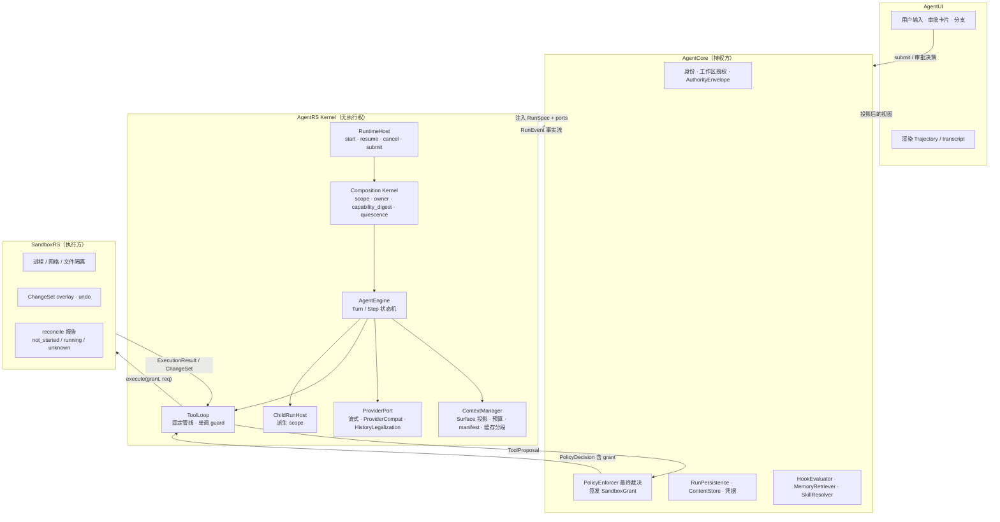
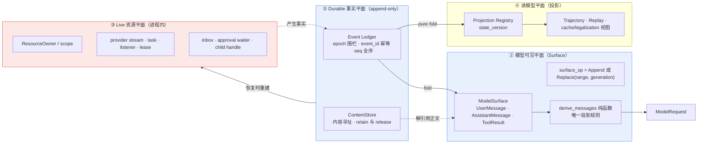
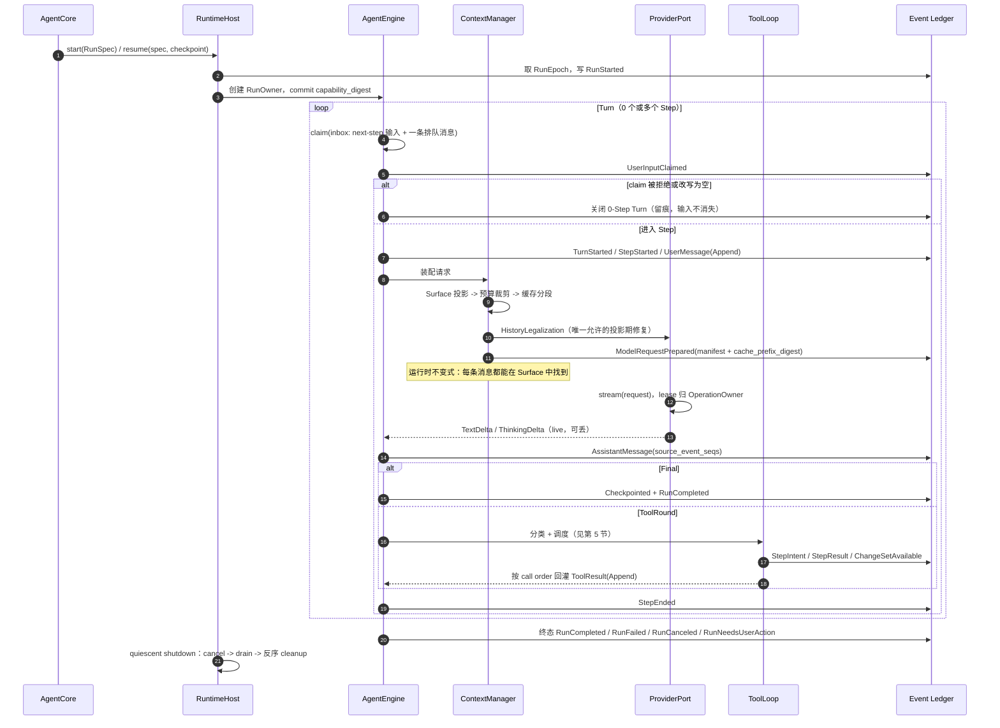
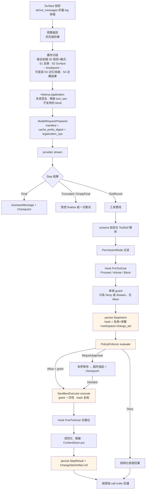
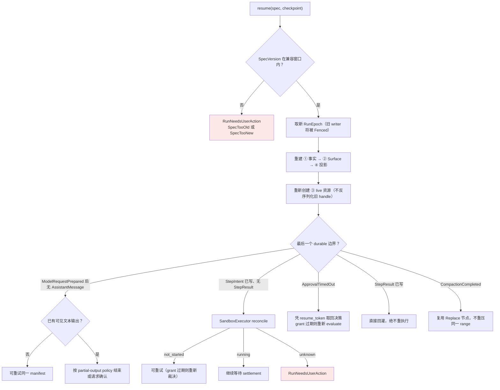

# AgentRS 架构说明（评审版）

> 用途：团队架构评审。本文只讲**是什么、为什么、要你拍板什么**，不含任务分解与排期。
>
> 完整方案：[技术架构设计与实施方案](agentrs-技术架构设计与实施方案.md) ｜ 任务分解：[任务级实施分解与源码借鉴清单](agentrs-任务级实施分解与源码借鉴清单.md)
>
> 对应版本：架构方案 v1.7
>
> **已有实现**：W1–W10 完成，252 个测试，真实模型端到端跑通。实现暴露的
> 六个契约缺口与五处设计修正见架构方案 §18——评审时值得一并过一遍，
> 它们是"设计读起来完整、落到接口才发现缺"的典型。
>
> **评审要拍板的事集中在第 6、7 节**，前面是背景。时间紧的话从第 2 节的图开始看。

---

## 0. 实施路线（已定案）

**走重写路线，但 aionrs 中经过验证且与本架构不冲突的模块直接复制源码。**

| | 规模 | 处理 |
|---|---:|---|
| **A 类：直接复制** | ~6,800 行 | 五个厂商 wire format、SSE framing/parser、projector、`tool_call_sanitize`、`ProviderCompat` 表、`aion-compact` 纯函数、内容块模型、token 账本、TurnGuards、`cache_diagnostics` |
| **B 类：改造接缝** | ~2,900 行 | skills 解析、分层压缩策略、JSONL 协议框架、tool registry/search、file_cache、plan 状态 |
| **C 类：拒绝** | ~12,900 行 | TUI、engine/session/orchestration、全局配置加载、skills shell 执行、工具执行体、`aion-process` |

判定规则：触碰四平面**结构** → 新写；含**执行权/环境配置/内核内授权状态** → 拒绝；**纯函数或纯数据** → 直接复制；其余 → 复制逻辑改接缝。

**三条纪律**：① 移植一次性，不与 aionrs 上游建立 rebase 关系（否则重写会偷偷变成演进）；② A 类必须连原测试一起搬；③ 移植后立即适配四平面模型，不留"以后再改"。

**许可证**：aionrs 为 Apache-2.0，复制合法但 §4 义务是强制的——每个移植文件头标注来源/commit/修改，维护 `THIRD-PARTY-NOTICES.md`，不使用 `aion` 商标。清单随移植逐条维护，**不允许发布前突击补写**。

---

## 1. 一页定位

AgentRS 是 uworker 的**推理与工作流内核**：Rust 编写、可嵌入、**无执行权**。

它把"用户目标 + 已授权上下文 + 可用能力"推进为可审计的步骤流——模型推理、工具提议、结果回灌、上下文管理、子 Agent、最终结果。

它**不**拥有：桌面 UI、数据库、用户身份、策略规则、文件写权限、OS 进程。

### 设计谱系

架构由两个现有系统的核心思想融合而成，各自贡献的层面不同：

| | 贡献什么 | 具体是什么 |
|---|---|---|
| **aionrs** | Agent 主体的**内容层** | 统一流式契约、ProviderCompat、四态回合骨架、TurnGuards、分层压缩、输出治理、前缀缓存治理、历史修复、读改缓存 |
| **DeepSeek Harness** | 系统的**结构层** | model-visible-is-logged、ModelSurface、三域事件、seam 三角、Turn/Step、inbox/claim、单调 guard、scope 非安全边界 |
| **AgentRS 自有** | **权限与恢复** | AuthorityEnvelope、grant 签发与一次性消费、StepIntent/reconcile、epoch 围栏、ContentStore |

> **一句话方针：Harness 给骨架，aionrs 给内容，Rust 与权限模型给约束。**

### 三条硬边界

1. 内核**没有任何执行权**——不 `spawn`、不 `fs::write`、不访问存储、不读凭据、不决定"总是允许"。
2. **模型可见即已记录**——模型能看到的每一个字节，物理来源只有 durable event ledger 和 ContentStore 两处，且由运行时不变式断言。
3. **任何可插拔的东西只能收紧，不能放宽**——guard 只有 `Deny`/`Abstain`，Hook 只有 `Proceed`/`Advise`/`Block`，都没有 `Allow` 变体。

---

## 2. 分层与权限边界



**看图要点**：AgentRS 到 SandboxRS 之间**没有直连箭头绕过 C2**。grant 由 Core 签发、内核只搬运、Sandbox 独立复核——三方各持一段，任一方失守不会单点击穿。

---

## 3. 四个平面：本架构最核心的一张图

理解 AgentRS 只需抓住一件事：**同一份 Run 状态被切成四个平面，各有各的规则，互相不可替代。**

评审前几版里发现的大部分设计缺陷，根因都是把两个平面混为一谈。



| 平面 | 规则 | 崩溃后 | 混淆的后果 |
|---|---|---|---|
| ① Durable 事实 | 只追加，epoch 围栏，`event_id` 幂等 | 权威来源，全部保留 | 双写者污染、重复副作用 |
| ② 模型可见 Surface | log 上的投影；压缩以 `Replace` 遮蔽而非改写 | 由 ① 重建 | 请求不可重建、transcript 被抹 |
| ③ Live 资源 | 有 owner，`cancel → drain → 反序 cleanup` | **不恢复**，重新创建 | 句柄泄漏、幽灵回调 |
| ④ 读模型 | 确定性纯 fold，带 `state_version` | 由 ① 重放 | 出现第二份可变事实源 |

**三条不可替代性**（评审时请重点确认这三条是否被认可）：

1. `cleanup / release` 只释放 ③ 的资源，**不宣称历史未发生**。外部副作用只能靠 `reconcile / compensate` 处理。用 `Drop` 假装回滚了一次 `rm -rf` 是错的。
2. ② 的任何变化都必须先是 ① 的一条事件。"只存在于内存里、下一轮还要发给模型"的状态是设计缺陷——它会在崩溃后凭空消失。
3. ④ 从不回写 ①。投影是只读派生，不是第二份事实源。

### ModelSurface 值得单独说明

这是从 Harness 直接吸收的机制，一个设计同时解决了三个问题：

```
durable log            [e1][e2][e3][e4][e5][e6][e7][e8]   ← 永远只追加
                        ↓   ↓        ↓        ↓
Surface（append-origin）[m1][m2]    [m3]     [m4]
                                     └──── Replace(range=m1..m3) ───┐
                                                                     ↓
模型看到的历史          [摘要节点][m4]
人类看到的 transcript   [m1][m2][m3][m4]      ← 用 append-origin，不受遮蔽
```

由此得到四条推论，每条都替代了此前一段专门设计：

- **压缩 = 追加一个 Replace 节点遮蔽一段 range**，历史从不被改写；
- **人类 transcript 用 append-origin 事件**，所以压缩不会抹掉用户已经看到的对话；
- **任何请求可由「log 前缀 + 同一个 fold 函数」精确重建**——这是"可重建"从约定变成机制；
- **缓存前缀失效点变成可精确计算的 `range.start`**，不需要靠"把改写攒到边界"这种约定去近似。

---

## 4. Run 生命周期



**术语精确定义**（沿用 Harness，避免"回合"一词指代两件事）：

```
Step = 一次模型请求 + 该请求提出的全部工具调用及其结果
Turn = 零个或多个 Step
       在第一批输入被 claim 之前打开，在"没有任何欠账"之后关闭
```

"欠账"指两类：工具还欠模型一次请求，或 inbox 里还有已到达的 next-step 输入。

**三个容易被忽略但必须支持的边界情况**：

1. **被拒绝的首次 claim 仍关闭一个 0-Step 的 durable Turn**——用户输入不得在事实流里凭空消失。
2. `TextDelta` 是 live 的、可丢；`AssistantMessage` 携带 `source_event_seqs` 精确记录它由哪些 delta 构成（含显式空列表），所以 **delta 全丢也不影响 transcript 重建**。
3. 空 content 的 `AssistantMessage` 不进入派生历史，但事件必须保留——它承载 usage 和 `max_tokens` 之类的终止信息。

---

## 5. Step 内部：请求装配与工具管线



### 五个不可绕过的固定阶段（图中橙色）

```
schema 校验 → ★StepIntent → ★Policy/grant → ★Sandbox → ★StepResult
```

middleware 只能环绕 **timeout / retry / metrics / 结果转换**，不能短路其中任何一个。这是内核不变量 1–4 的实现位置。

### grant 的四条规则

1. **一次性消费**——一个 grant 只能进入一次 `execute`，重复使用是内部错误而非重试路径。
2. **输入绑定**——`bound_input_hash` 覆盖 `工具名 + 规范化参数 + workspace_id + change_set_id`，Sandbox 必须**独立复核**。
3. **过期即失效**——未在 `expires_at` 前执行则作废，恢复时读到过期 grant 必须重新裁决，**不得直接执行**。
4. **不可派生**——ChildRun 不复用父 grant。

### 并发：fail-closed 布尔

`concurrency_safe(args)` **严格为真**才并行，未知 / 隐藏 / 未声明 / 抛异常一律 exclusive；exclusive 形成 ordering barrier；bounded rolling pool；**每个调用在真正启动前重新分类**（前序调用可能已改变状态，一次性预分类是错的）。

> 这里曾设计过完整的 `ResourceAccess` 冲突图 + lease 系统，后来砍掉。依据是 **aionrs 与 DeepSeek Harness 两个成熟实现独立收敛到同一个布尔设计**（`orchestration.rs:572` 与 `core/tools/src/index.ts:1276`）。理由：最有并行价值的 Read/Grep/Glob 本就只读，一个布尔足够；而 Bash/Exec 的资源集合在参数层不可判定，只能永远 exclusive——冲突图的净效果与布尔相同，复杂度却高一个量级。

---

## 6. 恢复决策树

**原则：宁可停下问人，也不重复未知副作用。**



**只有两种情况允许重试**：模型在无可见输出前的瞬时失败；Sandbox 明确返回 `not_started`。其余一律 `reconcile` 或停在 `RunNeedsUserAction`。

**双 writer 问题的解法**：`start`/`resume` 各分配一个单调 `RunEpoch`，所有 durable 写入携带 epoch，存储侧拒绝旧 epoch 并返回 `Fenced`。收到 `Fenced` 的 runtime 立即停止写入并收敛。没有这条，"恢复以 durable log 为准"本身不成立——log 已被两个 writer 写坏。

---

## 7. 关键设计裁决（评审重点）

三方思想冲突时的裁决已固定如下。**这七条是本次评审最需要确认的部分**，任一条被推翻都会影响大范围设计：

| # | 冲突点 | Harness 立场 | aionrs 立场 | 裁决与理由 |
|---|---|---|---|---|
| 1a | **动态扩展** | 运行时挂载插件、HMR、self-modification | 无 | **拒绝**。动态库 ABI、崩溃隔离、供应链成本过高，且与权限模型冲突 |
| 1b | **组件装配** | 组件集合与装配由配置决定 | `bootstrap` 按全局配置组装 | **保留此性质**：静态链接组件的集合与装配由宿主在 RunSpec/装配期决定，不在 `AgentEngine` 硬编码。trait object + builder 即可，不需要 Proxy。<br/>*评审说明：初版把 a/b 合并否决是论证跳步——"Rust 没有 Proxy"只否定机制，"不受信代码"也不成立（Harness 插件同样是受信编译代码）* |
| 2 | 扩展点形态 | waterfall，listener 可环绕包括安全判定在内的全部阶段 | 无扩展点 | 固定安全阶段 + typed middleware 只能环绕非安全阶段 |
| 3 | 状态模型 | append-only log + Surface 投影 | 全量 session 快照重写 | **取 Harness**。全量快照无法表达"这条命令跑没跑" |
| 4 | 并发调度 | `executionMode` 布尔，fail-closed | `is_concurrency_safe` 布尔 | 两者独立收敛，直接取用 + rolling pool + 启动前重分类 |
| 5 | 执行权 | `ctx.sandbox` 包 argv + landlock | 直接 `spawn`，`containment.rs` 只做 kill 传播 | **两者都不满足**。取自有的 grant + `SandboxExecutor`，内核无执行权 |
| 6 | scope 语义 | 明确"不是沙箱或权限边界" | 无 scope 概念 | 采纳。**Scope 管可见性与生命周期，Authority 管权限，两轴正交**——子 Run scope 更窄 ≠ 权限更小 |
| 7 | 配置 | profile/bundle/patch 分层覆盖 | 全局 TOML + `dirs::home_dir()` | 都不进内核。配置由宿主转为不可变 `RunSpec` |

### 明确不吸收（避免反复讨论）

| 不吸收 | 来源 | 理由 |
|---|---|---|
| JavaScript Proxy Context / 字符串服务定位 | Cordis | Rust 无等价物，破坏类型安全 |
| HMR / 热重载 | Cordis | 服务开发期体验，代价是全套 generation 机制 |
| `!!js` 可执行 YAML、下载即挂载 | Harness bundle | 与权限模型不可调和 |
| self-modification（Agent 挂载自己的插件） | Harness | 模型不得改变自身权限面 |
| 全局 TOML 与 `home_dir()` 读取 | aionrs | 破坏可嵌入性 |
| 内核内 `auto_approve` / `allow_list` 持久化 | aionrs `confirm.rs` | 授权状态归宿主 |
| 直接 `Command::spawn`、技能 shell 片段执行 | aionrs | 内核无执行权 |
| TUI | aionrs `aion-tui` | 归 AgentUI |

### 范围收缩决策

以下三项**有意推迟**到真实触发条件出现，不为尚未采用的能力预付复杂度：

| 推迟项 | 现状替代 | 启动条件 |
|---|---|---|
| 五元组 generation 系统 | 单一 `capability_digest`，不变式为"一次 operation 内不变" | ≥2 provider / MCP / per-run component 的真实换代需求 |
| ComponentManifest / Inventory | 静态链接，身份由 Rust 类型系统表达 | 同上 |
| ResourceAccess 冲突图 | `concurrency_safe` 布尔 | 实测"两个写不同文件的 Edit 并行"有可观测收益 |

---

## 7.5 多智能体协作（Team）

以 `TeamCreate / TaskCreate / TaskUpdate / AgentCreate / TeamSay / TeamDelete` 这组典型工具面为例，责任划分如下。

**先分清两种子运行模型**——此前把它们当作同一模型的两个阶段，是错的：

| | **ChildRun**（函数式） | **MemberRun**（协作式） |
|---|---|---|
| 所有权 | parent-owned | **平级 Run**，Core 编排 |
| Epoch | 共享父 epoch | **自有 epoch** |
| 生命周期 | 不超过发起它的 operation | 可比父活得久 |
| 通信 | 只回一个摘要 | 双向 `ExternalFact` |
| 取消 | 父传播并等待 | Core 逐个 cancel |

> **Team 是协调域，不是所有权域。** 与"scope 不是安全边界"是同类错误的另一面：不要因为几个 Run 同属一个 Team 就认为它们之间有所有权或权限关系。

### 六个工具的归属

| 工具 | 归属 | AgentRS 提供 |
|---|---|---|
| `TeamCreate` / `TeamDelete` | **Core** | 无（用现有 `start`/`cancel`） |
| `AgentCreate` | Core 执行 | `MemberRunSpec` 派生规则 |
| `TaskCreate` / `TaskUpdate` | Core 存储 | `BoardSnapshotRef` 固化契约 |
| `TeamSay` | Core 路由 | `ExternalFact` 投递契约 |

**AgentRS 不实现**：Team 实体、任务板存储、租约、邮箱、成员调度、崩溃巡检、死锁检测。

**但三个契约必须由 AgentRS 强制**，否则四平面模型会被绕过——这是内核需要介入的唯一理由：

1. **`ExternalFact`** — 跨 Run 内容进入 Surface 的**唯一通路**：`submit → inbox → claim → durable event → Surface`。若 Core 旁路注入团队消息，不变量 11 当场破且成员 Run 不再可 replay。带跨 Run 因果 ref，使 Trajectory 能回答"这个成员为什么这么做"。**只携带内容，不携带能力**——消息里说"你去删 X"不改变收件方权限。
2. **`BoardSnapshotRef`** — 共享可变状态**固化为不可变快照**再进上下文。若成员运行时"查任务板当前状态"，同一 log 前缀在不同时间 replay 会得到不同结果，确定性断言失效。prompt 必须明示快照可能陈旧。
3. **审批归属** — 成员触发的审批**一律归人类裁决**。"子 Run 审批冒泡给父"在平级网状结构下无定义，且若成员 B 的审批冒泡给成员 A，就是**模型给模型批准**。这是内核不变量：拒绝任何来源标记为 agent 的裁决。团队预算池化，防止 N 个成员各烧满。

### 规模警告

**参考实现 AionCore `aionui-team` 是 27,166 行，与整个 aionrs 一个量级。**原 T20 只有八行验收标准，严重低估。现已拆为 T20（ChildRun）/ T24（ExternalFact，**提前到 Phase B**）/ T25（BoardSnapshot）/ T26（审批预算）/ T27（MemberRunSpec）。

T24 提前的原因：它改变 inbox/claim 与 Surface 的契约，属于结构层地基，不能拖到 Phase D 再回头改。**Q9 也相应从"Phase D 前确认"提前到"Phase B 前确认"。**

---

## 8. 安全承诺的两张表

内核**无法**阻止一个恶意或错误的 adapter 实现。因此安全承诺必须拆开，不能把宿主义务包装成内核保证——开源之后尤其如此。

### 内核不变量（AgentRS 可自证，内核测试守护）

1. 无注册 ToolDef 和 schema 验证，不产生工具请求
2. 无 `Allow` 返回的 grant 不调用 `execute`；同一 grant 不消费两次
3. 无 `StepIntent` 不跨出有副作用的调用边界
4. 无 `StepResult` 或 reconcile 结果，恢复时不重放工具执行
5. 子 Agent 的工具、模型、`PermissionMode`、通信能力只能收窄
6. 模型输出与 Hook 只能建议或否决，不能签发 grant、不能放宽 Policy
7. `AuthorityEnvelope` 在 Run 内不可扩大
8. 每个 registration 和 async task 都有 owner，终态前完成 settlement
9. 每个模型请求有可重建 manifest；一次 operation 内 `capability_digest` 不变
10. 收到 `Fenced` 立即停止 durable 写入并收敛
11. 模型可见内容只来自 durable event 或已 retain 的 `ContentRef`
12. `HistoryLegalization` 是唯一允许投影期修复的位置，且全部留痕

### 宿主义务（无法自证，由 conformance suite 验证）

| # | 义务 | 责任方 | 违反后果 |
|---|---|---|---|
| H1 | `SandboxExecutor` 独立复核 `bound_input_hash` 与 grant 有效期 | SandboxRS | 不变量 2 失效 |
| H2 | 真正实施隔离；`reconcile` 如实报告三态 | SandboxRS | 不变量 4 失效，恢复会重复副作用 |
| H3 | `RunPersistence` 实现 `event_id` 幂等、`seq` 单调、epoch 围栏、checkpoint 写序 | AgentCore | 恢复与 replay 全部不可信 |
| H4 | `ContentStore` 在 `retain` 有效期内不回收 | AgentCore | 模型请求不可重建 |
| H5 | `PolicyEnforcer` 是最终裁决者并对 `Allow` 承担审计责任 | AgentCore | 审批链路不可审计 |
| H6 | `HookEvaluator` 不被用来放宽授权 | AgentCore | 不变量 6 失效 |
| H7 | ChangeSet overlay 对同一 Run 所有执行呈现一致视图 | SandboxRS | 读己之写破坏，模型陷入循环 |

`agentrs-testkit` 随内核发布一套 **host conformance suite**，宿主实现 adapter 后自测 H1–H7。没有它，"AgentRS 是安全的"这句话在第三方宿主上不成立。

---

## 9. 需要本次评审拍板的事

### 9.1 架构层（本文第 7 节）

- [x] ~~实施路线（重写 / 演进 / 包装）~~ → **已决：重写 + 模块级移植，见第 0 节**
- [ ] 裁决 #1a/#1b：接受"拒绝动态扩展、但保留配置化装配"这个拆分？
- [ ] 裁决 #5：接受"内核完全无执行权"带来的集成成本？
- [ ] 第 3 节的三条平面不可替代性是否被认可？
- [ ] 三项范围收缩（generation / Component / 冲突图）的推迟是否认可？
- [ ] 多 Agent：认可"编排归 Core、AgentRS 只强制三个契约"的划分？认可 T24 提前到 Phase B？

### 9.2 跨团队接口（Phase A 末前必须有结论，否则阻塞开发）

| # | 议题 | 对方 | 需要的结论 | 阻塞 |
|---|---|---|---|---|
| **Q1** | `SandboxGrant` 载荷与签名方式 | Core + Sandbox | 是否签名、含哪些字段、Sandbox 如何独立校验 hash | 工具执行链路 |
| **Q2** | ChangeSet overlay 实现形态 | Sandbox | overlay fs / CoW 目录 / 内存差分；**能否支撑编译与测试** | 读己之写 |
| **Q9** | Team 消息与任务板载荷 | Core | 载荷形状（决定 `ExternalFact`/`BoardSnapshotRef` 的形状）、成员可见性策略、租约与崩溃回收分工。**自 Phase D 提前** | 多 Agent 结构层 |

> **Q1/Q2 已升级为"要有实现"而非"要有接口"**：Phase B 开工前置要求 SandboxRS 能跑通 `Read` 与 `ExecCommand` 且 `reconcile` 返回真实三态。这是裁决 #5（内核无执行权）的直接代价——AgentRS 的可用性 100% 押在 SandboxRS 上，接口文档不能替代可运行实现。
| **Q4** | 审批令牌保管与唤醒 | Core | `resume_token` 存储、过期、离线多久作废、如何唤醒 | 审批挂起 |

其余 Q3（ContentStore 后端与 GC）、Q5（事件存储形态与保留期）、Q6（steering 的 UI 语义）、Q7（Hook 执行形态）、Q8（缓存成本目标）、Q9（TaskList API）、Q10（开源切分）在后续阶段确认，详见方案 §17。

**兜底规则**：确认前按最保守假设实现并用 fake 覆盖；确认后若假设不成立，改动必须限制在 adapter 层，不得反向污染内核契约。到最晚时点仍未确认的，转为「按假设交付 + 记技术债」并在 ADR 写明推翻代价。

### 9.3 两个已知需要校准的数字

| 参数 | 当前取值 | 校准时点 |
|---|---|---|
| 审批超时（超时后转挂起） | 60s，可由 `ExecutionBudget` 覆盖 | 真实 provider 接通后 |
| 缓存命中率门槛 | 连续 10 轮对话 ≥ 70%，**且需先确定一个报告缓存字段的端点** | 同上。本地 vLLM 实测不报告该字段且无缓存收益，见迭代计划 M1 说明 |

---

## 10. 附：完成标准（判断"做完了没有"）

不是"能调用模型和工具"，而是同时满足：

- 嵌入 Core 后不读写其私有存储，不依赖全局配置
- 工具请求经过 schema、Policy、Sandbox 三道边界
- 任意中断后能明确恢复、reconcile 或停在 `NeedsUserAction`，不重复未知副作用
- 上下文有硬预算，记忆/技能/工具/子 Agent 结果均可选择、裁剪、追溯
- 任意模型请求可由 manifest 指向的 durable facts 与 content refs 重建；UI delta 丢失不影响 committed transcript
- 真实 provider 上连续对话缓存命中率达标，每次 miss 可归因
- Edit 之后的 Read/Grep/构建在同一 ChangeSet overlay 上读到新内容
- Run/Operation/ChildRun 取消后无残留 stream/task/listener/registration
- 第三方宿主实现 adapter 后能独立通过 host conformance suite 的 H1–H7
- 参考 `agentrs-dev-adapter` 能让团队用 AgentRS 完成 AgentRS 自身的日常修改
